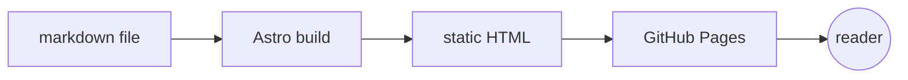

This is the first post on the new Astro-powered version of this site. The whole pipeline is markdown-in, static-HTML-out — drop a `.md` file under `src/content/blog/` and it shows up as a page after the next build.

## What works today

- **Frontmatter** is type-checked against a Zod schema in `src/content.config.ts`. Forget a required field and the build fails with a clear message.
- **Nested folders** map straight to nested URLs. See [`/blog/meta/about-this-blog/`](/blog/meta/about-this-blog/) for proof.
- **Drafts** (`draft: true`) skip generation entirely.
- **Code blocks** get default syntax highlighting via Astro's bundled Shiki integration.

```js
function greet(name) {
  return `Hello, ${name}!`;
}

console.log(greet('world'));
```

## Math via KaTeX

Inline math like $E = mc^2$ and display equations both work:

$$
\int_{-\infty}^{\infty} e^{-x^2}\,dx = \sqrt{\pi}
$$

## Diagrams via Mermaid

The build pipeline, end to end:



## What's coming

- GitHub Actions deployment (slice 4).

[← Back to home](/)
