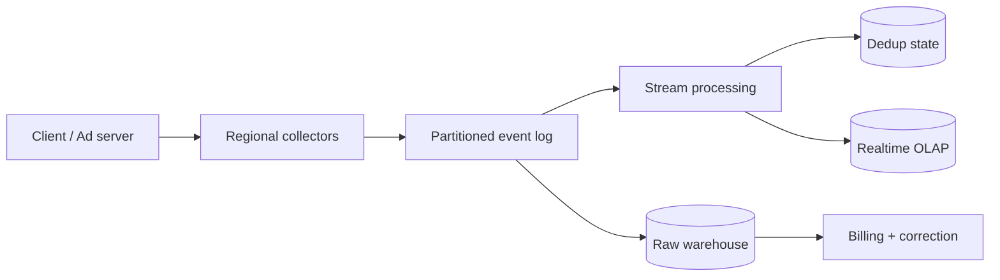

广告追踪不是“把点击写进数据库”，而是把每次曝光、点击和转化变成一条可验证、可回放、可聚合的事实。系统最难同时满足三件事：吞吐高、报表够新、计费不能乱。

先看一个最小反例。手机网络超时，客户端不知道 `click-123` 是否已被 collector 接收，于是重试。如果系统按请求次数计数，广告主会被收两次钱。可靠重试必然带来重复，**去重不是边角功能，而是事件系统的正确性基础**。

> 对应实验：[打开 Ad Click Tracking Lab](https://lab.zichaoyang.com/system-design/ad-tracking/)。依次提高峰值倍数、报表新鲜度和 durability 要求，观察 collector 为什么演化成分区 streaming pipeline。

## 先讲清几个词

- **Event ID**：一次业务事件的稳定身份。重试必须沿用同一个 ID。
- **Event time**：曝光或点击实际发生的时间；不同于 server 收到它的 processing time。
- **Dedup window**：系统保留 event ID 多久，以识别迟到的重复事件。
- **Raw event log**：不可变原始事实。实时报表错了可以从这里重放修复。
- **Attribution**：决定一次 conversion 归属于哪次 click/impression，是独立业务规则，不等于简单 join。

## 一条事件如何流动

Collector 只做认证、schema 校验、基础反滥用和 durable append，尽快返回。日志按稳定维度分区，让同一 campaign/ad 的事件能有序处理。Stream job 按 event time 做窗口聚合，结果写 realtime OLAP；raw log 同时进入 warehouse，支撑回放、审计和离线校正。

## 为什么不能直接宣称 exactly-once

Producer 会重试，broker 会重投，consumer 会 crash 在“写结果后、提交 offset 前”。端到端 exactly-once 很难跨越所有外部存储。更可靠的表达是：传输采用 at-least-once，事件带稳定 ID，consumer 更新使用幂等 key 或原子事务。

例如聚合写入可以用 `(campaign_id, window_start, version)` 做幂等覆盖，计费则从去重后的 immutable billable event 派生，而不是直接信 dashboard counter。

## 新鲜度与正确性的分层

实时 dashboard 允许一分钟内更新，并接受迟到数据之后修正；财务结算则可以晚几个小时，但必须经过更完整的 dedup、fraud filtering 和 reconciliation。把二者强行做成一条同步路径，会让低延迟和强正确性互相拖累。

## 常见难点

- 客户端 timestamp 不可信，需要限制允许的时间漂移并保留 ingest time。
- 热门 campaign 会形成 hot partition，可用更细的复合 key 分散，再在下游二次聚合。
- Schema 演化必须向后兼容，consumer 不能因新字段停止整条 pipeline。
- Bot 与 click spam 需要旁路 risk signal，但 collector 不应同步运行昂贵模型。
- 数据保留要区分 raw、聚合和可识别用户字段，遵守删除与隐私政策。

## 面试表达

> I would treat clicks and impressions as immutable events. Regional collectors durably append them to a partitioned log, while independent consumers handle deduplication, real-time reporting, billing, fraud signals, and warehouse storage.

高层设计讲到这里即可。随后让面试官选择深入 dedup、late events、hot partition、billing correctness 或 attribution。Kafka 的价值是缓冲、解耦与回放，不是因为“高吞吐题都应该用 Kafka”。
