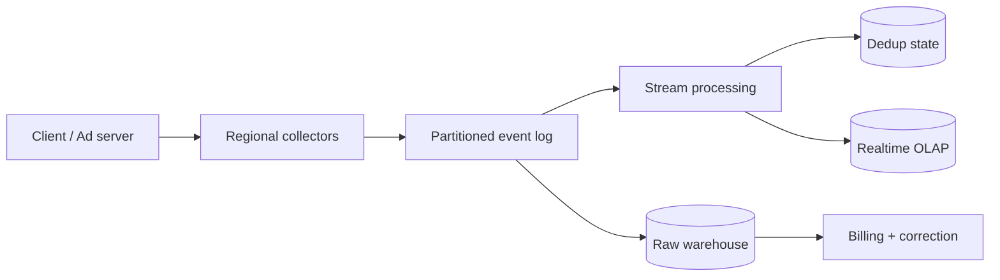

广告追踪不是“把点击写进数据库”，而是把每次曝光、点击和转化变成一条可验证、可回放、可聚合的事实。系统最难同时满足三件事：吞吐高、报表够新、计费不能乱。

先看一个最小反例。手机网络超时，客户端不知道 `click-123` 是否已被 collector 接收，于是重试。如果系统按请求次数计数，广告主会被收两次钱。可靠重试必然带来重复，**去重不是边角功能，而是事件系统的正确性基础**。

> 对应实验：[打开 Ad Click Tracking Lab](https://lab.zichaoyang.com/system-design/ad-tracking/)。依次提高峰值倍数、报表新鲜度和 durability 要求，观察 collector 为什么演化成分区 streaming pipeline。

## 需求边界（Requirements）

功能上采集 impression/click、实时聚合、离线校正并派生 billable event；attribution 深度后置。非功能上 collector 要承受峰值、raw event 可回放，dashboard 分钟级新鲜，billing 可更慢但必须去重和审计。

## 0. 先搭数据库队列版 MVP Scaffold

第一版只追踪 impression 和 click。一个 collector 接 HTTP event，把原始 payload 连同稳定 event ID 插入 PostgreSQL；一个 cron job 每分钟按 campaign 聚合写 `hourly_metrics`。先不引入 Kafka、Flink 和 OLAP。这个版本足以验证 schema、重试去重和报表语义。

搭建顺序：定义 event envelope；collector 做认证和 schema 校验；以 event ID 唯一约束插入；聚合 job 使用 watermark/cursor 扫描；dashboard 查聚合表；保留 raw event 供重算。

## 1. API：客户端重试必须沿用 event ID

```http
POST /v1/events/batch
Content-Encoding: gzip

{"events":[{
  "eventId":"e-991","type":"click","occurredAt":"...",
  "adId":"a-7","campaignId":"c-8","requestId":"auction-55",
  "userPseudoId":"u-hash","placement":"feed"
}]}

202 Accepted
{"accepted":1,"rejected":0}
```

批量 endpoint 降低网络开销；逐条返回永久 schema error 与可重试 server error。Collector 收到并 durable insert 后才接受，`202` 不代表已进入报表。

## 2. 数据模型（Data Model）

```text
AdEvent(event_id PK, event_type, occurred_at, ingested_at, ad_id,
        campaign_id, request_id, user_pseudo_id, payload, schema_version)
HourlyMetric(campaign_id, hour, impressions, clicks, unique_users, revision)
ProcessingCursor(job_name PK, last_event_position, watermark)
BillableEvent(event_id PK, billing_account, amount, state, reason)
```

Raw event immutable；metric 是可重算派生视图；billable event 经过 dedup 和 fraud policy 后单独形成，不直接拿 dashboard count 计费。

## 3. 单机端到端流程

Collector 校验 token、payload 大小和 timestamp，事务性 insert event；重复 event ID 视为成功。Aggregator 从 cursor 后读取 raw row，按 event time 窗口聚合，用 `(campaign,hour,revision)` 幂等 upsert，再推进 cursor。迟到事件触发新 revision，而不是静默丢弃。

## 4. 容量估算：先算 ingest 和保留成本

假设峰值 100 万 events/s、压缩后平均 300 bytes，入口约 300MB/s，每天约 26TB raw data；三副本约 78TB/天。Dashboard 只有 1 万 queries/s，不应与百万级 ingest 共用同一行存储和索引。单 PostgreSQL 会先在 WAL、索引和存储保留上越界。

## 5. Latency Budget：采集、报表、计费三套 SLA

Collector acceptance p99 可设 100ms；实时 dashboard freshness 目标 1 分钟；billing finalization 可在数小时后完成。它们不能被一个“实时”标签混在一起。Broker lag、watermark lag 和 OLAP query p99 是不同指标。

## 6. Correctness and Reliability

端到端采用 at-least-once 加 event ID 幂等。Broker/consumer offset 与 sink update 要通过事务或幂等 revision 协调。Raw log 多副本保留并可 replay。Client timestamp 只在允许 skew 内参与 event-time；同时保存 ingest time 便于审计。

## 7. Trade-offs：实时数字可以修正，账单不能猜

- 更长 dedup window 更正确但状态更大。
- 按 campaign 分区聚合方便，却会产生热门 campaign；加 salt 分散后需要二次 reduce。
- Dashboard 追求新鲜可接受 revision；billing 更慢但需要完整迟到数据、fraud filtering 和 reconciliation。

## 先讲清几个词

- **Event ID**：一次业务事件的稳定身份。重试必须沿用同一个 ID。
- **Event time**：曝光或点击实际发生的时间；不同于 server 收到它的 processing time。
- **Dedup window**：系统保留 event ID 多久，以识别迟到的重复事件。
- **Raw event log**：不可变原始事实。实时报表错了可以从这里重放修复。
- **Attribution**：决定一次 conversion 归属于哪次 click/impression，是独立业务规则，不等于简单 join。

## 一条事件如何流动



Collector 只做认证、schema 校验、基础反滥用和 durable append，尽快返回。日志按稳定维度分区，让同一 campaign/ad 的事件能有序处理。Stream job 按 event time 做窗口聚合，结果写 realtime OLAP；raw log 同时进入 warehouse，支撑回放、审计和离线校正。

## 为什么不能直接宣称 exactly-once

Producer 会重试，broker 会重投，consumer 会 crash 在“写结果后、提交 offset 前”。端到端 exactly-once 很难跨越所有外部存储。更可靠的表达是：传输采用 at-least-once，事件带稳定 ID，consumer 更新使用幂等 key 或原子事务。

例如聚合写入可以用 `(campaign_id, window_start, version)` 做幂等覆盖，计费则从去重后的 immutable billable event 派生，而不是直接信 dashboard counter。

## 新鲜度与正确性的分层

实时 dashboard 允许一分钟内更新，并接受迟到数据之后修正；财务结算则可以晚几个小时，但必须经过更完整的 dedup、fraud filtering 和 reconciliation。把二者强行做成一条同步路径，会让低延迟和强正确性互相拖累。

## 常见难点

- 客户端 timestamp 不可信，需要限制允许的时间漂移并保留 ingest time。
- 热门 campaign 会形成 hot partition，可用更细的复合 key 分散，再在下游二次聚合。
- Schema 演化必须向后兼容，consumer 不能因新字段停止整条 pipeline。
- Bot 与 click spam 需要旁路 risk signal，但 collector 不应同步运行昂贵模型。
- 数据保留要区分 raw、聚合和可识别用户字段，遵守删除与隐私政策。

## 面试表达

> I would treat clicks and impressions as immutable events. Regional collectors durably append them to a partitioned log, while independent consumers handle deduplication, real-time reporting, billing, fraud signals, and warehouse storage.

高层设计讲到这里即可。随后让面试官选择深入 dedup、late events、hot partition、billing correctness 或 attribution。Kafka 的价值是缓冲、解耦与回放，不是因为“高吞吐题都应该用 Kafka”。
