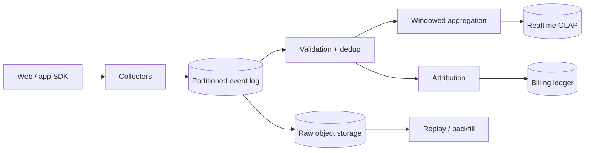

广告追踪的输入看起来只是两类事件：展示一次 impression，点击一次 click。真正的系统问题是这些事件来自不可靠的浏览器和手机网络：同一个 beacon 可能重发，离线设备可能几个小时后补传，客户端时钟可能错误，恶意流量还会故意伪造点击。

与此同时，广告主希望几分钟内看到报表，计费系统又不能因为一次重试就多收钱。

这道题的核心是：**先把每次曝光与点击作为不可变事件可靠接收，再以 event time、去重和可修正聚合把它们变成可信报表与归因。**

> 配套实验：[打开 Ad Click Tracking Lab](https://lab.zichaoyang.com/system-design/ad-tracking/)。先保持低峰值和宽松 freshness，再提高 burst 与 durability；观察 collector 为什么必须与报表计算解耦。

## 一个 Impression 为什么会被数三次

浏览器展示广告后发送 beacon：

```json
{
  "eventId":"imp-device9-881",
  "type":"IMPRESSION",
  "adId":"ad-42",
  "campaignId":"camp-7",
  "eventTime":"2026-07-13T17:00:00Z"
}
```

Collector 已经接收并写入日志，但响应丢失。浏览器重试两次。如果系统按“收到几次 HTTP 请求”计数，报表就是 3 impressions。

正确做法不是奢望网络 exactly once，而是让一次业务事件有稳定 `event_id`，下游在明确窗口内幂等去重。HTTP 请求可以 at-least-once，逻辑 impression 仍只计一次。

这个例子也说明：Collector 的响应最好代表“事件已进入 durable ingest log”，不是“所有报表都已更新”。后者会让用户请求等待整条 streaming pipeline。

## 先讲清三个时间

**Event time**

曝光/点击在设备上发生的业务时间。

**Ingestion time**

Collector 收到事件的时间。离线、批量上传和网络重试会让它晚于 event time。

**Processing time**

某个 streaming worker 实际计算这条事件的时间。扩容、backpressure 会继续推迟。

广告报表通常按 event time 归入小时/天窗口，但系统何时敢认为“12:00–13:00 的事件基本到齐”取决于 watermark 和 allowed lateness。

## Impression、Click 和 Conversion 怎样连接

Ad serving 在返回广告时生成一个签名 `impression_token`，绑定：

```text
impression_id
ad_id
campaign_id
creative_id
publisher_id
user/device pseudonymous id
auction_id
served_at
expiry
```

客户端 impression/click 事件携带 token。Collector 验证签名，避免客户端随意把 click 归到高价 campaign。

Conversion 可能几天后发生，需要 attribution：例如“最近 7 天最后一次有效点击”。这是业务规则，不是简单 join；规则必须版本化，且重算结果可追溯。

## 题目边界

核心功能：

1. 接收 impression、click 和 conversion 事件；
2. 校验 schema、token 和基本 anti-abuse 信号；
3. Durable ingest，按事件 ID 去重；
4. 按 campaign/ad/time 实时聚合；
5. 处理迟到事件并修正报表；
6. 运行 click/conversion attribution；
7. 为计费输出更严格的 finalized ledger；
8. 遵守 consent、retention 和删除政策。

第一版不设计广告竞价、预算投放和完整 fraud ML。它们消费本文产物。

非功能目标：

- Collector p99 例如低于 50ms；
- 高峰突发时事件不因同步报表变慢而丢失；
- Dashboard 数分钟可见，最终计费在更长窗口后稳定；
- 重复事件不重复计数；
- 迟到事件有明确修正语义；
- Raw event 可重放，聚合逻辑升级不用重新收集；
- PII 最小化、加密、按地区隔离并可删除。

## 第一版：一台 Collector + Append-only Events 表

先不做 stream processing。Collector 接收 batch：

```http
POST /v1/ad-events:batch
Content-Encoding: gzip

{
  "events":[
    {
      "eventId":"imp-device9-881",
      "type":"IMPRESSION",
      "impressionToken":"signed-token",
      "eventTime":"2026-07-13T17:00:00Z",
      "client":{"sdkVersion":"web@4","sequence":881}
    }
  ]
}
```

响应逐项给出 accepted/rejected：

```json
{
  "accepted":["imp-device9-881"],
  "rejected":[]
}
```

数据库：

```sql
CREATE TABLE ad_events (
  event_id          TEXT PRIMARY KEY,
  event_type        TEXT NOT NULL,
  impression_id     TEXT NOT NULL,
  campaign_id       TEXT NOT NULL,
  ad_id             TEXT NOT NULL,
  event_time        TIMESTAMP NOT NULL,
  ingestion_time    TIMESTAMP NOT NULL,
  payload           JSONB NOT NULL
);
```

`event_id` 唯一约束处理重试。Collector 在事务 commit 后 ack。定时 SQL 按小时聚合：

```sql
SELECT campaign_id,
       date_trunc('hour', event_time) AS hour,
       count(*) FILTER (WHERE event_type='IMPRESSION') AS impressions,
       count(*) FILTER (WHERE event_type='CLICK') AS clicks
FROM ad_events
GROUP BY campaign_id, hour;
```

这版可工作，但单表写入、扫描和索引很快会到上限。它仍建立了正确事件身份与时间语义。

## Event Schema 和 Raw Record

```text
AdEvent(
  event_id,
  schema_version,
  event_type,
  event_time,
  ingestion_time,
  impression_id,
  auction_id,
  campaign_id,
  ad_id,
  creative_id,
  publisher_id,
  pseudonymous_subject_id,
  consent_scope,
  client_sequence,
  payload
)
```

Schema version immutable。新增 optional field 可兼容，改变字段含义必须新 version。Collector 只做轻量校验；复杂 enrichment 异步完成，避免依赖用户/profile 服务拖慢 ingest。

Raw event 保存客户端原始值和 server-derived fields。不要覆盖 event time；若它明显异常，另存 `normalized_event_time` 和 reason，保留审计。

## 从数据库切到 Durable Log

流量增大后，Collector 将事件追加到 partitioned log：

```text
HTTP collectors
-> durable event log
-> raw object storage
-> streaming aggregates / validation / attribution
```

Partition key 选择决定顺序与热点：

- 按 campaign：同 campaign 聚合方便，但超级 campaign 热；
- 按 impression/user：关联事件局部有序，但报表需 shuffle；
- 随机/event hash：吞吐均衡，所有聚合都要 shuffle。

常见做法按 `hash(impression_id)` 或 event ID 均匀分区，再在 stream processor 按聚合 key 重分区。Collector 不应让单个 campaign 控制一个 ingest partition。



Raw object storage 按 event date / ingestion date / shard 写 columnar files，用于重放和离线 audit。Realtime OLAP 只保存聚合与可查询明细，不是唯一事实来源。

## 去重：窗口多长就是产品语义

Streaming dedup state：

```text
event_id -> first_seen_time, payload_hash
```

相同 event ID + 相同 payload 是正常 retry；同 ID + 不同 payload 是冲突/欺诈信号，不能随便选最后一个。

Dedup state 不可能永久保存在内存。设置 retention，例如 7 天。超过窗口的超迟重复可能进入离线 reconciliation，而不是实时计数。

可以在 partitioned state store 中精确保存近期 ID；Bloom filter 只能减少查询，不能作为计费最终去重，因为 false positive 会丢合法事件。

Exactly-once stream processing 通常指 state update 与输出 checkpoint 一致，并不自动去掉客户端生成的两个不同 event IDs。业务事件身份仍是根本。

## Event-time Window、Watermark 和迟到修正

按小时统计 `[12:00,13:00)`。Watermark 表示系统认为早于某时间的大多数事件已经到达，例如：

```text
watermark = max_observed_event_time - 10 minutes
```

当 watermark 超过 13:00，可以先发布小时结果；之后允许 24 小时 late update。

聚合记录带版本：

```text
CampaignHourlyMetric(
  campaign_id,
  window_start,
  metric_version,
  impressions,
  clicks,
  conversions,
  state,
  updated_at
)
```

Dashboard 读取 `PROVISIONAL`；计费只使用经过更长 lateness 和 reconciliation 的 `FINALIZED`。

迟到事件不是直接 `count += 1` 后没人知道。产生 upsert/changelog，OLAP 按 `(campaign, window)` 覆盖新 version；下游订阅者能看到修正。

## Attribution：一个 Conversion 归给谁

简化 last-click rule：conversion 发生前 7 天内，同一主体最近一次有效 click 获得归因；没有 click 可选 view-through window。

```text
AttributionResult(
  conversion_id,
  attributed_impression_id,
  campaign_id,
  rule_version,
  evidence_event_ids,
  result_version,
  computed_at
)
```

迟到 click 可能改变已有 conversion 的归因。Result version 允许 retract 旧 campaign credit，再 apply 新 credit。计费 ledger 以 adjustment entry 修正，不能编辑历史账单而无痕。

Cross-device attribution 涉及身份图和隐私，必须基于 consent。没有合法关联时宁可不归因，也不能偷偷拼接身份。

## 容量估算：Burst 比日均更重要

假设每天 100B ad events：

```text
100B / 86,400 ≈ 1.16M events/s average
```

大型赛事或突发流量按 10 倍，Collector 与 log 要承受 10M+ events/s。

若压缩后 raw event 平均 300 bytes：

```text
100B × 300B = 30TB/day compressed-ish payload
```

保留 90 天约 2.7PB，不含 replica 和索引。Raw storage 必须分层生命周期，热/冷数据不同成本。

网络 ingest 平均：

```text
1.16M × 300B ≈ 348MB/s
```

10 倍 burst 为数 GB/s。SDK batching + gzip 能显著减少 HTTP overhead，但 batch 不能太大，否则 app crash 会丢一大段本地 buffer。

聚合 state 量取决于 active keys × open windows。若 10M active campaigns/ads 同时维护多维窗口，state backend、checkpoint 与 shuffle 会成为主要资源。

## Collector 设计：快速拒绝坏数据，快速接住好数据

Collector 做：

- 请求大小、batch 条数和 schema envelope；
- Token 签名、expiry 与关键 ID；
- 基础 consent/region routing；
- Rate limit 与明显 bot 过滤；
- 添加 server ingestion time、request ID；
- 追加 durable log 后 ack。

Collector 不做：远程用户 profile 查询、完整 fraud model、复杂 attribution 和同步 OLAP 写入。

Backpressure 时返回明确 429/503，SDK 在本地有界队列指数退避。不能无限缓存占满用户设备，也不能无声丢弃计费事件。

## 实时报表与计费分层

**Realtime dashboard**

目标分钟级 freshness，接受 provisional 和小幅修正。存储支持 campaign/time 维度的低延迟 group-by。

**Billing ledger**

只消费通过 stricter validation、dedup、fraud filter 和 lateness cutoff 的 billable events。每个计费条目引用原 event/aggregate version，支持 adjustment 和 audit。

不要直接用 Dashboard 数字开票。一个系统优化低延迟，另一个优化财务完整性，它们的 SLO 和最终化窗口不同。

## 隐私、Consent 和删除

事件尽量使用 pseudonymous ID，不收集不需要的原始 PII。IP 可即时转粗粒度 geo 后丢弃或缩短 retention。

Consent scope 与事件一起保存，防止之后无法判断这条数据允许用于计费、个性化还是分析。地区路由在 ingest 边界执行。

删除请求通过 subject-to-partition/index 找到 raw 和 derived data。纯 hash subject ID 若无反向索引，无法高效删除；隐私设计必须在 schema 阶段完成。

聚合报表是否需要删除贡献取决于政策和匿名阈值。所有处理流程有 lineage，删除 job 记录覆盖范围与验证结果。

## Fraud 与数据质量

基础信号：

- 同设备/账户异常点击速度；
- Impression 后不可能快的 click；
- Token 签名错误或过期；
- Data center/bot network 来源；
- Click 与 viewability 不一致；
- 同 event ID payload 冲突；
- Publisher/creative 指标突变。

Fraud model 可以输出 invalid/hold/review。高风险事件先进入 quarantine，不计费；后续 verdict 通过 changelog 修正。

不要在 Collector 同步调用重模型。它会把 anti-fraud 故障变成 ingest 数据丢失。

## 故障与恢复

**Collector ack 丢失**

SDK 用同 event ID 重试，下游 dedup。Collector log append 是幂等或容忍重复。

**Stream worker 崩溃**

从 checkpoint + log offset 恢复。State snapshot 与 output transaction/changelog 保持一致，避免只更新 state 未输出或反之。

**OLAP 不可用**

Stream output backlog，raw/log 继续接收。Dashboard stale 但事件不丢。恢复后重放。

**错误聚合代码发布**

从 immutable raw event 用旧/新 job version 重算，写新 metric generation；验证后切 query pointer。

**分区热点**

Ingest 按高基数 hash 均匀；聚合阶段对 hot campaign 做 salted partial aggregation，再二次汇总。

**超迟事件**

超过 realtime allowed lateness 后不直接改 finalized billing。进入 reconciliation/adjustment pipeline，保留原因。

## 延迟和观测

Collector 50ms p99 示例：

| 阶段 | 预算 |
|---|---:|
| TLS/Gateway | 10 ms |
| Schema/token/basic checks | 8 ms |
| Durable log append | 20 ms |
| 响应与余量 | 12 ms |

端到端 freshness 另算：

```text
event ingestion -> dedup -> aggregation -> OLAP visible
```

监控：

- Accepted/rejected/event type、schema version；
- Collector p99、batch size、429、log append latency；
- Duplicate、conflicting duplicate、invalid token；
- Log lag、partition skew、consumer backpressure；
- Watermark delay、late-event 分布、window correction；
- Raw sink completeness、replay gap；
- Dashboard freshness、billing finalization age；
- Attribution retraction 和 reconciliation delta。

只看 ingestion QPS 正常，无法证明报表是新的。Oldest event age 和 watermark 是 streaming 系统更有意义的健康指标。

## 关键取舍

**更长 dedup retention** 捕捉更多重试，却增加 state 与存储。

**更宽 allowed lateness** 提高最终完整性，也让报表更晚 finalized、修正更多。

**更快 dashboard** 需要 provisional 结果；财务计费应等待更严格验证。

**客户端 batch 更大** 提高网络效率，却增加 app crash 时的本地丢失窗口和单请求重试量。

**Ingest 同步校验更多** 可能提高早期质量，却把远程依赖和模型 latency 放进最关键接收路径。

**Exactly-once processing** 可以简化 state/output 一致性，但仍需要稳定业务 event ID 和外部计费幂等。

## 用 Lab 观察 Streaming Pipeline 为什么出现

**实验一：提高峰值倍数**

让 collector 与同步数据库聚合一起运行，观察数据库如何拖慢 ingest；再用 log 解耦。

**实验二：收紧报表 Freshness**

观察更多 streaming state、checkpoint 和 OLAP 写入。区分 provisional dashboard 与 finalized billing。

**实验三：提高 Durability**

把 ack 从进程内存移动到 replicated log。计算增加的 latency，并说明为什么计费事件值得。

## 面试表达：先讲重试与事件时间

可以这样开场：

> I would treat browser and mobile delivery as at-least-once. Every logical impression or click carries a stable event ID, and collectors acknowledge only after a durable append. Downstream jobs deduplicate by event ID and aggregate by event time with explicit watermark and lateness semantics.

演化顺序：

```text
append-only events table
-> durable partitioned ingest log
-> raw immutable storage
-> event-time dedup and aggregation
-> provisional dashboard
-> finalized billing and attribution corrections
```

最后给深入入口：

> I can go deeper into deduplication, event-time windows and watermarks, attribution corrections, or burst capacity and privacy.

这样讲，广告追踪不再只是“Kafka + Flink”，而是一套清楚说明何时接收、何时计数、何时结算的事件系统。

## 参考资料

- [The Dataflow Model: A Practical Approach to Balancing Correctness, Latency, and Cost](https://research.google/pubs/the-dataflow-model-a-practical-approach-to-balancing-correctness-latency-and-cost-in-massive-scale-unbounded-out-of-order-data-processing/)
- [Apache Flink: Timely Stream Processing](https://nightlies.apache.org/flink/flink-docs-stable/docs/concepts/time/)
- [Kafka Design: Log Compaction and Delivery Semantics](https://kafka.apache.org/documentation/#design)
- [Transactional Outbox Pattern](https://microservices.io/patterns/data/transactional-outbox.html)
