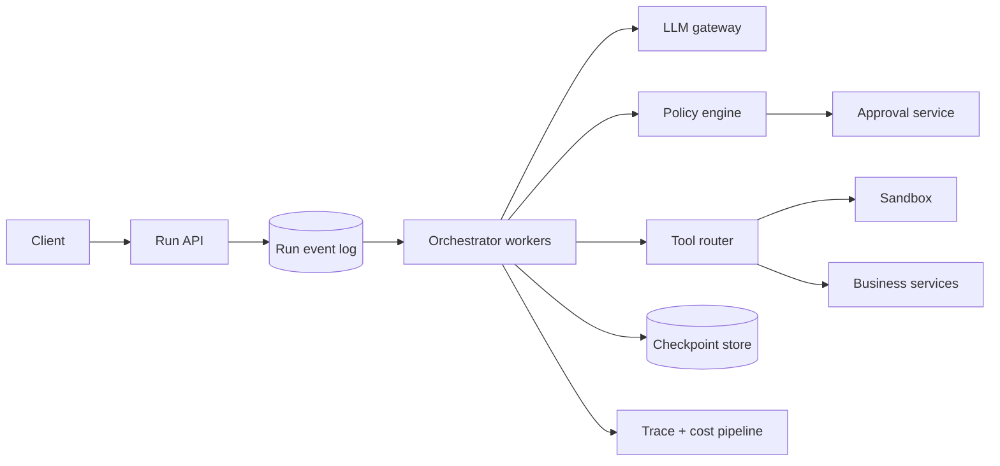

“给 LLM 接几个工具”还不是 Agent 平台。真正的系统问题出现在模型开始循环之后：模型决定下一步，工具产生结果，结果又进入下一轮模型调用，直到任务完成、预算耗尽、等待人工批准，或者被用户取消。

这个循环每多走一步，都会增加 token 成本、网络延迟和一次失败机会。更麻烦的是，工具可能真的改变外部世界：发邮件、退款、删文件、创建云资源。模型输出错一句话只是答案不好；工具被重复执行一次，可能就是一笔真实损失。

因此这道题的核心不是 prompt engineering，而是：**怎样把不确定的模型决策包在一个确定、可追踪、可恢复的执行系统里。**

> 配套实验：[打开 Agent Orchestration Lab](https://lab.zichaoyang.com/system-design/agent-orchestration/)。先保持 `max steps = 1`，再逐步增加工具数和上下文，不要直接跳到“全自动 Agent”。

## 一个退款为什么会执行两次

用户说：“给订单 991 退款。”

模型正确地产生了工具调用：

```json
{
  "tool": "create_refund",
  "arguments": { "orderId": "991", "amount": 49.00 }
}
```

Orchestrator 调用支付服务。支付服务已经完成退款，但响应在网络中丢失。Orchestrator 只看到 timeout，于是重试同一段 JSON。如果支付接口没有幂等键，用户可能收到两次退款。

这个故障和模型“聪不聪明”没有关系。它是一个标准的分布式系统问题：调用方不知道远端究竟“没执行”，还是“执行成功但回包丢了”。

所以一次工具调用至少要有稳定的 `tool_call_id`：

```http
POST /refunds
Idempotency-Key: run-7-step-3-call-1

{"orderId":"991","amount":49.00}
```

同一个 key 重试多少次，支付服务都必须返回同一个业务结果。仅仅在 Orchestrator 的日志里去重不够，因为第一次请求可能已经越过了 Orchestrator 的边界。

这是整篇设计的第一个抓手：**Agent 的每一步都可能重试，外部副作用必须能识别“这是同一次意图”。**

## 先把执行模型讲清楚

**Run**

一次完整用户任务。例如“调查订单并在符合条件时退款”。Run 可能持续几秒，也可能等待人工审批几小时。

**Step**

Run 中的一次决策。通常包含：组装 context、调用模型、验证模型输出，以及零个或多个 tool call。

**Tool call**

对外部能力的一次结构化调用。工具不是一段模型文本，而是一份需要 schema 校验、权限检查、timeout、retry 和审计的请求。

**Checkpoint**

Run 已经可靠完成到哪个位置。Worker 崩溃后，新 worker 应从最近 checkpoint 继续，而不是靠内存猜测。

**Durable waiting**

当 Run 等待人工审批或外部事件时，它应持久化为 `waiting` 并释放 worker。不能让一个线程或容器阻塞几个小时。

## 题目边界：先做受控执行，不做“无限自治”

平台支持：

1. 创建、查询、订阅和取消一个 Run；
2. 调用经过注册的工具；
3. 在敏感步骤暂停，等待人工批准或拒绝；
4. Worker 故障后从 checkpoint 恢复；
5. 记录每步模型版本、输入摘要、工具参数、结果与成本。

第一版只开放只读工具，例如查订单、查库存、搜索内部文档。写工具要等到幂等、审批和审计链路完成后再开放。

非功能约束比“能调用多少工具”更重要：

- 每个 Run 有总 deadline、最大 step、token 和费用预算；
- 租户凭证、工具结果和长期 memory 必须隔离；
- 模型输出永远按不可信输入处理；
- 用户取消后不得再开始新的副作用；
- 每一个外部动作都能追溯到用户、policy、模型版本和具体参数。

## 第一版：只允许一次模型决策和一个只读工具

最小版本不要写 `while True`。先固定执行链：

```text
user input
-> LLM chooses one read-only tool
-> validate JSON schema
-> authorize tool + resource
-> execute tool
-> LLM writes final answer
```

伪代码可以非常朴素：

```python
def answer_with_one_tool(user, input_text):
    action = llm.choose_tool(input_text, allowed_tools=user.allowed_tools)
    validate_against_schema(action)
    authorize(user, action.tool, action.arguments)

    result = tool_runner.execute(
        tool=action.tool,
        arguments=action.arguments,
        timeout_seconds=5,
    )

    return llm.write_answer(input_text, action, result)
```

这一版先解决三件基础问题：

1. 模型返回未知字段、错误类型或不存在的工具时，系统明确拒绝；
2. 用户能查“自己的订单”，不等于他能通过参数查别人的订单；
3. 工具返回一大段不可信文本时，它只是数据，不能偷偷改变系统指令。

完整记录原始模型输出很有排障价值，但敏感参数和工具结果需要按字段脱敏。Observability 不能成为另一条数据泄露路径。

## 第二版：把循环写成显式状态机

确认单步语义正确后，再允许最多 5 个 step。不要把 Run 只存在 worker 内存里，而要把状态转换写入 durable store。

```text
QUEUED
  -> RUNNING_MODEL
  -> RUNNING_TOOL
  -> RUNNING_MODEL
  -> COMPLETED

RUNNING_TOOL -> WAITING_APPROVAL
WAITING_APPROVAL -> RUNNING_TOOL | REJECTED
any non-terminal state -> CANCELLING -> CANCELLED
any state -> FAILED | TIMED_OUT
```

主循环更接近：

```python
while run.has_budget() and not run.deadline_expired():
    step = store.create_step(run.id)
    action = call_model(build_context(run, step))
    store.save_model_decision(step.id, action)

    if action.type == "finish":
        store.complete_run(run.id, action.answer)
        break

    tool_call = validate_authorize_and_persist(action)

    if policy.requires_approval(tool_call):
        store.wait_for_approval(run.id, tool_call.id)
        return

    result = execute_idempotently(tool_call)
    store.save_tool_result_and_checkpoint(step.id, result)
```

顺序很重要。执行工具前先持久化稳定的 `tool_call_id`；结果写入并 checkpoint 后，才能开始下一次模型决策。否则 worker 在副作用之后、checkpoint 之前崩溃，就无法区分是否需要重试。

## API：Run 是异步资源，不是一条永不结束的 HTTP

创建 Run：

```http
POST /v1/agent-runs
Idempotency-Key: support-ticket-88

{
  "agentVersion": "support-agent@17",
  "input": "检查订单 991，如果符合政策就退款",
  "maxSteps": 5,
  "deadlineSeconds": 60,
  "maxCostUsd": 0.50
}
```

```http
202 Accepted

{"runId":"run-7","state":"queued"}
```

观察、订阅和取消：

```http
GET    /v1/agent-runs/run-7
GET    /v1/agent-runs/run-7/events
DELETE /v1/agent-runs/run-7
```

审批不是一个同步弹窗，而是一项 durable command：

```http
POST /v1/agent-runs/run-7/approvals/approval-2

{"decision":"approve","comment":"符合七天退款政策"}
```

批准请求本身也要幂等。审批时重新验证 Run、tool 参数和 policy version，不能批准了一个后来已被修改的动作。

## 数据模型：把“模型说了什么”和“系统做了什么”分开

```text
Run(
  run_id, tenant_id, agent_version, state,
  step_count, token_used, cost_used,
  deadline_at, created_by, created_at, updated_at
)

Step(
  run_id, sequence, state,
  model_version, context_ref, model_output_ref,
  started_at, completed_at
)

ToolCall(
  tool_call_id, run_id, step_sequence,
  tool_name, tool_version, arguments_hash,
  arguments_ref, state, attempt_count, result_ref
)

Approval(
  approval_id, tool_call_id, policy_version,
  state, requested_at, decided_by, decided_at
)

RunEvent(
  run_id, sequence, event_type, payload_ref, created_at
)
```

大的 prompt、网页正文和工具结果放 object storage，数据库保存引用、hash 和必要摘要。`RunEvent.sequence` 给客户端一个稳定的进度顺序，断线重连时可以从 `last_seen_sequence` 继续。

长期 memory 不要混进 Run 表。它至少需要独立记录：

```text
MemoryEntry(
  memory_id, tenant_id, subject_id,
  content, provenance, confidence,
  visibility, expires_at, created_by_run
)
```

没有 provenance 的“记忆”很危险。模型在一次对话里猜错了用户地址，若系统把它当事实永久保存，未来每个 Run 都会继承错误。

## 高层架构：Orchestrator 负责状态，不负责信任模型



职责边界如下：

- Run API 接受命令并返回异步 ID，不执行长任务。
- Event log / queue 解耦请求流量和 worker，并提供至少一次投递。
- Orchestrator 是 Run 状态机 owner，负责 lease、checkpoint、预算和恢复。
- LLM gateway 统一模型限额、版本、timeout 和 fallback。
- Policy engine 决定某个用户能否用某个工具、哪些参数需要审批。
- Tool router 只把经过验证的调用送到正确信任边界。
- Sandbox 执行代码、shell 或不可信文件；业务服务执行退款等强语义动作。

不要把所有工具都放进同一个“万能 sandbox”。读取内部 CRM 和运行用户上传代码需要完全不同的网络、凭证和资源隔离。

## 容量估算：一个用户请求会放大成多少工作

假设高峰每秒进入 1,000 个 Run，平均 8 个 step，每个 step 调一次模型：

```text
1,000 runs/s × 8 steps = 8,000 model calls/s
```

若每步平均输入 20K tokens：

```text
8,000 × 20,000 = 160M input tokens/s
```

这说明系统首先可能撞上模型 gateway 的 token capacity，而不是 Run API 的 QPS。

若每个 Run 平均执行 3 个工具：

```text
1,000 × 3 = 3,000 tool calls/s
```

这些调用会落到不同下游，不能用一个总并发限制。搜索工具可能允许几千并发，支付写接口可能只允许几十。Tool router 应按 `tenant × tool` 设置独立 quota 和 circuit breaker。

还要估算等待状态。若每天有 100 万个 Run 进入人工审批，平均等待 4 小时，系统会长期持有约 16.7 万个 waiting Run。它们不能占 worker，却必须能被查询、过期和恢复。

## 延迟预算：多步串行会直接相加

假设一次模型调用 2 秒，一次工具调用 1 秒。8 个完全串行的 step 已经是：

```text
8 × (2s + 1s) = 24s
```

因此平台应从用户体验上区分两类任务：

- 交互任务尽量在几秒内完成，限制 step，并流式展示可靠的进度事件；
- 长任务立即返回 Run ID，后台执行，完成后通知用户。

没有数据依赖的只读工具可以并行，例如同时查订单和查物流。但两个写操作是否并行，是业务语义问题，不是性能开关。并发执行“退款”和“取消发货”可能产生难以补偿的中间状态。

每个下游调用都要拿到“剩余 deadline”，而不是重新获得完整 timeout。一个 Run 已经花掉 55 秒时，最后一步不能再向工具申请 30 秒。

## Context 不能无限增长

最简单的实现会把所有历史 step、工具结果和 schema 每轮都塞回 prompt。随着 Run 变长，成本和 latency 会二次恶化：后面的每一步都重复发送前面的全部内容。

更可控的 context 由四层组成：

1. 固定的 agent policy 和当前任务；
2. 最近几步的原始事件；
3. 较早历史的有来源摘要；
4. 按当前问题检索出来的长期 memory。

摘要不是事实数据库。它必须保留关键 ID、未完成约束和来源引用；对金额、权限、地址等高风险字段，应重新从系统 of record 查询，而不是相信模型写的 summary。

工具数量变多时，也不要把上百份 JSON Schema 永久塞进 prompt。先根据任务 route 到一个小工具集合，再让模型选择。这样同时降低 token、误选概率和权限暴露面。

## 正确性、恢复与取消

**Worker crash**

Worker 对 Run 只持短 lease。Lease 过期后，新 worker 从最后 checkpoint 恢复。因为队列是至少一次投递，同一个 Run 可能被取到多次；状态转换要用 version compare-and-swap，避免两个 worker 同时推进。

**Tool timeout**

只对明确可重试的错误重试，并复用同一个 `tool_call_id`。如果工具不支持幂等，就必须查询结果、人工确认或执行补偿，不能盲目重试写请求。

**取消**

取消先把 Run 原子地改为 `CANCELLING`，从这一刻起禁止创建新 tool call。对已经发出的调用发送 cancel；若远端无法取消，就等待结果并决定是否补偿。最后才进入 `CANCELLED`。

**审批过期**

审批请求要有 expiry。恢复执行前重新确认资源和 policy；一周前批准的价格或库存操作未必仍有效。

**循环跑偏**

除了 `max_steps`，还应检测重复 tool + arguments、连续无进展结果和成本增长。终止原因要对用户可见，不能统一显示“Agent failed”。

## 安全边界：模型输出默认不可信

最少需要以下防线：

- JSON Schema 只保证形状，不保证用户有权访问参数里的资源；
- 工具采用最小权限的短期凭证，不把主服务密钥放进 prompt；
- 网页、邮件和文件内容视为不可信数据，不能覆盖 system policy；
- 代码执行使用进程、文件系统、网络和资源配额隔离的 sandbox；
- 高风险动作在 policy 层强制审批，不能让模型自己决定绕过；
- Trace 与日志对 secret、PII 和工具结果做字段级脱敏。

“让模型判断这条指令是否安全”可以是辅助信号，但不能替代确定性的授权检查。

## 关键指标和故障告警

需要同时观察产品、模型和执行三层：

- Run completion、cancel、timeout、approval 和 human-escalation rate；
- 每个 Run 的 step、input/output token、费用和总耗时分布；
- 每个工具的成功率、p99、retry、幂等命中和 circuit-open 次数；
- waiting Run 数、最长等待时间、lease steal 和恢复次数；
- context 长度、compaction 次数、memory retrieval 命中；
- policy deny、schema reject、sandbox violation 和越权尝试。

只看最终“任务成功率”会掩盖一个成本失控的 Agent。一个任务最后完成了，但绕了 40 步、花了 10 美元，也不是健康系统。

## 关键取舍：自治不是越多越好

**更多 step** 可能提高复杂任务成功率，也线性扩大成本、延迟和跑偏空间。

**并行工具** 能缩短只读查询时间，但会让失败合并、顺序和副作用补偿更复杂。

**自动长期记忆** 让体验连续，也会把模型错误持久化。高风险事实应由用户确认或来自权威系统。

**模型 fallback** 提高可用性，却可能改变工具选择、输出格式和安全表现。切换模型前要验证兼容性，不能只看接口相同。

**精细 checkpoint** 减少故障重做，却增加写放大和状态管理。通常在模型决策后、工具调用前、工具结果后设置语义 checkpoint，比每个 token 都落盘更合理。

## 用 Lab 观察系统为什么需要这些组件

**实验一：增加 max steps**

保持并发不变，从 1 增加到 10。观察模型调用和总 latency 如何近似线性放大。问自己：哪些 step 真的产生了新信息？

**实验二：增加工具数和 context**

观察每次模型调用的 token 和路由压力。然后假设先用一个轻量 router 选出 5 个工具，再比较成本。

**实验三：增加并发 session**

注意瓶颈会在 LLM quota、某个 hot tool 和 waiting Run 之间移动。Run API 能接住流量，不代表下游副作用能接住。

## 面试里怎么自然地讲

开场先用退款例子锁定问题：

> I would not model an agent as a loop living inside one worker. I would model each run as a durable, budgeted state machine, because every model step can fail and every tool call may create an external side effect.

然后按演化顺序画：

```text
one read-only tool
-> bounded multi-step loop
-> durable checkpoints
-> idempotent side effects
-> approval + cancellation
-> context compaction and multi-tenant isolation
```

主链路讲完后，可以把 deep dive 交给面试官：

> The main execution path is complete. I can go deeper into exactly-once business effects, durable recovery, sandbox security, or context and memory management.

这比一句“LLM 调 MCP tools”更像系统设计，因为你解释了系统在失败和重试下仍然如何守住业务语义。

## 参考资料

- [ReAct: Synergizing Reasoning and Acting in Language Models](https://arxiv.org/abs/2210.03629)
- [Temporal: Durable Execution](https://docs.temporal.io/temporal)
- [The Morning Paper: Idempotence Patterns in Distributed Systems](https://blog.acolyer.org/2015/01/20/idempotence-is-not-a-medical-condition/)
- [OWASP Top 10 for Large Language Model Applications](https://owasp.org/www-project-top-10-for-large-language-model-applications/)
