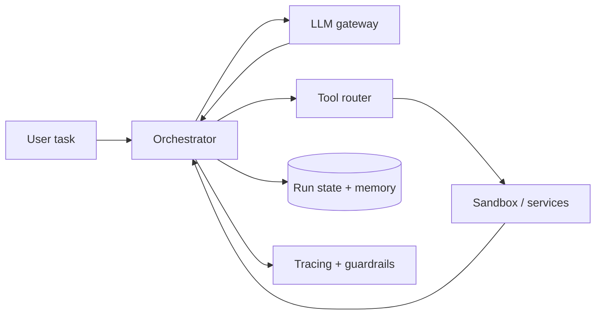

Agent 不是“LLM 加很多工具”。真正的系统问题从 loop 开始：模型决定行动，工具返回结果，结果进入下一步 context，直到完成、超时或被终止。每多一步都增加 latency、token 成本和副作用风险。

> 对应实验：[打开 Agent Orchestration Lab](https://lab.zichaoyang.com/system-design/agent-orchestration/)。增加 max steps、tool calls、context 和并发 session，观察成本与可靠性变化。

## 需求边界（Requirements）

功能上创建/观察/取消 run、执行工具、暂停审批并恢复；首版只读工具。非功能上要求预算和 deadline、durable execution、tool 副作用幂等、租户隔离与完整 trace，自治程度必须受 policy 控制。

## 0. 先搭单步 Tool Runner MVP Scaffold

第一版不做自治 loop。用户请求进来，应用调用 LLM 生成结构化 tool call；代码用 JSON Schema 校验；权限检查后执行一个只读工具；结果返回给 LLM 生成最终答复。完整记录 input、model output、tool args/result 和 trace ID。

第二版才允许最多 5 step 的 reason-act loop，并给 token、时间和工具调用总预算。先支持无副作用工具；写操作加入 idempotency 和 human approval 后再开放。

## 1. API：Run 是可暂停、可取消的状态机

```http
POST /v1/agent-runs
Idempotency-Key: task-88

{"agent":"support","input":"退款订单 991","maxSteps":5,"deadlineSeconds":60}

202 Accepted
{"runId":"run-7","state":"queued"}

POST /v1/agent-runs/run-7/approvals/a-2
{"decision":"approve"}
```

客户端通过 SSE 订阅 step/event；`DELETE /v1/agent-runs/run-7` 取消。Approval 是 durable waiting state，不是阻塞 worker 的同步弹窗。

## 2. 数据模型（Data Model）

```text
Run(run_id PK, tenant_id, agent_version, state, step_count, budgets, deadline, created_at)
Step(run_id, sequence, model_request, model_response, state, started_at, completed_at)
ToolCall(call_id PK, run_id, step, tool_version, arguments_hash, state, result_ref)
Approval(approval_id PK, call_id, policy_version, state, decided_by, decided_at)
MemoryEntry(memory_id, tenant_id, subject, fact, provenance, confidence, expires_at)
```

大 tool result 放 object storage，Step 保存引用和摘要。Memory 必须有 provenance 和作用域。

## 3. 单机端到端流程

Worker lease Run，写 Step started，调用 LLM，校验 action。若 tool 需审批，写 Approval 并释放 worker；批准后新 worker 从 checkpoint 恢复。执行 tool 前持久化稳定 call ID，tool 以该 ID 幂等；结果落盘后再进入下一 step。达到预算、deadline 或 stop action 就结束。

## 4. 容量估算：用户任务会放大成多次调用

1000 runs/s、平均 8 step，每秒 8000 次 LLM call；每 step 平均 20k input token，就是 1.6 亿 input token/s。每 run 3 次 tool call 又是 3000 次外部副作用/秒。成本、模型 gateway quota 和 context 带宽会先于普通 API QPS 成为瓶颈。

## 5. Latency Budget：串行 step 会相加

单次 LLM 2 秒、tool 1 秒、8 step 最坏已 24 秒。独立 tool 可并行，但有数据依赖或写副作用必须有序。对长任务返回异步 progress；不要让 HTTP 连接承担整个 run。每 step 传递剩余 deadline。

## 6. Correctness and Reliability

Run、Step、ToolCall 状态持久化，worker 只持 lease。Tool 调用 at-least-once，因此副作用必须幂等或有补偿。Schema validation、allowlist、sandbox 和 tenant credential boundary 在执行前完成。取消后禁止新 tool，in-flight 尽力撤销。

## 7. Trade-offs：自治程度与控制力

- 更多 step 提高完成复杂任务的机会，也线性增加成本、延迟和跑偏空间。
- 大 tool registry 灵活却挤 prompt、降低选择准确率；先 router 到小集合更稳。
- 自动记忆方便但会持久化错误；带 provenance 的确认写入更安全。
- 并行工具降低 latency，却使失败合并和副作用顺序更复杂。

## 一个最小失败

Agent 调用“创建退款”后网络超时。Orchestrator 不知道工具是否已成功，于是重试；如果没有 idempotency key，用户收到两次退款。这个例子说明 tool call 是分布式副作用，不只是模型输出的一段 JSON。

## 概念阶梯

- **Run / step**：run 是完整任务；step 是一次模型决策及其后续 tool call。
- **Durable state**：每步输入、输出、状态和 checkpoint 都持久化，worker crash 后能恢复。
- **Tool idempotency**：同一个 call ID 的重试返回同一业务结果。
- **Context compaction**：旧历史摘要化，把长期事实移到 memory，避免 context 无限增长。

## 主链路



Orchestrator 是状态机 owner：验证模型产生的 tool schema、执行权限检查、写 durable step、派发工具并处理 retry。LLM gateway 管模型限额与 fallback；sandbox 隔离代码、shell 和不可信文件。

## 架构演化

1. 单次模型调用不需要 agent infrastructure。
2. reason-act loop 出现后，需要 step limit、deadline、budget 和 cycle detection。
3. context 变长后，需要 compaction、retrieval memory 和明确 provenance。
4. 独立工具可并发，但有依赖或副作用的工具必须有序。
5. 多租户规模下，tracing、quota、sandbox、approval 和 cancellation 比 prompt 技巧更重要。

## 常见难点

- 不要把所有工具 schema 永久塞进 prompt；先 route 到小工具集，降低 token 与误选。
- Human approval 是状态机中的可暂停节点，不能靠 worker 阻塞等待。
- 取消 run 后要阻止新的副作用，并尽力取消在途工具。
- Memory 写入需要来源和作用域，错误事实不能无条件污染未来任务。

## 面试表达

> I would model an agent run as a durable, budgeted state machine. The orchestrator validates each action, executes tools idempotently in the right trust boundary, and checkpoints before the next model step.

这比“LLM 调 MCP tools”更接近真实系统设计。可深入 durable execution、sandbox security、context management 或 observability。
