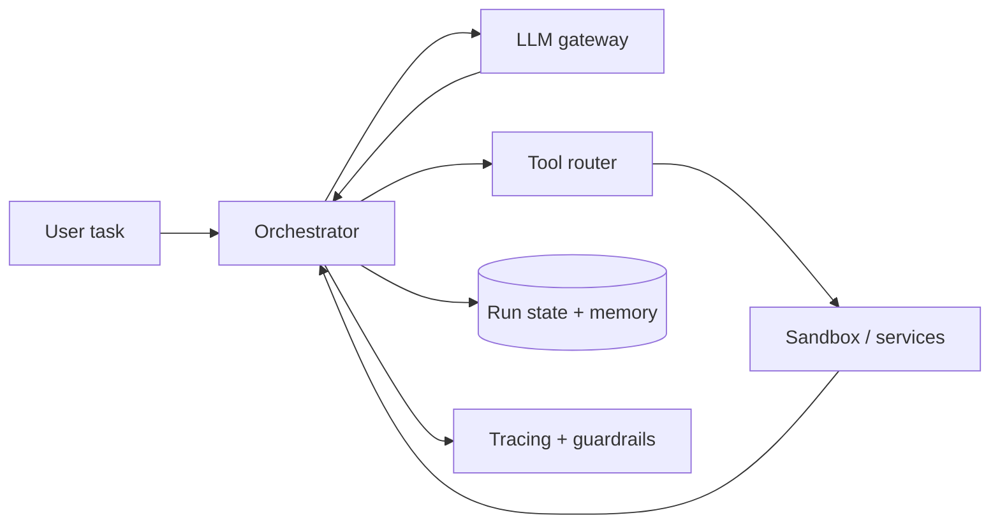

Agent 不是“LLM 加很多工具”。真正的系统问题从 loop 开始：模型决定行动，工具返回结果，结果进入下一步 context，直到完成、超时或被终止。每多一步都增加 latency、token 成本和副作用风险。

> 对应实验：[打开 Agent Orchestration Lab](https://lab.zichaoyang.com/system-design/agent-orchestration/)。增加 max steps、tool calls、context 和并发 session，观察成本与可靠性变化。

## 一个最小失败

Agent 调用“创建退款”后网络超时。Orchestrator 不知道工具是否已成功，于是重试；如果没有 idempotency key，用户收到两次退款。这个例子说明 tool call 是分布式副作用，不只是模型输出的一段 JSON。

## 概念阶梯

- **Run / step**：run 是完整任务；step 是一次模型决策及其后续 tool call。
- **Durable state**：每步输入、输出、状态和 checkpoint 都持久化，worker crash 后能恢复。
- **Tool idempotency**：同一个 call ID 的重试返回同一业务结果。
- **Context compaction**：旧历史摘要化，把长期事实移到 memory，避免 context 无限增长。

## 主链路

Orchestrator 是状态机 owner：验证模型产生的 tool schema、执行权限检查、写 durable step、派发工具并处理 retry。LLM gateway 管模型限额与 fallback；sandbox 隔离代码、shell 和不可信文件。

## 架构演化

1. 单次模型调用不需要 agent infrastructure。
2. reason-act loop 出现后，需要 step limit、deadline、budget 和 cycle detection。
3. context 变长后，需要 compaction、retrieval memory 和明确 provenance。
4. 独立工具可并发，但有依赖或副作用的工具必须有序。
5. 多租户规模下，tracing、quota、sandbox、approval 和 cancellation 比 prompt 技巧更重要。

## 常见难点

- 不要把所有工具 schema 永久塞进 prompt；先 route 到小工具集，降低 token 与误选。
- Human approval 是状态机中的可暂停节点，不能靠 worker 阻塞等待。
- 取消 run 后要阻止新的副作用，并尽力取消在途工具。
- Memory 写入需要来源和作用域，错误事实不能无条件污染未来任务。

## 面试表达

> I would model an agent run as a durable, budgeted state machine. The orchestrator validates each action, executes tools idempotently in the right trust boundary, and checkpoints before the next model step.

这比“LLM 调 MCP tools”更接近真实系统设计。可深入 durable execution、sandbox security、context management 或 observability。
