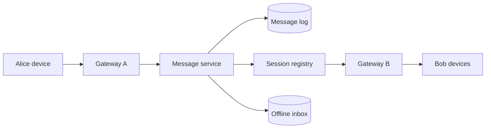

聊天系统首先是**连接与投递问题**，其次才是消息存储问题。

Alice 和 Bob 在同一台 server 上时，一条消息只是从 Alice 的 socket 转发到 Bob 的 socket。但当两人连接到不同机器，发送端必须先知道 Bob 的连接在哪里；当 Bob 离线，还要知道这条消息之后从哪里补发。

> 对应实验：[打开 Chat / Messaging Lab](https://lab.zichaoyang.com/system-design/chat-messaging/)。依次增加并发连接、群组大小、离线比例和 Region 数。

## 需求边界（Requirements）

功能上支持发送、历史、离线补拉和多设备 receipt；群聊与 E2EE 是后续层。非功能上要求 conversation 内有序、ack 后可恢复、在线低延迟，并允许 presence/typing 采用更弱的 best-effort 语义。

## 0. 先搭 1:1 Chat MVP Scaffold

第一版只支持两个人文本聊天、单设备、在线投递和历史拉取。部署一台 WebSocket server 加 PostgreSQL。连接建立后维护 `user_id -> socket` 内存表；消息先写数据库再推送。不要一开始就加入群聊、E2EE、presence 和 multi-region。

## 1. API 与 WebSocket Protocol

历史和会话列表走 HTTP：

```http
POST /v1/conversations {"participantIds":[42, 9]}
GET /v1/conversations/c-1/messages?afterSequence=120&limit=100
```

实时消息走 WebSocket：

```json
{"type":"send_message","conversationId":"c-1","clientMessageId":"m-local-8","text":"hi"}
{"type":"message_ack","clientMessageId":"m-local-8","messageId":"m-991","sequence":121}
```

`clientMessageId` 让重连重试保持幂等；服务端分配的 `sequence` 只在 conversation 内有序。

## 2. 数据模型（Data Model）

```sql
Conversation(conversation_id PK, kind, created_at)
Participant(conversation_id, user_id, joined_at, PRIMARY KEY(conversation_id, user_id))
Message(conversation_id, sequence, message_id UNIQUE, sender_id, body, created_at,
        PRIMARY KEY(conversation_id, sequence))
DeviceCursor(device_id, conversation_id, delivered_sequence, read_sequence)
```

消息 append-only；receipt 更新 cursor，不修改每条消息。大附件进 object storage，消息只存引用。

## 3. 单机端到端流程

Server 验证发送者属于 conversation，在事务中按 conversation 分配下一个 sequence 并插入消息，commit 后返回 ack，再向在线收件人 socket 推送。收件人断线后用 `afterSequence` 补齐。这个顺序保证“收到 ack 的消息可恢复”。

## 4. 容量估算：连接数和 fan-out 分开算

假设 1000 万并发设备，每条连接含 buffer、认证和协议状态约 20KB，连接内存约 200GB，已经迫使 gateway 集群化。若入站 20 万消息/秒、平均收件 2 人、每人 2 台设备，实际设备投递约 80 万/秒；大群会继续放大。

历史存储按 20 万消息/秒、平均 500 bytes 计算，每天约 8.6TB raw data，必须按 conversation/time 分区并做生命周期管理。

## 5. Latency Budget：发送到送达

可把同 region p99 目标设为 150ms：client-to-gateway 30ms，鉴权和路由 10ms，durable append 30ms，fan-out 40ms，余量 40ms。Presence 可以 best-effort 更快；消息不能为了追求 20ms 而在 durable append 前 ack。

## 6. Correctness and Reliability

同一 conversation 要有单一 ordering owner 或可线性化 sequence 分配。Gateway crash 后客户端重连并从最后 cursor 重放。At-least-once 推送会重复，客户端按 message ID/sequence 去重。Receipt 可最终一致，不应阻塞消息写入。

## 7. 关键 Trade-offs

- Durable-before-ack 防丢，但多一次写 latency；early ack 更快却可能确认后丢失。
- Per-conversation order 足够且可扩展；全球总序没有产品价值却极其昂贵。
- Sender-key sharding 写均匀，但群聊读取分散；conversation-key sharding 保局部性，却会形成 hot room。

## 术语阶梯

- **Connection gateway**：专门持有 WebSocket 的服务器。它维护长连接，不负责复杂业务。
- **Session registry**：`user/device -> gateway` 的短期映射，用来把消息路由到正确连接。
- **Inbox**：给离线设备保存待同步消息的持久化日志。
- **Delivery / read receipt**：独立的状态事件，不应修改原始消息记录。

## 一条消息怎么走



服务端先为消息分配稳定的 `message_id` 和会话内序号，持久化后再 fan-out。在线设备经 gateway 收到；离线设备从 inbox 或会话日志补齐。客户端重试时携带同一个 client message ID，避免重复消息。

## 为什么架构会变形

1. 几千条连接时，一台 server 可以同时持有 socket 和路由消息。
2. 百万连接时，gateway 必须水平扩展，session registry 解决“用户在哪台机器”。
3. 大群聊出现时，成本变成 `消息速率 × 群成员 × 设备数`，需要异步 fan-out 和背压。
4. 离线与多设备要求持久化 inbox、同步 cursor 和 push notification。
5. 多 region 时，socket 就近终结，消息通过跨 region backbone 去往收件人所在 region。

## 三个常见误区

**把 WebSocket 当成消息可靠性。** WebSocket 只是一条连接；断线、重连、重放和去重仍需协议完成。

**用全局时间戳排序。** 聊天通常只要求单个 conversation 内有序。给每个会话一个 sequence，比制造全球总序简单得多。

**把 presence 当 durable data。** 在线状态和正在输入提示会不断刷新，丢一次更新没关系；它们应走有 TTL 的易逝通道，不要污染消息日志。

## 面试表达

> I would separate durable message ordering from ephemeral connection state. Gateways own sockets, a session registry locates devices, and a durable per-conversation log supports replay and offline delivery.

高层设计讲到 `Gateway -> Message Service -> Log -> Fan-out/Inbox` 就可以停。随后让面试官选群聊 fan-out、消息顺序、multi-device sync 或 end-to-end encryption。重点始终是 delivery semantics，而不是“用了 WebSocket”。
