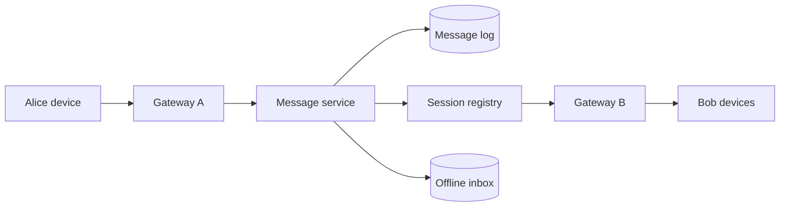

聊天系统首先是**连接与投递问题**，其次才是消息存储问题。

Alice 和 Bob 在同一台 server 上时，一条消息只是从 Alice 的 socket 转发到 Bob 的 socket。但当两人连接到不同机器，发送端必须先知道 Bob 的连接在哪里；当 Bob 离线，还要知道这条消息之后从哪里补发。

> 对应实验：[打开 Chat / Messaging Lab](https://lab.zichaoyang.com/system-design/chat-messaging/)。依次增加并发连接、群组大小、离线比例和 Region 数。

## 术语阶梯

- **Connection gateway**：专门持有 WebSocket 的服务器。它维护长连接，不负责复杂业务。
- **Session registry**：`user/device -> gateway` 的短期映射，用来把消息路由到正确连接。
- **Inbox**：给离线设备保存待同步消息的持久化日志。
- **Delivery / read receipt**：独立的状态事件，不应修改原始消息记录。

## 一条消息怎么走

服务端先为消息分配稳定的 `message_id` 和会话内序号，持久化后再 fan-out。在线设备经 gateway 收到；离线设备从 inbox 或会话日志补齐。客户端重试时携带同一个 client message ID，避免重复消息。

## 为什么架构会变形

1. 几千条连接时，一台 server 可以同时持有 socket 和路由消息。
2. 百万连接时，gateway 必须水平扩展，session registry 解决“用户在哪台机器”。
3. 大群聊出现时，成本变成 `消息速率 × 群成员 × 设备数`，需要异步 fan-out 和背压。
4. 离线与多设备要求持久化 inbox、同步 cursor 和 push notification。
5. 多 region 时，socket 就近终结，消息通过跨 region backbone 去往收件人所在 region。

## 三个常见误区

**把 WebSocket 当成消息可靠性。** WebSocket 只是一条连接；断线、重连、重放和去重仍需协议完成。

**用全局时间戳排序。** 聊天通常只要求单个 conversation 内有序。给每个会话一个 sequence，比制造全球总序简单得多。

**把 presence 当 durable data。** 在线状态和正在输入提示会不断刷新，丢一次更新没关系；它们应走有 TTL 的易逝通道，不要污染消息日志。

## 面试表达

> I would separate durable message ordering from ephemeral connection state. Gateways own sockets, a session registry locates devices, and a durable per-conversation log supports replay and offline delivery.

高层设计讲到 `Gateway -> Message Service -> Log -> Fan-out/Inbox` 就可以停。随后让面试官选群聊 fan-out、消息顺序、multi-device sync 或 end-to-end encryption。重点始终是 delivery semantics，而不是“用了 WebSocket”。
