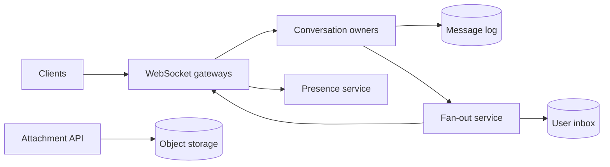

聊天系统最容易画成 `Client -> WebSocket -> Message Queue -> Database`。这条链路没有回答用户真正关心的三个问题：发送按钮变成“已发送”时，消息会不会丢？手机和电脑同时在线时，顺序是否一致？断网一小时后，怎样只补回缺失消息？

这道题的核心不是长连接本身，而是：**怎样为每个会话建立可靠、可恢复的消息顺序，并把它实时或稍后送到每个成员的设备。**

> 配套实验：[打开 Chat / Messaging Lab](https://lab.zichaoyang.com/system-design/chat-messaging/)。先保持一对一和单设备，再增加群组大小、离线比例和 Region；观察瓶颈从连接转向 fan-out。

## 一条消息什么时候算“发出去了”

Alice 给 Bob 发送：

```text
今晚 7 点见
```

客户端本地立刻显示一个灰色气泡，然后把消息发给服务端。服务端有三种可能的 ack 时机：

1. 收到网络包就 ack；
2. 写入进程内存后 ack；
3. 持久化到能够恢复的日志后 ack。

若采用前两种，服务端在 ack 后崩溃，Alice 看到“已发送”，Bob 却永远收不到。更稳的语义是：服务端分配消息 ID 和会话序号，durable append 成功后再返回 `accepted`。

这不等于 Bob 已经收到。消息生命周期要区分：

```text
local -> accepted by server -> delivered to device -> read by user
```

把四个状态都叫 `sent=true`，产品和系统都会含糊。

## 先讲清会话序号与全局时间

聊天不需要给全世界所有消息排一个总顺序。用户只在乎同一个 conversation 中看到稳定顺序。

每个会话可以有单调递增 `conversation_sequence`：

```text
conversation c-9:
  seq 41: Alice: 今晚 7 点见
  seq 42: Bob: 好的
```

客户端时间只用于展示，不用于权威排序。手机时钟可能快五分钟，网络也可能让后发送的包先到。会话 owner 分配的 sequence 才是同步游标。

跨不同 conversation 没有必要比较 `seq=41` 谁先。避免不需要的全局排序，可以显著降低协调成本。

## 题目边界

核心功能：

1. 一对一和群聊；
2. 多设备实时收发；
3. 离线后增量同步；
4. 发送、送达、已读状态；
5. 图片/文件附件；
6. 在线状态和正在输入提示。

第一版不展开语音视频、公开频道搜索和复杂机器人平台。端到端加密会讨论它对架构的影响，但不在本文实现密码协议。

非功能目标：

- 在线消息端到端 p99 例如低于 200ms；
- 已 accepted 的消息不因单机故障丢失；
- 单会话顺序稳定，重复发送可去重；
- 断线重连按 cursor 增量补齐；
- 大群不能把一个 sender request 同步阻塞到所有成员；
- Presence 丢一帧可以接受，正文消息不行。

## 第一版：单服务器、SQLite/Postgres、WebSocket

先只支持两人单设备。服务器维护 WebSocket connection map：

```text
user_id -> connection
```

数据表：

```sql
CREATE TABLE conversations (
  conversation_id TEXT PRIMARY KEY,
  next_sequence    BIGINT NOT NULL
);

CREATE TABLE conversation_members (
  conversation_id TEXT,
  user_id         TEXT,
  joined_sequence BIGINT NOT NULL,
  left_sequence   BIGINT,
  PRIMARY KEY (conversation_id, user_id)
);

CREATE TABLE messages (
  conversation_id TEXT,
  sequence        BIGINT,
  message_id      TEXT UNIQUE,
  client_message_id TEXT NOT NULL,
  sender_id       TEXT NOT NULL,
  content         TEXT NOT NULL,
  created_at      TIMESTAMP NOT NULL,
  PRIMARY KEY (conversation_id, sequence),
  UNIQUE (sender_id, client_message_id)
);
```

客户端发送稳定的 `client_message_id`。服务端事务：

1. 验证 sender 是会话成员；
2. 按 `(sender_id, client_message_id)` 查重；
3. 锁定 conversation，领取 `next_sequence`；
4. 插入 message 并递增 sequence；
5. commit；
6. ack sender，并向在线 Bob 推送。

```python
def send_message(command):
    with database.transaction():
        existing = find_by_client_id(command.sender, command.client_id)
        if existing:
            return existing

        assert_member(command.sender, command.conversation_id)
        sequence = allocate_sequence(command.conversation_id)
        message = insert_message(command, sequence)

    push_if_online(message)
    return message
```

网络超时后客户端重发同一个 `client_message_id`，服务端返回原消息，不产生两个气泡。

## WebSocket 协议：命令与事件分开

客户端命令：

```json
{
  "type":"send_message",
  "requestId":"r-91",
  "conversationId":"c-9",
  "clientMessageId":"alice-device-1:882",
  "content":{"type":"text","text":"今晚 7 点见"}
}
```

服务端 ack：

```json
{
  "type":"message_accepted",
  "requestId":"r-91",
  "messageId":"m-44",
  "conversationId":"c-9",
  "sequence":41
}
```

推送事件：

```json
{
  "type":"message_created",
  "eventId":"e-72",
  "conversationId":"c-9",
  "sequence":41,
  "messageId":"m-44",
  "senderId":"alice",
  "content":{"type":"text","text":"今晚 7 点见"}
}
```

同一个事件可能因重连或 retry 到达多次，客户端按 `message_id` 去重，并按 sequence 排列。不要假设 WebSocket 连接永不重建。

## 离线同步：Cursor 比“拉最近 100 条”可靠

Bob 最后处理到 `sequence=37`，重连时请求：

```http
GET /v1/conversations/c-9/messages?afterSequence=37&limit=500
```

返回 38–最新序号。若超过 500 条，继续用 next cursor。

多会话同步需要用户级 inbox cursor：

```text
UserInboxEvent(
  user_id,
  inbox_sequence,
  conversation_id,
  conversation_sequence,
  event_type
)
```

它告诉客户端哪些 conversation 发生了变化；客户端再按每会话 cursor 拉详情。否则用户有 10,000 个群时，重连不能逐个查询。

Cursor 是服务端稳定序号，不要用 `created_at > last_sync_time`。相同时间戳、时钟偏差和分页期间新增消息都会造成漏或重。

## 多设备：送达与已读属于设备还是用户

一个用户可能有手机、电脑和平板：

```text
DeviceSession(
  user_id,
  device_id,
  connection_id,
  last_heartbeat,
  last_inbox_sequence
)
```

消息要 fan-out 到用户所有活跃设备。设备 ack 表示该设备收到；产品可以把“delivered”定义为任一设备收到，或主设备收到。定义必须明确。

Read cursor 通常按用户/会话存一个最大值：

```text
ConversationReadState(
  user_id,
  conversation_id,
  last_read_sequence,
  updated_at
)
```

更新使用 `max(current, incoming)`，因为旧设备晚到的 cursor 不应把已读位置倒退。

## 附件：不要经过消息服务上传大文件

客户端先向 Attachment API 获取预签名上传 URL，直接上传 object storage。完成扫描后获得 immutable attachment ID：

```text
Attachment(
  attachment_id,
  owner_id,
  object_uri,
  content_hash,
  mime_type,
  size,
  scan_state
)
```

Message content 只引用 attachment ID。接收方通过授权的下载 URL 获取。

这样 100MB 视频不会占用 WebSocket server 内存，也不会让消息 log 承担 blob replication。消息只有在 attachment `READY` 后才能发送，或明确显示处理中状态。

## Presence 和 typing 为什么要走另一条路

Presence 是易逝状态：

```text
online
last_seen
typing in conversation c-9
cursor/active device
```

漏掉一次 typing event 没关系，几秒 TTL 后自然消失。把它写进 durable message log 会制造巨大写放大，也让用户离线同步到一堆过期“正在输入”。

Presence service 使用 heartbeat、TTL 和 best-effort pub/sub。正文消息走 durable log。两条路径共享鉴权，但不共享可靠性等级。

## 从单服务器到 Conversation Owner

多台 chat server 同时给同一 conversation 分配 sequence 会冲突。可以按 `hash(conversation_id)` 把会话路由到一个逻辑 owner / shard：

```text
conversation -> owner shard -> ordered append
```

Owner 串行处理该会话的 membership change 和 message append，写入 replicated log 后 ack。Gateway 只维护连接并转发命令。



Owner 不是永远固定机器。Shard map 带 epoch，故障后从 message log 恢复 next sequence。旧 owner 的 lease 失效后不能继续写，避免 split brain。

## 群聊 Fan-out：小群和大群不是同一种负载

100 人群中一条消息，可以为每个成员写一条 inbox event，读取非常快。这是 fan-out on write。

100 万人公开频道每条消息写 100 万份，会产生巨大写放大。更适合只写一次 conversation log，成员读取时按 cursor 拉取，即 fan-out on read。

混合策略：

- 小群：写入时 fan-out 到 member inbox；
- 大群/频道：只写 conversation log，在线成员通过 pub/sub 收到提示，离线按会话 cursor 读取；
- 特别活跃的用户：inbox 可按时间分片并设 retention。

阈值来自消息率和成员数乘积，不是固定“500 人以上”。一个 10 万人但每天一条消息的群，写放大也许可接受；一个 5,000 人高频交易群可能更重。

## 容量估算

假设 100M 日活，10% 峰值在线：

```text
10M concurrent WebSocket connections
```

若每台 gateway 安全维持 100K connections，需要约 100 台，再加 Region 与故障 headroom。连接数和消息 QPS是不同资源：大多数连接很空闲，但仍占 socket、heartbeat 和 memory。

假设每天 10B 条消息，平均正文与 metadata 1KB：

```text
10B × 1KB = 10TB/day raw messages
```

复制 3 份是 30TB/day，还没算索引和附件。消息按 conversation/time 分区，老数据进入冷存储与 retention。

若平均一条消息 fan-out 给 20 个用户：

```text
10B × 20 = 200B inbox events/day
```

Fan-out metadata 可能比正文总量更大。大群混合策略和紧凑 inbox record 很关键。

## 延迟预算

在线同 Region 200ms p99 示例：

| 阶段 | 预算 |
|---|---:|
| Gateway 鉴权/解析 | 10 ms |
| 路由到 owner | 20 ms |
| Durable append + quorum | 50 ms |
| Fan-out 到接收 gateway | 50 ms |
| 网络和客户端渲染 | 50 ms |
| 余量 | 20 ms |

Sender 的本地气泡立即显示，不等待网络；`accepted` 到达后变为已发送。接收端推送慢不应阻塞 sender ack，只要消息已 durable，fan-out 可以重试。

群 fan-out latency 按成员分布会有长尾。产品可以承诺“在线大多数成员快速收到，所有离线成员最终可同步”，而不是同步等待 100% delivery。

## 多 Region：会话要有一个排序归属

若 Alice 在美国、Bob 在欧洲，同一会话的消息仍需一个权威 sequence。可以为 conversation 选择 home Region：

- 写命令转发到 home owner 排序；
- 消息异步复制到成员所在 Region；
- Gateway 在本地维持连接和缓存；
- Home 故障时通过 lease/consensus 把 ownership 切到新 Region。

跨 Region 写会增加一方 latency，却保持顺序简单。允许多个 Region 同时排序则需要冲突/因果合并，复杂度更高。

Conversation home 可以按成员地理、创建者或动态活跃度选择。迁移时要冻结一个短 epoch，确保旧新 owner 不同时分配 sequence。

## 端到端加密改变什么

如果 message content 在客户端加密，服务端存 ciphertext：

```text
message_id, conversation_id, sequence,
sender_device_id, ciphertext, encryption_metadata
```

服务器仍负责顺序、delivery、membership、rate limit 和 ciphertext storage，但不能做正文搜索、服务端内容审核或轻易恢复密钥。

群成员变化要触发密钥/epoch 更新；多设备加入需要安全地获得会话密钥。密码协议应使用成熟标准，而不是系统设计面试现场发明。

## 故障和正确性

**Sender 重试**

稳定 client message ID 去重，返回原 sequence。Ack 丢失不会产生重复正文。

**Gateway 崩溃**

客户端重连任意 gateway，用 inbox/conversation cursor 补齐。Connection 本身不是可靠状态。

**Owner 在 append 后、ack 前崩溃**

新 owner 从 log 恢复。Sender 重试命中已有 client ID，得到原消息。

**Fan-out 消费者重复**

Inbox event 以 `(user_id, conversation_id, sequence)` 幂等。Push notification 重复也要带 message ID，客户端去重。

**慢设备**

Gateway 对每连接有有界 outbound buffer。慢到跟不上时断开，让设备重连后从 durable cursor 拉取；不能让一个慢客户端耗尽进程内存。

**成员被移出群**

Membership 带生效 sequence。读取只允许 `joined_sequence <= message.sequence < left_sequence`，避免移除后继续读新消息。

## 观测

- Concurrent connections、connect/disconnect、heartbeat timeout；
- Send-to-accepted、accepted-to-delivered、read receipt latency；
- Message append QPS、quorum failure、owner queue depth；
- Fan-out amplification、inbox lag、大群 backlogs；
- Duplicate client message、cursor gap、sync page count；
- Outbound buffer、slow consumer disconnect；
- Per-conversation hot shard、owner migration；
- Push provider failure 与离线通知延迟。

平均消息 latency 很低可能掩盖某个热点群排队数秒。指标必须按 conversation size、Region 和 online/offline path 切片。

## 关键取舍

**Durable-before-ack** 防止已发送消息丢失，却增加一次日志延迟。

**单会话 owner** 简化顺序和去重，但热点会话有单一 append 上限；fan-out 和读取可以扩，排序本身不能随意拆。

**Fan-out on write** 让读取快，却按成员数放大写；大群更适合按需读。

**Presence durable 化** 没有必要，增加成本；best effort 又意味着 UI 不能把“离线”当绝对事实。

**跨 Region 单 home** 保持顺序，却增加远端写 latency；多主合并更可用，但客户端和协议要处理冲突。

## 用 Lab 跟着状态量变化

**实验一：增加连接，保持消息率**

观察 gateway 的 socket/memory，而不是 message store。理解连接容量和消息吞吐要分别算。

**实验二：增加群组大小**

计算每条消息的 inbox 写放大。找到从 fan-out on write 切到 read 的边界。

**实验三：提高离线比例和 Region**

观察 durable inbox、cursor 和跨 Region replication 变得重要。实时 push 不是可靠同步协议。

## 面试表达：先定义 Ack

可以这样开场：

> I would first define message states. A client can render optimistically, but I would mark a message as accepted only after the conversation owner assigns a sequence and appends it durably. Delivery and read receipts are separate asynchronous states.

自然演化顺序：

```text
single server + durable message table
-> client idempotency and conversation sequence
-> cursor-based offline sync
-> WebSocket gateways + conversation owners
-> small-group fan-out and large-group pull
-> multi-device and multi-region
```

最后给深入入口：

> I can go deeper into ordering and idempotency, large-group fan-out, offline synchronization, or multi-region ownership.

这样一来，WebSocket 只是传输方式，真正的系统语义仍然清楚地落在消息、序号和 cursor 上。

## 参考资料

- [RFC 6455: The WebSocket Protocol](https://www.rfc-editor.org/rfc/rfc6455)
- [RFC 9420: The Messaging Layer Security Protocol](https://www.rfc-editor.org/rfc/rfc9420)
- [Dynamo: Amazon's Highly Available Key-value Store](https://www.allthingsdistributed.com/files/amazon-dynamo-sosp2007.pdf)
- [The Log: What every software engineer should know about real-time data's unifying abstraction](https://engineering.linkedin.com/distributed-systems/log-what-every-software-engineer-should-know-about-real-time-datas-unifying)
