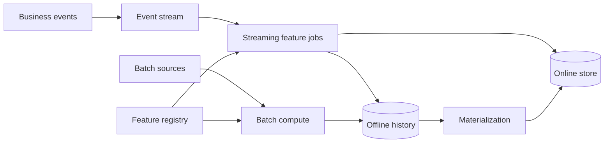

Feature store 最容易被误解成“专门存特征的数据库”。如果只是把几个数写进 Redis，这道题没有多少设计价值。

真正的问题是同一个特征要在两个完全不同的世界里保持同一种含义：训练时，我们一次读取几个月的历史；在线预测时，我们必须在几毫秒内拿到用户此刻的值。更危险的是，训练样本只能使用“预测发生当时已经知道的信息”，不能偷看未来。

所以 feature store 的核心是：**让特征定义、历史时间语义和在线低延迟读取保持一致。**

> 配套实验：[打开 Feature Store Lab](https://lab.zichaoyang.com/system-design/feature-store/)。先关闭 streaming feature，只打开 point-in-time correctness；理解数据泄漏以后，再观察 freshness 成本。

## 一个离线指标很高、上线却失效的模型

我们要预测用户在 `10:00` 会不会取消订单。特征之一是：

```text
user_cancel_count_7d
```

用户在 `10:05` 又取消了一笔订单。若训练 SQL 直接按 `user_id` 把“当天最终的取消次数” join 到 `10:00` 的样本，这条样本就看到了五分钟后的未来。

离线评估会变得异常漂亮，因为特征已经包含了部分答案；线上 `10:00` 不可能拿到 `10:05` 的事件，模型表现自然掉下来。

正确的 join 不是“同一个用户取最新值”，而是：

```text
对每条训练样本，只取 event_timestamp <= prediction_timestamp 的最新特征值
```

这叫 point-in-time correct join。它是 feature store 存在的第一理由，比“把特征缓存起来”更重要。

## 先把几个时间讲清楚

**Event time**

业务事件真正发生的时间。例如用户在手机上点击取消的时间。

**Ingestion time**

事件进入数据平台的时间。网络延迟或批处理会让它晚于 event time。

**Feature timestamp**

某个特征值在业务上代表的时间。窗口特征还可能有 window start/end。

**Created time**

系统算出并写入这个值的时间。它用于处理同一个 event time 的修正和 late arrival。

Feature store 不能只保留一个 `updated_at`。如果 event time 和 created time 混在一起，就无法同时回答“当时真实值是什么”和“我们什么时候知道这个值”。

## 题目边界

本文平台支持：

1. 开发者声明 feature 定义、owner、schema 和 freshness SLO；
2. 离线生成 point-in-time correct 训练数据；
3. 在线按 entity key 批量读取低延迟特征；
4. 把离线历史 materialize 到 online store；
5. 监控 freshness、null、分布漂移和训练/服务偏差。

第一版不设计完整数据仓库、模型训练平台和 inference server。Feature store 给它们提供数据契约。

非功能目标：

- 在线批量读取 p99 低于 10–20ms；
- 训练结果可复现到 feature definition 和 source snapshot；
- 新鲜度按 feature 单独约束，不能统一写“实时”；
- 多租户、PII 和 entity ACL 有明确边界；
- Schema 变化不会悄悄让线上读到错误类型。

## 第一版：一张历史表和一条正确的 SQL

先只做一个 batch feature，例如“用户过去 7 天订单数”。历史表不要只存 current value：

```sql
CREATE TABLE user_order_count_7d_history (
  user_id            BIGINT,
  feature_timestamp  TIMESTAMP,
  created_timestamp  TIMESTAMP,
  value               BIGINT,
  source_version      TEXT,
  PRIMARY KEY (user_id, feature_timestamp, created_timestamp)
);
```

训练样本表：

```sql
CREATE TABLE training_events (
  example_id           TEXT PRIMARY KEY,
  user_id              BIGINT,
  prediction_timestamp TIMESTAMP,
  label                 INTEGER
);
```

Point-in-time join 的逻辑是：对每条 example，在相同 `user_id` 下找不晚于 `prediction_timestamp` 的最新 feature。若同一个 feature time 被迟到数据修正，再按允许的 knowledge cutoff 选择 `created_timestamp`。

简化 SQL：

```sql
SELECT *
FROM (
  SELECT
    e.example_id,
    e.label,
    f.value AS user_order_count_7d,
    ROW_NUMBER() OVER (
      PARTITION BY e.example_id
      ORDER BY f.feature_timestamp DESC, f.created_timestamp DESC
    ) AS row_number
  FROM training_events e
  LEFT JOIN user_order_count_7d_history f
    ON f.user_id = e.user_id
   AND f.feature_timestamp <= e.prediction_timestamp
) joined
WHERE row_number = 1;
```

真实系统还要定义 late-arriving correction 是否在这次训练的 knowledge cutoff 内。关键是把时间条件写进平台能力，而不是要求每个 data scientist 自己重写一遍容易出错的 SQL。

## 第二版：加入 Feature Registry

Feature 定义应该是版本化契约：

```yaml
name: user_order_count_7d
version: 3
entity: user_id
value_type: int64
source: orders@v8
transformation: sql://features/user_order_count_7d.sql@6ab31f
event_timestamp_column: order_created_at
ttl: 10d
freshness_slo: 6h
owner: risk-ml
pii_classification: internal
```

Registry 不存大量 feature value，而是存 metadata：定义、schema、owner、lineage、状态和兼容性。

重命名、类型变化、窗口变化都产生新 version。`order_count_7d` 从“成功订单”改成“所有订单”即使字段类型不变，语义也已经 breaking，不能原地修改。

## 第三版：为在线预测增加 Online Store

在线路径只关心每个 entity 的当前可用值：

```text
OnlineFeatureValue(
  feature_view,
  entity_key,
  values,
  feature_timestamps,
  materialization_version,
  expires_at
)
```

读取 API 应支持一次拿齐多个 entity 和多个 feature，避免 inference server 发几十次网络请求：

```http
POST /v1/online-features:batchGet

{
  "entities": [
    {"entity":"user","keys":["u-9","u-10"]}
  ],
  "features": [
    "user:user_order_count_7d@3",
    "user:account_age_days@1"
  ],
  "requestTime": "2026-07-13T17:00:00Z"
}
```

响应不仅返回值：

```json
{
  "rows": [{
    "entityKey":"u-9",
    "values":{"user_order_count_7d":4,"account_age_days":91},
    "timestamps":{"user_order_count_7d":"2026-07-13T16:58:00Z"},
    "statuses":{"user_order_count_7d":"OK"}
  }]
}
```

`MISSING`、`STALE`、`TYPE_ERROR` 要明确区分。悄悄用 0 代替缺失，会把数据故障伪装成真实业务值。

## Materialization：把历史世界投影成在线快照

Batch materialization 定期从 offline store 读取每个 entity 最新值，批量写入 online store：

```text
offline history at cutoff T
-> latest value per entity
-> validation
-> online store generation T
```

Job 要记录：

```text
MaterializationRun(
  run_id,
  feature_view_version,
  source_snapshot,
  start_time,
  end_time,
  expected_entities,
  written_entities,
  state
)
```

不要一边回填一亿个 entity，一边让线上随机读到新旧混合语义。可以使用 generation、双写 namespace 或 per-value materialization version；切换前先验证数量、null rate 和分布。

## 实时特征：问题不只是“接 Kafka”

例如 `card_declines_5m` 需要秒级更新。Streaming job 按 event time 维护窗口，并把最新聚合写 online store，同时把变更追加到离线历史。



Streaming 与 batch 必须共享同一份逻辑定义，或者至少有 parity test。若在线窗口按 event time，离线 SQL 却按 ingestion date，模型训练和服务会看到不同含义。

迟到事件又带来产品决策：更新过去窗口是否要修正 online value？在线值可能已经用于一次支付决策，无法“撤回”。通常要在历史层保留修正，在线层按允许 lateness 更新当前窗口，并记录 freshness 和 correction 指标。

## 训练数据 API：返回 manifest，不搬运 TB 数据

```http
POST /v1/training-sets

{
  "entityData":"warehouse://risk/examples@2026-07-01",
  "eventTimestampColumn":"decision_time",
  "features":[
    "user:user_order_count_7d@3",
    "card:declines_5m@5"
  ]
}
```

返回异步 job。完成后得到：

```text
TrainingSet(
  training_set_id,
  entity_source_snapshot,
  feature_versions,
  join_engine_version,
  output_manifest_uri,
  row_count,
  schema_hash,
  created_at
)
```

Control plane 只返回 manifest URI、schema 和 lineage，不通过 API server 流式传输几 TB parquet。

## 容量估算：在线读、流式写和历史扫描是三种负载

假设在线 inference 高峰 100K requests/s，每次读取 40 个 feature。若 feature store 支持一条批量请求，网络 QPS 仍是 100K；如果每个 feature 单独读取，就会放大到 4M ops/s。

假设 1 亿活跃用户，每人当前 feature row 平均 2KB：

```text
100M × 2KB = 200GB raw online data
```

加 replica、索引和 headroom 后可能达到数百 GB，按 entity hash 分片即可。Online store 不需要保存全部历史，历史留在便宜的 columnar storage。

离线训练可能一次扫描数百 TB；它应在 analytical engine 上运行，不能把 online KV store 当数据仓库。把两个 workload 混在同一存储里，训练 scan 很容易冲垮线上 p99。

实时写吞吐由事件率决定。若每秒 1M 业务事件，每个事件更新 3 个 feature view，就是约 3M state updates/s。Streaming job 要按 entity key 分区，并监控 hot entity 和 state size。

## 延迟预算：Feature read 只是 inference 的一部分

若整个风控决策预算 100ms，可以分配：

| 阶段 | p99 预算 |
|---|---:|
| 请求解析与实体提取 | 5 ms |
| Feature batch read | 15 ms |
| 模型推理 | 30 ms |
| 规则与决策 | 20 ms |
| 网络与余量 | 30 ms |

Online API 应把 deadline 传到存储层。超时后是否使用默认值、缓存旧值或直接拒绝，是每个模型的 fail-open/fail-closed 策略，不能由 feature store 全局决定。

Freshness 也不是 latency。某次读取只花 3ms，但值已经旧了两小时，仍然是错误服务。所有响应和监控都要同时看 read latency 与 feature age。

## Training-serving parity 怎么验证

为一小批真实线上请求保存：

```text
entity keys
request timestamp
online feature values + timestamps
feature versions
```

离线系统在相同 timestamp 重建特征，再逐列比较：null、值、类型和允许误差。这叫 parity check。

差异可能来自：

- 在线和离线使用了不同代码；
- 时区或窗口边界不同；
- Streaming 有迟到事件，batch 已经修正；
- Materialization 落后；
- Online default 与训练缺失值处理不同；
- Feature version 没有和 model version 绑定。

Parity 指标必须按 feature 单独看。一个总的“99% 一致”可能掩盖最关键风险特征完全错误。

## 故障和正确性

**Streaming job 重放**

更新按 `(feature_view, entity, feature_timestamp, source_event_id)` 幂等。只依赖“最后写入赢”会让迟到旧事件覆盖新值。

**Online store 故障**

Inference client 应有很短 timeout 和明确降级策略。批量 API 返回逐 feature status，使模型服务知道哪些值缺失。

**Materialization 部分失败**

不发布半成品 generation。重试使用相同 run ID 和确定性 key，并对 row count、schema 和 freshness 做门禁。

**Schema 改变**

Registry 在发布前做兼容性检查。Model deployment pin 具体 feature versions；新的 definition 不应自动改变正在服务的模型输入。

**数据删除**

PII 删除必须覆盖 offline history、online value、training-set artifact 和 cache，并通过 lineage 找到受影响范围。

## 关键指标

- Online read p50/p95/p99、error、timeout、batch size；
- 每个 feature 的 freshness age、missing、default 和 stale rate；
- Streaming lag、late-event、state size 和 hot key；
- Materialization duration、coverage、row mismatch；
- Point-in-time join 行数、null 和 duplicate；
- Online/offline parity 按 feature 的差异率；
- Schema violation、owner 缺失和未使用 feature 数。

Feature store 的健康不能只用 uptime 表示。一个 100% 可用但持续返回过期值的 store，会稳定地产生错误预测。

## 关键取舍

**更低 freshness** 带来更多 streaming state、写放大和运维复杂度。每天变化一次的账户年龄不需要秒级流。

**在线预计算** 让读取快，但为大量不活跃 entity 浪费存储；按需计算节省写入，却把延迟和下游依赖带进预测热路径。

**共享 transformation code** 改善 parity，但 SQL batch 与 streaming runtime 很难完全相同；有时双实现加 parity tests 更实际。

**强 schema gate** 防止线上 silent corruption，也会让 feature 发布更慢。生产预测通常值得这份约束。

**默认值** 提高可用性，却可能隐藏数据中断。默认策略必须由 model contract 定义并监控使用率。

## 用 Lab 理解时间语义

**实验一：Point-in-time correctness**

构造一个预测时间之后才发生的事件。关闭正确 join 看离线指标如何虚高，再打开它。这个实验比先看架构图更重要。

**实验二：Freshness**

逐步从 batch 切到 streaming。观察 online write 和状态压力，判断哪些 feature 真正需要秒级更新。

**实验三：训练/服务 parity**

故意让 offline 窗口按 UTC、online 窗口按本地时间，观察边界样本。再设计一套 parity test 把问题提前暴露。

## 面试表达：先讲“不能偷看未来”

可以这样开场：

> A feature store is not just a low-latency key-value store. Its hardest contract is time: an offline training row may only use feature values that were available at that prediction time, while online serving needs the same feature semantics within a few milliseconds.

然后按演化顺序讲：

```text
historical feature table
-> point-in-time join
-> versioned feature registry
-> online materialization
-> streaming features
-> parity, freshness and governance
```

最后给 deep dive 入口：

> I can go deeper into point-in-time joins, streaming late data, online-store scaling, or training-serving parity.

这样读者和面试官都会知道，Feature Store 首先是在守住数据含义，其次才是在优化读取速度。

## 参考资料

- [Feast: Concepts and Architecture](https://docs.feast.dev/getting-started/architecture-and-components)
- [Uber Michelangelo: Machine Learning Platform](https://www.uber.com/blog/michelangelo-machine-learning-platform/)
- [TFX: A TensorFlow-Based Production-Scale Machine Learning Platform](https://research.google/pubs/tfx-a-tensorflow-based-production-scale-machine-learning-platform/)
- [Hidden Technical Debt in Machine Learning Systems](https://papers.nips.cc/paper/5656-hidden-technical-debt-in-machine-learning-systems)
