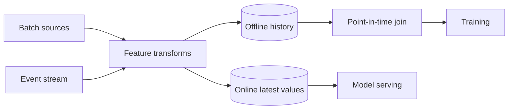

Feature Store 不是“专门放 feature 的数据库”。它要解决的是：同一个 feature 在训练和在线推理中，能否使用**相同定义、正确时间点和可接受的新鲜度**。

例如模型预测欺诈时使用“过去 10 分钟交易次数”。线上可以从 stream state 读取；训练如果直接 join 用户今天的最新计数，就把 label 之后发生的交易泄漏进过去样本，离线指标会虚高。

> 对应实验：[打开 Feature Store Lab](https://lab.zichaoyang.com/system-design/feature-store/)。打开 point-in-time correctness 与 streaming features，观察 parity 成本。

## 三个核心概念

- **Offline store**：保存历史 feature，服务大规模训练扫描和时间点 join。
- **Online store**：按 entity key 返回最新 feature vector，服务低延迟推理。
- **Point-in-time join**：每个 label 只能连接到当时已经存在的 feature 值，防止未来信息泄漏。

## 数据流

小团队最初可以在请求路径内计算 feature。只有多个模型重复使用、线上 latency 变紧或训练定义开始漂移时，共享 feature infrastructure 才值得。

## 架构为何分成两套 store

训练要扫描 TB/PB 历史、按事件时间回看；serving 要在几毫秒内按 user ID 点查。一个存储很难同时优化这两种访问模式。真正困难的不是拆分，而是保证 transform、默认值、schema 和数据版本在两边一致。

Streaming feature 还要可重放。否则线上状态因 bug 或 checkpoint 丢失后无法重建，也无法生成同定义的历史训练数据。事件时间、watermark 和迟到数据处理因此是 feature correctness 的一部分。

## 常见失败

- **Training-serving skew**：两边各自复制一份计算代码，逐渐产生差异。
- **Data leakage**：训练 join 使用“最新值”而不是 label 当时的值。
- **Silent default**：缺失 feature 被填 0，却没有区分“真实为 0”和“数据没到”。
- **热点 entity**：某些 key 更新过快，压垮单个 online shard。

## 面试表达

> A feature store is a consistency layer between training and serving, not just a database. I would optimize offline history for point-in-time joins and online values for low-latency keyed lookups.

主线说清 parity、两种访问模式和 point-in-time correctness 后，再深入 freshness、schema evolution 或 backfill。
