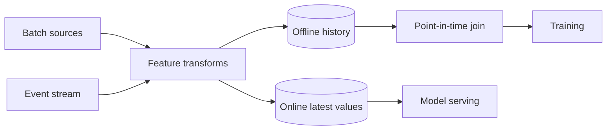

Feature Store 不是“专门放 feature 的数据库”。它要解决的是：同一个 feature 在训练和在线推理中，能否使用**相同定义、正确时间点和可接受的新鲜度**。

例如模型预测欺诈时使用“过去 10 分钟交易次数”。线上可以从 stream state 读取；训练如果直接 join 用户今天的最新计数，就把 label 之后发生的交易泄漏进过去样本，离线指标会虚高。

> 对应实验：[打开 Feature Store Lab](https://lab.zichaoyang.com/system-design/feature-store/)。打开 point-in-time correctness 与 streaming features，观察 parity 成本。

## 需求边界（Requirements）

功能上注册定义、生成 offline history、提供 online latest value 和训练 join。非功能上重点是 point-in-time correctness、training-serving parity、online 低延迟与可回放；不是所有 feature 都要求实时。

## 0. 先搭离线 Feature Table MVP Scaffold

第一版选一个 feature，例如 `user_purchase_count_30d`。用一条 SQL/dbt job 每天从交易表计算，写入按日期分区的 Parquet；训练脚本显式读取某个 snapshot。Serving 暂时在应用内按同一份 SQL 结果加载最新值。先证明定义可复现，再拆 online store。

脚手架至少包含 feature definition、owner、entity key、类型、默认值、数据源、生成时间和版本。没有这些 metadata，“共享 feature”只会变成无法信任的列名集合。

## 1. API：控制面与 serving 面分离

```http
POST /v1/features:batchGet
{"entities":[{"type":"user","id":"42"}],"features":["purchase_count_30d","risk_velocity_10m"]}

200 OK
{"values":{"purchase_count_30d":8},"featureSetVersion":"checkout-v7","asOf":"..."}
```

Feature registry 则提供定义注册、schema compatibility 和 lineage 查询。Online serving API 不接受任意 SQL，只允许已发布 feature set。

## 2. 数据模型（Data Model）

```text
FeatureDefinition(name PK, entity_type, dtype, transform_ref, owner, version, ttl)
OfflineFeature(entity_id, feature_name, event_time, value, definition_version)
OnlineFeature(entity_id, feature_set, values, updated_at, source_offset)
MaterializationJob(job_id, definition_version, input_snapshot, output_snapshot, state)
```

Offline 必须保留历史值；online 只保留最新 serving value。两边通过 definition version 和 source offset 对齐。

## 3. 单机端到端流程

Batch job 读取固定 input snapshot，计算并写 immutable output partition，验证 null/range/distribution 后发布。训练做 point-in-time join。Serving materializer 把最新值写本地/Redis key，模型请求按 entity 批量取 feature。先对同一批 entity 比较 offline 与 online 输出，建立 parity test。

## 4. 容量估算：宽度、实体和新鲜度一起算

1 亿 user、1000 个 feature、平均每值含编码 12 bytes，最新 online state 约 1.2TB，三副本 3.6TB。若 10 万预测 QPS、每次取 200 feature，虽然是一次 row lookup，网络 payload 仍可达数百 MB/s。训练 10 亿 label row 做历史 join，offline scan 才是另一条 PB 级成本。

## 5. Latency Budget：Feature lookup 只是模型链的一段

若总 inference p99 100ms，feature fetch 通常只能占 10 到 20ms。BatchGet 要避免每 feature 一次 RPC，按 entity/feature set 存宽行。过期 feature 返回 freshness metadata，由模型或业务决定降级，而不是静默装作最新。

## 6. Correctness and Reliability

Point-in-time join 保证 label 时刻只看到过去。Streaming materializer checkpoint source offset，重启后可 replay。Online write 带 event time/version，迟到事件不能覆盖更新值。Schema/type 变化要兼容验证，坏 materialization 不发布。

## 7. Trade-offs：Parity 是主要成本

- 一份通用 transform DSL 可减少 skew，但限制表达能力；双份 Python/SQL 灵活却容易漂移。
- 宽行一次读取快，但任一 feature 更新会写整组；细粒度 key 更新灵活，读取 fan-out 更大。
- 秒级 streaming 新鲜，但运维和重放复杂；多数慢变 feature 保持 batch 更经济。

## 三个核心概念

- **Offline store**：保存历史 feature，服务大规模训练扫描和时间点 join。
- **Online store**：按 entity key 返回最新 feature vector，服务低延迟推理。
- **Point-in-time join**：每个 label 只能连接到当时已经存在的 feature 值，防止未来信息泄漏。

## 数据流



小团队最初可以在请求路径内计算 feature。只有多个模型重复使用、线上 latency 变紧或训练定义开始漂移时，共享 feature infrastructure 才值得。

## 架构为何分成两套 store

训练要扫描 TB/PB 历史、按事件时间回看；serving 要在几毫秒内按 user ID 点查。一个存储很难同时优化这两种访问模式。真正困难的不是拆分，而是保证 transform、默认值、schema 和数据版本在两边一致。

Streaming feature 还要可重放。否则线上状态因 bug 或 checkpoint 丢失后无法重建，也无法生成同定义的历史训练数据。事件时间、watermark 和迟到数据处理因此是 feature correctness 的一部分。

## 常见失败

- **Training-serving skew**：两边各自复制一份计算代码，逐渐产生差异。
- **Data leakage**：训练 join 使用“最新值”而不是 label 当时的值。
- **Silent default**：缺失 feature 被填 0，却没有区分“真实为 0”和“数据没到”。
- **热点 entity**：某些 key 更新过快，压垮单个 online shard。

## 面试表达

> A feature store is a consistency layer between training and serving, not just a database. I would optimize offline history for point-in-time joins and online values for low-latency keyed lookups.

主线说清 parity、两种访问模式和 point-in-time correctness 后，再深入 freshness、schema evolution 或 backfill。
