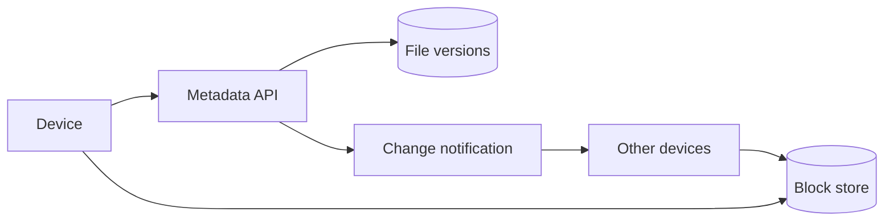

File Sync 不是“把文件上传到云端”，而是让多台设备在断线、重连和并发修改后，仍能判断**哪些字节变了、哪个版本领先、冲突如何保留**。

想象一个 1GB 文件只改了末尾 4KB。如果每次都重传 1GB，同步会很慢。把文件切成 chunk，只上传变化的块，就能把传输量从文件大小降到修改量附近。

> 对应实验：[打开 File Sync Lab](https://lab.zichaoyang.com/system-design/file-sync/)。改变文件大小、chunk 大小、设备数和共享开关，观察 metadata 与 block storage 为什么必须分离。

## 需求边界（Requirements）

功能上支持上传、版本、跨设备变更、删除和冲突保留；实时协同编辑不在文件同步首版范围。非功能上不能静默覆盖或损坏内容，跨设备新鲜度为秒级，并尽量只传变化字节。

## 0. 先搭整文件同步 MVP Scaffold

第一版只支持一个用户两台设备、整文件上传、版本号和轮询变更。客户端扫描目录；文件变化后上传完整 blob；服务端事务写 metadata version；另一台设备用 cursor 拉取 changes 并下载。先不做 chunk/dedup 和共享协作。

这一步必须先解决三个问题：客户端重试幂等、同一路径基于旧版本提交时检测冲突、下载到临时文件后原子 rename，避免半个文件覆盖本地好版本。

## 1. API：内容上传与版本提交分两阶段

```http
POST /v1/files/f-1/versions
{"baseVersion":7,"size":1048576,"contentHash":"sha256:..."}

201 Created
{"version":8,"uploadUrl":"..."}

POST /v1/files/f-1/versions/8/commit
GET /v1/changes?cursor=991&limit=500
```

大文件阶段会把 upload 改成 missing-chunk 协商，但 metadata commit 仍保持原子。`baseVersion` 不匹配返回 `409` 并保留冲突版本信息。

## 2. 数据模型（Data Model）

```text
File(file_id PK, owner_id, parent_id, name, current_version, deleted_at)
FileVersion(file_id, version, manifest_id, base_version, author_device, created_at)
Manifest(manifest_id PK, ordered_chunk_hashes, total_size)
Chunk(chunk_hash PK, object_key, size, reference_count)
ChangeLog(sequence PK, owner_id, file_id, version, operation)
DeviceCursor(device_id PK, last_sequence)
```

MVP 的 manifest 只含一个完整 blob；引入 chunk 后 schema 无需推翻。

## 3. 单机端到端流程

客户端先上传内容到临时 object key，再提交 metadata。服务端在事务中比较 baseVersion、创建 FileVersion、更新 current_version、追加 ChangeLog。其他设备按 cursor 读取变化，下载并校验 hash，成功后更新 cursor。Metadata commit 绝不能引用尚未完成的内容。

## 4. 容量估算：metadata 往往比想象中更热

假设 1 亿用户、每人 10 万文件，就是 10 万亿 metadata row；平均每人 3 台设备，每小时轮询一次也约 83k poll/s。每天 10 亿次 edit、平均文件 10MB，整文件传输是 10PB/天；若平均只改 1%，chunking 可把网络接近降到 100TB/天，但会增加大量 manifest/chunk metadata。

## 5. Latency Budget：同步新鲜度不是上传延迟

小文件上传可目标 p99 2 秒；另一设备看到变化目标 5 秒。通知只负责唤醒，真实状态仍从 ChangeLog/cursor 拉取。Block 下载走 CDN/object storage，metadata API 保持百毫秒内。

## 6. Correctness and Reliability

内容按 hash 校验，metadata 以 version compare-and-swap 防覆盖。Orphan upload 由保留期后 GC；删除先 tombstone，再等所有设备 cursor 越过该 change 后进入回收。Chunk reference count 不能只靠非事务增减，定期 mark-and-sweep 校正。

## 7. Trade-offs：chunk 不是越小越好

- 小 chunk dedup 精细，却放大 hash、manifest、请求和索引数量。
- Content-defined chunking 抗中间插入，但 CPU 更高；fixed-size 实现简单。
- Push 通知新鲜但连接成本高；polling 简单却产生大量空请求，常见做法是 push 唤醒加 cursor pull。

## 先讲清三个对象

- **Chunk / block**：文件的一段字节。hash 既是内容指纹，也是存储 key。
- **File manifest**：按顺序列出组成某个文件版本的 chunk hash。
- **Version**：一次 metadata 提交。它指向 manifest，而不是原地覆盖旧文件。

## 同步流程



客户端扫描文件并计算 chunk hash，询问服务端缺哪些块，只上传缺失内容。所有块完成后再原子提交新 manifest。顺序不能反过来，否则其他设备可能读到引用尚未存在 block 的版本。

## 架构演化

1. 一个用户一台设备时，普通 object upload 足够。
2. 多设备出现后，需要 server-side version 和 change cursor，设备才能增量拉取变化。
3. 大文件推动 chunking 与 block-level dedup，只传变化内容。
4. metadata 读写频繁而 block 大且不可变，两者沿不同轴扩展，应使用不同存储。
5. 共享编辑引入并发版本。服务端检测 base version 过期，保留 conflict copy，而不是悄悄覆盖其中一方。

## 固定大小还是内容定义 chunk

固定大小简单，但在文件开头插入一个字节会让后续边界全部移动，几乎每块 hash 都变化。Content-defined chunking 根据内容决定边界，能在插入后重新对齐，dedup 更好，但客户端计算和 metadata 更复杂。面试里要把这个取舍说出来，不必默认选择最复杂方案。

## 失败与正确性

- 上传中断留下的 orphan chunk 可由后台 GC 清理。
- metadata commit 要幂等，重试不能生成多个版本。
- 删除通常先写 tombstone，再等待多设备确认和保留期，不应立即物理删除。
- hash 用于内容寻址，但权限仍由 metadata 控制，知道 hash 不应等于有读取权限。

## 面试表达

> I would separate immutable content blocks from mutable file metadata. Devices upload only missing chunks, then atomically publish a versioned manifest and notify other devices.

讲清 upload、commit、notify、download 四步后，再深入 conflict handling、chunking、dedup 或 garbage collection。
