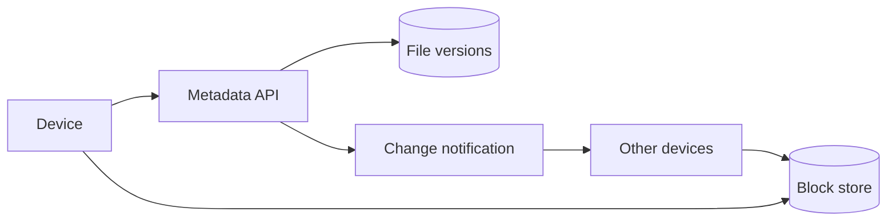

File Sync 不是“把文件上传到云端”，而是让多台设备在断线、重连和并发修改后，仍能判断**哪些字节变了、哪个版本领先、冲突如何保留**。

想象一个 1GB 文件只改了末尾 4KB。如果每次都重传 1GB，同步会很慢。把文件切成 chunk，只上传变化的块，就能把传输量从文件大小降到修改量附近。

> 对应实验：[打开 File Sync Lab](https://lab.zichaoyang.com/system-design/file-sync/)。改变文件大小、chunk 大小、设备数和共享开关，观察 metadata 与 block storage 为什么必须分离。

## 先讲清三个对象

- **Chunk / block**：文件的一段字节。hash 既是内容指纹，也是存储 key。
- **File manifest**：按顺序列出组成某个文件版本的 chunk hash。
- **Version**：一次 metadata 提交。它指向 manifest，而不是原地覆盖旧文件。

## 同步流程

客户端扫描文件并计算 chunk hash，询问服务端缺哪些块，只上传缺失内容。所有块完成后再原子提交新 manifest。顺序不能反过来，否则其他设备可能读到引用尚未存在 block 的版本。

## 架构演化

1. 一个用户一台设备时，普通 object upload 足够。
2. 多设备出现后，需要 server-side version 和 change cursor，设备才能增量拉取变化。
3. 大文件推动 chunking 与 block-level dedup，只传变化内容。
4. metadata 读写频繁而 block 大且不可变，两者沿不同轴扩展，应使用不同存储。
5. 共享编辑引入并发版本。服务端检测 base version 过期，保留 conflict copy，而不是悄悄覆盖其中一方。

## 固定大小还是内容定义 chunk

固定大小简单，但在文件开头插入一个字节会让后续边界全部移动，几乎每块 hash 都变化。Content-defined chunking 根据内容决定边界，能在插入后重新对齐，dedup 更好，但客户端计算和 metadata 更复杂。面试里要把这个取舍说出来，不必默认选择最复杂方案。

## 失败与正确性

- 上传中断留下的 orphan chunk 可由后台 GC 清理。
- metadata commit 要幂等，重试不能生成多个版本。
- 删除通常先写 tombstone，再等待多设备确认和保留期，不应立即物理删除。
- hash 用于内容寻址，但权限仍由 metadata 控制，知道 hash 不应等于有读取权限。

## 面试表达

> I would separate immutable content blocks from mutable file metadata. Devices upload only missing chunks, then atomically publish a versioned manifest and notify other devices.

讲清 upload、commit、notify、download 四步后，再深入 conflict handling、chunking、dedup 或 garbage collection。
