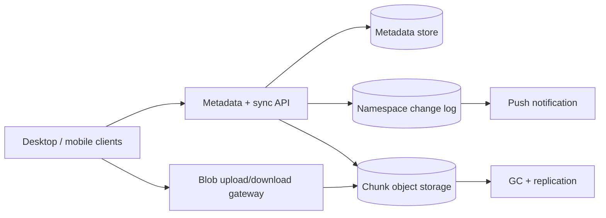

文件同步不只是“把文件上传到云端”。真正的场景是：手机、电脑和网页都可能修改同一个目录；设备可以离线几天；一个 10GB 文件只改了中间 4MB 时，不应该重新上传全部内容；上传到一半断网后，也不能出现一份损坏的“最新版本”。

这道题的核心是：**把文件内容与文件名、目录、版本这些 metadata 分开，让每次修改先形成一个完整、不可变版本，再在设备之间可靠传播。**

> 配套实验：[打开 File Sync Lab](https://lab.zichaoyang.com/system-design/file-sync/)。先只增加文件大小，比较整文件和 chunk 上传；再增加设备数与离线窗口，观察冲突为什么出现。

## 一个字符变化为什么不该上传 10GB

用户有一个 10GB 虚拟机镜像，只修改了其中很小一段。若每次按整文件上传：

```text
10GB upload per save
```

网络慢、失败重做昂贵，历史版本也会复制大量相同数据。

如果把文件切成 4MB chunks：

```text
10GB / 4MB = 2,560 chunks
```

客户端为每块计算 hash，服务端只要求上传不存在或发生变化的块。最终文件版本只是一个有序 chunk hash 列表。修改一个 chunk，理论上只上传约 4MB。

这就是 content-addressed storage 的基本直觉：内容 hash 同时充当身份和完整性校验。

## 先讲清 Content、Metadata 和 Version

**File metadata**

用户看到的路径、文件名、owner、权限、修改时间和当前版本指针。它小、经常变化，需要事务和目录操作。

**Blob / chunk**

实际文件字节。它不可变、体积大，适合 object storage，并以内容 hash 去重。

**File version / manifest**

一次完整文件内容的不可变描述：文件大小、chunk 顺序、hash 和父版本。只有 manifest 完整提交后，才成为可见版本。

**Sync cursor**

设备已处理到用户命名空间变更日志的哪个位置。它让重连只拉缺失变化，而不是扫描所有文件。

## 题目边界

核心功能：

1. 上传、下载、重命名、移动和删除文件；
2. 多设备增量同步；
3. 大文件分块、断点续传和去重；
4. 保存有限历史版本并恢复；
5. 离线并发修改时检测冲突；
6. 文件夹共享和权限撤销；
7. 变更通知和 cursor replay。

第一版不做在线文档协同编辑、全文搜索和媒体转码。文件以 opaque bytes 处理。

非功能目标：

- 已 commit 的版本永不指向缺失/损坏 chunks；
- 小修改只传变化部分；
- 断网重试幂等，并能续传；
- 多设备最终看到同一 namespace；
- 权限撤销后不能继续下载新内容；
- Metadata 强一致边界清楚，blob replication 可异步；
- 用户数据加密、隔离并可删除。

## 第一版：整文件上传，先把原子版本做对

一台 API server、Postgres 和 object storage。上传流程分两步：

```http
POST /v1/files/file-9/uploads

{
  "baseVersionId":"fv-17",
  "size":1048576,
  "contentHash":"sha256:..."
}
```

服务返回 upload session 和预签名 object URL。客户端直传 bytes，不经过 API server。

上传完成后 commit：

```http
POST /v1/uploads/up-81:commit
Idempotency-Key: device-4:save-991

{"uploadedObject":"staging://up-81/blob"}
```

服务端：

1. 验证 object size 和 hash；
2. 检查当前 file version 仍等于 `baseVersionId`；
3. 创建 immutable FileVersion；
4. 原子更新 File.current_version；
5. 追加 namespace change event；
6. 返回新 version。

只有第 3–5 步事务成功后，新内容才对其他设备可见。上传一半的 staging object 永远不是文件版本。

## 数据模型：路径不是文件身份

```text
FileNode(
  node_id,
  namespace_id,
  parent_node_id,
  name,
  node_type,
  owner_id,
  current_version_id,
  state,
  metadata_version,
  created_at,
  updated_at
)

FileVersion(
  file_version_id,
  node_id,
  parent_file_version_id,
  manifest_id,
  size,
  content_hash,
  created_by_device,
  created_at
)

UploadSession(
  upload_id,
  node_id,
  base_version_id,
  state,
  expires_at,
  idempotency_key
)

NamespaceChange(
  namespace_id,
  sequence,
  node_id,
  change_type,
  metadata_version,
  file_version_id,
  created_at
)
```

`node_id` 在 rename/move 后不变。若用完整路径作主键，改一个顶层文件夹名会重写所有子孙记录，也让离线设备难以识别“这是移动，不是删除加新建”。

同一个 parent 下对规范化 name 建唯一约束。大小写敏感策略必须按 namespace 定义，避免 macOS/Windows 客户端语义冲突。

## 第二版：固定大小 Chunk + Manifest

客户端把文件切为 4MB：

```text
ChunkRef(
  ordinal,
  chunk_hash,
  size
)

FileManifest(
  manifest_id,
  total_size,
  file_hash,
  chunking_algorithm,
  chunk_refs[]
)
```

上传 API：

```http
POST /v1/uploads/up-81/chunks:check

{"chunks":[
  {"hash":"sha256:a...","size":4194304},
  {"hash":"sha256:b...","size":4194304}
]}
```

返回缺失 hash 和预签名 URL。客户端并行上传缺失 chunks，随后提交完整 manifest。

Commit 验证：

- 所有 chunk 存在并大小正确；
- Manifest total size 等于 chunks 之和；
- 文件 hash（若提供）正确；
- Base version 仍有效；
- 用户有写权限和 quota；
- Chunk scan/policy 满足要求。

Blob object key 使用 `tenant_scope/hash`，避免全局去重泄露“另一个租户是否拥有某内容”。跨用户全局 dedup 有隐私侧信道，是否启用要慎重。

## 固定 Chunk 的问题与 Content-Defined Chunking

在文件开头插入 1 byte，固定 4MB 边界会整体移动，几乎每个 chunk hash 都变化。

Content-defined chunking 根据滚动 hash 在内容特征处切块。局部插入只影响附近边界，后续 chunks 仍可复用。这是 rsync/CDC 类算法的价值。

代价：客户端 CPU 更高、chunk 大小不固定、实现和安全验证更复杂。对于视频/压缩包，内部小改动可能仍改变大量 bytes；不要承诺任何文件都能高效 delta。

第一版固定块足够，真实 workload 显示“头部插入导致重传”是主要成本后再上 CDC。

## 变更日志与设备同步

每个 namespace 有单调 sequence。设备首次同步获取 snapshot + cursor：

```http
GET /v1/namespaces/ns-9/snapshot
```

之后增量拉取：

```http
GET /v1/namespaces/ns-9/changes?after=881&limit=1000
```

WebSocket/push 只通知“有新变化”，设备仍用 cursor 读取 durable log。Push 丢失没关系；cursor 是可靠同步协议。

Client 本地维护：

```text
LocalNode(
  node_id,
  local_path,
  remote_metadata_version,
  remote_file_version_id,
  local_content_hash,
  sync_state
)
```

应用 change event 时按 sequence 顺序，重复 event 幂等。若 cursor 落后超过 retention，服务返回 `CURSOR_EXPIRED`，客户端重新获取 snapshot，而不是猜测差异。

## 离线冲突：不要用 Last-write-wins 静默丢文件

电脑和手机都从 `fv-17` 离线修改。电脑先提交 `fv-18`；手机随后仍以 `base=fv-17` commit。

服务发现 current 已不是 base，说明分叉：

```text
fv-17
  ├─ fv-18 (computer)
  └─ fv-19 (phone conflict)
```

对于 opaque 文件，服务器通常无法语义 merge。更安全的产品行为是保留两份：

```text
report.docx
report (phone conflict 2026-07-13).docx
```

文本文件可以尝试三方 merge，但冲突仍要显式。Last-write-wins 会永久丢掉一台设备的工作，不适合作为默认。

Rename/move 也会冲突。例如一个设备删除，另一个设备修改。定义确定性 policy：保留修改为 recovered file、删除获胜并在 trash 可恢复，或提示用户。系统不能让执行顺序随机决定。

## 高层架构：Metadata 和 Blob 分开扩展



Metadata API 处理 namespace 事务、version CAS、权限和 cursor；Blob gateway 签发 URL、验证 chunk。大 bytes 直接进 object storage。

Metadata 按 `namespace_id` 分片，使一个目录树的 rename、membership 和 sequence 在一个事务/owner 内。Blob 按 hash 均匀分布，可独立复制。

## Chunk 引用计数与垃圾回收

多个 file version 可引用同一 chunk。删除一个版本不能立即删 blob。

实时 refcount 容易在 commit/retry 下出错。更稳的 GC：

1. FileVersion/Manifest 是事实来源；
2. 新 chunk 进入 staging/protected 状态；
3. Commit 后 manifest 可达；
4. 周期性 mark 所有保留 manifests 引用的 chunks；
5. 只删除超过 grace period 且未被 mark 的 object。

Grace period 防止 metadata/replication 延迟导致误删。Refcount 可做快速候选，但最终 sweep 仍验证 reachability。

历史版本有 retention：最近 30 天、最近 N 个，或付费 tier。Trash 与 version history 都要计入 quota 和删除政策。

## 共享文件夹与权限

```text
NamespaceMember(
  namespace_id,
  principal_id,
  role,
  membership_version,
  state,
  joined_at,
  revoked_at
)
```

客户端上传开始时有权限，不代表 commit 时仍有。Metadata commit 必须再次授权。

Download URL TTL 很短，并绑定 user/node/version。撤销权限后，新的 URL 不再签发；已签发 URL 的残余窗口由 TTL 定义。对高敏感数据，可通过鉴权 proxy 每次验证，代价是下载吞吐成本。

共享 folder 的 change log 由 namespace owner 排序。每个成员设备按同一 cursor 语义同步，但只接收其当前可见节点。

## 容量估算

假设 100M 用户，每人平均 10GB：

```text
1 exabyte logical data
```

若 chunk dedup 和压缩后物理比率 60%，再复制 3 份：

```text
1EB × 0.6 × 3 = 1.8EB physical
```

这说明 blob storage 是成本核心，metadata 规模却由文件数决定。若每人 10,000 nodes：

```text
100M × 10K = 1 trillion metadata nodes
```

平均每条 metadata 500 bytes 是 500TB raw，加索引和 replica 更大，必须按 namespace 分片并归档删除历史。

Upload 高峰假设 1M files/s、平均 20 chunks，每次 check 逐 chunk RPC 会产生 20M ops/s。Check API 应批量，客户端并发有上限，重复 hash 使用 Bloom/cache 加速存在性判断。

## 延迟与同步体验

小文件 commit p99 可以目标数百毫秒；大文件总时间主要是用户网络。更重要的是阶段进度：hashing、uploading missing chunks、committing、syncing other devices。

Metadata change propagation 示例：

| 阶段 | p99 预算 |
|---|---:|
| Commit transaction | 100 ms |
| Change log visible | 100 ms |
| Push hint | 500 ms |
| 设备拉取/应用 | 1,000 ms |

设备离线时没有实时保证，但重连后 cursor 补齐。大规模 full snapshot 要分页、校验，并允许增量日志在 snapshot cutoff 后继续接上。

## 故障与恢复

**Chunk 上传完成，commit 没发生**

Staging object 在 grace period 后由 GC 清理。重试同一 upload session 可复用已上传 chunks。

**Commit 成功，响应丢失**

Idempotency key 返回原 FileVersion。客户端不要再创建冲突版本。

**Change event 重复**

按 namespace sequence 和 metadata version 幂等。设备已应用 882，再收到 881 直接忽略。

**Object storage 某副本损坏**

Chunk hash 在读取时校验，从健康 replica repair。Metadata 指向的所有 chunks 有 durability monitor。

**Metadata store 故障**

禁止新 commit，避免产生未授权/无版本内容；已有带有效授权 URL 的下载可继续一小段时间。Metadata 正确性优先。

**Sync client 无限重试坏文件**

记录 per-node error 和 backoff，允许用户暂停/排除。一个文件失败不能阻塞整个 namespace cursor；可把失败节点隔离并继续应用其他变化。

## 观测

- Upload bytes、dedup saved bytes、chunk check hit；
- Upload session completion、abandon、resume；
- Metadata commit p99、version conflict、permission reject；
- Change log lag、cursor age、snapshot fallback；
- Per-device sync backlog、apply error、conflict copies；
- Object checksum error、under-replicated chunk、GC reclaimed bytes；
- Namespace hot shard、file count、rename/delete rate；
- Stale download after revoke 和 URL issuance。

总体同步成功率会掩盖某个大 namespace 永远追不上。按 namespace size、file size、device 和 network class 切片。

## 关键取舍

**小 chunk** 提高增量复用，却增加 hash、metadata 和 request 数；大 chunk 相反。

**Content-defined chunking** 抗插入偏移，CPU 和实现成本更高。

**全局去重** 最省存储，却带跨租户隐私侧信道；租户域内去重更安全。

**保留更多版本** 增强恢复能力，也增加 blob retention 和合规删除成本。

**Last-write-wins** 简单，却会静默丢离线编辑；保留 conflict copy 更诚实。

**短授权 URL** 改善撤销语义，却增加续签和下载控制面 QPS。

## 用 Lab 看数据与 Metadata 怎样分离

**实验一：增大文件**

比较整文件重传与 4MB chunk。再只改一个 chunk，计算节省的带宽。

**实验二：改变 Chunk size**

观察小块带来的 manifest/请求量和大块带来的重传量，找到 workload 合适点。

**实验三：增加设备与离线窗口**

让两台设备基于同一个 base 修改，亲自制造分叉。设计显式冲突结果，而不是覆盖。

## 面试表达：先把完整版本 Commit 说清楚

可以这样开场：

> I would separate mutable file metadata from immutable content. A client uploads bytes to staging first; only after validating the content do we atomically create a new file-version manifest, advance the file pointer, and append a namespace change event.

演化顺序：

```text
whole-file atomic upload
-> immutable versions
-> chunk manifests and dedup
-> cursor-based multi-device sync
-> offline conflict detection
-> namespace sharding, sharing and GC
```

最后给深入入口：

> I can go deeper into chunking algorithms, conflict semantics, sync cursors, or blob garbage collection and permissions.

这条主线把上传、同步和存储放在同一个版本语义下，不会只剩下一句“用 S3 存文件”。

## 参考资料

- [The rsync algorithm](https://rsync.samba.org/tech_report/)
- [Git Internals: Git Objects](https://git-scm.com/book/en/v2/Git-Internals-Git-Objects)
- [RFC 7694: Hypertext Transfer Protocol Client-Initiated Content-Encoding](https://www.rfc-editor.org/rfc/rfc7694)
- [Dropbox: Content-Defined Chunking](https://dropbox.tech/infrastructure/content-defined-chunking-and-locality-preserving-hashing)
