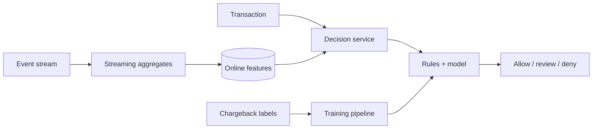

Fraud Detection 的核心不是模型精度，而是：交易被卡住的几十毫秒内，系统能否拿到**足够新鲜的行为证据**并给出可执行决策。

一张卡平时每周用两次，突然 30 秒内在三个国家连续交易。单看当前金额可能正常；“过去 30 秒的次数、距离和共享设备”才暴露风险。这些 rolling feature 不能在每次请求中扫描历史重算。

> 对应实验：[打开 Fraud Detection Lab](https://lab.zichaoyang.com/system-design/fraud-detection/)。改变 feature window、decision budget 和 label delay，观察 hot path 与 feedback loop。

## 概念阶梯

- **Velocity feature**：某 entity 在最近窗口内的次数、金额或不同地点数。
- **Decision**：通常不只是 allow/deny，还包括 step-up authentication 或 manual review。
- **Label delay**：chargeback 可能几周后才确认，模型看到的是延迟且不完整的真相。

## 主路径

Stream processor 异步维护最近窗口；同步请求只做 feature lookup、少量规则与有上界的模型调用。模型超时必须有 fallback，例如只运行高置信 hard rule，而不是让支付请求无限等待。

## 为什么从规则开始

规则可解释、上线快，适合明显边界。随着攻击变化，规则数量会膨胀且相互冲突，模型才有价值。成熟系统通常保留两者：规则负责硬政策和立即响应，模型整合大量弱信号。

## 常见难点

- 事件乱序会让窗口计数倒退，要用 event time、watermark 和幂等更新。
- 攻击者会适应模型，drift monitoring 与定期 retraining 是系统组成部分。
- 只优化 recall 会误杀正常用户；需要按金额和场景权衡 false positive 成本。
- Graph feature 能发现共享设备/地址形成的团伙，但图计算应离线或增量预计算，不能塞进 hot path。

## 面试表达

> I would precompute velocity and graph-derived signals asynchronously, then keep the synchronous decision path to a bounded feature lookup plus rules and model scoring.

面试里先问 latency、action types、label 来源与可接受误杀率，再讨论模型。真正的系统题是 feature freshness、fallback 和反馈闭环。
