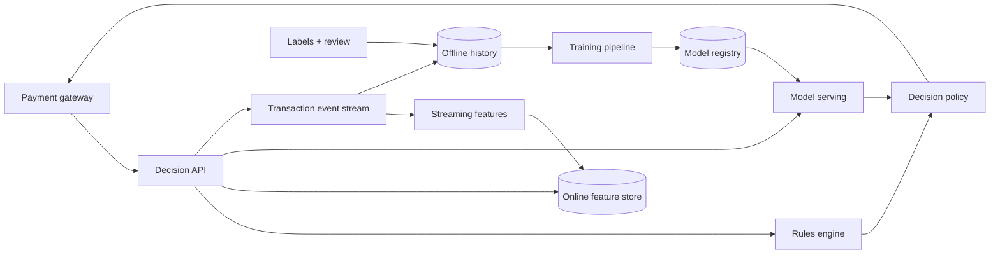

实时反欺诈有一个很不舒服的时间差：系统必须在用户刷卡的几十毫秒内决定“通过、拒绝还是人工审核”，但这笔交易究竟是不是欺诈，可能要等持卡人几天甚至几周后发起争议才知道。

也就是说，决策是即时的，真相却是迟到的。攻击者还会观察规则并改变行为，所以昨天表现很好的模型，今天可能已经被绕过。

这道题真正要设计的是：**怎样在极短延迟内组合可靠的实时信号做出可解释决策，并把迟到标签安全地送回训练和规则系统。**

> 配套实验：[打开 Fraud Detection Lab](https://lab.zichaoyang.com/system-design/fraud-detection/)。先只调整 decision budget 和 feature window，再增加 label delay；观察在线路径与反馈路径为什么必须分开。

## 一笔交易的三个时钟

用户在 `10:00:00` 发起一笔 800 美元交易。系统可能看到：

```text
10:00:00.000  transaction received
10:00:00.080  approve / decline decision required
10:03:00.000  merchant confirms capture
14 days later cardholder reports fraud
```

决策时能用的特征包括：过去 5 分钟尝试次数、设备是否新出现、商户风险、金额偏离用户习惯等。两周后的 chargeback 不能进入这次在线决策，却要成为未来训练的 label。

因此至少要区分：

- `event_time`：交易发生时间；
- `decision_time`：系统给出结论时间；
- `label_time`：真相进入系统的时间。

把它们压成一个 `created_at`，既无法做正确训练，也无法分析“当时系统究竟知道什么”。

## 先讲清楚 decision、score 和 label

**Risk score** 是模型对风险的连续估计，例如 0.87。它不是最终业务动作。

**Decision** 是 `APPROVE`、`DECLINE` 或 `REVIEW`。它由模型分数、硬规则、用户策略、商户协议和系统健康共同决定。

**Label** 是之后确认的结果，例如 `FRAUD`、`LEGIT`、`UNKNOWN`。没有争议不一定等于合法：很多欺诈永远不会被上报。

**Feature window** 是一段时间内的行为聚合，例如“这张卡过去 5 分钟失败次数”。窗口按 event time 还是 processing time 计算，会影响迟到事件和线上/离线一致性。

## 题目边界

本文设计支付授权前的实时风险系统：

1. 接收交易和账户、设备、商户上下文；
2. 在 deadline 内返回 approve / decline / review；
3. 组合硬规则和模型分数；
4. 记录决策依据和完整版本；
5. 吸收 chargeback、人工审核等迟到标签；
6. 监控攻击、漂移和业务损失。

第一版不设计支付清算、身份验证和通用 ML 训练平台。它们通过明确接口与风险系统交互。

非功能要求：

- 决策 p99 例如低于 80ms；
- 同一个 transaction 重试得到同一决策语义；
- Feature 或 model 故障时有明确 fail-open / fail-closed 策略；
- 每个决定可解释到 rule、feature snapshot 和 model version；
- PII、设备指纹和标注数据严格隔离；
- 系统优化的是总业务损失，不是只追求模型 AUC。

## 第一版：先写三条可解释规则

不要从深度模型开始。先实现一个单服务：读取交易，在数据库查询少量状态，执行规则，返回决策。

```python
def decide(transaction, account):
    reasons = []

    if transaction.amount > account.single_transaction_limit:
        reasons.append("AMOUNT_OVER_LIMIT")

    if transaction.country in account.blocked_countries:
        reasons.append("BLOCKED_COUNTRY")

    if transaction.failed_attempts_5m >= 5:
        reasons.append("VELOCITY_5M")

    if reasons:
        return Decision("DECLINE", reasons)

    return Decision("APPROVE", ["NO_RULE_TRIGGERED"])
```

这一版先把基础协议做对：

- 输入有稳定 `transaction_id`；
- 规则有 immutable `ruleset_version`；
- 决策完整落库后再响应；
- 同一个 transaction 重试不重新产生另一个结论；
- 响应包含机器可读 reason codes，不泄露可被攻击者利用的细节。

### 决策 API

```http
POST /v1/risk-decisions
Idempotency-Key: txn-991

{
  "transactionId":"txn-991",
  "accountId":"acct-4",
  "merchantId":"m-81",
  "deviceId":"d-19",
  "amount":{"currency":"USD","minorUnits":80000},
  "eventTime":"2026-07-13T17:00:00Z"
}
```

```json
{
  "decisionId":"rd-22",
  "decision":"REVIEW",
  "riskScore":0.87,
  "reasonCodes":["NEW_DEVICE","HIGH_VELOCITY"],
  "expiresAt":"2026-07-13T17:05:00Z"
}
```

金额用整数 minor units，不能用浮点数。`expiresAt` 防止支付服务在很久以后复用旧决策。

## 数据模型：Decision 是不可变事实

```text
RiskDecision(
  decision_id,
  transaction_id UNIQUE,
  account_id,
  event_time,
  decision_time,
  decision,
  risk_score,
  reason_codes,
  ruleset_version,
  model_version,
  feature_snapshot_ref,
  latency_ms
)

FraudLabel(
  label_id,
  transaction_id,
  label,
  source,
  source_version,
  effective_time,
  received_time,
  confidence
)

RuleSet(
  ruleset_version,
  definition_uri,
  state,
  approved_by,
  activated_at
)
```

不要更新旧 Decision 来反映新 label。Decision 表示“当时系统做了什么”；Label 表示“后来知道了什么”。两者通过 transaction ID 连接。

同一交易可能先由人工标成可疑，后来 chargeback 确认。Label 应保留事件历史和来源，训练数据生成时再按政策选择最终可信标签。

## 第二版：把 velocity 特征移出同步数据库查询

每笔交易都用 SQL 扫“过去五分钟交易”，在高峰会成为瓶颈。更合理的做法是事件流按 `account_id` 或 `card_id` 分区，持续维护窗口状态：

```text
attempt_count_5m
decline_count_1h
distinct_device_count_24h
amount_sum_24h
```

Streaming job 把当前值写入低延迟 feature store，并把历史写入离线存储。



在线路径不能等待 streaming job。当前交易的特征有两种处理方式：先写事件再读窗口，延迟高且有 race；或者读取历史窗口后在 decision service 内把当前交易临时合并进去。后一种更常见，但定义必须和离线训练一致。

## 第三版：在规则之后加入模型

模型不应替代所有规则。硬合规限制、明确 denylist 和系统保护逻辑更适合确定性规则；模型擅长组合大量弱信号。

决策策略可以写成：

```text
hard deny rule -> DECLINE
hard allow rule -> APPROVE
model unavailable -> fallback policy
score >= 0.92 -> DECLINE
0.75 <= score < 0.92 -> REVIEW
otherwise -> APPROVE
```

Threshold 不是 ML 团队自己拍脑袋。它取决于：

- 欺诈漏过的预期损失；
- 错拒合法用户的收入与信任损失；
- 人工审核容量；
- 不同地区、商户和支付方式的政策。

可以把决策成本写成：

$$
E[loss] = P(FN)C_{fraud} + P(FP)C_{customer} + P(review)C_{review}
$$

系统优化的是这个业务目标，而不是简单最大化 accuracy。

## 在线特征契约

Model deployment 必须 pin 住具体 feature versions：

```text
ModelDeployment(
  model_version,
  artifact_uri,
  feature_contract_version,
  threshold_policy_version,
  state
)
```

Feature response 除了值，还要返回 timestamp 和 status。若 `decline_count_1h` 已经 stale，Decision policy 可以选择更保守的 threshold，而不是把旧值当新值。

对每次决策保存完整 feature 向量可能很贵，也有隐私风险。可保存 hash、关键 reason features 和短期加密 snapshot；对模型审计要求高的场景，再按 retention policy 保存完整值。

## 容量估算：热路径和反馈路径不是一个数量级

假设高峰 100K transactions/s，每笔一次决策，Decision API 就要稳定处理 100K QPS。

每笔读取 50 个 feature。若批量读取一次完成，仍是 100K store requests/s；若逐特征读取，会放大到 5M requests/s。Feature client 必须 batch。

Streaming 侧若每笔交易更新 10 个窗口：

```text
100K events/s × 10 = 1M state updates/s
```

Key 要按 account/card 分区。大型商户、共享设备或攻击热点可能成为 hot key，需要二级分片或分层聚合。

人工 review 完全不同。若 1% 交易进入审核，就是 1,000 cases/s，远超多数人工团队容量。Threshold 必须受 review queue budget 约束，否则系统只是把实时压力搬到一个更慢的队列。

Label ingestion 量可能小得多，却关系训练正确性。它可以异步，但不能丢、不能覆盖来源。

## 延迟预算：模型不是唯一耗时

80ms p99 示例预算：

| 阶段 | 预算 |
|---|---:|
| Gateway、校验和幂等查询 | 8 ms |
| Feature batch read | 18 ms |
| Rules | 3 ms |
| Model inference | 20 ms |
| Policy、持久化与网络 | 21 ms |
| 余量 | 10 ms |

所有下游共享同一个绝对 deadline。Feature store 用满 40ms 后，model server 不能再拿完整 30ms timeout。

Model timeout 时的 fallback 需要按业务定义：小额低风险交易可能 approve，大额新设备可能 review 或 decline。一个全局“模型挂了就放行”会成为攻击窗口；全局拒绝又可能让支付业务停摆。

## 标签延迟和训练集构建

最新一天的“无 chargeback 交易”还不能当合法样本，因为 label maturity 不够。训练数据生成器要定义观察窗口，例如交易发生 45 天后才将未争议样本标为 mature legitimate。

```text
TrainingExample(
  transaction_id,
  decision_time,
  feature_values_as_of_decision,
  matured_label,
  label_source,
  dataset_version
)
```

这一步必须做 point-in-time feature join：只能使用 decision time 已知的特征。若把 chargeback 后更新的账户风险分数 join 回去，训练又会偷看未来。

还要处理 selection bias。被旧系统直接拒绝的交易，没有机会走到“真实成功或 chargeback”阶段，标签分布受现有 policy 影响。可以通过小流量 exploration、人工审核和 causal 分析缓解，但不能假装数据是独立同分布的。

## 模型发布：Shadow 比直接切流更重要

新模型先跑 shadow：接收真实 feature，产生 score，但不影响最终 decision。比较：

- 与当前模型的 score 和 decision disagreement；
- 各切片的 approve/decline/review rate；
- 延迟、timeout 和 feature missing；
- 在成熟 label 上的后验损失。

Canary 时只切少量可控流量，并保留 rules 保护。发布记录 model、features、threshold policy 和 ruleset 四个版本；只记 model version 无法重现最终决定。

## 攻击、漂移与观测

实时监控：

- Decision p99、timeout、fallback 和 error；
- approve/decline/review rate，按地区、商户、设备、金额切片；
- Feature freshness、missing、分布和异常值；
- Model score 分布、threshold 附近密度；
- Rule trigger rate 和新规则 overlap；
- Review queue depth、处理时间和 overturn rate；
- 成熟 cohort 的 fraud loss、false positive 和 delayed label rate。

攻击期间整体 fraud rate 可能还没显著变化，但某个设备簇、BIN 或商户的 velocity 已经暴涨。告警必须支持高基数切片和事件关联。

## 故障和正确性

**重复交易请求**

按 transaction ID 返回已持久化 Decision。不要因为重试时模型版本已经更新，就对同一支付产生另一个结论。

**Feature stream 落后**

响应暴露 feature age，policy 按风险选择 fallback。系统同时告警 lag，避免“可用但过期”。

**规则发布错误**

Ruleset immutable，支持 shadow、审批、canary 和即时回滚。紧急规则也要保留 owner、原因和 expiry，避免临时规则永久存在。

**模型服务故障**

短 timeout、circuit breaker 和本地/规则 fallback。恢复后渐进放量，避免冷启动把 p99 再次冲垮。

**Label 修正**

追加新 label event，不覆盖旧记录。Dataset version 固定所选 label policy，保证可重建。

## 关键取舍

**更长 feature window** 捕捉长期行为，却让 streaming state 更大，也可能稀释短时攻击信号。

**更低 threshold** 抓住更多欺诈，也增加误拒和 review backlog。Threshold 是运营容量和业务成本的函数。

**更多模型特征** 可能提高离线指标，却增加在线读取、缺失风险和解释成本。

**Fail open** 保护支付可用性但扩大欺诈风险；**fail closed** 保护资金却伤害合法用户。应按金额、用户信任和场景分层。

**更快 retraining** 适应攻击，也可能把尚未成熟、偏差更大的 label 加入训练。数据 freshness 与 label quality 必须平衡。

## 用 Lab 把闭环跑出来

**实验一：收紧 decision budget**

观察 feature、model 和持久化如何争抢 80ms。设计超时后的明确降级，而不是只增加机器。

**实验二：改变 feature window**

比较 5 分钟 velocity 和 30 天行为基线的状态量与用途。不要把所有风险压进一个窗口。

**实验三：增加 label delay**

观察模型训练能使用的成熟样本减少。问自己怎样避免把“暂时没投诉”当作合法事实。

## 面试表达：先讲即时决策与迟到真相

可以这样开场：

> Fraud detection has two very different clocks. We must make a decision in tens of milliseconds, but the ground-truth label may arrive weeks later. I would separate the low-latency decision path from the delayed feedback path, while preserving point-in-time feature and version lineage between them.

自然的演化顺序是：

```text
explainable rules
-> streaming velocity features
-> model score + decision policy
-> delayed label pipeline
-> shadow, canary and continuous monitoring
```

讲完以后再提供深入方向：

> I can go deeper into real-time feature windows, idempotent decisions, delayed-label training, or the false-positive versus fraud-loss trade-off.

这条主线会让人看到，风控系统不是“在线跑一个分类模型”，而是一套要长期对抗数据延迟和攻击者适应的决策闭环。

## 参考资料

- [Rules of Machine Learning: Best Practices for ML Engineering](https://developers.google.com/machine-learning/guides/rules-of-ml)
- [Hidden Technical Debt in Machine Learning Systems](https://papers.nips.cc/paper/5656-hidden-technical-debt-in-machine-learning-systems)
- [Feast: Point-in-time Joins](https://docs.feast.dev/getting-started/concepts/point-in-time-joins)
- [Stripe Radar: Machine Learning for Fraud Detection](https://stripe.com/radar)
