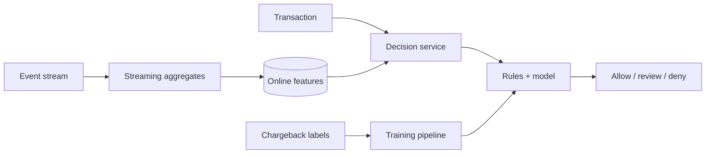

Fraud Detection 的核心不是模型精度，而是：交易被卡住的几十毫秒内，系统能否拿到**足够新鲜的行为证据**并给出可执行决策。

一张卡平时每周用两次，突然 30 秒内在三个国家连续交易。单看当前金额可能正常；“过去 30 秒的次数、距离和共享设备”才暴露风险。这些 rolling feature 不能在每次请求中扫描历史重算。

> 对应实验：[打开 Fraud Detection Lab](https://lab.zichaoyang.com/system-design/fraud-detection/)。改变 feature window、decision budget 和 label delay，观察 hot path 与 feedback loop。

## 需求边界（Requirements）

功能上对每笔交易输出 allow/review/deny、reason，并吸收延迟 label 训练更新。非功能上 decision 在支付 deadline 内完成、fallback 明确、决策可审计，同时在 fraud loss 与 false-positive friction 间权衡。

## 0. 先搭静态规则 MVP Scaffold

第一版只有同步 Decision API 和几条可解释规则：金额上限、被封设备、国家突变。规则从版本化配置加载，输出 `allow/review/deny` 和 reason code。所有输入与结果写 decision log。先建立 latency、误杀和人工 review 闭环，再训练模型。

第二步加入一个数据库计数 `card_id + minute`，实现最小 velocity rule。只有数据库聚合撑不住延迟时，才引入 streaming state。

## 1. API：决策必须有 deadline 和 reason

```http
POST /v1/fraud/decisions
{"transactionId":"t-9","accountId":"a-2","amount":12000,"currency":"USD",
 "deviceId":"d-7","occurredAt":"...","deadlineMs":80}

200 OK
{"decision":"review","score":0.91,"reasonCodes":["VELOCITY_10M"],"policyVersion":"p-18"}
```

同 transaction ID 重试返回相同 decision snapshot，防止一次支付在不同重试中摇摆。

## 2. 数据模型（Data Model）

```text
TransactionEvent(transaction_id PK, account_id, device_id, merchant_id, amount, occurred_at)
Decision(transaction_id PK, outcome, score, reasons, policy_version, model_version, created_at)
FeatureState(entity_key, feature_name, window, value, event_time, source_offset)
FraudLabel(transaction_id PK, label, source, confirmed_at)
ReviewCase(case_id, transaction_id, state, analyst_outcome)
```

Label 可能数周后才到，必须保留当时 decision/features 的版本，不能用今天的值解释过去。

## 3. 单机端到端流程

API 校验 request，查 denylist 和最近计数，执行规则，持久化 decision，返回。超时按风险等级使用 fallback policy。异步 label job 收 chargeback/review outcome，构建训练数据。模型上线后仍保留规则作为硬约束与 fallback。

## 4. 容量估算：feature state 比 raw 交易更适合 hot path

峰值 10 万 transactions/s、每笔查询 50 个 feature，若逐次扫历史会产生 500 万次复杂聚合/秒。预计算后每笔变成一次宽行读取。1 亿 entity、每个 100 个 8-byte 聚合，纯值约 80GB，考虑 key/版本/副本可能数百 GB，可按 entity shard。

## 5. Latency Budget：80ms 内完成决策

可分配 gateway 5ms、feature lookup 15ms、规则 5ms、model 25ms、decision write 15ms、余量 15ms。Graph traversal 和历史扫描不能在线做；离线算出 compact graph feature。模型超时退回规则，而不是默认 allow 或无限等待。

## 6. Correctness and Reliability

Streaming aggregation 用 event time、watermark 和幂等 event ID。Feature state checkpoint 可 replay。Policy/model 发布 canary 并保留快速 rollback。Decision log append-only，人工 override 追加新事件。敏感 PII 分域加密与最小化访问。

## 7. Trade-offs：风险损失与用户摩擦

- 更低 threshold 提高 recall，也提高 false positive 和 review 成本。
- 实时 graph 更鲜但昂贵；离线 graph 稳定却有 lag。
- Fail-closed 防风险但伤可用性；按金额/场景分层 fallback 更合理。

## 概念阶梯

- **Velocity feature**：某 entity 在最近窗口内的次数、金额或不同地点数。
- **Decision**：通常不只是 allow/deny，还包括 step-up authentication 或 manual review。
- **Label delay**：chargeback 可能几周后才确认，模型看到的是延迟且不完整的真相。

## 主路径



Stream processor 异步维护最近窗口；同步请求只做 feature lookup、少量规则与有上界的模型调用。模型超时必须有 fallback，例如只运行高置信 hard rule，而不是让支付请求无限等待。

## 为什么从规则开始

规则可解释、上线快，适合明显边界。随着攻击变化，规则数量会膨胀且相互冲突，模型才有价值。成熟系统通常保留两者：规则负责硬政策和立即响应，模型整合大量弱信号。

## 常见难点

- 事件乱序会让窗口计数倒退，要用 event time、watermark 和幂等更新。
- 攻击者会适应模型，drift monitoring 与定期 retraining 是系统组成部分。
- 只优化 recall 会误杀正常用户；需要按金额和场景权衡 false positive 成本。
- Graph feature 能发现共享设备/地址形成的团伙，但图计算应离线或增量预计算，不能塞进 hot path。

## 面试表达

> I would precompute velocity and graph-derived signals asynchronously, then keep the synchronous decision path to a bounded feature lookup plus rules and model scoring.

面试里先问 latency、action types、label 来源与可接受误杀率，再讨论模型。真正的系统题是 feature freshness、fallback 和反馈闭环。
