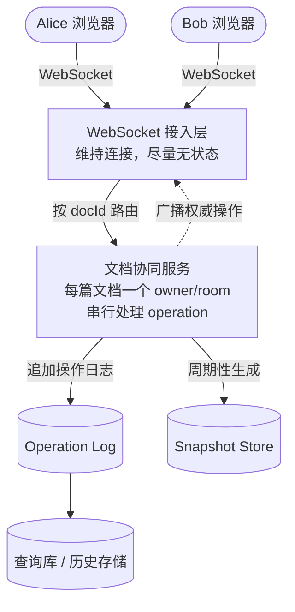
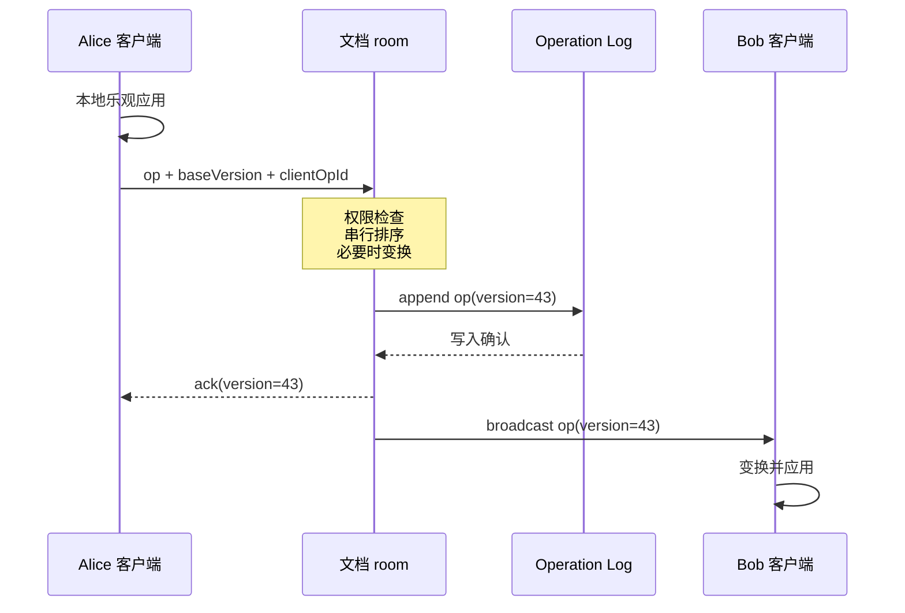
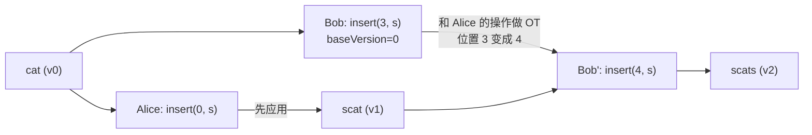
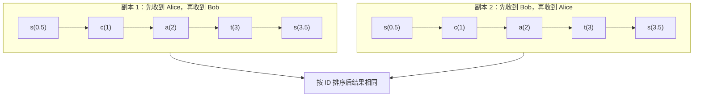
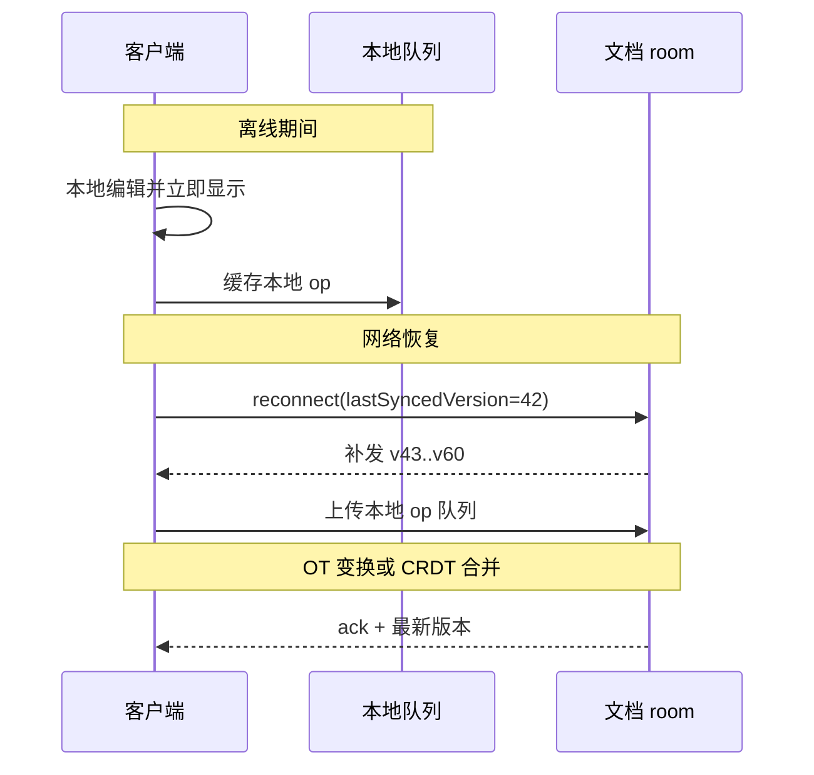

这道题不要一上来就想数据库、缓存、Kafka。Google Docs 最难的地方不是“把一篇文档存起来”，而是实时协同编辑（**real-time collaborative editing**）：几个人同时改同一篇文档时，大家最后看到的内容不能乱。

> 配套实验：[打开 Google Docs Lab](https://lab.zichaoyang.com/system-design/google-docs/)。先改变并发编辑者、离线窗口和被动浏览者，再回来理解 ordering path 为什么必须保持单一。

先看一个很小的例子。现在文档里只有一个词：

```text
cat
```

Alice 想在开头加一个 `s`，所以她的操作是：

```text
insert(pos=0, "s")
```

Bob 想在结尾加一个 `s`，所以他的操作是：

```text
insert(pos=3, "s")
```

这两条操作都没错，因为它们都是基于原文 `cat` 算出来的。但服务器如果先处理 Alice，文档就变成了 `scat`。这时 Bob 原来的 `pos=3` 已经不是结尾了，直接应用会变成：

```text
sca|t -> scast
```

Bob 本来想要的是 `scats`。这就是协同编辑的核心问题：**位置会因为别人的操作而过期**。英文里可以说：the position becomes stale because another operation has shifted the document.

所以这道题真正要设计的是一套系统，让每个人都能很快看到自己的输入，也能很快看到别人的输入；即使网络延迟（**network latency**）、消息乱序（**out-of-order delivery**）、有人离线再回来，所有副本（**replicas**）最后仍然能收敛（**converge**）到同一个文档。现实里我们通常追求的是最终一致性（**eventual consistency**），而不是每一毫秒都强一致（**strong consistency**）。[^sdhandbook]

---

## 先把几个词讲清楚

后面会反复出现一些系统设计和协同编辑术语。你不需要现在就掌握细节，但最好先知道它们大概指什么。否则一进入架构图，读起来会像一堆名词在互相引用。

**Operation / op**

一次最小编辑动作。比如“在位置 3 插入 `s`”就是一条 operation，也常简称 op。它不是整篇文档，而是用户刚刚做的那一步修改。

英文面试里可以说：

> An operation is a small edit, such as inserting text, deleting text, or applying formatting.

**Version / baseVersion**

`version` 是文档的版本号，每成功应用一条 operation，版本号就往前走。`baseVersion` 是客户端生成这条 operation 时看到的版本。

比如 Bob 发来的操作带着 `baseVersion=0`，但服务器已经处理完 Alice 的操作，来到 `version=1`。这就说明 Bob 的操作是基于旧版本算出来的，位置可能已经过期。

**Transform**

把一条基于旧版本的 operation 调整到新版本上。比如 Bob 原本要 `insert(pos=3)`，但 Alice 已经在前面插了一个字符，所以 Bob 的位置要变成 `pos=4`。

这里的 transform 不是“翻译文本”，而是“调整操作的位置或范围，让它仍然表达原来的意图”。

**Operation log**

按顺序保存所有 operation 的日志。它像一本流水账：谁在什么版本做了什么修改。系统需要它来做版本历史、离线同步、故障恢复。

**Snapshot**

某个版本的完整文档快照。只靠 operation log 也能恢复文档，但如果一篇文档有几十万条历史操作，从头重放会很慢。所以系统会定期存一份完整 snapshot，恢复时从最近的 snapshot 开始，再重放后面的少量 operation。

**Room / owner / actor**

这几个词在本文里意思接近：同一篇文档的所有编辑先汇到一个“负责处理这篇文档的地方”。它可以是一个进程、一个 actor、一个 worker，或者一个逻辑 room。

为什么需要它？因为同一篇文档里的并发编辑必须排出一个权威顺序（**authoritative order**）。如果两个机器同时给同一篇文档排序，问题会变复杂。

**Ack / acknowledgement**

服务端告诉客户端：“你这条操作我收到了，并且已经给它分配了版本号。”比如 `ack(version=43)`。但 ack 发得太早会有风险：如果服务端还没把操作写进可靠日志就崩了，用户以为成功的编辑可能丢失。

**Presence**

在线状态和光标状态。比如谁正在看这篇文档、谁的光标在哪、谁选中了哪一段。Presence 和正文内容不一样，它是易逝状态（**ephemeral state**）：丢一帧光标更新没关系，下一帧会补回来。

**WebSocket**

浏览器和服务器之间的一条长连接。普通 HTTP 更像“客户端问一次，服务器答一次”；WebSocket 更像双方开着一条电话线，客户端可以随时发编辑，服务器也可以随时推送别人的编辑。

**OT / CRDT**

这是两类协同编辑算法。现在先记一句就够：

- OT（Operational Transformation）：当操作基于旧版本时，调整这条操作，让它能应用到新版本上。
- CRDT（Conflict-free Replicated Data Type）：给数据本身设计一种可合并结构，让不同副本即使按不同顺序收到操作，也能最终得到同样结果。

后面的算法部分会用 `cat -> scats` 的例子展开它们。

---

## 面试策略（Interview Strategy）：不要把这题讲成知识背诵

这篇文章后面会讲很多内容，但面试时你不能像念教程一样从头讲到尾。系统设计面试更像一次有时间限制的技术讨论。你的目标不是把所有知识点倒出来，而是让面试官相信三件事：

1. 你知道这题真正难在哪里。
2. 你能先搭出一个能工作的系统。
3. 你能在关键点上做取舍，而不是只背方案。

所以这题的上场策略可以这样安排。

**前 5 分钟：先锁定题目**

不要直接画架构图。先问清楚范围，然后主动收敛：

> 我会先聚焦实时协同编辑本身：创建文档、多人编辑、实时同步、presence。搜索、评论、复杂权限和计费可以作为外部系统先不展开。

英文可以直接说：

> I would narrow the scope to the collaborative editing core: document creation, concurrent editing, real-time synchronization, and presence. I would treat search, comments, billing, and advanced sharing as separate systems.

这句话的作用是告诉面试官：你知道 Google Docs 很大，但你能把题目切到核心。

**接下来 5 分钟：用一个小例子暴露核心难点**

不要急着说 WebSocket。先讲 `cat` 例子：

> Alice 在位置 0 插入 `s`，Bob 在位置 3 插入 `s`。两条操作都基于旧版本 `cat`，但如果 Alice 先被应用，Bob 的位置就过期了。所以这题的核心不是存文档，而是并发操作如何收敛。

英文可以直接说：

> Both operations are valid relative to the original version, but once Alice's operation is applied first, Bob's position becomes stale. The core problem is not storing a document; it is making concurrent operations converge.

这个例子是你的“抓手”。后面讲 `baseVersion`、room 串行化、OT/CRDT，都是围绕它展开。

**中间 20 分钟：先给主方案，再解释取舍**

主线不要散。按这个顺序走：

```text
requirements -> estimation -> data model -> API -> architecture -> OT deep dive
```

每一步都只讲和协同编辑有关的东西。比如容量估算不是为了展示算术，而是为了推出 WebSocket 接入层、operation log、snapshot。数据模型不是为了列很多表，而是为了说明 `current_version` 和 append-only operation 为什么重要。

**最后 10 分钟：等面试官选择 deep dive**

你可以主动给几个深入方向，让面试官选：

- 如果他关心一致性，就深入 OT vs CRDT。
- 如果他关心可靠性，就讲 ack 什么时候发、room 崩了怎么恢复。
- 如果他关心规模，就讲热点文档、fanout、presence 为什么不落库。
- 如果他关心产品体验，就讲离线编辑、语义冲突和版本恢复。

这比你自己无限展开更好，因为系统设计面试通常是互动式的。你要给面试官可追问的入口。

**一个实用原则**

每讲一个组件，都顺手讲一句“为什么不是另一种方案”。比如：

- 用 WebSocket，因为编辑是双向低延迟（**bidirectional, low-latency communication**），不适合轮询（**polling**）。
- 同一文档进同一个 room / owner / actor，因为并发操作需要一个权威顺序（**authoritative order**）。
- presence 不进操作日志（**operation log**），因为它是易逝状态（**ephemeral state**），丢一帧没关系。
- ack 等日志写入（**durable log append**），因为用户收到确认的操作应该能从故障中恢复。

这套说法会让你的答案听起来像设计，而不是背架构图。

---

## 1. 先把题目边界说清楚（Requirements）

面试官说“设计 Google Docs”，你不要默认要做完整 Google Workspace。先把范围收住。

我会先确认这几个核心功能：[^hellointerview-gdocs]

1. 用户可以创建文档。
2. 多个用户可以同时编辑同一篇文档。
3. 一个用户的修改要实时出现在其他协作者那里。
4. 用户可以看到其他人的在线状态和光标位置，也就是 presence / cursor sharing。

然后说明哪些东西先不展开：账号系统、计费、搜索、评论、复杂分享策略。这些都重要，但不是这道题的主线。今天重点放在实时协同编辑。

非功能需求里，最关键的是这几个：

- **低延迟（low latency）**：打字后不能等一两秒才看到反馈。自己的输入要本地立即出现，别人的修改也要尽快同步。[^algomaster]
- **最终一致性（eventual consistency）**：并发修改之后，所有人最终看到同一份文档。[^algomaster]
- **高可用（high availability）**：某台机器挂了，用户可以重连，文档不能丢。
- **可扩展（scalability）**：系统要能支撑很多文档、很多在线连接，但单篇文档里的同时编辑人数通常不会是百万级。

这里有一个重要取舍（**trade-off**）：我们不追求传统意义上的强一致。强一致通常意味着锁（**locking**）、同步等待（**synchronous coordination**）、阻塞写入（**blocking writes**）。那样文档会很“卡”，不适合实时编辑。更自然的做法是：客户端先乐观更新（**optimistic update**），服务端负责给所有操作排出权威顺序，最后把大家拉回同一个状态。

---

## 动手搭一个“还不会处理并发”的版本

现在读者已经知道 `operation`、`baseVersion` 和 `ack` 是什么，可以开始写第一版。先不要实现 OT，也不要引入 CRDT。我们的目标是让一个用户的编辑能够可靠保存，并且让失败暴露得足够清楚。

### 第一步：定义最小 Operation

先只支持纯文本的插入和删除：

```ts
type TextOperation =
  | { type: 'insert'; position: number; text: string }
  | { type: 'delete'; position: number; length: number };
```

写一个完全确定的 `apply` 函数。同样的正文和 operation，在任何机器上都必须得到同样结果：

```ts
function applyOperation(document: string, operation: TextOperation): string {
  if (operation.type === 'insert') {
    return (
      document.slice(0, operation.position) +
      operation.text +
      document.slice(operation.position)
    );
  }

  return (
    document.slice(0, operation.position) +
    document.slice(operation.position + operation.length)
  );
}
```

这里先补上边界检查：position 不能为负，delete 不能越过文档末尾，单条 operation 也要限制文本大小。不要让非法操作进入日志后才发现无法重放。

### 第二步：单用户 Version Compare-and-swap

浏览器维护：

```text
confirmedVersion
confirmedDocument
pendingOperations[]
```

用户打字时，本地立即应用 operation，所以输入没有网络等待。客户端每隔很短时间批量发送：

```json
{
  "docId":"doc_123",
  "clientOpId":"device-7:881",
  "baseVersion":42,
  "operations":[
    {"type":"insert","position":3,"text":"s"}
  ]
}
```

服务端在一个事务中完成：

```text
读取 Document.current_version
-> 必须等于 baseVersion
-> 依次 apply operations
-> 追加 Operation rows
-> 更新 snapshot/current_version
-> commit
-> 返回 ack
```

`clientOpId` 有唯一约束。服务端 commit 成功但 ack 丢失时，客户端重发同一个 ID，得到原来的 version，而不是再插入一个 `s`。

这时可以故意杀掉服务端：commit 前崩溃，客户端没有 ack，安全重试；commit 后崩溃，幂等 ID 找回原结果。先把这条语义验证清楚，再进入多人协作。

### 第三步：加入两个人，但暂时拒绝 Stale Base

让 Alice 和 Bob 连接同一台 WebSocket server。内存中每篇文档有一个 room，room 串行处理收到的命令，并在 durable commit 后广播权威 operation。

第一版遇到 `baseVersion < currentVersion` 时不要假装会合并，直接返回：

```json
{
  "type":"stale_base",
  "currentVersion":43,
  "missingOperations":[...]
}
```

客户端拉到缺失操作后重建本地文档。这个版本用户体验不好，但它让并发问题变得可观察。

现在重放文章开头的 `cat`：Alice 和 Bob 都从 version 0 发操作。Alice 先成功，Bob 收到 stale base。你会亲眼看到 Bob 原来的 position 已经不再表达“结尾”。这时引入 transform 是为了解决一个已经出现的失败，不是为了展示算法名词。

### 第四步：加入 Pending Queue，再实现 Transform

现实客户端在上一条操作还没 ack 时，用户已经继续打字。因此需要区分：

```text
confirmed operations：服务端已排序
pending operations：本地已应用、服务端未确认
remote operation：刚从服务端收到
```

收到 remote operation 时，客户端不能直接应用到屏幕文本；它要先与 pending operations 做 transform，同时也调整 pending positions。服务端则把 stale incoming operation 与 `baseVersion` 之后的权威日志做 transform。

这一步用 property tests 比只写几个 example 更可靠。至少验证：

```text
apply(apply(doc, A), transform(B against A))
==
apply(apply(doc, B), transform(A against B))
```

还要覆盖 insert/insert 同位置、insert/delete 重叠、delete/delete 重叠和稳定 tie-break。只有所有客户端使用同一个 transform 规则，副本才会收敛。

这条动手路径的顺序很重要：

```text
deterministic operation
-> single-user durable version
-> two-user stale-base failure
-> pending queue
-> OT transform
```

如果直接安装一套 CRDT library，读者也许能做出 demo，却很难解释系统究竟解决了什么。

---

## 2. 容量估算（Capacity Estimation）：数字不用精确，但要能推出设计

估算不是为了算出一个漂亮答案，而是为了知道哪里会成为瓶颈。

先给一组方便面试讨论的假设：

| 假设 | 数字 |
|---|---:|
| 日活用户 | 100M |
| 高峰期同时编辑比例 | 1% |
| 高峰期并发编辑用户 | 1M |
| 活跃编辑时每人每秒产生操作 | 约 5 ops/s |
| 平均文档正文大小 | 100KB |

这样可以得到几个数量级。

**WebSocket 连接数（concurrent connections）**

高峰期大约有 `100M * 1% = 1M` 个在线编辑连接。编辑场景是持续、双向、低延迟通信，WebSocket 比 HTTP 轮询更合适。接入层要能水平扩展，并且最好保持无状态，这样用户断线后可以重连到其他机器。

**编辑操作吞吐（operation throughput）**

如果 1M 用户都在活跃编辑，粗略就是：

```text
1M * 5 ops/s = 5M ops/s
```

实际系统会有很多优化，比如批量发送、合并连续输入、只对活跃文档做高频广播。但这个数量级足够说明一件事：不能让每个按键都直接同步写主数据库。通常会让文档协同服务先处理操作，然后通过日志、队列或流式存储异步持久化。[^educative-gdocs]

**存储**

正文 100KB 不大，真正麻烦的是历史操作。如果每次插入、删除、格式变化都变成一条 operation，长期下来操作日志会比正文大很多。所以要有两层东西：

- append-only operation log，用来重放历史（**replay history**）、做版本恢复、支持离线同步。
- periodic snapshot，每隔一段时间保存一份文档快照，避免从第一条操作开始重放。

这里也有取舍。快照越频繁，恢复越快，但写入和存储成本更高；快照越少，存储省一点，但故障恢复和打开老文档会更慢。

## 3. 数据模型（Data Model）：正文只是结果，operation 才是核心

可以把核心实体拆成这些：

- `User`：用户。
- `Document`：文档元数据。
- `Permission`：谁能看、谁能改。
- `Operation`：一次编辑操作，也可以叫 edit operation / mutation。
- `Snapshot`：某个版本的全文快照。
- `Session`：当前在线连接和 presence 状态。

一个简化的数据模型如下：

```sql
Document(
  doc_id           PK,
  title,
  owner_id,
  current_version BIGINT,
  created_at,
  updated_at
)

Permission(
  doc_id,
  user_id,
  role             -- owner / editor / viewer
)

Operation(
  op_id            PK,
  doc_id,
  version          BIGINT,
  author_id,
  type,            -- insert / delete / format
  position,
  payload,
  created_at
)

Snapshot(
  doc_id,
  version,
  content_blob,
  created_at
)
```

这里最重要的是 `current_version` 和 `Operation.version`。

客户端发来的每条操作都要带一个 `baseVersion`，意思是：“我是在文档版本 42 的基础上做出这个编辑的。”英文可以说：this operation was generated against version 42. 服务端当前如果已经到了版本 45，就说明中间已经发生了别人的操作。这条操作不能直接应用，必须先变换（**transform**）到新版本上。

为什么不只存全文？因为全文只是当前状态，丢掉了过程。协同编辑系统需要过程：

- 冲突解决要看操作粒度。
- 版本历史可以从操作日志重建。
- 离线用户重连后，只需要补发它缺失的操作。
- 房间进程故障后，可以从 snapshot + operation log 恢复。

所以这类系统通常不是“只存一个大字符串”，而是“当前快照 + 操作日志”。[^educative-gdocs]

---

## 4. API：普通请求走 REST，实时编辑走 WebSocket

低频操作可以走 REST：

```text
POST   /documents
GET    /documents/{docId}
PUT    /documents/{docId}/permissions
GET    /documents/{docId}/history
```

打开文档时，客户端可以先通过 REST 拿到当前 snapshot 和 `currentVersion`。进入编辑状态后，建立 WebSocket。

WebSocket 上主要有三类消息。

客户端发给服务端：

```json
{
  "type": "op",
  "docId": "doc_123",
  "baseVersion": 42,
  "op": { "type": "insert", "pos": 3, "text": "s" }
}
```

```json
{
  "type": "cursor",
  "docId": "doc_123",
  "pos": 7
}
```

服务端发给客户端：

```json
{
  "type": "op",
  "docId": "doc_123",
  "version": 43,
  "authorId": "user_456",
  "op": { "type": "insert", "pos": 4, "text": "s" }
}
```

```json
{
  "type": "ack",
  "docId": "doc_123",
  "clientOpId": "local_789",
  "version": 43
}
```

`clientOpId` 很实用。客户端本地会先乐观应用自己的操作，服务端 ack / acknowledgement 回来后，客户端要知道 ack 的是哪一条本地操作。如果网络重试导致同一条 op 发了两次，服务端也可以用它做幂等（**idempotency**）。

---

## 5. 高层架构（High-Level Architecture）：把同一篇文档的操作放到同一个地方排序

整体架构可以长这样：



这个架构的关键不是某个具体组件名字，而是这个原则：

**同一篇文档的操作必须进入同一个有序处理点。**

你可以把它叫 room、actor、shard、owner worker，甚至进程。Figma 的多人协作架构里就有类似“每个文件一个服务进程”的思路。[^figma] 面试里说“per-document room”比较容易讲清楚，但生产实现未必真的是一个 OS process，也可能是一组 actor 分片。

一条编辑操作的路径是：

1. Alice 在本地输入，客户端立刻显示结果，这叫乐观更新（**optimistic update**）。
2. 客户端把操作、`baseVersion`、`clientOpId` 发到 WebSocket 接入层。
3. 接入层按 `docId` 路由到对应文档 room。
4. room 串行处理操作（**serialize operations**）：检查权限，比较版本，必要时做 OT 变换。
5. room 生成新的权威版本号，追加操作日志。
6. room 给 Alice 发 ack，并把权威操作广播给其他在线用户。
7. 其他客户端收到操作后，结合自己的本地未确认操作，再做一次本地变换并应用。



这里有一个很容易被追问的点：**ack 到底什么时候发？**

如果 room 内存里处理完就 ack，延迟最低，但 room 在落库前崩了，可能会丢掉已经确认给用户的操作。更稳妥的方案是：至少等 operation log 或队列写入成功后再 ack，也就是等一次 durable append。这样延迟会多一点，但用户收到 ack 的操作不会轻易丢。

面试里可以这样说：编辑体验上客户端先乐观更新，所以用户不会等 ack 才看到字；可靠性上，服务端 ack 应该在操作进入可恢复日志之后再发。

### 给主链路一份延迟预算

自己的输入不应等待服务端。浏览器在下一帧内完成本地渲染，网络路径只决定 ack 和其他协作者多久看到这次修改。

可以给远端协作设一份示例 p99 预算：

| 阶段 | 预算 |
|---|---:|
| 客户端短暂 batch | 20 ms |
| Gateway 路由到 room | 30 ms |
| 权限、transform、durable append | 50 ms |
| Room fan-out 到接收 gateway | 40 ms |
| 网络、客户端应用和余量 | 60 ms |
| **合计** | **200 ms** |

这张表的价值不是承诺所有网络都能做到 200ms，而是帮助定位问题。Ack 慢但 room queue 正常，可能是日志 append；只有某一篇文档慢，通常是 hot-document queue 或某个超大 operation；所有文档都慢，才去看 gateway、网络和 shared log。

Presence 的预算可以更松，也允许丢帧。正文 operation 不应为了追求相同的低延迟而跳过 durability。两种数据共享 WebSocket，不等于共享可靠性语义。

### 这一条链路里的四个取舍

- 本地 optimistic apply 让输入流畅，却要求客户端维护 pending queue，并在 ack/remote op 到来时调整它。
- Durable-before-ack 防止“已经确认”的编辑丢失，代价是一次日志写延迟。
- 每文档单一 owner 让排序清楚，也形成 hot-document 上限。Gateway 和 fan-out 可以水平扩，单篇文档的权威排序不能随意拆成多个 writer。
- OT 保留位置式操作，适合服务端排序；CRDT 更自然地支持离线与多主合并，但 identifier、tombstone 和 metadata 更重。

---

## 6. 核心算法（Core Algorithm）：OT 怎么把过期位置变成正确位置

Google Docs 历史上使用的是 Operational Transformation，也就是 OT。[^sdhandbook]

OT 的思路可以先不用说得很学术。你可以这样讲：

> 客户端发来的操作是基于某个旧版本算出来的。服务端如果发现文档已经被别人改过，就把这条操作的位置调整一下，让它在新版本里仍然表达原来的意图。

英文可以直接说：

> The client sends operations relative to a base version. If the server has already applied other operations since that base version, it transforms the incoming operation so that it still preserves the user's intent.

还是 `cat` 的例子。

初始状态：

```text
cat, version=0
```

Alice 和 Bob 都基于 version 0 编辑：

```text
Alice: insert(pos=0, "s")  -> 想要 scat
Bob:   insert(pos=3, "s")  -> 想要 cats
```

服务端先收到 Alice：

```text
cat -> scat, version=1
```

然后收到 Bob。Bob 的 `baseVersion=0`，但服务端已经是 version 1。中间发生过 Alice 的插入，而且 Alice 插入的位置 `0` 在 Bob 的位置 `3` 前面，所以 Bob 的位置要往后挪一位：

```text
Bob: insert(pos=3, "s")
变换后: insert(pos=4, "s")
```

于是：

```text
scat -> scats
```



如果两个人都在同一个位置插入呢？比如都在 `pos=0`。这时系统需要一个确定性的 tie-breaker / deterministic ordering rule，比如按服务端接收顺序，再结合 `user_id` 或 `op_id` 做稳定排序。重点不是规则多聪明，而是所有副本都必须按同一个规则得到同一个顺序。[^sandbox-ot]

OT 的难点在实现。你不只要处理 insert vs insert，还要处理：

- insert vs delete
- delete vs insert
- delete vs delete
- format vs insert
- format vs delete

操作类型越多，变换函数越多，边界条件也越多。这就是 OT 难调试的地方。[^systemdr]

那为什么还用 OT？因为 Google Docs 这种产品本来就需要中央服务端：

- 要做权限检查。
- 要保存历史。
- 要做审计和恢复。
- 多端同步要有权威版本。

既然服务端已经在链路中间，让服务端负责排序和变换是合理的工程选择。[^designgurus-arch][^systemdr]

---

## 7. CRDT：另一条路，把顺序藏进数据结构

CRDT 是另一类协同编辑方案，在很多新协同系统和离线优先应用里很常见。[^sdhandbook]

它和 OT 的思路不一样。OT 说：“位置过期了，我帮你变换操作。”CRDT 说：“我干脆不用容易过期的普通位置。”

在文本 CRDT 里，每个字符都有一个稳定的、有序的 ID，也就是 stable position identifier。你可以粗略理解成一个可以无限插入的小数位置。比如：

```text
c(1) a(2) t(3)
```

Alice 在开头插入 `s`，给它一个排在 `c(1)` 前面的 ID：

```text
s(0.5)
```

Bob 在结尾插入 `s`，给它一个排在 `t(3)` 后面的 ID：

```text
s(3.5)
```

不管两个操作以什么顺序到达，只要所有副本都按 ID 排序，最后都是：

```text
s(0.5) c(1) a(2) t(3) s(3.5)
```

也就是 `scats`。[^sandbox-crdt]



CRDT 的优势是离线和去中心化（**offline-first and decentralized collaboration**）更自然。客户端离线很久也可以继续生成操作；回来之后把操作同步给别人，大家按 CRDT 规则合并（**merge**）。

代价也很明显：每个字符都要带额外元数据（**metadata overhead**），比如唯一 ID、逻辑时间（**logical clock**）、删除墓碑（**tombstone**）等。长文档会带来内存和存储开销，客户端实现也更复杂。[^tiny-crdt][^systemdr]

一个简化对比如下：

| 维度 | OT | CRDT |
|---|---|---|
| 核心思路 | 操作基于旧版本时，变换操作 | 给数据元素稳定 ID，按规则合并 |
| 权威顺序 | 通常由中央服务端决定 | 每个副本可以独立合并 |
| 适合场景 | 中心化、强服务端、权限和历史都在服务端 | 离线优先、弱中心、多端自治 |
| 主要成本 | 变换函数难写，服务端压力大 | 元数据多，客户端和存储更重 |
| 代表 | Google Docs 历史方案 | 很多新协同编辑库和离线优先应用 |

面试里不用把 OT 和 CRDT 讲成宗教选择。更自然的回答是：

> 如果这个系统像 Google Docs 一样本来就有中央服务端，要做权限、历史、审计，我会选 OT 或中心化协同协议。如果产品特别强调离线优先、端到端合并、弱中心同步，我会认真考虑 CRDT。

英文可以直接说：

> For a Google Docs-like system, I would lean toward a centralized OT-style design because the server already needs to enforce permissions, store history, and maintain an authoritative version. If the product is offline-first or peer-to-peer, I would consider CRDTs more seriously.

---

## 8. 为什么 Figma 可以更简单

顺手讲 Figma 是一个很好的加分点，但不要把它讲成“Figma 更高级，所以 Google Docs 也应该这样做”。

Figma 的协同编辑场景和文本不一样。它编辑的是对象属性（**object properties**），比如矩形的位置、颜色、宽高。很多属性天然可以独立覆盖。Figma 工程博客里提到，他们没有直接用 OT，而是做了一套更贴合自己数据模型的多人协作方案，其中很多冲突可以用属性级 last-writer-wins / LWW 处理。[^figma]

文本不一样。文本是一条有顺序的字符流。你在前面插一个字，后面所有位置都会偏移。所以 Google Docs 需要更精细的位置处理。

这个对比的价值是说明：**协同算法不是脱离业务单独选择的，数据形态会决定冲突解决方案。**

---

## 9. Presence 和正文操作不要混在一起

文档内容和 presence 看起来都在 WebSocket 上跑，但它们的可靠性要求完全不同。

文档 operation / document mutation：

- 不能丢。
- 要有顺序。
- 要能恢复。
- 要进入操作日志。

Presence 和光标 / cursor updates：

- 高频变化。
- 可以丢一两帧。
- 不需要长期存储。
- 用户断线后自然失效。

所以 room 里可以维护一份内存表：

```text
user_id -> { cursor_pos, selection_range, color, last_seen }
```

客户端移动光标时发 cursor 消息，room 更新内存状态并广播给其他在线用户。用户断线或心跳超时，就把他从 presence 表里移除。

这也是一个典型 tradeoff：presence 追求轻量和实时，不追求持久可靠；正文操作追求可靠和有序，可以接受稍微多一点处理成本。英文里可以说：presence is ephemeral and best-effort, while document operations must be durable and ordered.

---

## 10. 离线编辑和重连（Offline Editing and Reconnection）

离线编辑可以这样处理：

1. 客户端断网后继续允许用户编辑。
2. 每条本地操作进入本地队列，同时在界面上乐观应用。
3. 客户端记住断线前最后看到的服务端版本，比如 `lastSyncedVersion=42`。
4. 重连后，客户端先告诉服务端自己最后同步到 42。
5. 服务端补发 43 之后的操作。
6. 客户端再上传本地离线期间产生的操作。
7. 双方通过 OT 或 CRDT 合并，最终收敛。

英文面试里可以这样概括：

> The client keeps a local operation queue while offline. On reconnection, it tells the server the last synced version, receives missing operations from the server, uploads local pending operations, and then the system reconciles them through OT or CRDT rules.



这里要诚实讲一个边界：算法能解决结构性冲突，不一定能解决语义冲突。

比如两个人离线期间都重写了同一段话，系统可以合并字符层面的操作，但结果未必符合人的意图。产品上可能还需要冲突提示、版本历史、恢复按钮，或者在复杂场景里让用户手动处理。

---

## 11. 扩展性和故障恢复（Scalability and Failure Recovery）

这套系统最容易被追问的几个点是：room 怎么扩展，热点文档怎么办，机器挂了怎么办。

**接入层扩展（gateway scaling）**

WebSocket 接入层尽量无状态。它负责维持连接、认证、心跳、转发消息。机器挂了以后，客户端重连到其他接入节点，再根据 `docId` 找到对应 room。

**文档 room 分片（document sharding）**

普通文档可以按 `docId` 做一致性哈希或通过 placement service 分配到某个 room worker。同一篇文档的操作只进一个 owner，这样排序简单。

代价是热点文档（**hot document**）会成为单点瓶颈。比如一个超大公开文档有上万人同时打开，不可能让所有 presence 和广播都堆在一个进程里。可以拆两层：

- 编辑者仍然进主 room，保证写操作有序。
- 只读观看者走 fanout 节点或订阅层（**subscription layer**），降低主 room 广播压力。

**故障恢复（failure recovery）**

room 崩溃后，新 owner 从最近 snapshot 加之后的 operation log 重建文档状态。这里前面提到的 ack 策略很关键：如果 ack 必须等 operation log 写入成功，那么用户收到确认的操作就能在恢复时重放回来。

**持久化和队列**

可以把 operation log 放在强顺序的日志系统里，也可以先写队列再异步消费到数据库。核心要求是：对同一篇文档，日志顺序必须和 room 生成的版本顺序一致。[^educative-gdocs]

---

## 12. 一套可以直接上场的 45 分钟打法

如果面试官给你完整 45 分钟，可以按下面这个节奏讲。时间不是死的，但它能防止你在 OT 细节里讲太久，最后没时间讲架构和可靠性。

| 时间 | 你要完成什么 | 关键话术 |
|---|---|---|
| 0-5 分钟 | 澄清范围 | “我先聚焦实时协同编辑：多人编辑、实时同步、presence、创建文档。” |
| 5-8 分钟 | 点出核心难点 | “难点是并发操作的位置会过期，比如 `cat` 里 Alice 和 Bob 同时插入。” |
| 8-13 分钟 | 估算和约束 | “1M 连接、百万级 ops/s，所以接入层要水平扩展，编辑操作要走日志/队列。” |
| 13-20 分钟 | 数据模型和 API | “核心不是只存全文，而是 `Document.current_version`、operation log、snapshot。” |
| 20-30 分钟 | 画主架构 | “WebSocket 接入层按 `docId` 路由到文档 room，同一文档在 room 内串行排序。” |
| 30-38 分钟 | deep dive OT | “Bob 的 `baseVersion` 过期，所以服务端把 `insert(pos=3)` 变换成 `insert(pos=4)`。” |
| 38-43 分钟 | 可靠性和扩展 | “ack 等日志写入后再发；room 崩了从 snapshot + log 恢复；热点读者走 fanout。” |
| 43-45 分钟 | 总结取舍 | “我选择中心化 room + OT，是因为 Google Docs 需要权限、历史和权威版本；离线优先系统可以考虑 CRDT。” |

你可以把开场说成这样：

> 我会先把范围收窄到实时协同编辑，不展开搜索、评论和计费。这个系统的核心难点是并发编辑时操作位置会过期，所以我会围绕 operation、version、room 串行化和 OT 来设计。目标是低延迟体验加最终一致性，而不是用锁做强一致。

如果面试官让你“简单讲架构”，你就压缩成这版：

> 客户端通过 WebSocket 连接接入层；接入层按 `docId` 把编辑操作路由到对应文档 room；room 是该文档的权威排序点，负责权限检查、版本比较、OT 变换、生成新版本；操作写入 operation log 后 ack 给作者，并广播给其他协作者；快照周期性生成，用于快速加载和故障恢复。Presence 走内存广播，不进入可靠日志。

如果面试官追问“为什么这么设计”，你就按取舍回答：

- **为什么不是 HTTP 轮询？** 编辑是持续双向通信，轮询延迟和浪费都更高。
- **为什么同一文档要进一个 room？** 因为并发操作需要一个权威顺序，否则冲突解决会复杂很多。
- **为什么不只存全文？** 因为离线同步、版本历史、故障恢复和冲突解决都需要 operation log。
- **为什么 ack 不应该太早？** 因为 ack 代表服务端承诺了这条操作，至少要等它进入可恢复日志。
- **为什么 presence 不落库？** 因为光标是易逝状态，可靠性要求和正文操作完全不同。
- **什么时候换成 CRDT？** 如果产品强调离线优先、弱中心同步、客户端自治，就更值得考虑 CRDT。

最后可以专门背这几句英文。它们不花哨，但面试里很自然：

- **Scope**: I would focus on the collaborative editing core and treat search, comments, billing, and advanced sharing as separate systems.
- **Core challenge**: The hard part is making concurrent edits converge when operations are generated against different document versions.
- **Consistency**: I would optimize for low latency and eventual consistency, not strict strong consistency on every keystroke.
- **Architecture**: I would route all operations for the same document to a single authoritative room or actor so that they can be serialized.
- **Storage**: I would store an append-only operation log plus periodic snapshots, rather than only storing the latest document content.
- **Reliability**: I would send an acknowledgement only after the operation has been appended to a durable log.
- **Presence**: Presence and cursor updates are ephemeral and best-effort, while document operations must be durable and ordered.
- **OT vs CRDT**: For a centralized Google Docs-like system, OT fits well; for an offline-first or peer-to-peer system, CRDTs become more attractive.

这套策略的重点是：你不是在展示“我知道 Google Docs 用 OT”，而是在展示“我能把需求、规模、数据模型、实时通道、一致性算法和故障恢复串成一个可运行的系统”。

---

## 想继续深入？推荐资源

1. **Hello Interview — [Google Docs Problem Breakdown](https://www.hellointerview.com/learn/system-design/problem-breakdowns/google-docs)**：答题结构很清楚。[^hellointerview-gdocs]
2. **AlgoMaster — [Google Docs System Design Interview](https://blog.algomaster.io/p/google-docs-system-design-interview)**：需求和挑战列得比较完整。[^algomaster]
3. **System Design Sandbox — [OT vs CRDT](https://www.systemdesignsandbox.com/learn/ot-vs-crdt)**：适合看 Alice/Bob 推演。[^sandbox-ot]
4. **Tiny.cloud — [Real-time collaboration: OT vs CRDT](https://www.tiny.cloud/blog/real-time-collaboration-ot-vs-crdt/)**：机制解释更细。[^tiny-ot]
5. **Design Gurus — [Design a Real-time Editor](https://www.designgurus.io/blog/design-real-time-editor)**：中心化实时编辑器讲得比较直观。[^designgurus-otcrdt]
6. **Educative — [Grokking the System Design Interview](https://www.educative.io/courses/grokking-the-system-design-interview)**：付费课程，Google Docs 模块覆盖比较全。[^educative-course]
7. **Figma Engineering — [How Figma's multiplayer technology works](https://www.figma.com/blog/how-figmas-multiplayer-technology-works/)**：理解“算法要贴合数据模型”的好材料。[^figma]

---

## 参考来源

[^hellointerview-gdocs]: Hello Interview — Google Docs Problem Breakdown. 4 个核心功能需求和系统设计答题结构。<https://www.hellointerview.com/learn/system-design/problem-breakdowns/google-docs>
[^educative-course]: Educative — Grokking the System Design Interview. 含 Google Docs 相关模块。<https://www.educative.io/courses/grokking-the-system-design-interview>
[^educative-gdocs]: Educative — Design of Google Docs. 推荐 WebSocket、处理队列、冲突解决和版本历史。<https://www.educative.io/courses/grokking-the-system-design-interview/design-of-google-docs>
[^algomaster]: AlgoMaster — Google Docs System Design Interview. 功能需求与低延迟、最终一致性等非功能需求。<https://blog.algomaster.io/p/google-docs-system-design-interview>
[^sdhandbook]: System Design Handbook — Google Docs Guide. Google Docs 历史上使用 OT，CRDT 是常见替代方向，协同编辑现实中追求最终收敛。<https://www.systemdesignhandbook.com/guides/google-docs-system-design/>
[^sandbox-ot]: System Design Sandbox — OT vs CRDT. OT 中央服务器维护操作顺序，并需要确定性冲突裁决。<https://www.systemdesignsandbox.com/learn/ot-vs-crdt>
[^sandbox-crdt]: System Design Sandbox — OT vs CRDT. CRDT 使用稳定位置标识符，让不同到达顺序最终收敛。<https://www.systemdesignsandbox.com/learn/ot-vs-crdt>
[^tiny-ot]: Tiny.cloud — Real-time collaboration: OT vs CRDT. OT 需要将 incoming operations 针对基线之后发生的本地操作做变换。<https://www.tiny.cloud/blog/real-time-collaboration-ot-vs-crdt/>
[^tiny-crdt]: Tiny.cloud — Real-time collaboration: OT vs CRDT. CRDT 将数据拆成很小的实体，通常更多处理位置而不是变换改动本身。<https://www.tiny.cloud/blog/real-time-collaboration-ot-vs-crdt/>
[^designgurus-arch]: Design Gurus — Design a Real-time Editor. 服务端作为文档状态权威，客户端通过持久连接发送编辑。<https://www.designgurus.io/blog/design-real-time-editor>
[^designgurus-otcrdt]: Design Gurus — Design a Real-time Editor. 对比 OT 的中心化权威和 CRDT 的独立合并。<https://www.designgurus.io/blog/design-real-time-editor>
[^systemdr]: systemdr — CRDTs vs Operational Transformation. 讨论 Google Docs 使用 OT、OT 服务端复杂度和 CRDT 客户端/元数据成本。<https://systemdr.systemdrd.com/p/crdts-vs-operational-transformation>
[^figma]: Figma Engineering — How Figma's multiplayer technology works. 介绍 Figma 的 client/server、WebSocket、每文件进程以及属性级冲突处理思路。<https://www.figma.com/blog/how-figmas-multiplayer-technology-works/>
