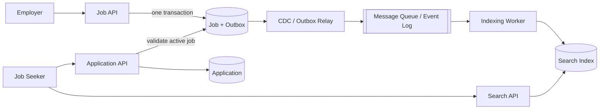

> 配套实验：[打开 Job Board Search Lab](https://lab.zichaoyang.com/system-design/job-board/)。从 PostgreSQL-only 开始，再提高常见关键词命中率和 Search QPS，观察 Elasticsearch / OpenSearch 什么时候才需要作为独立 component 出现。

Job Board 的产品功能很多：发布职位、搜索、申请、简历、通知、推荐、招聘流程。但系统设计面试不是功能清单比赛。如果把所有模块都画出来，反而看不出这道题最独特的技术问题。

这道题应该抓住一条主线：

> **Job Board 是一个搜索快速变化职位集合的系统。核心是低延迟搜索，以及数据库和搜索索引之间的 freshness。**

求职者带着明确意图进入系统，例如：

```text
"Backend Engineer" + location = Seattle + salary >= 150k
```

系统需要先按文字找到候选职位，再应用 location、salary 等结构化条件，最后只返回仍然有效的职位。

推荐系统解决“用户没有明确 query 时展示什么”。这里用户已经提供 query 和 filters，所以推荐不属于第一版核心设计。

## 题目的核心特征

发布职位本身只是一次普通写入，提交申请也是一次事务写入。这道题真正区别于一般 CRUD 系统的地方是：

1. 用户不是按 `job_id` 查找，而是输入自然语言；
2. 一次查询同时包含全文匹配和结构化过滤；
3. 职位会被频繁创建、修改、关闭和过期；
4. 搜索索引可以短暂落后，但不能让用户成功申请已经关闭的职位。

因此，面试中的主要 deep dive 应该是：

```text
Search API
  -> full-text retrieval
  -> metadata filters
  -> relevance ranking
  -> fresh and active results
```

## Requirements

### Functional Requirements

1. **Employers can create and manage job postings.** They can publish, edit, pause, and close a posting.
2. **Job seekers can search for jobs by keyword.** The query matches searchable text such as the title and description.
3. **Job seekers can filter search results.** Location and salary are representative examples; other attributes can be treated as metadata.
4. **Search returns only active jobs.** Closed, paused, or expired postings must be excluded.
5. **Job seekers can view job details.**
6. **Job seekers can apply for an active job.** The system validates the current job status and records the application.
7. **Search exposes at most the top 1,000 ranked matches.** Results are still returned in small pages; arbitrary deep pagination and an exact count beyond this result window are not required.

> “For the first version, I’ll focus on job posting, keyword search with structured filters, job details, and application submission.”

### Non-Functional Requirements

1. **Low latency:** Search should complete within 500ms at p95.
2. **High availability:** Search should remain available when indexing workers are delayed or temporarily unavailable.
3. **Search freshness:** On the PostgreSQL primary, a committed job creation, update, or closure must be visible to a new search statement. If a replica or derived Search Index is introduced later, propagation lag should stay below about 60 seconds.
4. **Scalability:** The search path should scale horizontally as the number of jobs and queries grows.
5. **Application correctness:** An accepted application must not be lost or duplicated.
6. **Clear consistency boundary:** The search index may be eventually consistent, but application submission must validate the job against the source of truth.
7. **Security:** Candidate data must be encrypted and accessible only to authorized parties.

### Out of Scope

- Personalized recommendations;
- A complete recruiter-side Applicant Tracking System;
- Messaging and interview scheduling;
- LLM-based resume matching;
- Sponsored-job ranking.

把 scope 收窄以后，后面的每个组件都应该能对应到某个 requirement。不能解释用途的组件就不应该先画。

## 先用 API 定义访问模式

不要从“我要几张表”开始。先看系统需要支持哪些访问模式，再推导数据模型和索引。

| API | 访问模式 | 需要的核心数据 |
|---|---|---|
| `POST /jobs` | 创建职位 | Job |
| `POST /jobs/{jobId}/update` | 更新或关闭职位 | Job + version |
| `GET /jobs/search` | 按文字和 metadata 搜索 | Job + search indexes |
| `GET /jobs/{jobId}` | 按 ID 查看最新职位 | Job |
| `POST /jobs/{jobId}/applications` | 校验职位并创建申请 | Job + Application |

这里已经能看到两种完全不同的读路径：

- `GET /jobs/{jobId}` 是精确主键读取；
- `GET /jobs/search` 是跨大量职位的全文检索。

这两种访问模式不应该被强行塞进同一种索引。

### Search API

```http
GET /v1/jobs/search
  ?q=backend+engineer
  &location=Seattle
  &salaryMin=150000
  &cursor=...
  &limit=20
```

对应的处理过程是：

```text
q              -> full-text retrieval
location       -> metadata filter
salaryMin      -> numeric range filter
cursor + limit -> stable pagination, small page size
```

`limit` 是单页大小，例如 20；1,000 是用户最多可以翻到的 ranked-result window，不是一次返回 1,000 条。到达第 1,000 条后不再提供 next cursor。API 可以返回 `1,000+`，不必为了展示一个精确数字而扫描并统计全部 matches。

### Create or Update Job API

```http
POST /v1/jobs
POST /v1/jobs/{jobId}/update
```

这里统一把 state-changing operation 表达为 `POST`；关闭职位可以表示为把 `status` 更新为 `closed`。这两个 API 更新 source of truth，并产生一个 `JobChanged` event，不需要同步等待整个搜索集群更新完成。

### Application API

```http
POST /v1/jobs/{jobId}/applications
Idempotency-Key: application-attempt-123
```

这个 API 必须读取最新 Job 状态，并只在职位仍然 active 时写入 Application。`Idempotency-Key` 或唯一约束负责处理客户端超时重试。

API 到这里先推导出 Job、Company 和 Application 三个持久化对象。第一版搜索直接读取 Job，不需要额外的 SearchDocument。

## 最小 Data Model

这里用少量标记突出真正影响设计的字段：

```text
PK       = primary key，唯一标识一条业务记录
FK       = foreign key，连接另一个核心对象
UNIQUE   = 业务唯一性或幂等约束
INDEX    = 支持一个高频查询条件
ACCESS   = 某条重要 API 的主要查询键
CRITICAL = 决定正确性或索引同步的字段
```

### Job：职位的权威状态

```text
Job {
  job_id                            [PK]
  company_id                        [FK, ACCESS: employer's jobs]
  title
  description
  metadata { location_id, salary_range, ... } [SEARCH FILTERS]
  status                            [CRITICAL: can this job accept applications?]
  updated_at
  version                           [CRITICAL: reject stale index updates]
}
```

`metadata` 是 high-level 分组，不代表把所有字段塞进一块无法索引的 JSON。像 `location_id`、`salary_range` 这样出现在高频 filter 中的属性，应保存为 typed columns；低频展示属性才适合留在一般 metadata 中。

`job_id` 是连接 Job API 和 Application 的稳定身份。`status` 决定职位能否申请；`version` 在第一版用于 optimistic update，未来也可以阻止旧索引事件覆盖新状态。

### Company：把公司名解析成稳定 ID

```text
Company {
  company_id       [PK]
  normalized_name  [INDEX, ACCESS: resolve company filter]
  display_name
}
```

用户输入 company name 时，先通过 `normalized_name` 找到候选 `company_id`，再搜索 Job。公司名本身未必全局唯一，所以稳定身份仍然是 `company_id`，不是展示名称。

### Application：申请事实

```text
Application {
  application_id   [PK]
  job_id           [FK -> Job.job_id, ACCESS: applications for a job]
  candidate_id     [FK, ACCESS: a candidate's application history]
  resume_reference
  status
  idempotency_key  [UNIQUE: retry protection]
  created_at
}

Optional business constraint:
  UNIQUE(candidate_id, job_id)
  // Use when one candidate may apply to a job only once.
```

`application_id` 标识一条已经接受的申请；`idempotency_key` 处理同一次请求的网络重试。如果产品规定同一候选人只能申请同一职位一次，再增加 `(candidate_id, job_id)` 的业务唯一约束。两者含义不同，不应混为一谈。

最关键的字段可以压缩成六个：

| Field | 为什么关键 |
|---|---|
| `Job.job_id` | 贯穿写入、详情读取和申请关联 |
| `Job.company_id` | 支持招聘方查看自己的职位，但不是搜索分片键 |
| `Company.normalized_name` | 把用户输入的公司名解析为候选 `company_id` |
| `Job.status` | Application API 的最终有效性判断 |
| `Job.version` | 支持并发更新；未来也可阻止乱序索引事件回滚状态 |
| `Application.idempotency_key` | 阻止超时重试产生重复申请 |

三个持久化模型分别服务三个边界：

```text
Job         -> searchable job data and current business truth
Company     -> stable company identity and name lookup
Application -> durable application record
```

这就是 API 和 Data Model 的对应关系。没有被访问模式需要的字段，不必在 high-level design 中展开。

## 第一版：PostgreSQL 就可以工作

第一版不需要 SearchDocument，也不需要 Elasticsearch。Job、Company 和 Application 都放在 PostgreSQL；Search API 直接查询 Job。

这一节保留 Job Board 面试需要的结论。B-tree、GIN、GiST、partial index、ranking 和 pagination 的完整学习版见：[PostgreSQL 搜索与索引](/blog/system-design/postgresql/search-and-indexing/)。

先把一次搜索抽象出来：

```text
active jobs
  AND keyword matches title/description
  AND location_id matches, if provided
  AND salary_range overlaps, if provided
  AND company_id matches, if provided
ORDER BY text relevance, freshness
LIMIT 20
```

每个条件使用不同的索引能力，但它们仍可以留在同一个数据库中。

### 四种搜索条件怎么 Index

| 搜索条件 | 数据表达 | 第一版索引 |
|---|---|---|
| Keyword | weighted `tsvector(title, description)` | GIN full-text index |
| Location | normalized `location_id` | B-tree；半径搜索以后再考虑 geo/GiST |
| Company name | `Company.normalized_name -> company_id` | name 上 B-tree，Job 上 `company_id` B-tree |
| Salary range | typed range，例如 `[150k, 200k]` | GiST range index for overlap/containment |

还有一个很实用的优化：绝大多数求职搜索只关心 active jobs，因此这些搜索索引可以做成 partial indexes，只包含 `status = active` 的行。这样 closed 和 expired jobs 不占用在线搜索索引。

概念上可能得到这些索引：

```text
job_id                              -> primary-key B-tree
Company.normalized_name             -> B-tree
Job(company_id, updated_at DESC)    -> B-tree, active jobs only
Job(location_id, updated_at DESC)   -> B-tree, active jobs only
Job(salary_range)                   -> GiST, active jobs only
Job(search_vector)                  -> GIN, active jobs only
```

这里不是让所有 query 都强制使用全部索引。PostgreSQL planner 会根据条件的 selectivity 选择一个索引，也可以把多个索引的 row locations 做成 bitmap，再用 `BitmapAnd` 合并。

例如：

```text
GIN(keyword) result bitmap
AND B-tree(location_id) result bitmap
AND GiST(salary_range) result bitmap
-> fetch matching Job rows
-> calculate text score
-> sort top 20
```

这就是为什么第一版不需要单独的搜索文档：全文 token、typed filters 和业务状态都可以由 Job 自己的 columns 和 indexes 提供。

### Index 不是免费的

每增加一个索引，读路径多了一个选择，但写路径也多了一份工作：Job 的 `INSERT`、相关字段的 `UPDATE` 和 `DELETE` 都要同步维护索引。索引还会占用磁盘和 buffer cache，并带来 vacuum、bloat、statistics 和 rebuild 的运维成本。GIN 尤其需要注意：一条 Job 会产生很多 token entries；它可以用 pending list 缓冲更新，但 pending list 过大又会拖慢搜索或造成 cleanup spike。

因此不要给每个 metadata field 都加索引。只为稳定、高频、能显著缩小候选集的访问模式建索引，再用真实 query plan 验证收益是否大于 write amplification。

`status` 很关键，但通常不应该只建一个 `INDEX(status)`。它的取值很少，而且 active 往往占大多数，单独扫描它可能没有足够 selectivity。更实用的做法是让在线搜索需要的 GIN、B-tree 和 GiST 都成为 active-only partial indexes：

```text
GIN(search_vector) WHERE status = 'active'
B-tree(location_id) WHERE status = 'active'
GiST(salary_range) WHERE status = 'active'
```

职位从 active 变为 closed 时，PostgreSQL 会在同一个事务里更新这些 partial indexes。代价是关闭职位也成为一次 index write；收益是积累多年的 closed jobs 不再扩大在线搜索的 working set。如果表里几乎所有职位都 active，这个收益会变小，所以仍要根据数据分布决定。

### 第一版的 Freshness 怎么保证

第一版只有 PostgreSQL 一份 searchable data。表和索引不是异步双写：PostgreSQL 在修改 Job 的同一个事务中维护相关索引。事务 `COMMIT` 后，一个新的 Read Committed statement 就可以通过更新后的索引看到新职位或新状态。因此第一版没有“等待 indexing worker 60 秒”的 freshness lag。

例如关闭 `job_123`：

```text
UPDATE Job SET status = 'closed' WHERE job_id = 'job_123'
-> update the row and active-only index entries
-> COMMIT
-> new searches no longer return job_123
```

一个已经开始的旧 snapshot 仍可能短暂看到旧版本，这是 MVCC 语义，不是索引落后。Application API 始终开启新事务并按 `job_id` 在 primary 上重新校验 `status = active`，所以搜索结果即使在边界时刻过期，也不能成功提交申请。

只有把 Search API 放到 read replica，或未来引入独立 Search Index，才会产生可观测的异步 lag。那时应监控 replica replay lag 或 event-to-index lag；关闭职位和申请校验等 correctness-sensitive 读取仍走 primary，搜索的 lag SLO 才是前面提到的约 60 秒。

### Separate Index 还是 Composite Index

如果 filters 可以任意组合，先使用几个独立索引，让 PostgreSQL 按需组合。不要为每一种组合创建：

```text
(location, salary)
(location, company)
(company, salary)
(location, company, salary)
...
```

这种做法会造成 index explosion，每次 Job 更新也要维护所有索引。

只有某个访问模式非常稳定、非常高频时，才建立 composite index。例如招聘方总是查看自己 active jobs 并按时间倒序，那么 `(company_id, updated_at DESC)` 的 partial index 很合理。

Multicolumn B-tree 最依赖 leading columns：`(company_id, updated_at)` 很适合先限定 company 的查询，却不能自动成为 location 搜索的好索引。因此 composite index 必须来自真实 query pattern，而不是把所有字段堆进去。

### Keyword Search 的成本在哪里

GIN 可以快速找到包含 keyword 的候选 Job，但它不能免费完成最终 ranking。

```text
rare query:     "rust compiler" -> 500 candidates -> cheap top 20
common query:   "engineer"      -> 500,000 candidates -> expensive scoring/sort
```

真正的边界通常不是表里有多少行，而是一个 query 产生多少 candidates。若 GIN 找到几十万条记录，PostgreSQL 还要计算 relevance、读取其他字段、应用 filters 并找 top 20；这时 p95/p99 会先变差。

可以先做这些限制：

- Title 权重大于 description，减少无意义 match；
- 强制 `status = active`，使用 partial GIN；
- 对 query 长度、top-1,000 结果窗口和执行时间设上限；
- 使用 cursor + `LIMIT 20`，不允许任意深的 offset；
- 维护好 statistics，使用 `EXPLAIN (ANALYZE, BUFFERS)` 检查实际 candidate rows 和 I/O；
- 只给真正高频的 query pattern 增加 composite index。

### Top 1,000 会不会让 Latency 好很多

会有帮助，但它限制的是**结果窗口**，不是自动把所有 query 的检索成本都限制在 1,000 rows。

它明确改善了三件事：

- 网络和序列化有硬上限，而且每次仍只返回 20 条；
- 禁止任意 deep pagination，不会为了第十万页不断跳过前面的结果；
- 不要求对全部 matches 做精确 `COUNT(*)`，可以显示 `1,000+ results`。

如果排序与 B-tree 顺序一致，例如 `ORDER BY updated_at DESC LIMIT 20`，PostgreSQL 可能从索引头部读取足够的行后立即停止，这时 `LIMIT` 的收益很大。

但全文 relevance ranking 不一定如此。GIN 先找到匹配 token 的 candidates，却不按动态的 `ts_rank` 分数排序。若 `engineer` 匹配 500,000 个 active jobs，数据库仍可能要对大量 candidates 过滤和打分。使用 keyset cursor 时，每一页的 top-N sort 可以只保留 cursor 之后最好的 20 个，但为了判断哪些 candidates 排在 cursor 之后，动态分数仍可能要计算 500,000 次。

所以第一版的正确表达是：

```text
retrieve and filter candidates
-> calculate ranking and select the next 20 after the cursor
-> return 20 results
-> stop issuing cursors when returned_count reaches 1,000
```

Top 1,000 是很好的 bounded-work 产品约束，特别能控制用户最多发起多少次翻页请求以及 count 的成本；但它对单页 latency 的改善可能很小，common keyword 产生的 candidate explosion 仍然是 PostgreSQL 的真正边界。不能在 ranking 前随便只截前 1,000 个 candidates，除非产品愿意接受 relevance 下降。

### Company Name 和 Location 的边界

Company filter 最好分两步：

```text
"OpenAI" -> resolve Company.company_id -> filter Job.company_id
```

Exact normalized name 使用 B-tree 就够了。只有产品要求 typo/fuzzy company lookup，例如 `Open AI`、`OpenAl`，才在 Company name 上考虑 `pg_trgm` 的 GIN/GiST index；不要让所有 Job description 承担 company-name fuzzy search。

Location 第一版也保持简单：把城市或地区规范化为 `location_id`，使用 B-tree equality filter。只有需求明确要求 “within 25 miles” 时，才加入坐标和 geo index。先支持精确 location 不代表架构错误，而是主动限制 scope。

### Salary Range 为什么适合 Range Index

若 Job 有一个 salary range，用户也给出期望范围，语义通常是两个区间是否重叠：

```text
job salary:       [140k, 180k]
requested salary: [160k, 220k]
result: overlap
```

分别给 `salary_min` 和 `salary_max` 建 B-tree 也能工作，但两个 inequality conditions 的组合不一定足够 selective。PostgreSQL range type 加 GiST index 能直接表达 overlap/containment，也让 query 语义更清楚。

如果产品只支持 `salary_max >= requested_min` 这种单边条件，一个普通 B-tree 就可能足够。不要为了展示 GiST 而改变产品语义。

## PostgreSQL 的 Latency 与能力边界（容量估算）

PostgreSQL 没有一个固定的“超过 10M 行就不能搜索”的边界。真正决定 latency 的是：

```text
query selectivity
candidate count before ranking
index and hot-data working set
concurrent search QPS
sorts that spill to disk
CPU / I/O / connection-pool saturation
```

面试中可以使用下面的工程预算。它们是 target，不是 PostgreSQL 的性能承诺：

| 路径 | 健康系统中的目标量级 |
|---|---|
| Primary-key / selective exact filter | DB p95 在几十毫秒内 |
| Keyword + 1–3 个 filters + top 20 | DB p95 约 50–150ms |
| 完整 Search API | p95 低于 300–500ms |

如果 DB query p95 在 100ms 左右，API 还有时间完成连接、鉴权、序列化和网络传输。若单次 DB search 已接近 400ms，整个 API 很难稳定满足 500ms SLO。

一个实用但非硬性的规模感觉：

- 几十万到几百万 active jobs、几百 search QPS：PostgreSQL 通常是合理默认；
- 低千万级 active jobs、上千 search QPS：仍可能可行，但必须用真实 query distribution 压测；
- 行数不大但 common keyword 产生巨大候选集：也可能比上面更早触碰边界；
- 行数很大但 filters 高度 selective：PostgreSQL 可能继续表现很好。

不要只看平均 latency。判断边界时重点看：

```text
p95 / p99 query latency
rows scanned or scored per 20 returned rows
shared-buffer hit vs disk reads
temporary-file sort spill
CPU and IOPS at peak
connection-pool wait time
replica lag
```

`EXPLAIN (ANALYZE, BUFFERS)` 如果反复显示下面的问题，就说明索引或架构正在接近边界：

- 对 active-job corpus 做 sequential scan；
- 先取出几十万 candidates，再做 expensive sort；
- planner 对组合 filters 的 row estimate 严重失真；
- 排序写入 temporary files；
- 为了搜索读取大量 heap pages，挤压事务 workload。

## PostgreSQL 的扩容顺序

不要从单实例直接跳到 Elasticsearch。可以按这个顺序演进：

1. **Fix data representation:** 高频 filters 使用 typed columns，而不是无索引的大 JSON；
2. **Add focused indexes:** GIN、B-tree、GiST 和 active-only partial indexes；
3. **Fix query shape:** cursor、small limit、bounded query、避免深 offset；
4. **Tune and measure:** statistics、`EXPLAIN ANALYZE`、connection pool、内存和 slow-query logging；
5. **Scale reads:** 把允许轻微 replication lag 的 Search API 路由到 read replicas；
6. **Separate workload:** 当 search 已经与职位写入、申请事务争抢 CPU/I/O，再引入独立 Search Index。

Read replica 增加读取容量，但不会减少单个 bad query 的成本；所有搜索索引也仍要复制和维护。因此 replica 是 scale-out 工具，不是 query-design 的替代品。

## 什么时候需要独立 Search Index

出现以下任一主导条件时，才引入 Elasticsearch、OpenSearch、Solr 或其他专用搜索系统：

- 正确索引和 replica 之后，peak p95 仍持续超过 latency SLO；
- common query 需要对几十万 candidates 做复杂 scoring；
- search QPS 已经明显影响 Job/Application transaction latency；
- 需要 typo tolerance、复杂 synonyms、highlight、facet aggregation 或多字段 relevance tuning；
- 搜索需要独立扩容、独立发布 analyzer，或独立做 index rebuild。

到这一步才引入派生模型：

```text
SearchDocument {
  job_id                                      [DOCUMENT ID -> Job.job_id]
  searchable_text { title, description }      [INVERTED INDEX]
  filterable_metadata { location, salary, ... } [SEARCH FILTERS]
  status
  version                                     [LAST INDEXED JOB VERSION]
}
```

SearchDocument 不是第一版的表，也不是新的 source of truth。它只是 Job 的 searchable copy。使用相同的 `job_id` 作为 document ID，让重复事件变成 upsert；`version` 防止旧事件覆盖新状态。

产品名仍然不是重点。独立 Search Index 提供的是一份可以与 PostgreSQL 分开扩容、分开重建的倒排索引：

```text
backend  -> [job_12, job_27, job_91]
engineer -> [job_12, job_34, job_91]
```

代价是系统从一份数据变成 source of truth + derived index，后面才需要讨论 outbox 和 freshness。

### 用 Cache Miss 路径决定要不要 Elasticsearch

Cache 不能替代搜索后端的能力判断。是否引入 Elasticsearch，要看 **cache miss / cold query**，而不是看一个被热门 query 美化过的平均 latency：

1. 如果 PostgreSQL 在没有外部 result cache 的压测中，keyword + filters 的 peak p95 仍满足 SLO，而且不需要 typo、synonyms、facets，就不需要 Elasticsearch；
2. 如果一条 common keyword 在 filters 后仍留下几十万 candidates，单次 miss 已经很慢，那么即使 cache hit rate 很高，也应该解决底层 retrieval 与 ranking；
3. 如果功能明确需要复杂 relevance、typo tolerance、highlight 或 facet aggregation，引入 Search Service 的理由来自功能边界，不来自 QPS；
4. 如果单次查询不贵，但 `backend_search_qps = incoming_qps × (1 - measured_cache_hit_rate)` 已经让 PostgreSQL 与事务路径争抢 CPU/I/O，才从 workload isolation 和独立 scale-out 角度引入 Search Service。

因此这里没有“达到 10M rows 就必须迁移”的固定门槛。真正的边界是：

```text
cold-query latency
+ candidates scored per miss
+ backend miss QPS
+ required search features
+ workload isolation
```

## Result Cache 不是默认 Layer

Job Board 的 query space 很大：keyword、location、salary、company、sort 和 cursor 都会改变 cache key。大量 long-tail query 只出现一次，把 Redis 永久画在 Search API 后面通常没有意义。

外部 Cache 主要服务两个有证据的场景。

### 场景一：热门 First-page Result Cache

只有真实流量表明某些 normalized query 被大量重复时，才缓存它们的第一屏结果：

```text
key = normalized(keyword, location, salary bucket, company, sort, first page)
value = Top 20 job IDs + ranking metadata
TTL = 30 seconds
```

不要尝试在一个 Job 更新时删除所有可能包含它的 query keys；一个职位可能命中成千上万个 keyword/filter 组合。更简单的策略是短 TTL、容量上限和 LRU eviction。缓存中的 closed Job 可以短暂出现在列表中，但 Application API 仍回 PostgreSQL 校验 `status = active`。

一个具体容量例子：

```text
incoming Search QPS                 = 5,000
measured popular-result hit rate    = 40%
cache hits                          = 2,000 QPS
backend Search Service QPS          = 3,000 QPS
primary shards touched per request  = 6
cluster shard operations            = 3,000 × 6 = 18,000 / second
```

如果这些 shard copies 大致分布在 6 个 data nodes，每个节点在计算 headroom、replica、fetch、merge 和 concurrent indexing 之前，平均承担约 3,000 shard operations/s。这个数字不是厂商 benchmark，而是一个可以拿真实 shard latency 验证的容量模型。

30 秒 TTL 也不是免费优化。如果 Search Index 自身约落后 1 秒，那么 cache hit 的最坏可见 stale 约为：

```text
visible staleness <= index lag + cache TTL
                  ≈ 1s + 30s
                  ≈ 31s
```

只有产品接受这个 freshness，40% hit 才是真正的收益，而不是隐藏要求冲突。

### 场景二：Search Session Cache

Search Session 解决的不是热门 query QPS，而是稳定分页。第一次搜索完成后，可以短暂 materialize 一个 bounded result window：

```text
search_session_id -> {
  ranking_time,
  top_1_000_job_ids,
  expires_at = now + 5 minutes
}
```

后续 cursor pages 从同一个集合取数据，因此数据库没有变化时结果稳定；即使期间有新 Job，也不会插进用户当前翻页过程。代价是 session storage 和有意接受的结果陈旧。第一屏仍然必须执行真实 search，所以 Search Session Cache 不能用来证明 PostgreSQL 或 Elasticsearch 的 cold path 足够快。

### Elasticsearch 自带 Cache，但不是完整 Result Cache

Elasticsearch 的 filesystem cache 会保存热 index pages；filter context 中高频结构化 filters 也可能进入 node query cache。但 shard request cache 默认只缓存 `size = 0` 的 totals、aggregations 和 suggestions，不会默认缓存带 Top 20 hits 的完整搜索响应。因此文章中的 Result Cache 指 Search API 明确管理的 Redis 类外部 cache，不要把几种 cache 混成一个 component。

最后的原则是：

> **没有实测重复性，就不加 Result Cache；需要稳定翻页，就 cache bounded search session；要不要 Elasticsearch，永远看 cache miss 路径。**

## Search Ranking：保持传统和可解释

这不是推荐系统。第一版 ranking 只需要回答：“哪些结果最符合当前 query？”

```text
final score =
    text relevance
  + bounded freshness boost
  + optional quality adjustment
```

PostgreSQL core 并没有内置 BM25。第一版直接使用内置的 `ts_rank` 或 `ts_rank_cd`，并通过 `setweight` 让 title match 高于 description match；如果未来明确需要 BM25，再引入 PostgreSQL extension 或独立 Search Index。Freshness 只能作为有限加分，否则一条最新但无关的职位会超过真正相关的职位。

搜索结果必须强制过滤：

```text
status = active
expires_at > now, if expiration exists
location matches, if requested
salary overlaps requested range, if requested
```

用户画像、历史点击和 embedding reranking 都属于后续扩展，不进入主设计。

## Indexing Pipeline：真正 tricky 的部分

Job 更新写入 PostgreSQL，而搜索读取 Search Index。现在系统有两份数据，难点从“如何搜索”变成“如何保持派生索引足够新”。

先把三个容易混在一起的概念分开：

- **CDC（Change Data Capture）**：捕获数据库中已经提交的变化。以 PostgreSQL 为例，CDC connector 通常持续读取 WAL，把 `INSERT`、`UPDATE` 和 `DELETE` 变成有顺序的 change events。
- **Outbox**：保证业务状态和事件一起提交的模式。Job API 在同一个 PostgreSQL transaction 中更新 Job，并插入一条 outbox event。
- **Message Queue / Event Log**：传输和缓冲事件，例如 Kafka。它让 Indexer 可以独立消费、重试和追赶，但它本身既不负责捕获数据库变化，也不是 Job source of truth。

因此 CDC 和 Message Queue 不是二选一。一个常见组合是：CDC 负责从 PostgreSQL 可靠地拿到变化，Kafka 负责保存和传输变化，Indexer 负责把变化转换成 SearchDocument。

不要这样做：

```text
1. write PostgreSQL
2. write Search Index
3. return success
```

如果第 1 步成功、第 2 步失败，两个系统永久分叉。这是一个脆弱的同步双写。

更可靠的写路径是：



Job 和 outbox event 在同一个数据库事务中提交。CDC / Relay 只发布已经 commit 的 event；Queue 缓冲事件；Indexer 异步生成 SearchDocument，并以 `job_id` 作为 document ID 执行 upsert。

Message Queue 不是任何规模都必须有。第一版可以让一个 background worker 轮询 outbox table，或者让 CDC connector 直接交给 Indexer。出现下面任一需求时，再加入 Kafka 一类的 durable log 会更自然：

1. Search Service 暂时不可用时，更新不能丢；
2. 更新存在 burst，需要削峰并让 Indexer 按自己的速度追赶；
3. 除 Search Index 外，还有 analytics、notification 等多个 consumers；
4. 需要保留事件位置，以便 replay、repair 或 rebuild。

对这道题，我会画出生产版主路径：

```text
PostgreSQL -> Outbox / CDC -> Queue -> Indexer -> Elasticsearch/OpenSearch
```

如果面试官要求第一版极简方案，则先省略 Queue，但不省略“先提交 PostgreSQL，再异步更新派生索引”这个一致性边界。

这条 pipeline 需要三个简单规则：

1. **Idempotent:** 重放同一个事件不会创建重复 SearchDocument；
2. **Versioned:** 只有更高版本才能覆盖当前 document；
3. **Repairable:** 可以从 Job 数据重新构建整个 Search Index。

例如 Job 先从 version 8 更新到 version 9，事件却乱序到达：

```text
receive version 9 -> index version 9
receive version 8 -> ignore stale update
```

这比展开所有搜索字段更值得在面试中 deep dive，因为它直接决定 closed job 是否会错误地重新出现。

## Search Freshness 与申请正确性不是同一个要求

假设发生下面的竞态：

```text
10:00:00  employer closes job_123 in PostgreSQL
10:00:02  user sees an old search result containing job_123
10:00:20  indexing worker removes job_123
```

我们允许搜索索引在 20 秒内 eventual consistency，但不能允许用户成功申请这个职位。

Application API 的逻辑应该是：

```text
1. read current Job from PostgreSQL
2. verify status == active
3. create Application with idempotency protection
4. commit
```

因此：

> Search Index 决定“找到哪些候选职位”，PostgreSQL 决定“这个职位现在是否仍然有效”。

这种一致性边界比要求两个系统时刻完全同步更现实，也更清晰。

## 关键取舍

| 选择 | 好处 | 代价 |
|---|---|---|
| PostgreSQL Full Text Search | 架构简单，一份数据 | 搜索能力和独立扩展有限 |
| 独立 Search Index | 全文检索、过滤和扩展能力强 | 引入 eventual consistency 与 indexing complexity |
| 同步双写 | 表面上更新立即可见 | 部分失败会让 DB 与 Index 分叉 |
| Outbox / CDC | 事件可以重放 | 搜索存在可量化的 index lag |
| Message Queue / Event Log | 缓冲、重试、replay、多个 consumers | 多一个需要运维和监控的 component |
| 按 company 分片 | 单公司管理查询直接 | 候选人跨公司搜索 fan-out 严重 |
| 按 job ID 分布 | 数据更均匀 | 搜索通常需要查询多个 shards |

最重要的 trade-off 是：

> 为了获得独立、低延迟的搜索能力，系统接受一份 eventually consistent 的派生索引；正确性要求更高的申请路径仍然回到 source of truth。

## 面试表达：用一条主线讲完整

开场先锁定 scope：

> “I’ll focus on job posting, keyword search with structured filters, job details, and application submission. Personalized recommendations are out of scope.”

定义题目核心：

> “The defining characteristic of a job board is low-latency search over a large and rapidly changing corpus of job postings.”

用 API 推导模型：

> “The APIs first give us three persisted models: Job, Company, and Application. I would introduce SearchDocument only if we later separate the search workload from PostgreSQL.”

解释为什么不是直接上 Elasticsearch：

> “I would start with PostgreSQL full-text search. I would introduce a dedicated inverted index only when scale or search features require independent scaling.”

解释最关键的一致性边界：

> “The search index may be eventually consistent, but the Application Service must revalidate the job against PostgreSQL before accepting an application.”

一套 45 分钟结构：

1. Requirements 和 out of scope；
2. API 与访问模式；
3. Job、Company、Application 三个持久化模型；
4. PostgreSQL 第一版与四类索引；
5. 用 latency 和 query-plan evidence 决定是否引入 SearchDocument；
6. Outbox/CDC indexing pipeline；
7. Closed-job 竞态与 Application correctness；
8. 最后总结容量边界和 trade-offs。

如果面试官停留在第一版，就 deep dive PostgreSQL 的 query shape、candidate count 和 index plan；只有规模数据证明需要拆分时，再进入 Indexing Pipeline。这样架构演进由证据推动，而不是由技术名词推动。

## 追问与知识点：Top 1,000 到底怎么工作

先区分两个数字：

```text
page size = 20                 // 一次 API 返回多少条
result window = top 1,000      // 用户最多能翻到第几条
```

Top 1,000 是产品和 API 的边界，不是一条“让数据库只检查 1,000 行”的指令。到达第 1,000 条后，API 不再返回 next cursor，即使后面还有 matches，也只显示 `1,000+ results`。

### 问题一：是不是先把全部结果搜出来，再截取 Top 1,000？

不一定，取决于 `ORDER BY` 是否能直接利用索引。

**情况 A：排序顺序已经在 B-tree 中。**

```text
ORDER BY updated_at DESC, job_id DESC
LIMIT 20
```

如果有匹配这个顺序的 index，PostgreSQL 可以沿着 index 读取，找到足够的 qualifying rows 后停止，不必读取剩余结果。这里是真正的 early termination。若中间还有不能由该 index 完成的 filters，它可能需要扫描超过 20 个 entries 才能找到 20 个结果，但仍有机会提前停止。

**情况 B：按照动态全文相关度排序。**

```text
GIN finds M matching row IDs
-> apply metadata filters
-> calculate ts_rank for the remaining candidates
-> keep the best K results
```

GIN 能快速回答“哪些文档包含这些词”，但它不是按照当前 query 的 `ts_rank` 排序。为了得到**精确**的 Top K，PostgreSQL 通常仍要检查和打分所有 `M` 个候选，因为任何一个尚未打分的 candidate 都可能进入 Top K。

不过，它不必把全部 `M` 个结果完整排序并保存在内存里。Top-N sort 可以只维护一个大小为 `K` 的 heap：

```text
candidate retrieval and scoring: approximately O(M)
top-K maintenance:              approximately O(M log K)
sort memory:                    approximately O(K)
```

若使用 keyset cursor，每次请求的 `K` 通常只是 page size，也就是 20；若选择一次预计算并缓存完整 result window，`K` 才是 1,000。两种实现都没有消除对 `M` 个 candidates 的动态打分。具体执行计划仍要通过 `EXPLAIN (ANALYZE, BUFFERS)` 验证。

PostgreSQL 还有 `gin_fuzzy_search_limit`，可以从巨大结果集中返回一个随机子集，但这是 approximate protection，不是稳定、精确的产品 Top 1,000。第一版不要把两者混为一谈。

### 问题二：Top 1,000 为什么能帮助 Latency？

它主要限制 worst-case work，而不一定显著改善第一页：

- 第一页本来就只需要 Top 20；增加“最多翻到 1,000”通常不会让第一页突然变快；
- 它禁止第十万页这样的 deep pagination，把一次搜索最多限制为 50 个 20-row pages；
- 它允许返回 `1,000+`，避免为了精确 total count 扫描全部 matches；
- 它限制网络、序列化、缓存和客户端处理的结果规模；
- 当排序与 B-tree index 一致时，`LIMIT` 可以让数据库真正提前停止。

因此 Top 1,000 最明显的价值是控制 tail latency 和系统最坏负载。对于 common keyword 导致的 candidate explosion，它不能替代更好的 query、filter、ranking 或独立搜索引擎。

### 问题三：翻页时怎么在第 1,000 条停止？

不要一次计算并发送 1,000 条，也不要允许无限 `OFFSET`。cursor 至少携带完整排序位置和已经返回的数量：

```text
cursor {
  last_score
  last_updated_at
  last_job_id
  returned_count
  ranking_time
}
```

每次只按 cursor 继续读取下一页 20 条。当 `returned_count` 达到 1,000，服务端不再签发 next cursor：

```text
returned_count < 1,000  -> return next_cursor
returned_count = 1,000  -> next_cursor = null
```

这叫 keyset pagination。它限制用户能够访问的结果深度，但不声称数据库只产生了 1,000 个 candidates。

系统也可以选择把同一次搜索的 Top 1,000 `job_id` 缓存成一个短期 search session。这样第一次请求承担检索和 ranking 成本，后续翻页只是读取缓存，结果也更稳定；代价是额外的缓存空间、session 生命周期和 freshness 处理。第一版通常先使用无状态的 signed cursor，只有压测证明重复 ranking 太贵时才 materialize result window。

### 问题四：数据库不变时，Top 1,000 每次是否完全相同？

只有满足下面四个条件，才可以把结果当作 deterministic：

1. 使用相同的 database snapshot；
2. query、filters 和 ranking formula 相同；
3. ranking 不依赖不断变化的 `now()`、random value 或外部状态；
4. `ORDER BY` 形成唯一的 total order。

只写下面这句还不够稳定：

```text
ORDER BY text_score DESC
```

很多职位可能拥有相同分数。SQL 不保证这些 ties 的内部顺序；不同 query plan 或 parallel execution 都可能改变谁刚好位于第 1,000 名。需要增加稳定的 tie-breaker：

```text
ORDER BY text_score DESC,
         updated_at DESC,
         job_id DESC
```

`job_id` 唯一，因此最终形成 total order。对于完全不变的数据、固定 ranking time 和相同 snapshot，结果及顺序就可以重复。

如果两次请求之间有新职位发布、职位关闭，或者 freshness score 直接使用当前 `now()`，结果即使查询文字相同也会移动。Keyset cursor 能减少重复和跳项，但不能冻结一个持续变化的数据库。若产品要求用户翻十页仍看到严格相同的集合，就需要固定 `ranking_time`，并保存 search snapshot 或缓存这一轮 Top 1,000 job IDs；普通 Job Board 通常接受结果随新职位轻微变化。

### 面试中的一句话回答

> “Top 1,000 is a result-window limit, not necessarily a candidate-scan limit. PostgreSQL can stop early when a B-tree provides the requested order; with dynamic full-text ranking, it may still score every match while keeping only the best K in memory. I make the result deterministic with a unique tie-breaker such as job_id, and stop pagination by not issuing a cursor beyond rank 1,000.”

## 参考资料

- [PostgreSQL: Introduction to Indexes](https://www.postgresql.org/docs/current/indexes-intro.html)
- [PostgreSQL: Indexes and ORDER BY](https://www.postgresql.org/docs/current/indexes-ordering.html)
- [PostgreSQL: LIMIT and OFFSET](https://www.postgresql.org/docs/current/queries-limit.html)
- [PostgreSQL: Full Text Search](https://www.postgresql.org/docs/current/textsearch.html)
- [PostgreSQL: Ranking Search Results](https://www.postgresql.org/docs/current/textsearch-controls.html#TEXTSEARCH-RANKING)
- [PostgreSQL: GIN Indexes](https://www.postgresql.org/docs/current/gin.html)
- [PostgreSQL: Multicolumn Indexes](https://www.postgresql.org/docs/current/indexes-multicolumn.html)
- [PostgreSQL: Combining Multiple Indexes](https://www.postgresql.org/docs/current/indexes-bitmap-scans.html)
- [PostgreSQL: Partial Indexes](https://www.postgresql.org/docs/current/indexes-partial.html)
- [PostgreSQL: Range Types](https://www.postgresql.org/docs/current/rangetypes.html)
- [PostgreSQL: Using EXPLAIN](https://www.postgresql.org/docs/current/using-explain.html)
- [PostgreSQL: Transaction Isolation](https://www.postgresql.org/docs/current/transaction-iso.html)
- [PostgreSQL: pg_trgm](https://www.postgresql.org/docs/current/pgtrgm.html)
- [Elasticsearch: Full-text search and filters](https://www.elastic.co/guide/en/elasticsearch/reference/current/full-text-filter-tutorial.html)
- [Elasticsearch: Index aliases](https://www.elastic.co/guide/en/elasticsearch/reference/current/aliases.html)
- [Elasticsearch: Query and filter context](https://www.elastic.co/docs/reference/query-languages/query-dsl/query-filter-context)
- [Elasticsearch: Shard request cache](https://www.elastic.co/guide/en/elasticsearch/reference/current/shard-request-cache.html)
- [Elasticsearch: Tune for search speed](https://www.elastic.co/docs/deploy-manage/production-guidance/optimize-performance/search-speed)
- [Debezium: CDC Architecture](https://debezium.io/documentation/reference/architecture.html)
- [Debezium: Outbox Event Router](https://debezium.io/documentation/reference/stable/transformations/outbox-event-router.html)
