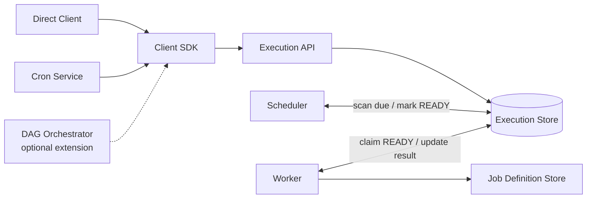

Job Scheduler 很容易被讲成一句话：

```text
时间到了，让 Worker 执行 Job。
```

这句话没有错，但 “Job Scheduler” 在不同语境里可能指完全不同的系统。真正开始设计之前，我们必须先认清题目：

> **面试官期待的是定时触发服务、工作流编排器，还是集群资源调度器？**

如果不先把题目收窄，我们很容易犯两个相反的错误：

1. 把 one-time、cron、delayed 和 retry 分别设计成四套重复的系统；
2. 把 workflow、长时间运行的任务和 GPU placement 也硬塞进一条简单的 delayed queue。

## 这道题默认设计什么

如果题目只有一句 “Design a Job Scheduler”，没有提到 DAG、GPU、Kubernetes 或 ETL，通常期待的是：

> **设计一个分布式的 time-based Job Scheduler：可靠保存一次性和周期性计划，并在预定时间把 Execution 至少一次地交给 Worker。**

从产品功能看，它支持 One-time 与 Recurring/Cron；从内部组件边界看，却有两种合理方案：

```text
Integrated
Job Scheduler 自己保存 Cron rule，并生成每次 Execution

Composable
底层只调度一次 Execution；Cron Service 负责把 recurrence 展开成单次 Execution
```

本文选择第二种，先把最难复用的可靠性问题收敛成一个基础组件：

> **One-time Job Scheduler 只负责在 `execute_at` 到达时，可靠地把一次 Execution 交给 Worker。**

Cron Service、Retry coordinator，甚至 DAG Orchestrator，都可以通过同一个 Client SDK 使用它：

```text
Direct Client ───────────────┐
Cron Service ── Client SDK ──┼──> One-time Job Scheduler ──> Worker
DAG Orchestrator ────────────┘
```

这里的 Cron Service 必须是 durable service，不能只有一个进程内 library。Client SDK 只负责调用与重试；Cron rule、timezone、misfire 和 overlap policy 必须在服务端持久保存。

## Requirements

### Functional Requirements

- Client 可以提交一次 Execution，并指定 `execute_at`；
- Client 可以用 `execution_id` 查看状态与结果引用；
- Client 可以取消尚未开始的 Execution；
- 到期的 Execution 会被交给 Worker；
- Cron Service 可以创建、更新、暂停和取消 Cron rule，并通过 Client SDK 生成单次 Execution。

### Non-functional Requirements

- 已确认的 Execution 不能静默丢失；
- 正常情况下达到秒级调度精度；
- 使用 at-least-once delivery，允许重复投递；
- 相同 `idempotency_key` 的重复提交只创建一个 Execution；
- Scheduler 节点故障后可以恢复，并能水平扩展到到期流量峰值。

`idempotency_key` 只解决重复提交；at-least-once delivery 仍可能把同一个 Execution 多次交给 Worker，Worker 必须用 `execution_id` 单独保证副作用幂等。

### Out of Scope

```text
- DAG dependencies
- large batch fan-out / fan-in
- GPU or topology-aware placement
- checkpoint-based recovery for multi-hour jobs
```

这些系统以后可以使用底层 one-time component，但不属于当前实现。

可以用一句话和面试官确认：

> “I’ll expose one-time and recurring scheduling, but make reliable one-time execution the core primitive. A durable Cron Service will materialize each occurrence through the same client used by direct callers. DAG dependencies and resource placement stay out of scope.”

确认 scope 以后，再用三个问题检查后续约束有没有把题目推向另一类系统：

```text
Trigger:   Job 为什么在现在变成 ready？
Execution: Job 运行多久，失败后怎样恢复？
Placement: Job 可以被任意 Worker 执行吗？
```

这三个问题决定 High-Level Architecture 的形状，但它们不是三种并列的 Job 类型。

## API：核心只接受一次 Execution

```http
POST /executions
Idempotency-Key: cron-42:2026-08-13T02:00:00Z

{
  "definitionUri": "registry://jobs/generate-report",
  "definitionVersion": 3,
  "inputs": {
    "datasetUri": "s3://datasets/orders",
    "reportDate": "2026-08-12"
  },
  "executeAt": "2026-08-13T02:00:00Z"
}
```

```http
GET /executions/{executionId}
DELETE /executions/{executionId}
```

`POST` 提交单次执行，`GET` 查看状态与输出引用，`DELETE` 只取消尚未开始的执行。Cron Service 也调用同一个 `POST`；它用 `cron_job_id + occurrence_time` 生成稳定的 idempotency key，避免重试时重复创建。

## Data Model：Definition File 与 Execution

Scheduler 不应该把可执行代码或某一种 runtime 写死在自己的数据库里。更干净的边界是：执行平台提供一份版本化的 **Job Definition File**，Scheduler 只引用它。

Definition File 可以使用 YAML、JSON 或 XML。它声明输入、输出与执行方式，例如：

```yaml
name: generate-report
version: 3

inputs:
  dataset_uri: string
  report_date: date

outputs:
  report_uri: string

execution:
  type: container
  image: report-generator:v3
  command: ["generate"]
```

Scheduler 不需要理解 `execution` 里的具体实现。它只校验 Definition File 存在、输入符合声明，并保存一次 Execution：

```text
Execution
- execution_id
- definition_uri
- definition_version
- input_snapshot
- execute_at
- idempotency_key
- status
- output_reference
```

Definition File 回答“这是什么任务、需要什么输入、产生什么输出”；Execution 回答“使用哪个版本和输入、在什么时候运行，以及结果在哪里”。创建 Execution 时必须固定 Definition 版本并保存输入快照，保证后续重试可复现。

Cron Service 自己保存另一份很小的模型：

```text
Cron Job
- cron_job_id
- definition_uri + version
- input_values
- cron_expression + timezone
- next_run_at
- status
```

到达 `next_run_at` 后，Cron Service 通过 Client SDK 创建 Execution，再计算下一次时间。核心 Scheduler 不需要保存或解释 Cron expression。

关系是：

```text
Job Definition File 1 ── N Execution
Cron Job 1 ── materializes ── N Execution
```

## Time-based Schedule 怎样落到底层 Primitive

外部产品仍然可以提供常见的时间能力，但它们最终都产生一次 `execute_at`：

### One-time 与 Delayed

One-time 直接提交绝对时间；Delayed 只是 Client SDK 的便捷写法：

```text
One-time: execute_at = 2026-08-13 15:00
Delayed:  execute_at = now + 30 minutes
```

### Recurring / Cron

Cron Service 计算 occurrence，并逐次提交：

```text
Cron rule: 0 2 * * *
Occurrence: 2026-08-13 02:00
POST /executions execute_at=2026-08-13T02:00:00Z
```

### Retry

Retry 不是新的 Execution。失败后，同一个 Execution 可以在 backoff 时间到达时产生下一个 Attempt：

```text
attempt 1 failed
next_attempt_at = now + backoff(attempt 2)
```

它可以在内部复用相同的 durable timer 能力，但不能用 `POST /executions` 创建一个失去关联的新 Execution。Attempt 的状态留到下一节状态机再设计。

Cron 仍需明确：

- 使用哪个时区；
- 夏令时切换时运行零次、一次还是两次；
- Scheduler 停机期间错过的运行是否补跑；
- 上一次还没有结束时，下一次是并行、跳过、排队还是替换；
- 暂停后恢复时，是否追赶所有 missed executions。

这些策略留在 Cron Service。底层 primitive 只接收已经确定的 `execute_at`。

## 为什么不总是这样拆

可组合方案的优点是职责单一，Cron、Retry 和 DAG 可以复用同一套持久化、计时、幂等与投递能力；底层也不必理解 Cron 或 dependency。

代价是多了一条跨服务边界：Cron Service 更新自身状态与提交 Execution 不是天然的单事务，取消和可观测性也需要跨服务串联。Cron Service 必须持久化自己的 rule，并使用稳定 idempotency key 重试提交。

如果系统很小、只有 Cron 一个调用方，集成式设计更简单；当可靠 timer 被多个上层服务复用时，拆出 one-time primitive 才真正值得。

## Worker Pull 还是 Scheduler Push

这里有两种有效模型。“Worker 领取任务”指 **Pull**：没有谁主动给 Worker 发任务。Scheduler 只把到期 Execution 改成 `READY`；空闲 Worker 查询 READY records，并通过原子 compare-and-set 或 lease claim 其中一个。

```text
Pull
Scheduler -> mark READY in Execution Store
Worker -> poll -> claim lease -> run
```

Pull 不需要 Scheduler 维护 Worker registry、心跳、容量和连接状态；Worker 也会自然地按自身处理速度领取工作。它适合本文默认的独立、短时、同质任务，代价是 polling latency、空轮询以及多个 Worker 对 Execution Store 的竞争。

**Push** 则由 Scheduler 选择 Worker，再通过 RPC 主动派发：

```text
Push
Scheduler -> choose Worker -> assign lease -> RPC dispatch
```

Push 可以更快地响应，并能显式考虑 locality、资源、priority 或 sticky placement；但 Scheduler 必须掌握 Worker membership、health 和 capacity，还要处理“assignment 已提交但 RPC 响应丢失”这种不确定状态。Tie-breaker 很直接：**同质 Worker + 普通秒级任务选 Pull；需要资源匹配、数据本地性或极低 dispatch latency 时才选 Push。**

## Queue 是可选组件，不是默认答案

第一版不需要独立 Message Queue。Execution Store 可以同时承担 durable scheduling state 与 ready-work handoff：

```text
Execution API -> Execution Store
                       ↑
Scheduler: 到期后原子地把 SCHEDULED 改成 READY
Worker:    用 lease 原子领取 READY Execution
```

这样组件更少，也避免了“数据库已更新，但 Queue 写入失败”的双写问题。代价是 Worker polling 和领取竞争会给 Execution Store 增加压力。

当到期流量尖峰、Worker backpressure 或数据库轮询压力成为真实瓶颈时，可以加入 Queue：

```text
Scheduler -> Ready Queue -> Worker
```

这是 Hybrid：Scheduler 把任务 push 给 Queue，Worker 再从 Queue pull。Queue 负责缓冲与分发，Execution Store 仍是状态真相；数据库状态与 Queue 消息之间需要 Outbox 或等价的可恢复投递机制。因此 Queue 是有成本的扩展，不是架构图里的默认装饰。

## 不要混进主分类的相邻系统

下面这些概念经常也带有 “Scheduler” 或 “Job” 字样，但不应该和 One-time、Cron、Delayed、Retry 放在同一个分类表里。它们是相邻的系统边界，不是四种新的时间策略。

### Event-driven Task Platform

例如：

```text
订单完成 -> 生成发票
用户上传视频 -> 开始转码
Git push -> 运行 CI
```

这里没有预先存在的 `next_run_at`。Execution 由业务事件产生，因此系统需要另一条 trigger path：

```text
Event Bus -> Event Consumer -> Execution Store -> Ready Queue
```

Event Consumer 需要处理重复事件、乱序和事件与业务数据库的一致性。它可以复用后面的 Execution Store、Ready Queue 和 Worker，但已经不是 time-based Scheduler 的一种 schedule type。

### Workflow Orchestrator

例如：

```text
下载文件 A
   ↓
解析数据 B ──┬──> 更新数据库 C
             └──> 生成报告 D
                       ↓
                    发送邮件 E
```

任务 B 不是因为“时间到了”而 ready，而是因为 A 已经成功。任务 E 则需要等待 D。

这会引入新的闭环：

```text
Worker completes task
        │
        ▼
Workflow state update
        │
        ▼
Dependency evaluation
        │
        ▼
new downstream tasks become READY
```

系统需要 DAG、Workflow Run、Task Run、dependency resolution 和 completion event。它属于另一道更大的题：Workflow Orchestrator。

### Long-running Execution 是执行约束，不是 Scheduler 类型

运行 200ms 的任务失败后，可以整体重试。运行 6 小时的视频处理或数据导入如果也从头重试，代价可能无法接受。

长任务需要：

```text
Worker heartbeat
Lease renewal
Progress reporting
Checkpoint storage
Cancellation signal
Lost-worker recovery
```

因此 Worker 不再只是“拿到消息，执行，然后 ack”。Worker 与控制面之间会形成持续状态协议。它会扩展默认设计，但 “long-running” 本身不是与 Cron 并列的一种 Scheduler。

### Batch Processing Engine

如果一个 Job 需要处理 10 亿条记录，通常不能只交给一个 Worker：

```text
Logical Job
    │
    ▼
Splitter
    ├── Partition 1 -> Worker
    ├── Partition 2 -> Worker
    ├── ...
    └── Partition N -> Worker
                         │
                         ▼
                     Aggregator
```

系统需要追踪 partitions、限制 fan-out 并发、处理部分失败，并在所有必要分片完成后执行 fan-in。

如果 Batch 只是“一条 SQL 生成日报”，它仍可以作为普通 Job 执行。只有当拆分、并行和汇总成为平台责任时，题目才转向 Batch Processing Engine。

### Cluster / Resource Scheduler

如果所有 Worker 完全同质，任意 Worker 都可以从 Queue 领取任务。

但下面这些任务不能随便领取：

```text
video-transcode:  8 CPU, region=us-west
model-training:   8 × A100 GPU, high-bandwidth network
data-import:      128 GB memory
compliance-job:   region=eu
```

系统需要知道 Job requirements 和可用 capacity，并进行 placement：

```text
Ready Execution
      │ requirements
      ▼
Resource Scheduler
      │ placement
      ▼
Specialized Worker Pool
```

此时 Scheduler 主要回答“在哪里运行”，而 time-based Job Scheduler 主要回答“什么时候可以进入 ready”。两者可能在生产平台里连接起来，但面试中不应默认混成一道题。

可以把这几个边界记成一张小表：

| 系统 | 它主要回答的问题 | 默认 Job Scheduler 是否包含 |
|---|---|---|
| Time-based Job Scheduler | 什么时候生成一次 Execution？ | 是，本文主问题 |
| Event-driven Task Platform | 哪个业务事件触发 Execution？ | 否，扩展 trigger path |
| Workflow Orchestrator | 哪些依赖满足后 Task 才 ready？ | 否，另一道题 |
| Batch Processing Engine | 如何拆分、并行和汇总大量工作？ | 否，另一道题 |
| Cluster / Resource Scheduler | Execution 应该放在哪台机器？ | 否，另一道题 |

这张表分类的是**系统责任**。One-time、Cron、Delayed 和 Retry 描述的是**产品层的时间语义**。两者不要混在一个层级里。

## 一个容易漏掉的例外：类型没变，规模也会改变架构

假设系统只有最普通的 Delayed Job，但存在：

```text
500 million future jobs
100,000 jobs due per second
sub-second scheduling precision
```

Execution 语义仍然没有变化，但单个数据库的 `execute_at` index 和一个轮询 Scheduler 已经可能成为瓶颈。系统可能需要：

- 按稳定 key 或时间范围分片；
- 按分钟或秒建立时间桶；
- 只把近期任务加载进内存；
- 对近期窗口使用 timing wheel；
- 独立扩展 Scheduler shards；如果引入 Queue，再扩展 Queue partitions。

所以最终判断不是：

```text
“它叫 Delayed Job，所以架构不变。”
```

而是：

```text
“它没有引入新的执行语义；但 scale 与 precision 是否已经击穿当前时间索引？”
```

## 面试中应该怎样收束 Scope

如果题目只说 “Design a Job Scheduler”，不要立刻把 Workflow、GPU placement 和大规模 Batch 全画进去。先问：

1. 默认是否是 time-based Scheduler？是否还需要 event trigger？
2. Job 彼此独立，还是存在 dependency / DAG？
3. 一般运行多久？失败后整体重试是否可以接受？
4. 一个 Job 是否会拆成大量并行子任务？
5. Worker 是否同质，还是需要 CPU、GPU、内存、region placement？
6. 有多少待执行 Executions？峰值每秒有多少 Execution 到期？
7. 调度精度是分钟、秒还是亚秒？
8. 允许重复执行吗？允许丢失吗？

如果面试官给出的边界是：

```text
- one-time + cron + delayed + retry
- jobs are independent
- jobs usually finish within 30 seconds
- homogeneous workers
- second-level precision
- at-least-once execution is acceptable
```

那么第一版可以收敛为：



而不是一开始就引入 DAG Engine、Checkpoint Store、GPU Scheduler 和 Timing Wheel。

这一阶段最重要的结论是：

> **产品可以提供 One-time 与 Recurring/Cron，但底层最小可复用组件只调度一次 Execution。Delayed 由 Client 换算为 `execute_at`，Cron Service 逐次 materialize occurrences，Retry 则属于同一 Execution 的后续 Attempt。**

下一步基于这套 API 和 Data Model 设计 Execution / Attempt 状态机，再讨论 Scheduler 怎样可靠地领取到期任务。
