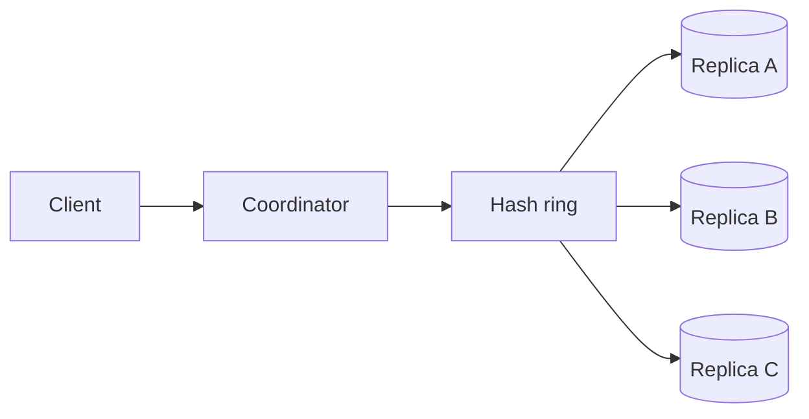

分布式 KV Store 的核心不是“用了 consistent hashing”，而是：数据有多个副本时，一次读写需要多少副本同意，以及网络分区时系统愿意牺牲什么。

先从单节点开始：`put(k, v)` 写入，`get(k)` 读取。它简单、一致，但机器故障就不可用，容量也有上限。分布式组件都是对这两个约束的回应。

> 对应实验：[打开 Key-Value Store Lab](https://lab.zichaoyang.com/system-design/kv-store/)。调节 replication factor `N`、read quorum `R`、write quorum `W`，直接观察 latency、availability 与 consistency 的交换。

## 概念阶梯

- **Consistent hashing**：把 key 和 node 放到同一个 hash ring。扩缩容时只搬动相邻区间，不重分全部数据。
- **Replication factor N**：每个 key 保存 N 份，换取容错，代价是 N 倍存储和写放大。
- **Quorum R/W**：一次读等待 R 个副本，一次写等待 W 个副本。当 `R + W > N` 时，读写集合必有交集，但仍需版本信息判断最新值。

## 主路径

Coordinator 根据 key 找到 preference list，并行请求副本。写入带逻辑版本；读取收集多个版本，返回可解析的新值，并异步修复落后副本。

## 一组具体数字

设 `N=3`。`W=2, R=2` 让读写 quorum 重叠，通常更一致，但任意操作要等待两个节点。`W=1, R=1` 延迟低、可用性高，却可能读到旧值。对购物车这类可合并数据可接受；对余额扣款通常不可接受。

这就是 CAP 的实际样子：不是在白板上选两个字母，而是在发生 partition 时决定继续接受可能冲突的写，还是拒绝请求以保护单一顺序。

## 故障恢复机制

- **Hinted handoff**：目标副本不可用时暂存写入，恢复后补交。
- **Read repair**：读取发现旧副本时顺手修复。
- **Anti-entropy**：后台用 Merkle tree 等结构比较数据区间，长期消除漂移。
- **Gossip**：传播 membership 和健康信息，不承担强一致共识。

## 面试表达

> I would start from the required consistency semantics, then choose replication and quorum settings. The same storage engine can behave very differently under `R=1, W=1` versus overlapping quorums.

面试中不要先背 Dynamo 名词。先问 value 大小、读写比、是否允许 stale read、冲突能否合并，再推导 sharding、replication 和 quorum。
