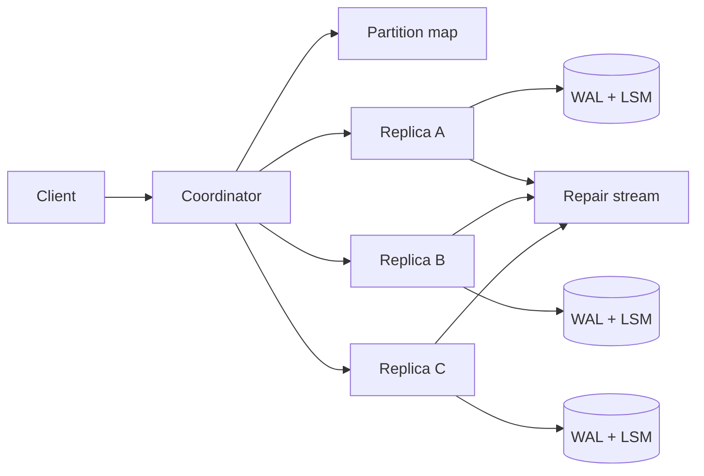

Key-value store 的接口可能只有 `put(key, value)` 和 `get(key)`，但真正的设计藏在这些动词没有说出来的地方：写成功是什么意思？读到旧值是否允许？两台机器同时接受不同值时，谁赢？节点恢复后怎样补齐缺失数据？

这道题不该从一致性哈希开始。先在一台机器上把“写入不会因崩溃丢失”做对，再让容量与可用性推动我们走向分片和复制。

> 配套实验：[打开 Key-Value Store Lab](https://lab.zichaoyang.com/system-design/kv-store/)。先设置 `N=3, R=1, W=1`，再分别提高 R 和 W；用读写 latency 与可用性验证 quorum 公式，而不是死记。

## 一个简单接口里隐藏的语义

客户端执行：

```text
PUT cart:u-9 = {item: "book", quantity: 1}
```

服务返回 `200 OK` 后，机器立即断电。重启后这个值还在吗？如果不在，`OK` 的含义就有问题。

再假设手机和电脑离线修改同一个购物车：

```text
phone:   quantity = 2
laptop:  add item "pen"
```

二者稍后分别写入不同副本。简单的“最后时间戳获胜”可能把其中一次修改完全覆盖。KV store 可以选择不理解业务，只把冲突版本都返回给客户端；也可以定义 LWW。关键是 API 必须公开语义，而不是让冲突随机消失。

## 题目边界

本文设计一个 Dynamo 风格、支持高可用读写的通用 KV store：

1. `put/get/delete`，value 大小有限制；
2. 可选 conditional write，例如 compare-and-set；
3. Key 按 hash 分片，数据复制到多个节点；
4. 通过 `N/R/W` 调节一致性与可用性；
5. 节点故障时继续服务，并在恢复后修复副本；
6. 暴露版本冲突，不承诺跨 key 事务。

第一版不做 SQL 查询、二级索引、范围扫描和任意事务。它是 key-addressed storage。

非功能目标：

- 单 key 读写 p99 在几到几十毫秒；
- 节点/磁盘故障后，已确认 durable write 不丢；
- 水平扩容时只迁移部分 key；
- 热 key 不让整个 shard 失效；
- 一致性级别是显式 contract；
- Repair、compaction 和 rebalancing 不压垮前台流量。

## 第一版：单机 Append Log + 内存 Hash Index

最小实现不需要 B-tree。写入先追加到日志，再更新内存索引：

```text
record = [key_length][value_length][version][checksum][key][value]
```

```python
def put(key, value):
    offset = append_to_log(key, value, next_version(key))
    fsync_if_required()
    index[key] = offset

def get(key):
    offset = index.get(key)
    return read_record_at(offset)
```

重启时顺序扫描 log，验证 checksum，重建 hash index。尾部半写 record 被丢弃。

这一版已经逼出两个 durability 选择：

- 每次 `fsync` 后 ack：更可靠，写 latency 高；
- 每隔几毫秒 group commit：吞吐高，但进程/机器故障时可能丢最后一个窗口。

如果 API 声称 durable，ack 必须发生在 WAL 达到承诺的持久层之后。只写进进程 buffer 不能叫 durable。

## API：Value、Version 和条件写

```http
PUT /v1/kv/cart%3Au-9
If-Match: "v17"

{"item":"book","quantity":2}
```

```http
200 OK
ETag: "v18"
```

读取：

```http
GET /v1/kv/cart%3Au-9?consistency=quorum
```

```json
{
  "key":"cart:u-9",
  "value":{"item":"book","quantity":2},
  "version":"v18"
}
```

如果存在并发 siblings，API 可以返回：

```json
{
  "key":"cart:u-9",
  "conflict":true,
  "siblings":[
    {"version":"clock-a","value":{"quantity":2}},
    {"version":"clock-b","value":{"items":["book","pen"]}}
  ]
}
```

Compare-and-set 适合单 key coordination，但在高冲突 key 上会频繁失败。跨多个 key 的业务原子性不应假装存在。

## 单机数据如何持续增长

Append-only log 会保留旧版本。后台 compaction 读取多个 segment，只输出每个 key 的最新可见版本和未过期 tombstone，再原子替换旧文件。

```text
Segment(
  segment_id,
  min_key_hash,
  max_key_hash,
  size,
  state,
  checksum
)
```

删除写入 tombstone，而不是立即移除。若直接删掉本地值，尚未收到删除的旧副本以后可能在 repair 时把数据“复活”。Tombstone 要保留超过最大故障/修复窗口，之后才能安全回收。

大规模实现常采用 LSM tree：内存 memtable 排序，flush 成 SSTable，读取查询 memtable 和多层文件，后台 compaction 合并。Bloom filter 避免为不存在的 key 读取每个 SSTable。

## 容量不够：按 Key Hash 分片

对 key 计算 hash，映射到 token ring。每个节点负责一组 token range。

直接 `hash(key) % node_count` 在节点数变化时会让几乎所有 key 重映射。一致性哈希把 key 和虚拟节点放到环上；增加节点只迁移相邻范围。

Virtual nodes 让一台物理节点拥有许多小 range，改善负载均衡和恢复并行度。代价是 membership 与 repair metadata 变多。

```text
PartitionMap(
  epoch,
  token_range,
  replica_nodes,
  state
)
```

客户端可以先到任意 coordinator，由它读取带 epoch 的 partition map 并路由。Map 过旧时，目标节点返回 redirect/new epoch，避免静默写到错误 ownership。

## 数据复制：N、W、R 分别是什么

- `N`：每个 key 存多少个 replica；
- `W`：写成功前至少等多少 replica 确认；
- `R`：读返回前至少查询多少 replica。

例如 `N=3, W=2, R=2`：写等两个副本，读查两个副本。因为：

$$
R + W > N
$$

读集合与最近成功写集合理论上至少相交一个副本，因此能看见一个新版本。若还要求并发写集合相交：

$$
W > N/2
$$

但 quorum 公式不是魔法强一致。Sloppy quorum、网络分区、冲突解决、时钟和 membership epoch 都会影响语义。它只是帮助我们理解读写副本集合。

常见配置：

| 配置 | 特性 |
|---|---|
| `N=3,W=1,R=1` | 最低延迟、最高可用，但容易读旧 |
| `N=3,W=2,R=2` | Quorum，延迟和一致性折中 |
| `N=3,W=3,R=1` | 写慢且故障时不可写，读快 |
| `N=3,W=1,R=3` | 写快，读要等所有健康副本 |

系统可以允许客户端按请求选择 consistency，但不能让所有组合都无限开放；平台要测试并明确每种模式的 SLA。

## 写路径与读路径



写：Coordinator 生成/验证版本，向 N 个 preference replicas 并行发送，收到 W 个 durable ack 后返回。剩余副本继续异步补齐。

读：向 N 个副本并行请求，收集至少 R 个响应，比较版本，返回可合并的新版本或 siblings。发现旧副本时异步 read repair。

Coordinator 不长期拥有 key，只负责一次请求。这样 API 层可水平扩展；真正的数据 ownership 在 replicas。

## 版本冲突：LWW 不是没有冲突

**Last-write-wins**

按 timestamp 或逻辑版本选一个值。实现简单，但并发更新会静默丢失。如果依赖客户端 wall clock，时钟偏差甚至会让旧写长期压过新写。

**Vector clock / version vector**

每个版本记录因果历史。若 A 的 clock 全部不小于 B 且至少一项更大，A 因果上更新；若互不包含，则并发冲突，返回 siblings。

```text
v1 = {nodeA: 3, nodeB: 1}
v2 = {nodeA: 2, nodeB: 2}
```

这两个版本并发，store 无法理解购物车怎样合并。客户端可以做 union；用户 profile 可能按字段选择；余额则根本不适合在这个 AP KV 语义上直接 LWW。

系统设计要诚实：通用 KV store 只能检测/呈现冲突，真正 merge 往往属于数据类型或业务层。

## 节点故障时怎样继续写

若 `N=3,W=2`，一个 replica 不可用仍可写。Coordinator 为失败节点保存 hint，或者把临时副本写到 ring 上下一台健康节点，这叫 hinted handoff / sloppy quorum。

```text
Hint(
  target_node,
  token_range,
  key,
  version,
  value_ref,
  expires_at
)
```

目标恢复后，临时节点回放 hint。Sloppy quorum 提高可用性，却削弱“R+W>N 保证相交”的简单推理，因为写可能落在非首选节点。读协调器要知道 hint 或查询更多节点。

Hint 不能永久代替 repair。长时间故障、临时节点也故障或 hint 过期时，需要 anti-entropy。

## Anti-entropy：Merkle Tree 找出副本差异

后台按 token range 计算 Merkle tree。两个 replica 先比较 root hash；不同才递归到更小 range，最终只传输差异 key，而不是全量扫描网络。

Repair 有资源预算：限制磁盘读、网络和 compaction 并发。节点刚恢复时若立即全速 repair，可能把前台流量再次打垮。

监控每个 range 的 repair age。系统“当前可读写”不等于副本健康；repair backlog 长期增长意味着下一次故障可能越过 durability 边界。

## 容量估算

假设：

```text
10B keys
average key + value + metadata = 1KB
replication N = 3
```

原始数据约 10TB，复制后 30TB；加 LSM space amplification、compaction headroom 和备份可能需要 60TB 以上。

高峰 2M reads/s、500K writes/s。每次 quorum 读向 3 个 replica 发请求，内部 read RPC 可接近 6M/s；每次写复制 3 份，内部 write 约 1.5M/s。

若一台节点安全承受 20K disk operations/s，不能简单用业务 QPS 除；要把 replication、read repair、compaction 和 cache hit 算进去。

Memory index 假设每 key 32 bytes：

```text
10B × 32B = 320GB
```

分布到节点并保留 headroom。LSM 的 sparse index 和 Bloom filter 可减少常驻元数据，但 false positive 会增加磁盘读。

## Hot key 和大 value

Hash sharding只能均匀分布大量 key，无法拆一个 hot key。对只读 hot key，可以：

- 在 coordinator/local cache 复制 value；
- 增加 read replicas；
- 请求合并，避免 cache miss stampede。

高频写 hot key 仍需要一个顺序或业务侧分片。把计数器拆为多个 shard 再聚合会放松精确性；严格余额不能这么做。

限制 value size，例如 1MB。大 blob 放 object storage，KV 只存 URI 和 hash。否则 compaction、replication 和 repair 都会被少数大 value 拖慢。

## 延迟预算与尾延迟

Quorum 操作的 latency 由第 W 快写副本或第 R 快读副本决定，不必等待所有 N；但后台仍要处理慢副本。

读 p99 示例：

| 阶段 | 预算 |
|---|---:|
| Coordinator 路由 | 2 ms |
| Replica 并行读取 | 10 ms |
| 版本比较/反序列化 | 2 ms |
| 网络与余量 | 6 ms |

Hedged read 可以在一个 replica 变慢时向另一个发送副本请求，改善 tail，但增加内部流量。只在接近 deadline 且系统有 headroom 时使用，不能无条件把所有读翻倍。

## 故障和正确性

**Coordinator crash**

客户端带 request ID 重试。Put 若已经写入部分 replicas，新 coordinator 使用同一 version 或更高因果版本，避免产生无意义 siblings。

**网络分区**

若允许两侧写，就接受冲突并在恢复后合并；若要求单 key 线性一致，应选择 leader/quorum consensus，而不是假装 Dynamo quorum 自动提供。

**磁盘损坏**

Record 和 segment checksum 检测，坏副本从健康 replica repair。Replication 不能替代独立备份，因为软件 bug 和误删会复制到所有副本。

**Membership 变化**

Partition map 带 epoch。Rebalance 期间旧 owner 和新 owner 有明确 handoff 状态；不能先删旧数据再确认新副本完整。

**Tombstone 过早回收**

离线副本回来后会复活旧值。Tombstone grace 必须大于最大允许故障和 repair 窗口，并监控逾期副本。

## 观测

- Client read/write p50/p95/p99、consistency mode、conflict rate；
- Replica RPC、timeout、slow node、quorum failure；
- WAL fsync、memtable flush、compaction backlog、read amplification；
- Cache/Bloom hit、disk IOPS、space amplification；
- Hinted handoff backlog、oldest hint；
- Repair age、Merkle mismatch、under-replicated ranges；
- Rebalance progress、partition skew、hot key；
- Tombstone count 和 expired-but-not-collected 数据。

只看 API uptime 会遗漏副本健康持续恶化。Durability 是后台 repair 与前台 quorum 共同维持的。

## 关键取舍

**更大的 W** 让确认写覆盖更多副本，却提高延迟并降低故障时写可用性。

**更大的 R** 降低读旧概率，也增加读 fan-out 和 latency。

**Sloppy quorum** 提高分区期间可用性，却让简单 quorum guarantee 变弱。

**LWW** 简单、value 单一，但可能丢并发更新；**siblings/vector clocks** 保留信息，却把 merge 复杂度交给业务。

**更多 compaction** 降低读取放大和空间，代价是后台 I/O；太少则 SSTable 与 tombstone 堆积。

**虚拟节点更多** 改善平衡与恢复并行，也增加 metadata 和 range 管理。

## 用 Lab 验证 N/R/W

**实验一：`N=3,R=1,W=1`**

观察最低读写 latency，然后制造一个 replica 落后。读到旧值不是意外，而是配置选择。

**实验二：`N=3,R=2,W=2`**

观察 quorum latency 和单节点故障下的可用性。解释为什么 R+W>N 有帮助，又为什么 sloppy quorum 会让结论更复杂。

**实验三：提高 R 或 W 到 3**

制造一个慢节点。看 tail latency 如何被最慢副本控制，并讨论是否值得换取更强语义。

## 面试表达：从一台机器的 Ack 开始

可以这样开场：

> I would first define what a successful put means. On one node, I would append to a checksummed WAL before acknowledging, keep a memory index for reads, and compact immutable segments in the background. Then I would shard by key hash and replicate each partition.

演化顺序：

```text
single-node WAL + index
-> immutable segments and compaction
-> consistent-hash partitioning
-> N/R/W replication
-> conflict versions
-> hinted handoff and anti-entropy
```

最后给深入方向：

> I can go deeper into quorum semantics, conflict resolution, LSM compaction, or failure repair and rebalancing.

这样讲，分布式组件都是从单机已经定义清楚的 durability 和版本语义中长出来的。

## 参考资料

- [Dynamo: Amazon's Highly Available Key-value Store](https://www.allthingsdistributed.com/files/amazon-dynamo-sosp2007.pdf)
- [Bigtable: A Distributed Storage System for Structured Data](https://research.google/pubs/bigtable-a-distributed-storage-system-for-structured-data/)
- [Consistent Hashing and Random Trees](https://www.cs.princeton.edu/courses/archive/fall09/cos518/papers/chash.pdf)
- [The Log-Structured Merge-Tree](https://www.cs.umb.edu/~poneil/lsmtree.pdf)
