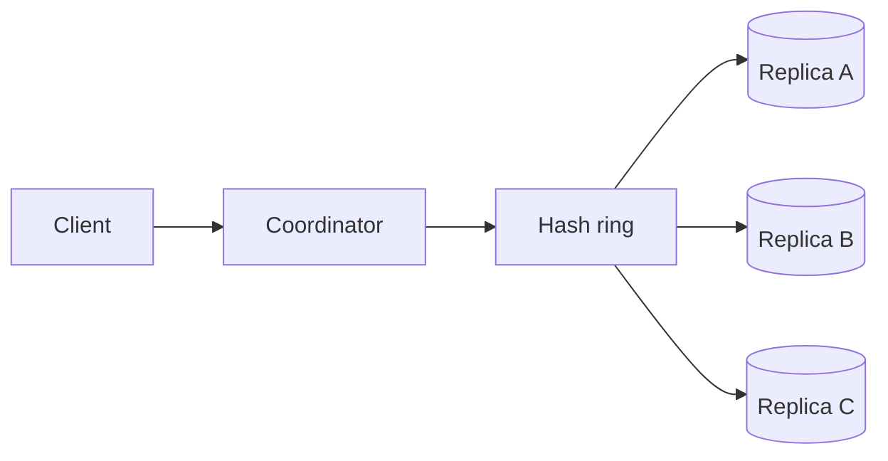

分布式 KV Store 的核心不是“用了 consistent hashing”，而是：数据有多个副本时，一次读写需要多少副本同意，以及网络分区时系统愿意牺牲什么。

先从单节点开始：`put(k, v)` 写入，`get(k)` 读取。它简单、一致，但机器故障就不可用，容量也有上限。分布式组件都是对这两个约束的回应。

> 对应实验：[打开 Key-Value Store Lab](https://lab.zichaoyang.com/system-design/kv-store/)。调节 replication factor `N`、read quorum `R`、write quorum `W`，直接观察 latency、availability 与 consistency 的交换。

## 需求边界（Requirements）

功能上提供 byte-oriented put/get/delete、TTL 和 conditional write；不提供 join/range analytics。非功能上要求单节点可恢复、分布式后可调 consistency/durability，并明确网络分区时优先 availability 还是最新值。

## 0. 先搭一个单节点 KV MVP Scaffold

先实现 `put/get/delete`，只接收 byte key 和 byte value。内存 memtable 接写入，同时 append 到 WAL；memtable 达到阈值后 flush 成 immutable sorted segment；读取按 memtable、最新 segment 到旧 segment 查找；后台 compact segment。第一版不做 replication 和分片，但必须能 crash recovery。

搭建顺序：定义 API 语义；写 append-only WAL；实现内存 map；启动时 replay WAL；加入 immutable segment 与 sparse index；最后做 compaction 和 tombstone。没有可靠单节点，就没有可靠分布式版本。

## 1. API：先定义 consistency contract

```http
PUT /v1/kv/dXNlcjo0Mg==
If-Match: 17
{"value":"...","ttlSeconds":3600}

200 OK
ETag: 18

GET /v1/kv/dXNlcjo0Mg==?consistency=quorum
```

除了 value，还返回 version/context，客户端才能做 conditional write 或冲突合并。限制 key/value 大小，避免单个巨大 value 拖垮 replication。

## 2. 数据模型（Data Model）

存储记录可表示为：

```text
Record {
  key,
  value_or_tombstone,
  logical_version,
  expires_at,
  checksum
}
```

分布式阶段额外维护 `TokenRange -> ReplicaSet`、node membership 和 hinted write。Value 本身 schema-free，不代表存储系统没有 metadata。

## 3. 单机端到端流程

Put 先 append WAL 并 fsync 到约定 durability，再更新 memtable 和返回 version。Get 合并 memtable 与 segment 中同 key 的最新记录。Delete 写 tombstone，不能立刻从所有 segment 擦除。Compaction 丢弃被覆盖且超过安全时间的旧版本。

## 4. 容量估算：数据量和吞吐决定分片

假设 1000 亿 key、平均 value 1KB，裸数据约 100TB；replication factor 3 后至少 300TB，算上 compaction 空间和索引应预留更高。峰值 100 万 ops/s、平均网络 payload 1KB，单方向约 1GB/s，复制后写带宽继续放大。

这说明节点数同时受磁盘容量、IOPS、网络和恢复时间约束，不能只做 `总数据/单盘大小`。

## 5. Latency Budget：quorum 等待谁

同 region 可设 p99 read 10ms、write 20ms。Coordinator 并行请求 N 个 replica，只等待最快 R/W 个；慢副本不应串行拖住请求。跨 region quorum 会把 WAN RTT 直接加入 p99，因此 consistency policy 必须按产品需求选择。

## 6. Correctness and Reliability

WAL checksum 防部分写，replica record 带 version/vector clock 或 HLC。节点故障时 hinted handoff 临时保存；读到多个版本时按业务合并或返回 siblings；read repair 与 anti-entropy 只负责最终修复，不能替代请求时的 consistency contract。

## 7. Trade-offs：从需求选 R/W

- `R=1,W=N` 读快写慢，适合读重且要求已确认写稳定的场景。
- `R=N,W=1` 写快读慢，且节点故障影响读。
- `R+W>N` 提高读到最新 acknowledged write 的机会，但 partition 时可用性下降。
- LSM 写吞吐高但读放大/compaction 明显；B-tree 点读稳定但随机写更多。

## 概念阶梯

- **Consistent hashing**：把 key 和 node 放到同一个 hash ring。扩缩容时只搬动相邻区间，不重分全部数据。
- **Replication factor N**：每个 key 保存 N 份，换取容错，代价是 N 倍存储和写放大。
- **Quorum R/W**：一次读等待 R 个副本，一次写等待 W 个副本。当 `R + W > N` 时，读写集合必有交集，但仍需版本信息判断最新值。

## 主路径



Coordinator 根据 key 找到 preference list，并行请求副本。写入带逻辑版本；读取收集多个版本，返回可解析的新值，并异步修复落后副本。

## 一组具体数字

设 `N=3`。`W=2, R=2` 让读写 quorum 重叠，通常更一致，但任意操作要等待两个节点。`W=1, R=1` 延迟低、可用性高，却可能读到旧值。对购物车这类可合并数据可接受；对余额扣款通常不可接受。

这就是 CAP 的实际样子：不是在白板上选两个字母，而是在发生 partition 时决定继续接受可能冲突的写，还是拒绝请求以保护单一顺序。

## 故障恢复机制

- **Hinted handoff**：目标副本不可用时暂存写入，恢复后补交。
- **Read repair**：读取发现旧副本时顺手修复。
- **Anti-entropy**：后台用 Merkle tree 等结构比较数据区间，长期消除漂移。
- **Gossip**：传播 membership 和健康信息，不承担强一致共识。

## 面试表达

> I would start from the required consistency semantics, then choose replication and quorum settings. The same storage engine can behave very differently under `R=1, W=1` versus overlapping quorums.

面试中不要先背 Dynamo 名词。先问 value 大小、读写比、是否允许 stale read、冲突能否合并，再推导 sharding、replication 和 quorum。
