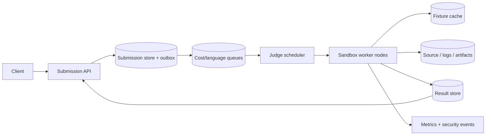

Online Judge 的 API 很容易描述：用户提交代码，系统运行测试，返回 AC、WA、TLE 或 MLE。真正困难的是“代码”并不是普通请求参数，而是一段由陌生用户提供、会在我们机器上执行的程序。

它可能死循环、申请无限内存、创建大量进程、写满磁盘、扫描内网，甚至专门攻击 compiler 或 kernel。与此同时，正常用户希望几秒内拿到稳定、可复现的 verdict。

所以这道题的核心是：**把每次提交变成一个可重试的异步任务，在严格资源和权限边界内执行，并保证失败 worker、重复任务和不同语言环境不会改变最终判题语义。**

> 配套实验：[打开 Online Judge Lab](https://lab.zichaoyang.com/system-design/online-judge/)。先保持单语言和短运行时间，再提高 submission rate 与语言数；观察 queueing 和 warm sandbox 如何成为主要约束。

## 先看三段完全合法的“恶意代码”

死循环：

```python
while True:
    pass
```

内存炸弹：

```python
blocks = []
while True:
    blocks.append(bytearray(1024 * 1024))
```

进程炸弹或网络探测：

```python
import os
while True:
    os.fork()
```

这三段代码不需要利用漏洞，就能让一个天真的 worker 永远不返回、耗尽内存或进程表。仅给 `subprocess.run(..., timeout=2)` 加 timeout 不够：子进程可能继续存在，内存/磁盘没有限制，网络和系统调用也没有隔离。

因此安全边界必须在执行用户代码之前建立，而不是在程序“表现不好”之后才杀掉。

## 先把几个对象讲清楚

**Submission**

一次正式提交意图，绑定 user、problem、language、source、测试版本和 runner 版本。它有一个最终 verdict。

**Attempt**

Worker 对同一 Submission 的一次执行。Worker 崩溃后可以有 attempt 2，但不能产生第二个逻辑 submission。

**Fixture**

不可变的测试输入、期望输出、checker 和资源限制集合。题目修改测试时产生新 version，旧 submission 仍可复现。

**Sandbox**

执行不可信代码的隔离环境。它限制可见文件、网络、系统调用、CPU、内存、进程、输出和时间。

**Verdict**

`AC / WA / TLE / MLE / RE / CE / SYSTEM_ERROR`。用户代码错误与平台故障必须分开；worker 磁盘坏了不能判用户 RE。

## 题目边界

核心功能：

1. 用户按 problem/language 提交 source；
2. 异步编译并运行隐藏测试；
3. 返回 verdict、时间、内存和有限错误信息；
4. 支持多语言和 custom checker；
5. 区分 Run Code 与正式 Submit；
6. 保存提交历史和可复现执行版本；
7. 在比赛流量突发时公平排队。

第一版不设计题目编辑器、反作弊/抄袭检测和排行榜。它们消费判题结果。

非功能目标：

- 用户代码无法访问 host、内网、其他提交或秘密测试答案；
- CPU、内存、进程、文件、输出和 wall time 都有硬上限；
- 已 accepted 的任务不会因 worker crash 永久丢失；
- 重复执行只有一个最终 result，旧 attempt 不能覆盖新 attempt；
- 同一 fixture/runner 下结果尽量可复现；
- Queue 有 backpressure、公平性和 priority isolation；
- 平台故障返回 SYSTEM_ERROR，可安全重试，不污损用户统计。

## 第一版：先跑可信样例，搭出异步状态机

最早的本地版本不要立刻执行任意公网代码。先用几段我们自己写的 trusted source 验证流程：

```text
POST submission
-> database: QUEUED
-> worker lease task
-> write source to temp directory
-> compile if needed
-> run fixed sample
-> compare output
-> write terminal result
```

最小状态机：

```text
QUEUED -> RUNNING -> ACCEPTED
                  -> WRONG_ANSWER
                  -> TIME_LIMIT_EXCEEDED
                  -> MEMORY_LIMIT_EXCEEDED
                  -> RUNTIME_ERROR
                  -> COMPILE_ERROR
                  -> SYSTEM_ERROR
```

状态转换使用 version/attempt fencing。Worker 只持 lease；lease 超时后任务可被新 worker 领取。

这一步的目标不是安全上线，而是让 API、任务、attempt 和 immutable result 语义先工作。下一步把 runner 替换为真实 sandbox，外层流程不用推倒重来。

## Submission API：提交和结果天然异步

```http
POST /v1/submissions
Idempotency-Key: user-42:device-8:991

{
  "problemId":"two-sum",
  "language":"python@3.13",
  "source":"def two_sum(...): ..."
}
```

```http
202 Accepted

{
  "submissionId":"sub-81",
  "state":"QUEUED",
  "pollAfterMs":1000
}
```

查询：

```http
GET /v1/submissions/sub-81
```

```json
{
  "submissionId":"sub-81",
  "state":"ACCEPTED",
  "verdict":"AC",
  "runtimeMs":42,
  "memoryKb":15200,
  "language":"python@3.13",
  "fixtureVersion":"two-sum@17",
  "runnerVersion":"python-runner@sha256:..."
}
```

Short polling 足够。Verdict 产生后 immutable，GET 只是 KV/cache lookup。WebSocket 只有在产品需要统一实时进度通道时才值得，不是判题系统的核心。

队列已超过可接受等待时，POST 返回 `503` 和 Retry-After，或者接受但明确预计等待。无限接收会让用户在 queue 里等十分钟并反复提交，形成更大风暴。

## 数据模型：Submission 与 Attempt 必须分开

```text
Problem(
  problem_id,
  active_fixture_version,
  title,
  difficulty,
  state
)

FixtureVersion(
  problem_id,
  version,
  manifest_uri,
  manifest_hash,
  checker_uri,
  checker_hash,
  time_limit_ms,
  memory_limit_bytes,
  output_limit_bytes,
  state
)

Submission(
  submission_id,
  user_id,
  problem_id,
  language_version,
  source_uri,
  source_hash,
  fixture_version,
  runner_version,
  state,
  final_attempt,
  verdict,
  runtime_ms,
  memory_bytes,
  created_at,
  completed_at
)

JudgeAttempt(
  submission_id,
  attempt,
  lease_token,
  worker_id,
  state,
  started_at,
  lease_expires_at,
  completed_at,
  failure_reason,
  log_ref
)
```

Source、测试数据和完整日志是 blob，放 object storage；数据库保存 URI、hash 与小摘要。隐藏 fixture 下载使用短期授权，worker node 不能把它暴露给用户进程。

Submission 表 append-heavy，按 `created_at` 时间分区便于归档；用户历史索引 `(user_id, created_at desc)`。规模更大时按 user hash 分库、库内再时间分区。

## 第二版：建立真正的 Sandbox 边界

一个最低限度的 Linux sandbox 需要：

- **Namespaces**：隔离 pid、mount、user、network、IPC；
- **cgroups v2**：限制 CPU、memory、pids，并读取峰值资源；
- **seccomp**：只允许必要 system calls；
- 只读 root filesystem + 单独、限额的 tmpfs；
- 无网络 namespace；
- 非 root user，drop capabilities；
- Wall-clock watchdog；
- 文件大小、open files、stdout/stderr 上限；
- 进程树整体回收，而不是只杀父进程。

执行目录：

```text
/runner      read-only trusted harness
/tests       read-only, user process cannot enumerate hidden answers unnecessarily
/workspace   writable, strict quota
/output      bounded pipe/file
```

编译器也处理不可信输入。C++ 模板可能让编译耗尽 CPU/内存，恶意 source 可能攻击 compiler。因此 compile stage 同样放 sandbox，有独立、更宽资源上限。

容器提供打包和 namespace/cgroup 便利，但不是绝对安全边界。高风险公网代码平台可以用 microVM 或强化 runtime，牺牲一些启动时间换更强 kernel 隔离。具体选择来自 threat model，不是“Docker 一定安全”。

## Runner 的最小执行协议

Runner 接收 immutable job spec：

```json
{
  "submissionId":"sub-81",
  "attempt":2,
  "sourceHash":"sha256:...",
  "fixture":"two-sum@17",
  "runner":"python@sha256:...",
  "limits":{
    "wallMs":3000,
    "cpuMs":2000,
    "memoryBytes":268435456,
    "pids":32,
    "outputBytes":1048576
  }
}
```

每个 testcase 的结果：

```text
TestResult(
  testcase_id,
  verdict,
  wall_ms,
  cpu_ms,
  memory_peak,
  exit_code,
  signal,
  output_hash
)
```

默认 fail-fast：第一个 WA/TLE/MLE 后停止。继续跑所有隐藏测试很贵，对用户价值有限。教育模式可以选择收集更多失败，但有明确成本预算。

`SYSTEM_ERROR` 不作为用户 verdict。Node I/O error、fixture 下载失败、sandbox runtime crash 进入平台 retry；只有用户程序自身 signal/exit 才是 RE。

## Output Checker：字符串比较没有那么简单

普通题可以规范化行尾空白后比较 expected 与 actual。规则必须固定，不能随 worker 语言变化。

多解题需要 custom checker：

```text
checker(input, expected_metadata, user_output) -> accepted/reason
```

Checker 由平台/题目作者提供，但仍可能有 bug 或被巨大输出拖垮，因此也运行在受限环境，只是权限比用户代码不同。把 checker 视为“绝对可信、无需限制”并不专业。

Interactive problem 更复杂：用户程序与 interactor 双向通信，双方都要 timeout、pipe backpressure 和 transcript limit。第一版可明确不支持，避免假装普通 stdout compare 可以覆盖。

## 多语言：Runner Image 是判题语义的一部分

```text
LanguageRuntime(
  language_id,
  version,
  image_digest,
  compile_command,
  run_command,
  base_limits,
  state
)
```

固定 compiler/interpreter、标准库和 flags。`python` 或 `java latest` 不可复现；必须 pin image digest。

语言间启动成本差异很大：C++ 编译贵，Java/JVM warmup 会影响短测试，Python 启动较快但解释执行慢。题目 time limit 可以按 language multiplier 调整，但规则版本化并公开。

不能无限复用一个运行过用户代码的 container。最安全是每 submission 新 sandbox；为了启动性能，可以预热干净 base microVM/container snapshot，执行后彻底销毁，而不是“清一下目录再给下一个用户”，后者容易残留进程、文件和内核状态。

## Pre-warmed Pool：预热的是干净环境，不是用户实例

按语言维护 ready capacity：

```text
python pool: 500 clean sandboxes
java pool:   300 clean sandboxes / warm runtime snapshots
haskell:      10, allow cold start
```

任务领取一个干净实例，注入只读 fixture 和 source，执行后销毁。后台补充 pool。

Pool 大小由 arrival rate、startup time 和目标 queue delay决定。冷门语言保持少量或按需启动，避免大量空闲资源；比赛允许的语言提前扩容。

Warm pool 仍要定期轮换 node/image，不能让长期运行 host 成为跨租户持久状态。

## 高层架构



API 事务写 Submission + outbox，publisher 送 queue，避免数据库成功但入队丢失。

Scheduler 按 language、预计成本、priority 和 quota 选择 worker。Worker node 本地缓存 immutable runner image 和 fixture，减少每次从 object storage 下载；hash 验证防缓存损坏。

Result store 可用 Redis/Valkey 作为近期 polling cache，Postgres/持久 KV 保存最终事实。Cache miss fallback 数据库，不能让 Redis 成为唯一 verdict。

## Worker Lease 与 Fencing：旧 Worker 不能晚到覆盖

Scheduler 发 attempt 2 与 lease token 902。Worker 定期续租；若 node 失联，lease 到期，任务发给 attempt 3/token 903。

Attempt 2 可能只是网络慢，稍后也写结果。Result transaction 必须验证 token/attempt 仍是 current：

```sql
UPDATE submissions
SET state = :terminal,
    verdict = :verdict,
    final_attempt = 3
WHERE submission_id = :id
  AND state = 'RUNNING'
  AND current_lease_token = 903;
```

旧 token 写入 0 行，结果只留作诊断，不能覆盖 attempt 3。At-least-once queue + fencing 比幻想 exactly-once worker 更可靠。

如果 attempt 2 已完成用户程序但 result response 丢失，重跑可能得到不同 runtime；final verdict 通常仍确定。统计取 winning attempt，并记录 retry 原因。

## 容量估算：用 Worker-seconds，不用 API QPS

假设峰值每分钟 100,000 submissions：

```text
100,000 / 60 ≈ 1,667 submissions/s
```

若平均一次完整判题消耗 2 worker-seconds：

```text
1,667 × 2 ≈ 3,334 concurrent worker slots
```

为长尾、故障、部署和 burst 留 30%：

```text
≈ 4,300 slots
```

如果只按 submission count，60 秒重题与 100ms 简单题被当成同样工作。Scheduler/容量应估算 `CPU-seconds + memory reservation + startup/compile cost`。

测试数据假设每 submission 平均读 20MB：

```text
1,667 × 20MB ≈ 33GB/s
```

Fixture 必须按 problem/version 在 worker node 本地缓存；不能每次从 metadata DB 或跨 Region object storage 拉。

每天 100M submissions、每条 metadata 1KB 是约 100GB/day；source/log 单独 object storage，按保留策略归档。

## Queue 设计：避免重题阻塞所有短题

至少拆：

```text
run-code-short
formal-submit-normal
long-running / special judge
contest-reserved
```

并按 language/resource profile 进一步路由。一个 FIFO 中前面 100 个 60 秒任务会造成 head-of-line blocking。

公平调度：

- Per-user/token rate limit，防止一个账号无限提交；
- Weighted fair queue，普通用户不会被一个大团队饿死；
- Contest capacity reservation，不影响站外正常练习；
- Cost budget，超大内存题占用对应 token；
- Aging，低优先任务等待过久会提升优先级。

付费 priority 可以存在，但不能让低 tier 永远无进展。SLO 用 queue wait percentile 表达。

## Run Code 与 Submit 应是两条 Pipeline

| | Run Code | Submit |
|---|---|---|
| 测试 | 公开样例/自定义输入 | 全部隐藏 fixture |
| 结果 | 临时，不计统计 | 持久 verdict |
| Queue | 低延迟短任务 | 完整判题 |
| Rate limit | 可较宽，但防滥用 | 更严格 |
| 安全 | 同样不可信 sandbox | 同样不可信 sandbox |

Run Code 不是“安全要求较低”。它仍执行用户代码，只是 fixture 和持久语义不同。独立队列防止用户反复点击 Run 堵住正式提交。

## 延迟预算：用户等的是 Queue + Startup + Tests

正式 submission p95 5 秒示例：

| 阶段 | 预算 |
|---|---:|
| API durable acceptance | 100 ms |
| Queue wait | 1,000 ms |
| Sandbox/fixture prepare | 500 ms |
| Compile + tests | 3,000 ms |
| Result commit/visible | 200 ms |
| 余量 | 200 ms |

不同题目 time limit 不同，SLO 可按 cost class。只看 API p99 会误以为系统健康，而 queue 已经积压一分钟。

Autoscaling 信号优先用 estimated queued worker-seconds、oldest age 和 warm-pool deficit，CPU 只是辅助。CPU 低可能是所有 worker 正在等待 fixture I/O；CPU 高也可能是健康满载。

扩容有冷启动，因此比赛开始前按赛程预热。Reactive scaling 只能处理较慢变化，无法追回已经产生的首分钟 backlog。

## 测试保密与侧信道

用户不应读取隐藏 input/expected output。Runner harness 按 testcase 一次注入 stdin；不要把整个 fixture 目录可读地 mount 给用户程序。

错误响应只返回允许公开的信息。正式提交通常不回传完整隐藏 input；否则可反复探测答案。

资源和时间也是侧信道。绝对消除很难，但可以限制系统信息、固定目录、隐藏其他进程、无网络、清理环境，并对异常 probe 行为 rate limit。

Source 和 fixture 访问有审计、加密和最小权限。Worker 的临时凭证只允许读取当前 job artifacts，不能列出整个 bucket。

## Correctness：判题也不是天然完全 Deterministic

同一代码可能因随机数、线程调度、浮点、时间、未初始化内存和 runtime 版本产生差异。平台要缩小不确定性：

- 固定 image、compiler flags、locale、timezone 和环境变量；
- 限制/模拟 wall clock 和 random source（视题目需要）；
- CPU architecture 与 instruction set 版本明确；
- Test order 固定；
- Floating checker 使用明确 tolerance；
- Nondeterministic/interactive 题有专门协议。

无法保证所有用户程序数学上 deterministic，但可以保证环境 contract 与结果 lineage。争议 submission 能在相同 runner/fixture 上重放。

## 故障与恢复

**Worker crash**

Lease 到期后新 attempt 重跑。旧 attempt fencing，不能覆盖。

**Fixture cache 损坏**

每次使用验证 manifest/hash；删除本地副本重拉。判 SYSTEM_ERROR，不判用户 WA。

**Result cache 故障**

Polling fallback 持久 Submission store。Terminal result 不依赖缓存 durability。

**Queue 重复投递**

Submission state + lease CAS 去重。两个 worker不能同时成为 current attempt。

**Runner image 发布错误**

Immutable digest、golden submissions、canary worker pool。旧 submissions pin 旧 runner；新 version异常立即回滚路由。

**比赛突发**

Admission/backpressure、预留 pool、按 contest 分区队列。先保证已接受任务最终完成，不让客户端重试风暴无限放大。

## 结果统计不要进入热路径

“运行速度超过 87% 的 Python 提交”不需要每次 AC 实时扫描历史。

Batch 按 `(problem_id, language, fixture_version)` 计算 runtime/memory 分布：

```text
SubmissionStats(
  problem_id,
  language_version,
  fixture_version,
  computed_at,
  sample_count,
  percentile_sketch
)
```

AC 后查询 sketch 近似 percentile。测试版本或机器代际改变时不能把不可比数据混在一起。

这类“够新即可”的产品指标应与 verdict 正确性分离，避免重报表拖慢判题。

## 观测

- Submission acceptance、dedup、terminal verdict；
- Queue depth、estimated worker-seconds、oldest age，按 class/language；
- Sandbox acquire/startup、compile、test、result commit p99；
- Warm pool ready/deficit/cold-start；
- CPU/memory/pids/output limit trigger；
- Worker crash、lease expiry、duplicate attempt、fenced result；
- Fixture/image cache hit、hash failure、download bytes；
- SYSTEM_ERROR 与用户 verdict 分布；
- Seccomp violation、network attempt、sandbox escape indicators；
- Contest fairness、per-user queue share。

总体完成率很高可能掩盖冷门语言等待 30 秒。所有指标按 language、problem cost、Region 和 queue class 切片。

## 关键取舍

**每次创建新 Sandbox** 隔离更干净，启动成本高；预热干净 snapshot 能折中，但执行后仍应销毁实例。

**Container** 启动快、运维成熟，共享 host kernel；**microVM** 边界更强，但资源和启动更重。

**Fail-fast tests** 节省 worker，用户看不到所有失败；正式提交通常值得。

**更多错误细节** 帮助学习，也可能泄露隐藏测试。Run Code 与 Submit 使用不同披露政策。

**严格确定环境** 提高复现，却限制某些语言/API；允许更多系统能力就扩大攻击面。

**更深排队缓冲** 吸收 burst，也延长等待并鼓励重试；达到 SLO 边界应 backpressure。

## 用 Lab 观察系统为什么不是普通 API

**实验一：提高 Submission Rate**

保持 worker 固定，观察 queue age 如何积累。用 worker-seconds 算容量，而不是只看请求数。

**实验二：增加平均执行时间**

同样 QPS 下需要成倍 worker。拆短/长队列，避免 head-of-line blocking。

**实验三：增加语言数**

观察 image/fixture cache 和 warm-pool 内存。为热门语言常驻，冷门语言接受受控 cold start。

## 面试表达：先说不可信代码，再说扩容

可以这样开场：

> The API is simple, but every request asks us to execute untrusted code. I would model a submission as an asynchronous, leased job pinned to immutable source, test fixtures, and a runner image. A sandbox enforces CPU, memory, process, file, output, network, and syscall limits before any user code runs.

演化顺序：

```text
trusted single-worker flow
-> real sandbox boundary
-> immutable fixture/runner versions
-> leased attempts with fencing
-> warm language pools and cost queues
-> contest capacity, fairness and recovery
```

最后给深入入口：

> I can go deeper into sandbox isolation, worker leasing and fencing, multi-language scheduling, or contest bursts and fixture security.

这条主线先回答“一份不可信代码怎样正确、安全地跑完”，然后才谈 queue 和 Kubernetes，顺序才是合理的。

## 参考资料

- [isolate: Sandbox for running untrusted executables](https://github.com/ioi/isolate)
- [Linux cgroup v2 Documentation](https://docs.kernel.org/admin-guide/cgroup-v2.html)
- [Linux Seccomp Userspace API](https://docs.kernel.org/userspace-api/seccomp_filter.html)
- [Firecracker: Lightweight Virtualization for Serverless Applications](https://www.usenix.org/conference/nsdi20/presentation/agache)
