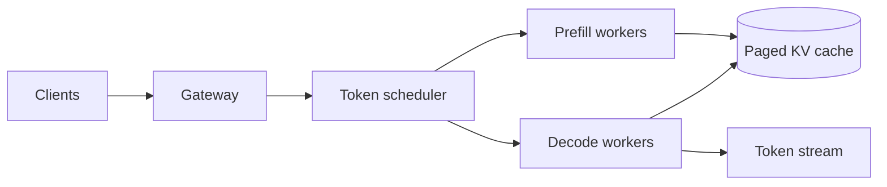

LLM Inference 与普通模型 serving 最大的不同，是生成过程 autoregressive：每次只产生一个 token，下一步又依赖前面的 token。请求会在 GPU 上停留很久，并持续增长 KV cache。

> 对应实验：[打开 LLM Inference Lab](https://lab.zichaoyang.com/system-design/llm-inference/)。增加 prompt/output 长度、request rate 与模型大小，观察 memory 和 time-to-first-token 的变化。

## 需求边界（Requirements）

功能上支持流式生成、取消、usage 与多模型版本；首版不做复杂 agent。非功能上分别约束 TTFT、inter-token latency、tokens/s 和 KV memory，过载必须 admission/load shedding，租户数据与 cache 隔离。

## 0. 先搭单 GPU 生成服务 MVP Scaffold

第一版加载一个能放进单卡的模型，一次只处理一个请求：tokenize prompt，prefill，循环 decode，逐 token 通过 SSE 返回，遇到 EOS、`max_tokens` 或 deadline 停止。先记录 TTFT、每 token latency、输出 token 数和 GPU memory，不做 batching。

然后加一个有界 FIFO queue 和 admission rule：prompt 太长、预计 KV memory 超预算或 queue 已满就明确拒绝。没有 admission control，任何后续 batching 都会在过载时崩溃。

## 1. API：流式结果和取消是基本语义

```http
POST /v1/generations
Accept: text/event-stream

{"model":"70b-chat","prompt":"...","maxTokens":512,"requestId":"g-8"}

event: token
data: {"text":"Hello"}

event: done
data: {"finishReason":"stop","usage":{"promptTokens":120,"outputTokens":42}}
```

客户端断开或 `DELETE /v1/generations/g-8` 触发取消；scheduler 应停止后续 decode，已经进入当前 GPU kernel 的工作可能无法立刻收回。

## 2. 数据模型（Data Model）

```text
RequestState(request_id, model, prompt_tokens, generated_tokens, deadline,
             kv_pages, priority, state, worker_id)
ModelDeployment(model_version, weight_shards, tokenizer_version, parallelism, limits)
UsageRecord(request_id, tenant_id, input_tokens, output_tokens, model_version, latency)
```

Prompt/response 是否持久化由隐私策略决定；usage 和版本必须保留以计费与排障。

## 3. 单机端到端流程

Gateway 鉴权并 tokenize、估算 token；admission 检查 weights 后剩余显存；prefill 分配 KV pages；decode loop 每步生成 token 并 stream；完成后立即释放 pages。先用这个版本测单请求 memory 曲线，再引入 continuous batching scheduler。

## 4. 容量估算：按 token 和 KV memory 算

70B BF16 weights 约 140GB，单张 80GB 卡放不下，至少需要 tensor parallel 或量化。若单请求 KV cache 在 8k context 下约数 GB，几十个并发请求就可能吃完剩余显存。100 requests/s、平均输出 500 token 等于 50k decode tokens/s；这是核心 throughput 单位。

## 5. Latency Budget：TTFT 与 inter-token 分开

目标可以是 TTFT p99 1 秒、inter-token p99 50ms。TTFT 包含 queue 和 prefill；decode latency 受 active batch、collective 和 memory bandwidth 控制。长 prompt 与短交互共用 queue 会 head-of-line blocking，因此规模化后拆 prefill/decode pool。

## 6. Correctness and Reliability

生成虽可随机，协议状态仍需正确：tokenizer/model 版本绑定，usage 可核对，取消释放 KV，worker crash 返回明确 incomplete。已经 stream 部分 token 的请求不能悄悄从头重放。过载时按预计 token memory load shed，不只按 request 数。

## 7. Trade-offs：吞吐不是免费增大 batch

- Continuous batch 提高 GPU 利用率，但 active sequence 越多每步越慢。
- Quantization 降 memory 和成本，可能损失质量或需要特定 kernel。
- Tensor parallel 让模型放得下，却每 token 做 collective。
- Prefix cache 节省重复 prefill，但占 KV memory 且需租户隔离。

## 先讲清两个阶段

- **Prefill**：一次处理全部 prompt，计算密集，决定 time-to-first-token。
- **Decode**：每步生成一个 token，memory-bandwidth 敏感，决定 inter-token latency。

**KV cache** 保存每层历史 token 的 attention key/value，避免每步重算整个 prompt。它让生成可行，却使每个活跃请求占用随序列长度增长的 GPU memory。

## 为什么 static batch 会浪费

把 8 个请求固定成一批，其中 7 个已完成，最后一个还在生成时，7 个 slot 会一直空着。Continuous batching 每个 decode step 都能接纳新请求、移除完成请求，让 GPU 持续有活干。



Paged attention 用固定 page 管 KV cache，减少连续大块分配造成的碎片。模型 weights 超过单卡时才用 tensor parallel；它增加每个 token step 的 collective latency。

## 架构演化

1. 低负载、小模型：单 GPU 顺序处理。
2. 多请求：continuous batching 提升 throughput。
3. 长上下文：paged KV、admission control 与 prefix caching 管 memory。
4. 大模型：tensor-parallel shard 解决 weight capacity。
5. 大规模：分离 prefill 与 decode，避免长 prompt 阻塞稳定 decode，并独立扩缩两类 worker。

## 关键指标和失败模式

不要只报“平均 latency”。至少区分 TTFT、inter-token latency、tokens/s、queue time 和拒绝率。过载时要限制总 token budget，而不只是 request 数；一个 100k-token prompt 远重于短请求。

## 面试表达

> The key resource is not just GPU compute; it is KV-cache memory over the lifetime of autoregressive requests. I would schedule tokens continuously and control admission by expected token memory.

这句话把题目从普通 REST serving 拉回了 LLM 的真正约束。
