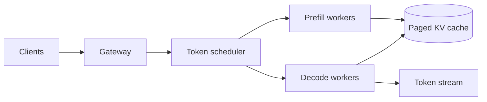

LLM Inference 与普通模型 serving 最大的不同，是生成过程 autoregressive：每次只产生一个 token，下一步又依赖前面的 token。请求会在 GPU 上停留很久，并持续增长 KV cache。

> 对应实验：[打开 LLM Inference Lab](https://lab.zichaoyang.com/system-design/llm-inference/)。增加 prompt/output 长度、request rate 与模型大小，观察 memory 和 time-to-first-token 的变化。

## 先讲清两个阶段

- **Prefill**：一次处理全部 prompt，计算密集，决定 time-to-first-token。
- **Decode**：每步生成一个 token，memory-bandwidth 敏感，决定 inter-token latency。

**KV cache** 保存每层历史 token 的 attention key/value，避免每步重算整个 prompt。它让生成可行，却使每个活跃请求占用随序列长度增长的 GPU memory。

## 为什么 static batch 会浪费

把 8 个请求固定成一批，其中 7 个已完成，最后一个还在生成时，7 个 slot 会一直空着。Continuous batching 每个 decode step 都能接纳新请求、移除完成请求，让 GPU 持续有活干。

Paged attention 用固定 page 管 KV cache，减少连续大块分配造成的碎片。模型 weights 超过单卡时才用 tensor parallel；它增加每个 token step 的 collective latency。

## 架构演化

1. 低负载、小模型：单 GPU 顺序处理。
2. 多请求：continuous batching 提升 throughput。
3. 长上下文：paged KV、admission control 与 prefix caching 管 memory。
4. 大模型：tensor-parallel shard 解决 weight capacity。
5. 大规模：分离 prefill 与 decode，避免长 prompt 阻塞稳定 decode，并独立扩缩两类 worker。

## 关键指标和失败模式

不要只报“平均 latency”。至少区分 TTFT、inter-token latency、tokens/s、queue time 和拒绝率。过载时要限制总 token budget，而不只是 request 数；一个 100k-token prompt 远重于短请求。

## 面试表达

> The key resource is not just GPU compute; it is KV-cache memory over the lifetime of autoregressive requests. I would schedule tokens continuously and control admission by expected token memory.

这句话把题目从普通 REST serving 拉回了 LLM 的真正约束。
