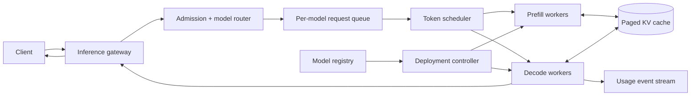

设计普通模型服务时，我们常把一次请求想成一次函数调用：输入一个向量，模型前向计算一次，返回分类结果。

LLM 推理不是这样。它先读完整段 prompt，然后一个 token、一个 token 地往后写。生成第 200 个 token 时，前 199 个 token 仍然影响结果。因此，一个请求不是“碰一下 GPU 就走”，而是会在 GPU 上停留几十到几千个解码步骤，并在这段时间里持续占用显存。

这道题真正要解决的也就不是“怎样包一层 REST API”，而是：**怎样让许多长短不一的生成任务共享昂贵的 GPU，同时守住首字延迟、逐字流畅度和显存上限。**

> 配套实验：[打开 LLM Inference Lab](https://lab.zichaoyang.com/system-design/llm-inference/)。本文最后给了三组实验，不要一开始就把所有开关都打开。

## 先看两个请求，为什么 request QPS 会骗人

假设两个用户同时到达：

| 请求 | Prompt | 期望输出 | 用户感受 |
|---|---:|---:|---|
| A：翻译一句话 | 30 tokens | 20 tokens | 应该立即开始返回 |
| B：总结一本书 | 20,000 tokens | 1,000 tokens | 可以稍等，但不能拖死别人 |

从网关看，它们都是一个 request；从 GPU 看，它们完全不是同一种工作。

请求 A 很快完成。请求 B 先要读完 20,000 个 prompt token，之后还要执行最多 1,000 轮 decode。如果调度器只限制“同时 32 个请求”，那么 32 个 B 就可能把 KV cache 填满；如果把 A 排在 B 后面，A 的首字延迟会被一段超长 prefill 拖住。

所以这里至少要同时计算三种量：

1. prompt token 带来的 prefill 工作量；
2. output token 带来的 decode 工作量；
3. 请求整个生命周期占用的 KV-cache 显存。

这也是本文后面所有设计的出发点。

## 先把四个词讲清楚

**Prefill**

模型一次处理完整 prompt，计算每个位置的 attention，并建立初始 KV cache。它更像一次较大的矩阵计算，通常决定首字要等多久。

**Decode**

模型根据已有上下文生成下一个 token。新 token 又被写入上下文，然后继续下一轮。单轮计算不大，但每个活跃请求都要反复执行，通常更受显存带宽影响。

**TTFT 与 TPOT**

- TTFT（time to first token）是从请求到达到第一个输出 token 的时间。
- TPOT（time per output token）是后续两个输出 token 之间的时间，也常被叫作 inter-token latency。

用户对二者的感受不同。TTFT 高，页面像“没反应”；TPOT 高，文字会一顿一顿地出现。只报一个总 latency，会把两种问题混在一起。

**KV cache**

Transformer 的每层 attention 都需要之前 token 的 key 和 value。把它们缓存下来，下一步就不用重算全部历史。代价是：每个活跃 token 都占显存，而且序列越长，占得越多。

对采用 grouped-query attention 的模型，可以粗略估算：

$$
\text{KV bytes/token}
= 2 \times L \times H_{kv} \times D \times B
$$

其中 `2` 表示 key 和 value，$L$ 是层数，$H_{kv}$ 是 KV head 数，$D$ 是每个 head 的维度，$B$ 是每个数值的字节数。

例如一个有 80 层、8 个 KV head、head dimension 为 128、使用 BF16 的模型：

```text
2 × 80 × 8 × 128 × 2 bytes = 320 KiB / token
```

单个 8K-token 上下文就大约需要 2.5 GiB KV cache。这个数字会随模型结构和精度变化，但它足以说明：**模型 weights 能放进 GPU，不代表服务就能接住很多并发请求。**

## 题目边界：先把“模型平台”收窄

本文设计一个多租户、支持流式生成的在线推理平台。核心功能是：

1. 客户端指定模型、prompt、最大输出长度和 deadline。
2. 服务端以流式方式返回 token，并支持取消。
3. 平台可以部署多个模型版本，做灰度和回滚。
4. 平台记录 token usage、完成原因和实际使用的模型版本。

第一版先不做 agent tool calling、训练、复杂内容审核和跨请求记忆。它们可以调用推理平台，但不是这个平台的核心调度问题。

非功能目标要分开写：

- 交互请求的 TTFT p99 目标，例如 1 秒以内；
- TPOT p99 目标，例如 50 毫秒以内；
- 过载时明确拒绝，不能让排队无限增长；
- 不同租户的 prompt、response 和 prefix cache 必须隔离；
- 已经流出的 token 不能在 worker 重启后无声重复。

这些数字只是面试中的设计目标，不是所有模型都能达到的固定指标。模型大小、硬件和上下文长度会改变可行边界。

## 手把手搭第一版：单 GPU、单请求、先把语义做对

不要一开始就写 distributed scheduler。先选一个能放进单张 GPU 的小模型，只允许一个请求在执行。

最小数据结构只有一个：

```text
GenerationRequest
  request_id
  tenant_id
  model_version
  prompt_tokens
  max_output_tokens
  deadline_at
  generated_tokens
  finish_reason
```

最小执行循环可以写成下面这样：

```python
def generate(request):
    kv_cache = model.prefill(request.prompt_tokens)

    for _ in range(request.max_output_tokens):
        if request.is_cancelled() or request.deadline_expired():
            return finish("cancelled")

        next_token = model.decode_one(kv_cache)
        request.generated_tokens.append(next_token)
        stream_to_client(next_token)

        if next_token == EOS:
            return finish("stop")

    return finish("length")
```

这一版很慢，却能先验证五件容易被“高层架构”掩盖的事：

1. tokenizer 和 model version 是否严格绑定；
2. SSE 或 WebSocket 断开时，取消信号能否到达 decode loop；
3. `EOS`、长度上限和 deadline 的完成原因是否准确；
4. usage 是按实际 token 统计，而不是按客户端声称的长度；
5. 无论正常完成还是异常退出，KV cache 都会释放。

### API 不只返回文本，还要表达生命周期

```http
POST /v1/generations
Accept: text/event-stream
Idempotency-Key: gen-8

{
  "model": "chat-8b@2026-07-01",
  "prompt": "Explain continuous batching",
  "maxOutputTokens": 512,
  "deadlineMs": 10000
}
```

流式响应：

```text
event: accepted
data: {"requestId":"gen-8","modelVersion":"chat-8b@2026-07-01"}

event: token
data: {"index":0,"text":"Continuous"}

event: done
data: {"finishReason":"stop","inputTokens":5,"outputTokens":87}
```

还需要：

```http
DELETE /v1/generations/gen-8
GET    /v1/generations/gen-8
```

`Idempotency-Key` 只能防止客户端重试创建两个逻辑请求。它不意味着已经输出一半的随机采样结果可以在另一台 worker 上精确续写。若产品要求可恢复生成，就必须保存采样参数、随机数状态、已生成 token 和兼容的 KV 状态；多数在线聊天产品宁可明确告诉用户“生成中断”。

## 第二版：加队列，但先学会拒绝

单请求版本跑通后，可以在 worker 前放一个有界队列。这里最危险的实现是：队列按 request 数限长。

更合理的 admission control 会估算：

```text
预计 KV token = prompt_tokens + max_output_tokens
预计 prefill work ∝ prompt_tokens
预计 decode work  ∝ max_output_tokens
```

当预计 KV 超过可分配 pages、deadline 已经不可能满足，或租户 token budget 用完时，网关应直接返回 `429` 或 `503`，并给出可重试信息。让请求排二十秒后才超时，比立即拒绝更浪费 GPU，也更难让上游降级。

这时数据模型才需要平台级状态：

```text
ModelDeployment(
  model_version, tokenizer_version, weight_uri,
  parallelism_plan, quantization, state
)

RequestState(
  request_id, tenant_id, model_version, input_tokens,
  max_output_tokens, generated_tokens, deadline_at,
  priority, worker_id, state, finish_reason
)

UsageRecord(
  request_id, tenant_id, model_version,
  input_tokens, output_tokens, ttft_ms, total_ms
)
```

`RequestState` 是运行控制面状态，不应在每个 token 上同步写关系数据库。`UsageRecord` 可以在完成时通过事件异步落库，但要有 request ID 去重，避免 worker 重试造成双重计费。

## 容量估算：先问 weights，再问 KV，最后问 token throughput

假设要服务一个 70B 参数模型：

```text
BF16 weights ≈ 70B × 2 bytes = 140 GB
```

单张 80 GB GPU 放不下，仅“加载模型”就需要 tensor parallel、pipeline parallel，或者更低精度的量化。可用显存还要扣掉运行时 workspace 和 KV cache，不能把整张卡都算给 weights。

再看吞吐。若高峰是每秒 100 个请求，平均每个输出 500 tokens：

```text
100 requests/s × 500 output tokens = 50,000 decode tokens/s
```

这才是 decode pool 的核心工作量。prompt 平均 2,000 tokens，则 prefill 还要处理：

```text
100 requests/s × 2,000 prompt tokens = 200,000 prefill tokens/s
```

这两个数字不能直接相加后交给一个“GPU QPS”指标，因为 prefill 和 decode 的计算形态不同。估算的目的，是提前看到三个独立上限：

- weights 决定一组 replica 至少需要多少 GPU；
- KV cache 决定一组 replica 同时容纳多少活跃序列；
- token throughput 决定需要多少 replica 才能清空持续到达的工作。

## 为什么固定 batch 会浪费 GPU

假设把 8 个请求固定成一批。它们的输出长度分别是：

```text
20, 24, 25, 31, 40, 42, 50, 800
```

前 7 个请求结束以后，batch 仍要陪最后一个请求跑到第 800 步。如果执行框架不能移除已完成序列，绝大多数 slot 都在空转。

Continuous batching 的做法是：每个 decode step 之后，移除完成的请求，再从等待队列补进新请求。伪代码大致是：

```python
while True:
    finished = decode_one_step(active_sequences)
    release_kv_pages(finished)

    token_budget = available_token_budget(active_sequences)
    admitted = queue.take_requests_that_fit(token_budget)
    prefill(admitted)
    active_sequences.extend(admitted)
```

关键不是 `while True`，而是“that fit”。调度器要同时守住 KV pages、每轮 token budget、优先级和 deadline。只追求最大 batch，TPOT 会越来越差；只追求最低延迟，GPU 又会吃不满。

## Paged KV cache：解决的不是总量，而是分配方式

如果每个请求一开始就为最大上下文申请一整块连续显存，大量短请求会浪费空间；请求结束时间不同，还会造成碎片。

Paged KV cache 把 KV 空间切成固定大小的 page。序列增长时按需领取 page，结束后立即归还。逻辑 token 位置通过 page table 映射到物理显存，思路很像虚拟内存。

它带来三项实际收益：

1. 不必按 `max_context` 预留整块显存；
2. 不同长度的序列可以共享统一 allocator；
3. prefix cache 可以让多个请求引用相同的只读 pages。

但 prefix cache 不是免费午餐。它会挤占普通请求的 KV 空间，还可能跨租户泄露访问模式。因此 cache key 至少要包含模型版本、tokenizer 版本、完整 token prefix 和租户隔离域，并配合明确的 eviction policy。

## 高层架构：数据面要短，控制面可以慢



请求热路径上的职责要很克制：

- Gateway 做鉴权、限额、流式连接和取消传播。
- Model router 锁定一个具体 model version，不能在生成中途换权重。
- Scheduler 决定什么时候 prefill、哪些序列参加下一轮 decode。
- Worker 持有 weights 和 KV pages，不在每个 token 上访问远程数据库。
- Registry 与 deployment controller 负责加载、预热、canary 和回滚，属于控制面。

模型发布时，先加载 weights、跑健康样例并预热 kernel，再把少量新请求切过去。旧 worker 要 drain 已接收请求，而不是在版本切换时杀掉所有长生成。

## 什么时候拆开 prefill 和 decode

早期把两者放在同一组 worker 最简单，也避免搬运 KV cache。规模上来后，超长 prompt 的 prefill 会占住 GPU，令正在聊天的请求突然停顿。

将两类工作拆成独立 pool，可以分别扩缩：

- Prefill pool 偏计算吞吐，适合合并相似长度的 prompt。
- Decode pool 偏稳定的逐 token 延迟，应该保护活跃会话。

代价是 prefill 产生的 KV cache 必须传给 decode worker。KV 数据可能很大；如果网络或拓扑选得不好，节省的排队时间会被传输抵消。因此这不是“高级架构必选项”，而是在 head-of-line blocking 已经超过 KV transfer 成本时才值得做。

## 延迟预算：先定位哪一段在变慢

可以为交互请求拆一份示例预算：

| 阶段 | p99 预算 |
|---|---:|
| 鉴权、路由、tokenize | 50 ms |
| 排队 | 200 ms |
| Prefill | 600 ms |
| 第一次采样和网络 | 150 ms |
| **TTFT 合计** | **1,000 ms** |

后续每个 token 的 50 ms 预算又是另一条路径：scheduler tick、decode kernel、跨 GPU collective、采样和网络 flush。

如果 TTFT 上升而 TPOT 正常，优先看 queue time 和 prefill；如果 TPOT 随 active sequence 数上升，说明 decode batch 太大、collective 太慢或显存带宽已饱和。只看“请求总耗时”无法做出这个判断。

## 正确性与故障语义

LLM 输出可以随机，服务协议不能含糊。

**Worker 崩溃**

如果还没有向客户端发送 token，可以安全地把请求重新排队。只要已经发送过部分输出，默认行为应是发出 `incomplete` 并结束；不要悄悄从头生成，让用户收到重复或前后矛盾的文本。

**客户端断开**

Gateway 要取消后端请求。GPU kernel 可能无法在微秒级中断，但 scheduler 下一轮不应再把该序列加入 batch，并应尽快回收 KV pages。

**模型版本漂移**

请求一旦接受，就记录 immutable model version、tokenizer version、sampling config 和 runtime revision。排障时只写“请求用了 chat-70b”没有意义。

**计费重复**

Usage consumer 按 `request_id` 幂等写入。计费基于服务端实际处理的 token，并明确 cancelled、length 和 error 是否收费。

**过载**

宁可早拒绝，也不要无限排队。保护顺序通常是：已开始流式输出的会话、短交互请求、普通 batch 请求、超长上下文请求。具体优先级是产品决策，必须公开，不能藏在 scheduler 的魔法数字里。

## 必须监控什么

至少把指标按 model version、worker pool 和租户拆开：

- TTFT、TPOT、queue time 和端到端 latency 的 p50/p95/p99；
- input/output tokens per second；
- active sequences、scheduled tokens 和 batch occupancy；
- KV page 使用率、碎片率、prefix-cache hit rate；
- admission reject、deadline miss、cancel propagation delay；
- GPU utilization、HBM bandwidth、collective time；
- worker crash、模型加载失败和 usage event lag。

平均 GPU utilization 很高不一定是好事。若 queue 和 TPOT 同时恶化，说明平台是在用用户延迟换“看起来很满”的 GPU。

## 关键取舍：每一项优化都在移动成本

**更大的 continuous batch** 提升吞吐，却让每轮 decode 更慢，伤害 TPOT。

**量化** 降低 weights 和 KV 的显存占用，也可能改变质量，并要求适配的 kernel。它是成本、吞吐和精度之间的取舍，不是纯工程优化。

**Tensor parallel** 让大模型跨卡放置，但每个 token step 都需要 collective；卡间互联会进入用户延迟。

**Prefix cache** 节省重复 prefill，但占用 KV pages，还要解决隔离、失效和命中率问题。

**Prefill/decode 分离** 保护交互式 decode，却增加 KV transfer、调度和拓扑复杂度。

面试里不要把这些技术念成购物清单。先指出你遇到的瓶颈，再选择刚好解决它的机制。

## 用 Lab 把这条推导跑一遍

**实验一：先只拉长 prompt**

保持 request rate 和输出长度不变，逐步增加 prompt。观察 TTFT 与 KV memory。你应该看到 prefill 压力先上升，而 TPOT 不一定同比例恶化。

**实验二：只增加输出长度和并发**

保持 prompt 较短，增加 output tokens 和 request rate。观察活跃序列生命周期变长，KV pages 不易释放，decode throughput 成为主要约束。

**实验三：比较扩卡方案**

增大模型直到单卡装不下，再打开并行。问自己：现在增加 GPU 是为了装 weights、增加 replica throughput，还是改善 KV capacity？三个目标对应的拓扑并不相同。

## 一套自然的面试表达

开场不要说“我会用 vLLM 和 Kubernetes”。可以先这样说：

> 普通模型请求通常只做一次 forward pass，但 LLM 请求会经历一次 prefill 和很多轮 autoregressive decode。请求在整个生成期间持续占用 KV cache，所以我会用 token 和 KV memory，而不是只用 request QPS 来做容量与 admission 设计。

画完单 worker 主路径后，再给出演化顺序：

```text
single request
-> bounded queue + admission
-> continuous batching
-> paged KV cache
-> model parallel / more replicas
-> prefill-decode disaggregation when HOL blocking justifies it
```

最后把选择权交给面试官：

> 主路径已经覆盖了流式协议、token scheduler 和 KV 生命周期。接下来我可以深入 continuous batching、公平调度、大模型并行，或者 worker 故障后的请求语义。

这比罗列组件更能证明你理解系统为何一步步长成现在的样子。

## 参考资料

- [vLLM: Easy, Fast, and Cheap LLM Serving with PagedAttention](https://arxiv.org/abs/2309.06180)
- [Orca: A Distributed Serving System for Transformer-Based Generative Models](https://www.usenix.org/conference/osdi22/presentation/yu)
- [DistServe: Disaggregating Prefill and Decoding for Goodput-optimized LLM Serving](https://arxiv.org/abs/2401.09670)
- [NVIDIA Megatron-LM: Training Multi-Billion Parameter Language Models Using Model Parallelism](https://arxiv.org/abs/1909.08053)
