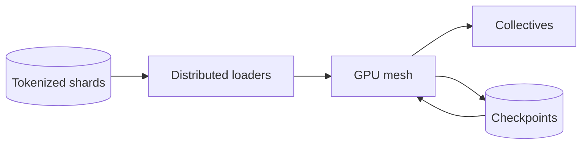

LLM 训练基础设施的第一条约束是 memory，第二条是通信，第三条是故障概率。不能先说“上很多 GPU”，因为 GPU 越多，collective communication 与任一设备失败的概率也越高。

> 对应实验：[打开 LLM Training Infrastructure Lab](https://lab.zichaoyang.com/system-design/llm-training-infra/)。改变参数量、GPU 数、互联带宽和 checkpoint 间隔，观察瓶颈迁移。

## 最小 memory 账

100B 参数用 BF16 weights 约 200GB；训练还要 gradients、master weights 和 optimizer states，实际远超一张 80GB GPU。模型“能推理”不等于“能训练”。

## 三种并行

- **Data parallel**：每张 GPU 有完整模型，处理不同 batch，再 all-reduce gradient。扩 throughput，但不解决模型装不下。
- **Tensor parallel**：把一层矩阵切到多张 GPU，每层都通信。解决单层 memory，依赖高速互联。
- **Pipeline parallel**：把不同层放到不同 stage，用 micro-batch 填流水线，会产生 bubble。

大模型通常组合成 3D parallel mesh。

## 架构演化

1. 能装进单卡时用单卡，避免任何 collective。
2. 需要更高 throughput 时复制模型做 data parallel，网络开始承担 gradient all-reduce。
3. 模型装不下时才引入 tensor/pipeline sharding。
4. activation 仍超内存时使用 activation checkpointing，以 backward 重算换 memory。
5. 上千 GPU 时，checkpoint、健康检测和快速 restart 决定训练是否能完成。

## 容易忽略的系统问题

- Data loader 吞吐不足会让昂贵 GPU 空等。
- 慢一张卡会拖慢整个同步 step，必须监控 straggler。
- Checkpoint 太频繁浪费 I/O，太少则故障丢掉大量计算，可用“checkpoint 成本 vs 预期故障间隔”估算。
- 参数、optimizer、RNG 和 dataloader position 都要恢复，不能只保存 weights。

## 面试表达

> I would first determine whether the model and optimizer state fit on one device. Parallelism is then introduced in order: data parallelism for throughput, model sharding for capacity, and checkpointing for inevitable failures.

重点是从 memory math 推导 topology，而不是罗列框架名。
