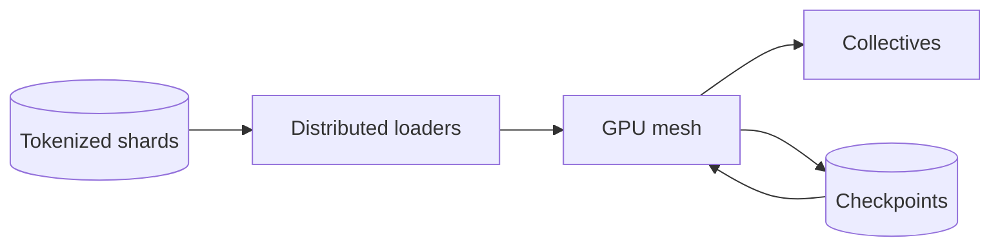

LLM 训练基础设施的第一条约束是 memory，第二条是通信，第三条是故障概率。不能先说“上很多 GPU”，因为 GPU 越多，collective communication 与任一设备失败的概率也越高。

> 对应实验：[打开 LLM Training Infrastructure Lab](https://lab.zichaoyang.com/system-design/llm-training-infra/)。改变参数量、GPU 数、互联带宽和 checkpoint 间隔，观察瓶颈迁移。

## 需求边界（Requirements）

功能上启动/恢复 pretraining run、分配 mesh、stream dataset、checkpoint 和监控。非功能上优化有效 tokens/s、收敛正确性和故障恢复；模型状态必须放得下，slow rank 与数据饥饿不能长期浪费整组 GPU。

## 0. 先搭单 GPU Trainer MVP Scaffold

先用能装进单卡的小模型和固定 tokenized shard：DataLoader 读取 batch，forward，loss，backward，optimizer step，每 N 步写 checkpoint。日志记录 tokens/s、loss、GPU memory、data wait 和 step time。单卡 run 能从 checkpoint 精确恢复后，再加 data parallel。

最小 checkpoint 不只保存 weights，还包括 optimizer、scheduler、global step、RNG state 和 dataloader cursor；否则“恢复”会改变训练轨迹或重复数据。

## 1. API：训练控制面只管理 Run

```http
POST /v1/pretraining-runs
{"modelConfig":"70b-v3","dataset":"corpus-2026-07","tokens":2000000000000,
 "mesh":{"gpus":1024,"tensor":8,"pipeline":4},"checkpointMinutes":20}

202 Accepted
{"runId":"pretrain-9","state":"queued"}
```

控制面还需要 pause/cancel/resume 和 checkpoint 查询。高频 training step 不经过 API；它发生在已分配的 worker mesh 内。

## 2. 数据模型（Data Model）

```text
TrainingRun(run_id PK, model_config, dataset_version, code_ref, mesh, state)
WorkerGroup(run_id, rank, node_id, topology, heartbeat, state)
Checkpoint(run_id, global_step, object_prefix, manifest, checksum, complete)
DatasetShard(dataset_version, shard_id, token_count, object_url, checksum)
TrainingMetric(run_id, step, name, value, rank_scope, recorded_at)
```

Checkpoint 先写所有 shard，再写 complete manifest；没有 manifest 的半成品不能恢复。

## 3. 单机端到端流程

Launcher 校验 config 和 dataset，分配一张 GPU，下载 shard，训练 loop 定期把 checkpoint 写临时 prefix，校验后发布 manifest。进程 crash 时控制面启动新 worker，从最新 complete checkpoint 恢复并继续 dataloader cursor。这个闭环是分布式版本的基础。

## 4. 容量估算：先做 memory math

100B 参数 BF16 weights 约 200GB。Adam 训练粗略还需 gradients、master weights 和两份 optimizer state，可能达到每参数 16 bytes，即约 1.6TB，尚未计算 activation。若每卡可用 70GB，光模型状态理论下限已超过 23 卡；实际还需通信 buffer 和 activation，必须更大 mesh 与 ZeRO/sharding。

2T token、每秒 100 万 token 的有效吞吐也要约 23 天；利用率每下降 10%，都直接变成昂贵 GPU 时间。

## 5. Latency Budget：关注 step time 而非请求 p99

把 step 分成 data load、forward、backward、collective、optimizer。目标是 overlap I/O/communication 与 compute，并监控最慢 rank。一次 all-reduce 被慢节点拖长 200ms，乘数百万 step 会变成巨大训练时间。

## 6. Correctness and Reliability

所有 rank 对 global step、dataset partition 和 checkpoint manifest 一致。Collective timeout 后整组重启，不让部分 rank 继续。Checkpoint 原子发布并周期验证可读。数据 shard checksum 防 silent corruption；loss spike、NaN 和 straggler 自动触发诊断或停跑。

## 7. Trade-offs：memory、通信和重算

- Data parallel throughput 好但复制完整模型；tensor/pipeline 解决容量，却增加 collective/bubble。
- Activation checkpointing 省 memory，但 backward 多做计算。
- Checkpoint 频繁少丢工作，却吃 object-store 带宽并暂停 step。
- 更大 global batch 提高吞吐，可能改变优化行为，需要学习率与收敛验证。

## 最小 memory 账

100B 参数用 BF16 weights 约 200GB；训练还要 gradients、master weights 和 optimizer states，实际远超一张 80GB GPU。模型“能推理”不等于“能训练”。

## 三种并行

- **Data parallel**：每张 GPU 有完整模型，处理不同 batch，再 all-reduce gradient。扩 throughput，但不解决模型装不下。
- **Tensor parallel**：把一层矩阵切到多张 GPU，每层都通信。解决单层 memory，依赖高速互联。
- **Pipeline parallel**：把不同层放到不同 stage，用 micro-batch 填流水线，会产生 bubble。

大模型通常组合成 3D parallel mesh。



## 架构演化

1. 能装进单卡时用单卡，避免任何 collective。
2. 需要更高 throughput 时复制模型做 data parallel，网络开始承担 gradient all-reduce。
3. 模型装不下时才引入 tensor/pipeline sharding。
4. activation 仍超内存时使用 activation checkpointing，以 backward 重算换 memory。
5. 上千 GPU 时，checkpoint、健康检测和快速 restart 决定训练是否能完成。

## 容易忽略的系统问题

- Data loader 吞吐不足会让昂贵 GPU 空等。
- 慢一张卡会拖慢整个同步 step，必须监控 straggler。
- Checkpoint 太频繁浪费 I/O，太少则故障丢掉大量计算，可用“checkpoint 成本 vs 预期故障间隔”估算。
- 参数、optimizer、RNG 和 dataloader position 都要恢复，不能只保存 weights。

## 面试表达

> I would first determine whether the model and optimizer state fit on one device. Parallelism is then introduced in order: data parallelism for throughput, model sharding for capacity, and checkpointing for inevitable failures.

重点是从 memory math 推导 topology，而不是罗列框架名。
