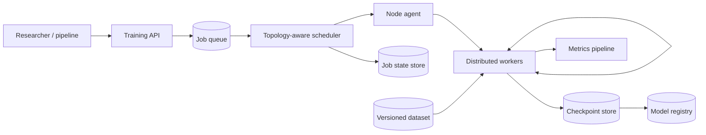

很多人第一次估算大模型训练，只算了参数：70B 参数乘以 BF16 的 2 bytes，大约 140GB。于是结论是“两张 80GB GPU 应该放得下”。

真正启动 Adam 训练时，程序却会立刻 OOM。因为训练不只保存一份 weights，还要保存 gradient、optimizer moments、可能存在的 FP32 master weights，以及随 batch 和 sequence length 增长的 activation。

这道题的核心因此不是“多买几张 GPU”，而是：**怎样把模型状态和计算合理地分布到许多加速器上，并让这些设备在故障、慢节点和昂贵 checkpoint 下仍然像一个可恢复的训练作业。**

> 配套实验：[打开 LLM Training Infrastructure Lab](https://lab.zichaoyang.com/system-design/llm-training-infra/)。先改变模型参数量和单机 GPU 数，再增加节点；观察瓶颈什么时候从显存变成互联。

## 先算清 70B 训练到底要多少显存

以 mixed-precision Adam 为一个粗略例子，每个参数可能需要：

| 状态 | 每参数字节 |
|---|---:|
| BF16 parameter | 2 |
| BF16 gradient | 2 |
| FP32 master parameter | 4 |
| FP32 first moment | 4 |
| FP32 second moment | 4 |
| **小计** | **16 bytes/parameter** |

那么 70B 参数只算模型状态就是：

```text
70B × 16 bytes ≈ 1.12 TB
```

这还没算 activation、temporary buffer、通信 workspace 和内存碎片。不同 optimizer、精度和框架会改变常数，但结论不会变：**训练显存不能只用 inference weights 大小估算。**

如果 16 张 GPU 每张可用 70GB，总共约 1.12TB，看起来刚好，但没有任何空间留给 activation。真正设计时还要留 10%–20% headroom，并根据 sequence length、micro-batch 和 activation checkpointing 重新测量。

这个数字解释了后面所有 parallelism 为什么存在。

## 先讲清四种“并行”分别拆什么

**Data parallel**

每张 GPU 保存完整模型，处理不同 micro-batch，然后 all-reduce gradient。它提高吞吐，但没有解决“单卡放不下模型”的问题。

**Sharded data parallel / ZeRO / FSDP**

把 optimizer state、gradient，甚至 parameter 分散到 data-parallel ranks。计算到某一层时再 all-gather 需要的 parameter。它用更多通信换显存。

**Tensor parallel**

把同一层的大矩阵乘法拆到多张 GPU。它解决单层太大或单卡算不动的问题，但几乎每层都需要 collective，因此非常依赖高带宽、低延迟互联。

**Pipeline parallel**

把连续的 layer 分成多个 stage，不同 micro-batch 像流水线一样通过。它能跨更多设备放置模型，却会出现 pipeline bubble，并要求 stage 负载均衡。

这些方法可以组合成 3D parallelism。不要先背一个固定组合；先问模型状态、单层大小、节点拓扑和目标 batch，才能决定各维度多大。

## 题目边界

本文设计一个面向研究和生产训练的大模型基础设施：

1. 用户提交 immutable training spec；
2. Scheduler 为 job 分配成组 GPU 和网络拓扑；
3. Worker 启动分布式训练、汇报指标并定期 checkpoint；
4. 节点故障后自动恢复；
5. 完成的 checkpoint、config、code 和 dataset lineage 进入 registry。

第一版不设计模型算法、标注平台和在线 serving。Dataset 已经由上游以版本化 manifest 提供。

非功能目标：

- 训练结果可复现并可追溯；
- 集群故障不会让数天计算全部丢失；
- GPU 高利用率不能以频繁 OOM 和长尾 straggler 为代价；
- 多租户之间有 quota、priority、公平性和数据隔离；
- 调度必须感知 GPU 型号、节点、机架和高速互联拓扑。

## 第一版：单机单卡，把训练 run 做成可重放对象

先不要写 Kubernetes operator。用一个小模型在单张 GPU 跑通：

```yaml
run_id: pretrain-001
code_revision: 6f91a72
container_image: trainer@sha256:...
dataset_manifest: corpus@v12
tokenizer: tokenizer@v4
base_checkpoint: null
seed: 42
model_config:
  layers: 24
  hidden_size: 2048
training_config:
  sequence_length: 2048
  global_batch_tokens: 1048576
  optimizer: adamw
  learning_rate: 0.0003
```

最小 loop：

```python
for batch in dataset_from_manifest(spec.dataset_manifest):
    loss = model(batch).loss
    loss.backward()
    optimizer.step()
    optimizer.zero_grad()

    if step % checkpoint_interval == 0:
        save_atomic_checkpoint(step, model, optimizer, dataloader_state)
```

这一版先保证：

1. 数据顺序能由 manifest、shard 和 random state 重建；
2. Checkpoint 包含 weights、optimizer、LR scheduler、random state 和 dataloader position；
3. Artifact 在写完整前不可见，完成后有 checksum；
4. Run 记录真实消费的 tokens、loss 和环境版本；
5. 从 checkpoint 恢复后，global step 和 learning-rate schedule 不会重置。

只保存 weights 只能用于 inference，不能忠实恢复一次训练。

## 第二版：一台机器上的 Data Parallel

当模型能放进单卡，只是训练太慢时，最先引入 DDP。8 张 GPU 各拿不同 micro-batch，反向传播时同步 gradient。

```text
global batch
= micro_batch_per_gpu
 × data_parallel_size
 × gradient_accumulation_steps
```

例如每卡 micro-batch 为 2、8 张卡、累积 16 次：

```text
2 × 8 × 16 = 256 sequences/global batch
```

这里有一个常见错误：GPU 数增加后忘记保持 global batch，导致优化语义变化。扩容实验要么调整 accumulation 保持 batch，要么明确重新调 learning rate，不能把吞吐变化和算法变化混在一起。

DDP 的 all-reduce 可以与 backward computation overlap，但最慢 rank 仍会拖住全部设备。一次 2 秒的 data-loader 卡顿，会让其余 7 张 GPU 一起等待。

## 模型放不下：先 shard state，再拆层内计算

如果主要显存来自 optimizer、gradient 和 parameter 副本，优先考虑 ZeRO/FSDP：

- Stage 1 shard optimizer state；
- Stage 2 再 shard gradient；
- Stage 3 连 parameter 也 shard。

分片越彻底，单卡状态越少，但 forward/backward 需要更多 all-gather 和 reduce-scatter。它不是“免费把显存除以 GPU 数”，通信、prefetch 和 layer wrapping 策略都会影响吞吐。

如果单个 layer 的矩阵本身太大，或希望聚合更多算力，再引入 tensor parallel。由于每层通信频繁，TP group 应优先放在同一台 NVLink/NVSwitch 主机内；跨普通网络做细粒度 TP，延迟很容易吞掉计算收益。

Pipeline parallel 更适合把许多层分到多个 stage。假设 4 个 stage 只跑 1 个 micro-batch，大部分设备会轮流空等；增加 micro-batch 可以填满流水线，但会增加 activation 和 global batch 约束。

## API：Training job 是 immutable spec 加可变状态

```http
POST /v1/training-jobs

{
  "specVersion": "v1",
  "modelConfig": "llm-70b@v3",
  "dataset": "corpus@v12",
  "codeRevision": "6f91a72",
  "resources": {
    "gpuType": "h100-80gb",
    "gpuCount": 256,
    "topology": "8-gpu-nodes"
  },
  "parallelism": {"data":32,"tensor":8,"pipeline":1},
  "checkpointPolicy": {"everyMinutes":30,"keepLast":3}
}
```

返回异步 job：

```http
202 Accepted

{"jobId":"train-88","state":"queued","specHash":"sha256:..."}
```

控制命令：

```http
GET  /v1/training-jobs/train-88
POST /v1/training-jobs/train-88/cancel
POST /v1/training-jobs/train-88/pause
POST /v1/training-jobs/train-88/resume
```

不要允许 `PATCH` 一个正在运行 job 的 dataset 或 parallelism。新的配置应产生新 attempt 或新 job，并保留 lineage。否则排障时无法知道前 10,000 step 和后 10,000 step 到底用了什么。

## 数据模型

```text
TrainingJob(
  job_id, tenant_id, spec_hash, state,
  priority, submitted_by, created_at
)

JobAttempt(
  job_id, attempt, cluster_id, allocation_id,
  state, start_checkpoint, started_at, ended_at, failure_reason
)

Allocation(
  allocation_id, gpu_type, node_ids,
  topology, lease_expiry, state
)

Checkpoint(
  checkpoint_id, job_id, global_step,
  manifest_uri, content_hash, state, created_at
)

TrainingArtifact(
  job_id, type, uri, hash, producer_attempt
)
```

一个逻辑 Job 可以有多个 Attempt。节点失败后启动新 Attempt，但仍属于同一个训练目标。Checkpoint 只有在所有 rank shard 和 manifest 完整、校验通过后才进入 `READY`。

## 高层架构：Control plane 不碰训练热路径



Training API 和 scheduler 属于 control plane。真正的 gradient collective 直接走训练网络，不经过 API service。

Node agent 负责准备 container、挂载数据、健康检查和启动 rank。Scheduler 必须一次性拿到完整 gang，并选择合适拓扑；只看“还有 256 张空闲 GPU”不够，如果它们散落在低带宽节点上，训练可能慢数倍。

## 拓扑感知调度：同样 256 张卡，性能可能完全不同

一个常见优先级是：

1. Tensor-parallel ranks 放在同一高速互联域；
2. Pipeline 相邻 stage 放在网络距离较近的节点；
3. Data-parallel groups 可以跨更大的网络域，但 all-reduce 仍需要足够 bisection bandwidth；
4. 数据 shard 尽可能靠近对应 worker，避免所有 rank 抢同一个 object-store prefix。

Scheduler 要了解故障域。为了吞吐把所有 replica 放在同一个机架，机架故障会一次损失整个 job；过度跨域又会增加通信。Placement 是性能和 failure blast radius 的共同取舍。

## 容量估算：不要只报 FLOPS

训练计算量常用近似：

$$
\text{training FLOPs} \approx 6 \times N_{params} \times N_{tokens}
$$

例如 70B 模型训练 1T tokens：

```text
6 × 70e9 × 1e12 = 4.2e23 FLOPs
```

若 256 张 GPU 每张持续有效 300 TFLOP/s，理论时间约：

```text
4.2e23 / (256 × 3e14) ≈ 5.47e6 seconds ≈ 63 days
```

这是极粗上界估算。实际还要乘 model FLOPs utilization，并扣掉 checkpoint、评估、故障、pipeline bubble、data stall 和集体通信。估算的价值是判断订单量级，而不是承诺一个精确交付日期。

存储也要算。若每个完整 checkpoint 约 1TB，每 30 分钟一次、保留 3 个，单 job 热数据至少 3TB；100 个 job 就是 300TB，还没算上传过程中的 staging。Checkpoint 带宽若只有 10GB/s，写 1TB 就要约 100 秒，这段暂停会直接降低训练效率。

## Checkpoint：分布式一致性比“定时保存”难

每个 rank 可能只保存自己的一部分 state。正确流程是：

1. Coordinator 选择一致的 global step；
2. 各 rank 把 shard 写到临时路径；
3. 每个 shard 返回 size 和 checksum；
4. Coordinator 验证 expected ranks 全部到齐；
5. 最后写 manifest，并原子地把 checkpoint 标为 READY。

Manifest 示例：

```json
{
  "jobId": "train-88",
  "globalStep": 12000,
  "worldSize": 256,
  "parallelism": {"dp":32,"tp":8,"pp":1},
  "shards": [
    {"rank":0,"uri":"...","sha256":"..."}
  ]
}
```

恢复前要先验证 manifest 和 shard 完整性。看到一个目录存在就尝试加载，可能读到半写 checkpoint。

Checkpoint interval 可用“故障重做成本”和“保存开销”权衡。故障越频繁、step 越贵，越值得频繁保存；checkpoint 越慢，就越影响正常训练。平台应根据真实 MTBF 和写入时间建议 interval，而不是所有模型固定 30 分钟。

## 故障与弹性

**单个 worker 崩溃**

同步训练通常无法让其余 ranks 无缝继续。终止本次 attempt，释放 gang，从最近 READY checkpoint 重新分配完整 world。

**慢节点**

Collective 的速度由最慢 rank 决定。监控 per-rank step time、data wait、collective time 和硬件错误。平均 step time 看不出是哪一张卡拖住全局。

**网络抖动**

设置 collective timeout，但 timeout 后不要只重启同一批节点。保留拓扑和错误计数，隔离反复出现问题的 host、NIC 或 link。

**数据读取停顿**

训练数据按 shard 预取到本地或节点缓存。Data loader 记录 shard position，恢复时避免跳过或大规模重复。缓存是性能优化，manifest 才是事实来源。

**Control plane 故障**

正在训练的 workers 不应因为 API 短暂不可用立刻退出。它们继续到安全边界并缓冲心跳；lease 超时和双重调度要由 job epoch 防护。

## 观测：GPU utilization 只是结果，不是诊断

至少记录：

- tokens/s、samples/s、step time 和 model FLOPs utilization；
- 每个 rank 的 compute、collective、data wait 和 checkpoint 时间；
- allocated GPU-hours、有效训练 GPU-hours 和浪费 GPU-hours；
- OOM、NaN、hardware error、retry 和 lost work；
- 网络带宽、collective p95、straggler rank；
- Dataset shard latency、cache hit 和 object-store throttling；
- Checkpoint size、duration、failure 和 restore time。

若 GPU utilization 只有 40%，答案不一定是“增加 batch”。可能是数据喂不进来、all-reduce 太慢、某个 pipeline stage 不平衡，或 checkpoint 正在阻塞。

## 关键取舍

**更大的 data parallel** 提高吞吐，也扩大 all-reduce 和 global batch；模型未必保持同样的收敛行为。

**ZeRO/FSDP 更深的分片** 降低每卡显存，却增加 parameter gather 和实现调优。

**Tensor parallel 跨更多卡** 让单层拥有更多算力，但把互联延迟放进每一层。

**更多 micro-batch** 减少 pipeline bubble，也增加 activation 和 batch 语义压力。

**Activation checkpointing** 用反向阶段重算 forward 换显存，能放更长序列，但增加计算。

**频繁 checkpoint** 减少故障重做，却降低正常训练吞吐并增加存储成本。

## 用 Lab 建立资源直觉

**实验一：模型变大**

固定 GPU 数增加参数量。先问 weights 是否放得下，再按约 16 bytes/parameter 估算训练状态。观察何时必须进入 sharding。

**实验二：GPU 跨节点**

增加 GPU 数但降低互联带宽。观察理论算力增长而 step time 不再下降。判断当前 communication-to-compute ratio。

**实验三：Checkpoint interval**

缩短 interval，比较故障重做窗口和正常写入开销。用真实 checkpoint duration 推导，而不是凭感觉选数字。

## 面试表达：先算显存，再选并行

可以这样开场：

> A 70-billion-parameter model is about 140 GB in BF16 for inference, but mixed-precision Adam training can require roughly 16 bytes per parameter before activations. I would first make the memory budget explicit, then choose sharded data, tensor, and pipeline parallelism according to model shape and network topology.

演化顺序保持清楚：

```text
single-GPU reproducible run
-> single-node DDP
-> sharded model states
-> tensor/pipeline parallel when the model shape requires them
-> topology-aware gang scheduling
-> atomic distributed checkpoints and recovery
```

最后可以问：

> The end-to-end job path is complete. I can go deeper into parallelism selection, topology-aware scheduling, checkpoint consistency, or straggler diagnosis.

这比从 `DP × TP × PP` 公式开始更自然，因为所有并行策略都已经有了明确的资源原因。

## 参考资料

- [Megatron-LM: Training Multi-Billion Parameter Language Models Using Model Parallelism](https://arxiv.org/abs/1909.08053)
- [ZeRO: Memory Optimizations Toward Training Trillion Parameter Models](https://arxiv.org/abs/1910.02054)
- [GPipe: Efficient Training of Giant Neural Networks using Pipeline Parallelism](https://arxiv.org/abs/1811.06965)
- [PyTorch Fully Sharded Data Parallel](https://pytorch.org/docs/stable/fsdp.html)
