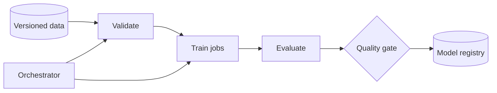

ML Training Pipeline 最先要解决的不是“多加 GPU”，而是**同一个模型能否被解释、复现和安全发布**。

一次实验得到 92% accuracy，但没人记录使用了哪份数据、哪版特征代码和哪些超参数。下周指标降了，团队既无法复现，也无法判断差异来自数据还是代码。这个失败说明训练产物必须带 lineage。

> 对应实验：[打开 ML Training Pipeline Lab](https://lab.zichaoyang.com/system-design/ml-training-pipeline/)。增加 job 数、dataset 大小与 GPU 数，观察 scheduler 和 artifact lineage 的作用。

## 需求边界（Requirements）

功能上提交 run、执行可重试步骤、追踪 artifact/metric、评估并注册模型。非功能上要求可复现 lineage、资源公平、失败恢复和发布门禁；time-to-result 比 HTTP latency 更重要。

## 0. 先搭一个可复现训练脚本 MVP Scaffold

第一版是一条命令：读取固定 dataset snapshot，训练，评估，写 checkpoint 和 `run.json`。`run.json` 至少记录 git commit、参数、随机种子、输入 snapshot、环境 image digest、指标和 artifact checksum。先在一台机器上重复两次得到可解释结果，再做分布式调度。

然后把脚本拆成 `validate -> preprocess -> train -> evaluate -> register` 五个可单独重试的 step。最初用 Makefile 或简单 runner 即可，不必先引入大型 orchestrator。

## 1. API：训练是异步 Run

```http
POST /v1/training-runs
{"project":"fraud","codeRef":"git:abc123","dataset":"fraud@2026-07-12",
 "config":{"learningRate":0.001},"resources":{"gpu":4}}

202 Accepted
{"runId":"run-88","state":"queued"}
```

还需要 cancel、status、logs、artifacts 与 retry API。相同 client run key 不重复创建昂贵 job。

## 2. 数据模型（Data Model）

```text
Run(run_id PK, project, code_ref, config, dataset_version, image_digest, state, created_at)
Step(run_id, step_name, attempt, state, input_artifacts, output_artifacts, resource_request)
Artifact(artifact_id PK, content_hash, object_url, type, metadata)
Metric(run_id, step, name, value, slice, recorded_at)
ModelRegistration(model_name, version, run_id, artifact_id, stage)
```

Artifact content-addressed、不可变；Run/Step 是控制状态。不要把大 checkpoint 塞数据库。

## 3. 单机端到端流程

Runner 创建 Run，锁定 input versions，依次执行 step。每步先写 running lease，输出到临时 object key，校验后登记 artifact 并置 success。Crash 后 lease 过期，只重试失败 step；相同 inputs+code+config 可命中 cache，但 cache key 必须完整。

## 4. 容量估算：GPU 与数据入口都要算

每天 1000 个 job、平均 8 GPU 跑 4 小时，需要 32k GPU-hours/day，持续平均约 1333 GPU；考虑峰值和故障可能配 2000。若每 run 扫 10TB，直接重复读取是 10PB/day，object storage 和网络会先成为瓶颈，需要 shared preprocessing artifact、shard 与本地 cache。

## 5. Latency Budget：训练关注 queue time 与 time-to-result

在线 p99 不适用。核心 SLO 是排队时间、step runtime、GPU utilization 和失败恢复时间。高优线上 hotfix 可以抢占低优 sweep；但 gang job 必须一起分配 GPU，半组资源无法开跑。

## 6. Correctness and Reliability

每 step 幂等，artifact 发布原子。Checkpoint 保存 model/optimizer/RNG/dataloader position。Preemptible worker 被回收后从最近 checkpoint 恢复。Dataset validation 和 evaluation gate 失败不得注册 production model。Lineage 能从部署版本追到 run、代码、数据与配置。

## 7. Trade-offs：吞吐、公平和复现

- 大量并行 sweep 加快探索，却可能饿死生产 retraining，需要 quota/priority。
- Aggressive cache 省计算，但不完整 key 会复用错误结果。
- Spot GPU 便宜但增加中断与 checkpoint 开销。
- 自动注册快，人工审批稳；高风险模型通常保留 gate。

## 核心对象

- **Dataset snapshot**：不可变的数据版本，而不是会变化的表名。
- **Run**：代码 commit、配置、输入版本、资源和指标的一次完整记录。
- **Artifact**：checkpoint、模型、评估报告等内容寻址产物。
- **DAG**：ingest、validate、train、evaluate、register 的依赖关系。

## 主链路



Orchestrator 管依赖和重试；scheduler 管 CPU/GPU 配额、优先级和 placement。两者不要混为一谈。训练 job 通过 manifest 读取 versioned data，产出 artifact 和 metrics；quality gate 通过后才注册模型。

## 架构演化

1. 少量实验时脚本足够，但必须记录输入和结果。
2. 多步骤、多团队后 DAG 让依赖、缓存和失败恢复显式化。
3. GPU 成为共享稀缺资源后，需要 queue、quota、priority 和 gang scheduling。
4. 大 dataset 推动 shard、parallel loader 与本地 cache，避免 GPU 等数据。
5. 自动 retraining 出现后，data validation、offline evaluation 和 approval gate 防止坏模型自动上线。

## 常见难点

- 重试必须幂等；相同 run ID 不应重复注册多个模型。
- 缓存中间结果时，cache key 必须包含代码、数据和参数版本。
- 指标可比不代表数据分布相同，要保存 slice metrics 与 dataset statistics。
- Spot GPU 降成本但会被回收，需要 checkpoint 与可恢复训练。

## 面试表达

> I would make every run reproducible through immutable data, code, configuration, and artifact lineage, then use a DAG orchestrator and resource scheduler to scale execution safely.

先讲 reproducibility，再讲规模。否则答案很容易退化成“Kubernetes 加 Airflow”的工具清单。
