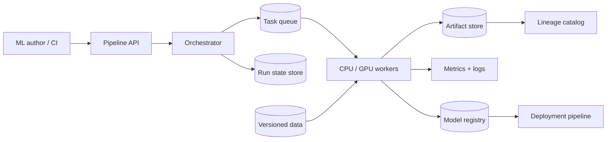

一个 notebook 可以很快训练出第一个模型。三个月后，团队往往会遇到更难的问题：这个模型到底用了哪批数据？为什么同事跑同一份 notebook 得到不同指标？线上版本出问题时，能不能重新生成上一版 artifact？

ML training pipeline 的价值不是把 notebook 换成一张漂亮 DAG，而是把一次实验变成一个**有确定输入、确定产物、可重试、可比较、可审计的运行对象**。

> 配套实验：[打开 ML Training Pipeline Lab](https://lab.zichaoyang.com/system-design/ml-training-pipeline/)。先从一个 notebook 开始，再增加 dataset version 和并发 job；观察瓶颈为什么从训练代码转向编排与治理。

## 一个“代码没变”的模型为什么变了

研究员周一运行：

```python
data = read_table("warehouse.transactions")
model.fit(data)
```

周五重新运行同一格代码，仓库里已经多了四天数据，部分旧记录也被修正。即使 git commit、随机种子和超参数都相同，输入集合已经不是原来那一份。

若模型表现变化，我们无法判断是代码、数据、依赖还是随机性造成的。更严重的是，周一模型可能已经上线，却没有任何 manifest 能证明它训练时看过什么。

因此第一条原则是：**训练 job 不能读取“某张不断变化的表”，必须读取一个不可变 dataset snapshot 或 manifest。**

## 先把四个对象讲清楚

**Run**

一次完整训练尝试，绑定 code、data、config、environment 和初始 model。Run ID 是所有 metrics 与 artifact 的根。

**Stage**

可独立重试和缓存的一步，例如 validation、feature transform、training、evaluation。Stage 应有明确输入输出，而不是靠共享目录传递隐式状态。

**Artifact**

由 stage 产生的不可变对象，例如 dataset manifest、feature matrix、model weights、metrics report。

**Lineage**

从 artifact 反向追踪它由哪个 run、哪些输入和哪版代码产生，也能正向查询一批问题数据影响了哪些模型。

Model registry 只是管理模型 artifact 生命周期；experiment tracker 记录 run 参数和指标；orchestrator 决定 stage 何时运行。把三者叫成一个“大 MLOps 数据库”会让职责模糊。

## 题目边界

本文平台支持：

1. 用户提交版本化 pipeline spec；
2. Orchestrator 按 DAG 执行 validation、transform、train、evaluate；
3. 每个 run 记录参数、指标、日志和 artifact lineage；
4. 通过门禁的模型进入 registry；
5. 可以由 schedule、新数据或代码变更触发 retraining；
6. 失败 stage 能从安全边界重试。

第一版不设计 feature store、在线 serving 和底层 GPU collective。它们是相邻系统，通过 artifact 和 deployment contract 对接。

非功能要求：

- Run 可复现，所有输入 immutable；
- Stage 幂等，重试不生成含义不明的重复 artifact；
- 训练集与模型受权限和保留策略保护；
- CPU、GPU 和内存资源可调度并有租户 quota；
- 失败能定位到 stage 和具体 input shard；
- 只有通过 evaluation 与审批的模型才能进入生产 stage。

## 第一版：先把 notebook 变成一个可重放命令

不要急着部署 Airflow 或 Kubeflow。先把 notebook 中依赖顺序整理成一个 CLI：

```bash
train-model \
  --dataset-manifest s3://ml-data/fraud/v17/manifest.json \
  --config configs/fraud-xgb-v3.yaml \
  --code-revision 4f20a19 \
  --output-uri s3://ml-artifacts/runs/run-41/
```

Run manifest：

```yaml
run_id: run-41
pipeline_version: fraud-training@8
code_revision: 4f20a19
container_image: fraud-trainer@sha256:...
dataset_manifest: fraud-data@v17
base_model: null
seed: 42
parameters:
  max_depth: 8
  learning_rate: 0.05
```

命令完成后写一个不可变结果：

```text
RunResult(
  run_id,
  state,
  model_artifact_uri,
  model_artifact_hash,
  metrics_uri,
  started_at,
  completed_at
)
```

如果这一步都无法从干净环境重跑，加入 scheduler 只会自动化不可复现过程。

## 第二版：拆成四个有契约的 Stage

```text
validate data
-> transform features
-> train model
-> evaluate candidate
```

每个 stage 的输入输出写进 spec：

```yaml
stages:
  - id: validate
    image: data-validator@sha256:...
    inputs: [dataset_manifest]
    outputs: [validation_report]

  - id: transform
    image: feature-builder@sha256:...
    inputs: [dataset_manifest, validation_report]
    outputs: [train_matrix, transform_contract]

  - id: train
    image: fraud-trainer@sha256:...
    inputs: [train_matrix, training_config]
    outputs: [model, train_metrics]

  - id: evaluate
    image: evaluator@sha256:...
    inputs: [model, evaluation_dataset]
    outputs: [evaluation_report]
```

Stage output key 可由下面这些输入的 hash 决定：

```text
stage code + container + input artifact hashes + parameters
```

相同输入重试时，若之前产物完整且通过 checksum，可以复用；任一输入改变，就产生新 artifact。这样 cache 是可解释的，不是“目录里好像有个文件就跳过”。

## API：提交的是 Pipeline Spec，不是任意 shell

```http
POST /v1/pipeline-runs

{
  "pipelineVersion":"fraud-training@8",
  "parameters":{
    "dataset":"fraud-data@v17",
    "trainingConfig":"xgb@v3"
  },
  "trigger":{
    "type":"manual",
    "requestedBy":"alice"
  }
}
```

```http
202 Accepted

{"runId":"run-41","state":"queued"}
```

查询与控制：

```http
GET  /v1/pipeline-runs/run-41
GET  /v1/pipeline-runs/run-41/stages
POST /v1/pipeline-runs/run-41/cancel
POST /v1/pipeline-runs/run-41/stages/train/retry
```

只允许重试失败 stage 的前提，是它的上游 artifact 仍然 immutable 且可访问。若用户修改参数，应创建新 run，而不是把旧 run 的历史改掉。

## 数据模型

```text
PipelineDefinition(
  pipeline_name, version, spec_uri, spec_hash,
  owner, state, created_at
)

PipelineRun(
  run_id, pipeline_name, pipeline_version,
  state, trigger_type, trigger_ref,
  submitted_by, created_at, completed_at
)

StageRun(
  run_id, stage_id, attempt,
  input_hash, state, allocation_id,
  started_at, completed_at, failure_reason
)

Artifact(
  artifact_id, type, uri, content_hash,
  schema_hash, producer_run, producer_stage,
  created_at, retention_class
)

ArtifactEdge(
  input_artifact_id, output_artifact_id,
  run_id, stage_id
)

ModelVersion(
  model_name, version, artifact_id,
  evaluation_report_id, stage,
  approved_by, created_at
)
```

`ArtifactEdge` 形成 lineage graph。查询“这个 production model 依赖哪些 dataset”沿边向上走；查询“坏掉的 source snapshot 影响哪些模型”沿边向下走。

## 高层架构：编排状态和大数据传输分离



Orchestrator 只传 artifact metadata 和 URI，不把 TB 级 feature matrix 经过自己的内存。Worker 从 object storage 或 warehouse 直接读取。

Run state store 保存状态机；task queue 提供至少一次投递；worker 通过 lease 执行 stage。Stage 自身必须幂等，因为 queue 可能重复交付。

## Data validation 应该挡住什么

训练开始前至少检查：

- Schema：字段缺失、类型变化、枚举新增；
- Volume：row count 是否异常下降或暴涨；
- Quality：null、duplicate、范围、时间覆盖；
- Leakage：label 或未来字段是否进入 feature；
- Split：train、validation、test 是否按 entity/time 正确隔离；
- Policy：PII、license 和数据保留是否允许该用途。

Validation report 是 artifact，并且是 train stage 的必需输入。不要只发 Slack 告警后继续训练；违反 hard gate 的 run 必须停止。

软变化可以记录 warning，例如某特征分布轻微漂移；硬变化如 label 列缺失则 fail。Gate policy 同样需要版本化。

## Experiment tracking：记录什么才有用

最少记录：

- 参数和随机种子；
- code revision、container digest 和依赖；
- input artifact IDs；
- 每个 epoch/step 的 metrics；
- 系统指标，如 GPU memory、throughput 和 stage duration；
- 输出 model、plots、evaluation report。

Tracker 不是训练事实来源。Immutable run manifest 和 artifact hash 才能证明输入；tracker 更适合查询、比较和可视化。

高频 step metrics 不应每条同步写主数据库。Worker 批量上报到 metrics pipeline，Run 表只存摘要和链接。

## Model Registry：不是文件列表，而是发布状态机

```text
CANDIDATE -> VALIDATED -> STAGING -> PRODUCTION -> RETIRED
```

一次 promotion 命令应验证：

1. Model artifact checksum 正确；
2. Evaluation report 来自允许的 dataset version；
3. 指标超过 gate，且关键切片无 regression；
4. Feature contract 与 serving 环境兼容；
5. 必要审批完成；
6. 当前 production version 可回滚。

Registry 不直接覆盖 `model/latest.bin`。Deployment pin immutable model version；`PRODUCTION` 是可变指针和审计事件。

## 容量估算：分别算 Job、Data、Compute 和 Metadata

假设每天 10,000 个 pipeline run，平均 6 个 stage：

```text
10,000 × 6 = 60,000 stage runs/day
```

Orchestrator 平均不到 1 task/s，但高峰和 retry 可能高很多。它通常不是主要瓶颈；真正资源在 data scan 和训练。

若每个 run 扫 200GB：

```text
10,000 × 200GB = 2PB logical reads/day
```

Stage cache、共享 feature artifact 和数据本地性可能比扩 Orchestrator 更省钱。

如果 10% run 使用 8 GPU、平均 2 小时：

```text
1,000 × 8 × 2 = 16,000 GPU-hours/day
```

平均需要约 667 张 GPU 持续运行，再加高峰、维护和 headroom。Scheduler 要按队列等待和利用率扩容，不是按 API QPS。

Artifact storage 也会迅速增长。若每个 run 平均产生 10GB，日增 100TB。必须按 artifact 类型定义 retention：失败 run 的临时矩阵、长期保留的 production lineage、可重算 cache 不应同一策略。

## 调度：CPU 与 GPU 只是开始

Stage spec 还要声明 memory、local disk、dataset locality、GPU type、数量、是否 gang schedule、preemptibility 和 deadline。

Validation 通常 CPU/IO-heavy；transform 可能用大内存 Spark；training 用 GPU；evaluation 可能再次需要 GPU。把整个 DAG 绑在一台“大机器”上会让多数阶段浪费资源。

多租户使用 quota + priority。Production hotfix 可以抢占探索实验，但 worker 必须先 checkpoint。若 stage 不支持安全 checkpoint，就不应标成 preemptible。

## 故障恢复与 Exactly-once Artifact

Queue 只能现实地提供 at-least-once task delivery。我们追求的是每个逻辑 stage 只发布一份有效 artifact：

1. Worker 获取 `(run_id, stage_id, attempt)` lease；
2. 输出写到 attempt 临时路径；
3. 完成后计算 checksum、schema 和 row count；
4. 用 compare-and-swap 提交 artifact manifest；
5. 只有 winning attempt 的 artifact 进入 lineage；
6. 其他 attempt 的临时数据异步清理。

外部副作用如“注册模型”也要使用 run/stage idempotency key。Worker timeout 后重试，不能注册两个语义相同却 version 不明的模型。

## 持续训练：触发快不等于应该自动上线

触发来源可以是：

- 固定 schedule；
- 新数据达到阈值；
- 线上 drift 或性能下降；
- Feature/code 变更；
- 人工请求。

这些触发只创建新 run。是否 promotion 仍取决于 evaluation gate。数据每天更新，不代表模型每天都应上线。

为了防止重复触发，可用 `(pipeline_version, dataset_version, config_version)` 作为逻辑 key。相同输入已经有成功 run 时，复用结果或要求显式 `force`。

## 观测与运营

- Run 成功、失败、取消和 queue wait；
- Stage duration、retry、cache hit 和资源使用；
- GPU/CPU utilization、data read throughput 和 idle allocation；
- Artifact 写入失败、校验错误、storage growth；
- Data validation gate 与 drift；
- 模型 evaluation、promotion、rollback 和 production age；
- Lineage completeness：有没有 artifact 缺 owner 或 source。

指标按 pipeline、owner、stage 和 failure reason 切片。一个总体 95% 成功率，可能掩盖某条关键生产 pipeline 连续失败。

## 关键取舍

**更细的 Stage** 允许缓存和局部重试，却增加调度、artifact 和 lineage 开销。

**更强的 reproducibility** 要保存更多 data/version/environment 信息，也增加存储和流程约束；生产模型通常值得。

**自动 retraining** 缩短模型老化时间，也可能在坏数据到达时自动放大事故。Validation 和 release gate 必须先于自动化。

**Artifact cache** 节省计算，但 cache key 少一个输入版本就会复用错误结果。宁可保守 miss，也不要错误 hit。

**抢占低优先级训练** 提高集群利用率，代价是 checkpoint 开销和完成时间波动。

## 用 Lab 跟着架构演化

**实验一：从 notebook 到 scheduled DAG**

先增加每日 job 数，不增加模型。观察问题如何先从代码变成可重复执行、排队和失败恢复。

**实验二：增加 dataset 大小**

观察 data scan 和 artifact storage，而不是只看 GPU。尝试复用 transform artifact，比较成本。

**实验三：增加 experiment 与自动 retraining**

问自己 registry、evaluation gate 和 retention 在什么时候成为必要组件。自动触发不是自动发布。

## 面试表达：先把一次 Run 说完整

可以这样开场：

> I would first turn a notebook into a reproducible run with immutable code, data, configuration, environment, and output artifacts. Only after that contract is solid would I split it into an orchestrated DAG for caching, retries, resource scheduling, and continuous retraining.

推荐演化顺序：

```text
replayable CLI run
-> typed stages and artifacts
-> scheduler + retries
-> experiment tracking and lineage
-> model registry and gates
-> automated retraining triggers
```

讲完后再问：

> I can go deeper into artifact idempotency, GPU scheduling, data validation, or registry and promotion semantics.

这比一上来列 Airflow、Spark、MLflow 更专业，因为工具出现之前，每个组件已经有一个真实要解决的问题。

## 参考资料

- [TFX: A TensorFlow-Based Production-Scale Machine Learning Platform](https://research.google/pubs/tfx-a-tensorflow-based-production-scale-machine-learning-platform/)
- [Hidden Technical Debt in Machine Learning Systems](https://papers.nips.cc/paper/5656-hidden-technical-debt-in-machine-learning-systems)
- [The ML Test Score: A Rubric for ML Production Readiness](https://research.google/pubs/the-ml-test-score-a-rubric-for-ml-production-readiness-and-technical-debt-reduction/)
- [MLflow Model Registry](https://mlflow.org/docs/latest/ml/model-registry/)
