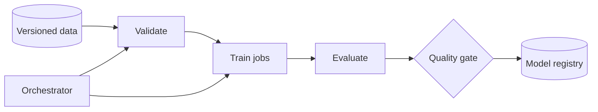

ML Training Pipeline 最先要解决的不是“多加 GPU”，而是**同一个模型能否被解释、复现和安全发布**。

一次实验得到 92% accuracy，但没人记录使用了哪份数据、哪版特征代码和哪些超参数。下周指标降了，团队既无法复现，也无法判断差异来自数据还是代码。这个失败说明训练产物必须带 lineage。

> 对应实验：[打开 ML Training Pipeline Lab](https://lab.zichaoyang.com/system-design/ml-training-pipeline/)。增加 job 数、dataset 大小与 GPU 数，观察 scheduler 和 artifact lineage 的作用。

## 核心对象

- **Dataset snapshot**：不可变的数据版本，而不是会变化的表名。
- **Run**：代码 commit、配置、输入版本、资源和指标的一次完整记录。
- **Artifact**：checkpoint、模型、评估报告等内容寻址产物。
- **DAG**：ingest、validate、train、evaluate、register 的依赖关系。

## 主链路

Orchestrator 管依赖和重试；scheduler 管 CPU/GPU 配额、优先级和 placement。两者不要混为一谈。训练 job 通过 manifest 读取 versioned data，产出 artifact 和 metrics；quality gate 通过后才注册模型。

## 架构演化

1. 少量实验时脚本足够，但必须记录输入和结果。
2. 多步骤、多团队后 DAG 让依赖、缓存和失败恢复显式化。
3. GPU 成为共享稀缺资源后，需要 queue、quota、priority 和 gang scheduling。
4. 大 dataset 推动 shard、parallel loader 与本地 cache，避免 GPU 等数据。
5. 自动 retraining 出现后，data validation、offline evaluation 和 approval gate 防止坏模型自动上线。

## 常见难点

- 重试必须幂等；相同 run ID 不应重复注册多个模型。
- 缓存中间结果时，cache key 必须包含代码、数据和参数版本。
- 指标可比不代表数据分布相同，要保存 slice metrics 与 dataset statistics。
- Spot GPU 降成本但会被回收，需要 checkpoint 与可恢复训练。

## 面试表达

> I would make every run reproducible through immutable data, code, configuration, and artifact lineage, then use a DAG orchestrator and resource scheduler to scale execution safely.

先讲 reproducibility，再讲规模。否则答案很容易退化成“Kubernetes 加 Airflow”的工具清单。
