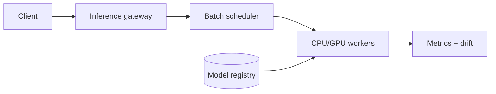

Model Serving 的核心不是给模型包一层 HTTP，而是同时满足 p99 latency、硬件利用率和安全发布。三者经常冲突：batch 越大 GPU 越高效，但单个请求等 batch 的时间越长。

> 对应实验：[打开 Model Serving Lab](https://lab.zichaoyang.com/system-design/model-serving/)。提高 QPS、模型大小和 batch window，再收紧 p99，观察 scheduler 的取舍。

## 最小例子

单个请求在 GPU 上跑 8ms。如果逐个执行，每秒上限约 125 个；把 16 个请求组成 batch，也许只需 20ms，总吞吐大幅提高。但第一个请求要先等待其他请求到齐。Batching 是 throughput 与 queueing latency 的交易，不是免费优化。

## 概念阶梯

- **Dynamic batching**：在很短窗口内合并兼容请求，并设最大 batch 和 deadline。
- **Model registry**：保存 artifact、schema、版本、依赖和审批状态，是部署 source of truth。
- **Canary**：只让少量流量进入新版本，以错误率、latency 和业务指标决定继续或回滚。

## 主路径

Gateway 做认证、schema validation 和版本路由；scheduler 按模型、shape、deadline 聚合；worker 从 registry 拉取并预热模型。Autoscaler 不只看 CPU，还要看 queue delay、batch fullness、GPU memory 和 model load time。

## 架构演化

1. 单模型低流量：一个常驻进程即可，先优化正确性和可观测性。
2. QPS 上升：dynamic batching 提升利用率，但受 p99 budget 约束。
3. 模型变大：GPU worker 与 CPU preprocessing 分离，避免昂贵设备等待 I/O。
4. 多版本：registry、canary、shadow traffic 和快速 rollback 变成发布基础设施。
5. 多模型：需要 placement 与 memory packing；频繁换模型会产生 cold-load 抖动。

## 常见难点

- queue 满时要 backpressure 或 load shedding，不能让等待无限增长。
- timeout 后请求可能仍在 GPU batch 中计算，需要取消策略或接受浪费。
- 新版本技术指标正常，业务分布却漂移，因此监控不止 latency/error。
- GPU OOM 往往来自输入 shape 或并发变化，需要 admission control。

## 面试表达

> The main tradeoff is batching efficiency versus tail latency. I would use deadline-aware dynamic batching, versioned model loading, and canary traffic with fast rollback.

面试时先明确 online/batch inference、模型大小、QPS 和 p99。没有这些约束，谈 GPU、Kubernetes 或 Triton 都只是名词堆叠。
