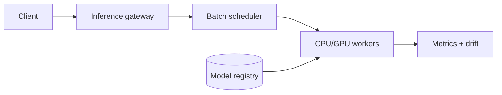

Model Serving 的核心不是给模型包一层 HTTP，而是同时满足 p99 latency、硬件利用率和安全发布。三者经常冲突：batch 越大 GPU 越高效，但单个请求等 batch 的时间越长。

> 对应实验：[打开 Model Serving Lab](https://lab.zichaoyang.com/system-design/model-serving/)。提高 QPS、模型大小和 batch window，再收紧 p99，观察 scheduler 的取舍。

## 需求边界（Requirements）

功能上提供 versioned online predict、部署、canary 和 rollback；batch inference 分开。非功能上满足 p99、吞吐、GPU memory 隔离与可观测性，模型/输入 schema 不匹配必须失败而非静默推理。

## 0. 先搭单模型同步 MVP Scaffold

把一个已训练模型固定在版本 `v1`，server 启动时加载并 warm up；提供 `/predict`；做输入 schema validation、timeout、基础 metrics 和 health/readiness。第一版一进程一模型、无 batching、CPU 即可。先测单请求 latency、memory 和最大并发。

部署流程也从最小闭环开始：artifact 上传 object storage，registry 记录 checksum/schema，启动参数指定 version，readiness 只有 warmup 成功后才通过。

## 1. API：输入契约必须版本化

```http
POST /v1/models/fraud-score:predict
X-Model-Version: 18

{"requestId":"r-7","instances":[{"featureVectorVersion":"checkout-v7","values":{...}}]}

200 OK
{"predictions":[{"score":0.83}],"modelVersion":"18"}
```

Batch size、payload 和 deadline 都有限制。Async batch inference 是另一套 job API，不应与 online endpoint 混合。

## 2. 数据模型（Data Model）

```text
ModelVersion(model_name, version, artifact_url, checksum, input_schema,
             framework, resource_profile, stage, created_at)
Deployment(deployment_id, model_version, traffic_weight, replica_count, state)
InferenceLog(request_id, model_version, schema_version, latency, outcome, sampled_features)
```

Registry 是发布 source of truth，artifact immutable。Deployment 只引用版本，不覆盖 artifact。

## 3. 单机端到端流程

Request validation 后进入 bounded queue；worker 做 preprocessing、model forward、postprocessing，记录分段 latency。Queue 满立即 `429/503`，不能无限等待。新版本在旁路进程 warmup，通过 sample parity 后切流。

## 4. 容量估算：先用 service time 算 worker

单请求 GPU service time 10ms，逐个处理理论 100 QPS/GPU；峰值 10k QPS 至少 100 GPU，且没有冗余。若 batch 16 用 30ms，吞吐约 533 QPS/GPU，约 19 GPU 即可，但增加 queue wait。20GB 模型在 40GB GPU 上考虑 runtime/KV/input buffer 后可能只能放一个 replica。

## 5. Latency Budget：queueing 是最容易失控的一段

总 p99 100ms 可分 ingress 10ms、queue 15ms、preprocess 10ms、inference 45ms、postprocess 5ms、余量 15ms。Batch scheduler 以 deadline 而非只以“凑满”为准。Autoscaler 看 queue delay 和 utilization，不能只看 CPU。

## 6. Correctness and Reliability

请求记录实际模型与 feature schema 版本。Canary 比较 error、p99 和业务指标，异常自动回滚。Replica crash 由 gateway 重试只限幂等预测；过载时 load shed。模型加载 checksum 不匹配或 warmup 失败，readiness 必须保持 false。

## 7. Trade-offs：利用率、尾延迟和隔离

- 大 batch 提高吞吐但增加等待；deadline-aware dynamic batching 找平衡。
- 多模型共享 GPU 提高利用率，却引入 memory contention 和 noisy neighbor。
- Shadow 流量不影响用户但成本翻倍；canary 能看真实结果却有小范围风险。

## 最小例子

单个请求在 GPU 上跑 8ms。如果逐个执行，每秒上限约 125 个；把 16 个请求组成 batch，也许只需 20ms，总吞吐大幅提高。但第一个请求要先等待其他请求到齐。Batching 是 throughput 与 queueing latency 的交易，不是免费优化。

## 概念阶梯

- **Dynamic batching**：在很短窗口内合并兼容请求，并设最大 batch 和 deadline。
- **Model registry**：保存 artifact、schema、版本、依赖和审批状态，是部署 source of truth。
- **Canary**：只让少量流量进入新版本，以错误率、latency 和业务指标决定继续或回滚。

## 主路径



Gateway 做认证、schema validation 和版本路由；scheduler 按模型、shape、deadline 聚合；worker 从 registry 拉取并预热模型。Autoscaler 不只看 CPU，还要看 queue delay、batch fullness、GPU memory 和 model load time。

## 架构演化

1. 单模型低流量：一个常驻进程即可，先优化正确性和可观测性。
2. QPS 上升：dynamic batching 提升利用率，但受 p99 budget 约束。
3. 模型变大：GPU worker 与 CPU preprocessing 分离，避免昂贵设备等待 I/O。
4. 多版本：registry、canary、shadow traffic 和快速 rollback 变成发布基础设施。
5. 多模型：需要 placement 与 memory packing；频繁换模型会产生 cold-load 抖动。

## 常见难点

- queue 满时要 backpressure 或 load shedding，不能让等待无限增长。
- timeout 后请求可能仍在 GPU batch 中计算，需要取消策略或接受浪费。
- 新版本技术指标正常，业务分布却漂移，因此监控不止 latency/error。
- GPU OOM 往往来自输入 shape 或并发变化，需要 admission control。

## 面试表达

> The main tradeoff is batching efficiency versus tail latency. I would use deadline-aware dynamic batching, versioned model loading, and canary traffic with fast rollback.

面试时先明确 online/batch inference、模型大小、QPS 和 p99。没有这些约束，谈 GPU、Kubernetes 或 Triton 都只是名词堆叠。
