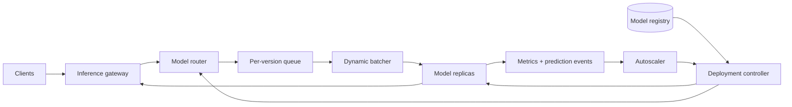

模型在 notebook 里跑出一个预测，只证明它“能算”。生产 serving 还要回答另一组问题：请求用了哪版模型和特征？高峰时是否还能守住 p99？新模型如何只接 1% 流量？GPU batching 提高吞吐时，单个用户要多等多久？

这道题的核心不是给 `model.predict()` 包一层 HTTP，而是：**怎样让不同版本、不同资源形态的模型在一个稳定的延迟与发布契约下提供预测。**

> 配套实验：[打开 Model Serving Lab](https://lab.zichaoyang.com/system-design/model-serving/)。先保持单 replica，分别增加模型计算时间和请求率；看到排队后，再打开 dynamic batching。

## 一个 2ms 模型为什么会有 500ms p99

假设模型单次计算只要 2ms，服务每秒稳定处理 400 个请求。单 replica 理论上每秒最多完成约 500 次推理，看起来还有余量。

如果某一秒突然到达 700 个请求，后面的请求就会排队。即使每个计算仍然只有 2ms，队尾也可能等待几百毫秒。模型 latency 没变，端到端 p99 却崩了。

因此必须区分：

```text
end-to-end latency
= gateway + queue + batch wait + model compute + serialization + network
```

“模型 forward 只要 2ms”不能代表服务满足 20ms SLO。排队才是许多 serving 故障的真正来源。

## 先讲清几个对象

**Model artifact**

不可变的权重和运行图，带 checksum、framework/runtime 要求。

**Model version**

Artifact 加上 input/output schema、preprocessing、feature contract 和 deployment config。只有 weights hash 不足以定义可复现预测。

**Replica**

已经加载某个 model version、可以接收请求的进程或容器。它可能运行在 CPU、GPU 或专用加速器上。

**Dynamic batching**

在很短的窗口内把多个独立请求合成一个 batch，以提高硬件吞吐。代价是每个请求先等待 batch 形成。

**Canary 与 shadow**

Canary 让新版本真正影响一小部分响应；shadow 复制请求给新版本，但用户仍收到旧版本结果。Shadow 更安全，却要付双份计算。

## 题目边界

本文平台支持：

1. 发布和加载 immutable model version；
2. 实时同步预测与批量预测；
3. 按 tenant、model 和 version 路由；
4. Dynamic batching、autoscaling 和 overload protection；
5. Canary、shadow、A/B 和快速回滚；
6. 记录 prediction metadata、latency 和 usage。

第一版不设计训练 pipeline、feature store 和 LLM autoregressive decode。LLM serving 的 KV cache 与 token scheduler 是另一道题。

非功能目标：

- 在线预测 p99 例如 50ms；
- 过载时快速拒绝或降级，不能无限排队；
- 每个响应绑定具体 model version；
- 模型与租户数据隔离；
- 发布失败不影响当前 production version；
- Autoscaling 同时考虑 queue、latency、cost 和 cold start。

## 第一版：一个进程、一个模型、一个同步 API

启动时加载 model 和 schema：

```python
model = load_model("fraud-xgb@sha256:...")
schema = load_schema("fraud-input@v3")

def predict(request):
    validated = schema.validate(request.features)
    tensor = preprocess(validated)
    output = model.forward(tensor)
    return postprocess(output)
```

这一版先把协议做严：

1. Model 在 readiness 之前已完整加载并跑过健康样例；
2. 未知字段、缺失字段、NaN 和类型错误明确拒绝；
3. Preprocessing 是 model version 的一部分，不由客户端随意实现；
4. 每个响应返回实际使用的 version；
5. 设置请求 deadline 和最大 payload。

### Predict API

```http
POST /v1/models/fraud:predict
X-Request-Id: req-91

{
  "instances":[{
    "amount":800.00,
    "accountAgeDays":91,
    "declines5m":3
  }],
  "deadlineMs":50
}
```

```json
{
  "predictions":[{"riskScore":0.87}],
  "modelVersion":"fraud@17",
  "schemaVersion":"fraud-input@3"
}
```

一条请求允许多个 instances，但平台设置最大 batch。客户端批量和服务端 dynamic batching 可以同时存在，scheduler 最终按总 instance 数计算资源。

## 数据模型：Deployment 不是 Model 本身

```text
ModelVersion(
  model_name,
  version,
  artifact_uri,
  artifact_hash,
  runtime,
  input_schema_version,
  output_schema_version,
  feature_contract_version,
  state
)

Deployment(
  deployment_id,
  model_name,
  environment,
  routing_policy_version,
  resource_profile,
  state,
  created_at
)

DeploymentTarget(
  deployment_id,
  model_version,
  traffic_weight,
  shadow,
  min_replicas,
  max_replicas
)

PredictionRecord(
  request_id,
  tenant_id,
  model_version,
  latency_ms,
  outcome,
  input_hash,
  created_at
)
```

输入原文是否保存由隐私政策决定。大多数平台默认保留 hash、schema、版本和抽样 trace，而不是永久记录每个敏感 feature。

Deployment 的路由策略是可变配置，但每次变化都产生版本和审计事件。这样才能重建某个时间点 90/10 canary 的真实状态。

## 第二版：加有界队列和 admission control

每个 model replica 前有一个小的有界 queue。请求到达时检查：

- payload 和 instance count；
- 剩余 deadline 是否还足够完成排队与计算；
- queue 是否已满；
- tenant quota；
- 目标 version 是否 ready。

不满足时立即返回 `429` 或 `503`，而不是接受后在队列里过期。过载保护的目标是让系统在 2 倍流量下仍能对一部分请求快速成功，而不是让所有请求一起超时。

Queue depth 应按预计计算 work，而不只按 request 数。一个包含 1,000 instances 的请求远大于单 instance。

## Dynamic batching：吞吐来自等待，等待必须有上限

假设 GPU：

```text
batch=1   -> 2ms,  500 instances/s
batch=8   -> 5ms, 1600 instances/s
batch=32  -> 12ms, 2667 instances/s
```

Batch 越大，总吞吐越高，但第一个请求要等待其他请求到达。Scheduler 可以使用两个上限：

```text
max_batch_size = 32
max_batch_delay = 3ms
```

达到任一条件就发车。伪代码：

```python
batch = [queue.take()]
deadline = now() + max_batch_delay

while len(batch) < max_batch_size and now() < deadline:
    next_request = queue.take_until(deadline)
    if next_request:
        batch.append(next_request)

outputs = model.forward(stack(batch))
split_and_respond(outputs, batch)
```

实际实现还要避免把不同 model version、不同 shape 或不同 deadline 随意混成一批。对于 variable-length input，可以按长度 bucket，减少 padding 浪费。

Dynamic batching 适合 GPU 或能从向量化中获益的模型。CPU 上的轻量树模型可能 batch 收益很小，不值得引入等待。

## 高层架构：控制面管理版本，数据面保护延迟



Gateway 负责鉴权、quota、deadline 和 payload；Router 锁定具体 version；Batcher 与 replica 属于低延迟数据面。

Registry、deployment controller 和 autoscaler 属于控制面。控制面短暂故障时，已运行 replicas 应继续服务当前路由，不能因为拿不到最新配置就停止预测。

## 发布新模型：先加载，再健康检查，最后切流

安全顺序：

1. 下载 artifact 到新 replica；
2. 验证 hash、runtime 和 schema；
3. 加载模型并运行 golden examples；
4. 预热 kernel、JIT 和 memory allocator；
5. 标记 ready；
6. Shadow 或切 1% canary；
7. 观察 latency、error、业务指标和输出分布；
8. 逐步增加权重；
9. 旧版本 drain 后再缩容。

Readiness 不能只检查 HTTP port 已打开。模型仍在加载时接流量，会让第一批请求承担几秒到几分钟 cold start。

Rollback 只改变 routing pointer，旧 immutable version 在观察窗口内保留 warm replicas。若为了省钱立即删掉旧版本，真正事故时就无法快速回滚。

## Shadow 和 Canary 分别回答什么

Shadow 同一请求同时发给旧、新模型：

- 比较输出 disagreement；
- 测量新模型真实 latency 和 resource；
- 不改变用户结果。

但 shadow 流量会使计算翻倍，也可能重复调用不该重复的下游。Model serving 只做纯预测时较安全。

Canary 让少量用户真正收到新结果，可以观察真实业务指标和反馈。但分流应稳定，例如按 `user_id` hash，而不是每次请求随机；同一用户反复切版本会污染体验和实验。

## 容量估算：从单 replica benchmark 推导，不从 GPU 数猜

假设单 GPU 在 batch=16 时能稳定完成 2,000 instances/s。高峰 50K instances/s，希望最多 70% utilization 保护 p99：

```text
required replicas
= 50,000 / (2,000 × 0.70)
≈ 35.7
```

至少 36 replicas，再加故障域和 rollout headroom。

若有 500 个模型，每个都保留一张 GPU，会严重浪费。需要按流量分层：

- Hot models：常驻独立 replica；
- Warm models：多个模型共享 host，但限制同时加载数；
- Cold models：按需加载，接受更高 latency 或只做 batch inference。

多模型 packing 提高利用率，却可能因显存换入换出造成 thrashing。Scheduler 要看 model size、working set 和调用频率，不只是“这台 GPU 还有 10GB”。

## 延迟预算和 tail protection

50ms p99 示例：

| 阶段 | 预算 |
|---|---:|
| Gateway、校验、路由 | 5 ms |
| Queue + batch wait | 8 ms |
| Preprocess | 4 ms |
| Model compute | 20 ms |
| Postprocess、网络 | 8 ms |
| 余量 | 5 ms |

Autoscaler 不能只看平均 GPU utilization。Queue delay 已上升时再启动 cold replica，可能来不及救当前请求。更好的信号包括 arrival rate、queue work、deadline miss 和每 replica throughput。

保留少量 warm headroom，通常比把 GPU 长期跑到 99% 更能守住 tail。成本优化目标应是“满足 SLO 下的最小资源”，不是“最高利用率”。

## Autoscaling：扩容和缩容的时间不对称

扩容可能需要拉镜像、下载数 GB 模型、初始化 runtime 和预热，耗时几十秒甚至更久。缩容却可以立刻做错：若杀掉有在途 batch 的 replica，会丢请求。

因此：

- 根据短期 arrival forecast 和 queue work 提前扩；
- 设置 min replicas 保护基线；
- 新 replica 通过 readiness 后才进路由；
- 缩容先停止新请求，再 drain 当前 queue/batch；
- 使用 cooldown，避免负载波动造成反复加载。

对严格低延迟模型，按需从零启动通常不现实；对低频内部模型，可以接受冷启动换成本。

## 故障与正确性

**Replica crash**

未开始的请求可重新排队；已经计算但响应丢失的纯预测可以用同一 request ID 重试。平台记录 attempt，但只写一个逻辑 PredictionRecord。

**Model artifact 损坏**

加载前校验 content hash；失败 target 不进入 ready。当前 production 路由不受影响。

**Schema 漂移**

输入严格校验，监控 reject。不能为了“兼容”把未知 categorical value 随意映射为 0，除非 model contract 明确定义。

**Dependency 故障**

预测热路径尽量不同步依赖远程 registry 或数据库。Feature store 依赖由调用服务或明确的 serving graph 管理，并带共同 deadline。

**Canary regression**

自动 gate 可以根据 error、latency 和严重输出异常停止扩流；业务质量通常 label 延迟，仍需要更长观察和人工审批。

## 观测

- Request 与 instance QPS；
- p50/p95/p99，拆分 queue、batch wait、preprocess、compute；
- Batch size、batch fill、padding ratio；
- Deadline miss、reject、timeout 和 retry；
- 每 version 的 replica、readiness、load 和 crash；
- CPU/GPU memory、utilization 和模型 load time；
- Canary traffic、output disagreement 和业务指标；
- Prediction data drift、schema violation 和 missing feature。

所有指标必须带 model version。只看 model name 的汇总，会把新版本 regression 和旧版本正常流量平均掉。

## 关键取舍

**更大的 batch window** 提高吞吐，却把等待直接加到 latency。

**更多 warm replicas** 保护 p99 和发布速度，也增加空闲成本。

**多模型共享 GPU** 提高利用率，却增加显存竞争、noisy neighbor 和换入换出风险。

**Shadow traffic** 提供安全对比，但消耗近似双份计算。

**严格 schema** 防止 silent error，却要求 producer 与 model 团队认真做版本兼容。

**缓存预测** 对确定性、重复输入有用，但 cache key 必须包含 model version、完整 feature 和权限上下文；许多实时个性化请求命中率并不高。

## 用 Lab 找到吞吐与延迟的拐点

**实验一：提高请求率**

保持 replica 与 batch window 不变，观察 queue time 在利用率接近上限时突然上升。不要只看平均 compute。

**实验二：打开 Dynamic batching**

逐步增加 batch window。记录 throughput 和 p99，找到满足 SLO 的最大等待，而不是追求最大 batch。

**实验三：增加模型数**

观察 host memory 和 load thrashing。为 hot、warm、cold model 设计不同 placement，而不是一个策略服务所有模型。

## 面试表达：从单模型契约开始

可以这样开场：

> I would first build a single-version endpoint with strict input schema, immutable preprocessing, deadlines, and versioned responses. Once that path is correct, I would add bounded queues and dynamic batching, then scale replicas and introduce safe version routing.

演化顺序：

```text
single model endpoint
-> bounded queue and overload rejection
-> dynamic batching
-> multiple replicas and autoscaling
-> registry, shadow, canary and rollback
-> multi-model placement
```

最后给深入方向：

> I can go deeper into dynamic batching, tail-latency autoscaling, multi-model GPU placement, or canary and rollback semantics.

这样讲，平台里的每个组件都来自一次已经观察到的失败，而不是因为“生产 ML 应该有这些东西”。

## 参考资料

- [Clipper: A Low-Latency Online Prediction Serving System](https://www.usenix.org/conference/nsdi17/technical-sessions/presentation/crankshaw)
- [TensorFlow Serving Architecture](https://www.tensorflow.org/tfx/guide/serving)
- [NVIDIA Triton: Dynamic Batching](https://docs.nvidia.com/deeplearning/triton-inference-server/user-guide/docs/user_guide/batcher.html)
- [The ML Test Score: A Rubric for ML Production Readiness](https://research.google/pubs/the-ml-test-score-a-rubric-for-ml-production-readiness-and-technical-debt-reduction/)
