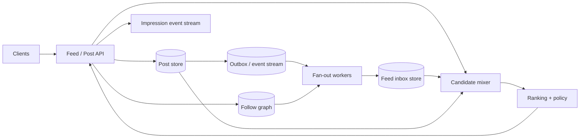

News Feed 的表面需求是“展示我关注的人发的内容”。真正困难的是关注关系与流量分布极不均匀：普通用户发一条帖子也许只通知 200 个粉丝，名人发一条帖子却可能影响 1 亿个 feed。

如果每次读 feed 都扫描所有关注者的帖子，读路径会越来越慢；如果每次发帖都写入所有粉丝 inbox，名人发帖会制造巨大的写爆炸。

这道题的核心是：**在读时聚合和写时 fan-out 之间，按作者分布选择合适的计算时机。**

> 配套实验：[打开 News Feed Lab](https://lab.zichaoyang.com/system-design/news-feed/)。先只增加普通用户和关注数，再提高 celebrity follower 数；观察同一个 fan-out 策略为什么会突然失效。

## 先做一个最简单的时间线

Alice 关注 Bob 和 Carol。两人最近发了：

```text
10:05 Bob   post-8
10:03 Carol post-7
09:50 Bob   post-6
```

Alice 请求首页，第一版可以直接查：

```sql
SELECT posts.*
FROM follows
JOIN posts ON follows.followee_id = posts.author_id
WHERE follows.follower_id = 'alice'
ORDER BY posts.created_at DESC, posts.post_id DESC
LIMIT 20;
```

这就是 fan-out on read：写帖子很便宜，读时才合并所有来源。

关注 200 人时也许够用；关注 10,000 人、每人都有大量帖子时，join、排序和分页会变得很贵。先跑通这个版本，才能清楚下一步为什么需要预计算 feed。

## 先讲清三个对象

**Post store**

保存每篇帖子本身。它是内容事实来源，按 author/time 或 post ID 查询。

**Feed inbox / timeline entry**

为某个用户预先写入“应该考虑展示哪篇 post”的轻量引用。它不是帖子副本，只保存 `user_id, post_id, candidate_time, reason`。

**Fan-out**

作者发帖后，把 post ID 分发到粉丝 feed inbox。Fan-out on write 让读快，但写放大与 follower 数成正比。

**Ranking**

从候选中根据关系、兴趣、新鲜度和质量排序。Chronological feed 是 ranking 的一个最简单版本。

## 题目边界

核心功能：

1. 用户发帖、删除帖子；
2. 关注/取消关注；
3. 获取个性化首页并分页；
4. 过滤被屏蔽、无权、已删除内容；
5. 支持时间序和基础 ranking；
6. 记录 impression、click、like 反馈。

第一版不做评论系统、广告竞价和完整推荐模型。媒体上传由 object storage/CDN 负责。

非功能目标：

- Feed p99 例如低于 200ms；
- 发帖成功后，在数秒内进入大多数粉丝 feed；
- 名人发帖不能把数据库写崩；
- 删除/权限变化要尽快停止展示；
- Cursor 分页不因新帖子插入而大量重复或漏项；
- 允许 feed 短暂最终一致，但不能展示越权内容。

## 第一版：Post、Follow 和读时 Merge

```text
Post(
  post_id,
  author_id,
  content_ref,
  visibility,
  state,
  created_at,
  version
)

FollowEdge(
  follower_id,
  followee_id,
  state,
  created_at
)
```

Post ID 最好大致可按时间排序，并在同一时间戳下唯一。Cursor 不应只用 `created_at`，否则同一毫秒多条帖子会漏：

```text
cursor = (created_at, post_id)
```

API：

```http
POST /v1/posts
Idempotency-Key: device-1:post-882

{"contentRef":"media://asset-9","visibility":"FOLLOWERS"}
```

```http
GET /v1/feed?limit=20&cursor=opaque-token
```

响应记录每项来源：

```json
{
  "items":[{
    "postId":"p-8",
    "authorId":"bob",
    "reason":"FOLLOWING",
    "impressionToken":"signed-token"
  }],
  "nextCursor":"...",
  "feedVersion":"home@17"
}
```

Cursor 是签名 opaque token，包含排序键、query generation 和必要过滤上下文；不要让客户端自己拼 SQL offset。

## 为什么 Offset Pagination 会漂

Alice 读第一页 `OFFSET 0 LIMIT 20` 后，顶部插入了 5 条新帖子。她再读 `OFFSET 20`，原第一页末尾的 5 条会重复；如果内容删除，也可能漏。

Keyset pagination 使用上一页最后一项：

```sql
WHERE (created_at, post_id) < (:last_time, :last_post_id)
ORDER BY created_at DESC, post_id DESC
LIMIT 20
```

Ranking feed 的 score 可能随时间变化。可以给一次浏览会话固定 `feed_generation` 或候选 cutoff，让翻页在有限窗口内稳定；无限追求动态重排会让 pagination 无法解释。

## 第二版：普通用户 Fan-out on Write

发帖事务完成后产生事件：

```text
PostCreated(post_id, author_id, created_at, visibility_version)
```

Fan-out worker 分页读取粉丝列表，为每个粉丝写轻量 inbox entry：

```text
FeedEntry(
  user_id,
  candidate_time,
  post_id,
  author_id,
  reason,
  source_event_id,
  expires_at
)
```

写入按 `(user_id, post_id, reason)` 幂等。Queue 至少一次投递，重复事件不能让 feed 出现两份相同帖子。

读取变成：从一个用户的 inbox 拿最近数百候选，批量 hydrate Post，过滤并排序。相比运行时 join 上千个作者，p99 更稳定。

## Fan-out 与 Post 事务如何连接

危险实现：先写 Post 数据库，再向 queue publish；若进程在两步之间崩溃，帖子存在但永远不 fan-out。

使用 transactional outbox：

```text
同一数据库事务：
  INSERT Post
  INSERT OutboxEvent(PostCreated)
```

后台 publisher 扫 outbox 并至少一次发送。发送后崩溃会重复，consumer 幂等即可；不会静默漏掉。

发帖 API 在 Post durable 后就可返回，不必同步等待百万粉丝写完。响应可以说“published”，feed propagation 是异步 SLO。

## 名人问题：1 亿粉丝不能同步写 1 亿 inbox

一个 celebrity 每分钟发 1 条，1 亿 followers：

```text
100M feed-entry writes/post
```

即使每条只有 32 bytes，也有数 GB 逻辑写和海量随机 key 更新。更合理的是 hybrid fan-out：

- 普通作者：fan-out on write；
- 超大作者：不预写到所有 inbox，读 feed 时查询其最新帖子；
- 中间层：只 fan-out 给活跃粉丝，休眠用户读时 merge。

Feed read 合并：

```text
precomputed inbox candidates
+ latest posts from followed celebrities
+ optional recommendation candidates
-> dedup -> filter -> rank
```

Celebrity 阈值不只看 follower count，还看 `followers × post rate × active ratio`。一个 1 亿粉丝、每年发一次的账号与每天发 100 条的账号负载不同。

## 高层架构



Post store 与 Feed inbox 分开：前者保存一份内容，后者保存大量用户候选引用。Follow graph 支持按 followee 分页读取 followers，也支持按 follower 读取 followees。

Candidate mixer 批量 hydrate，避免对每个 post 单独 RPC。Ranking 与 policy 最终检查可见性、block 和删除状态。

## 删除、取消关注和权限变化

Fan-out entry 是派生数据，可能落后。正确性不能只依赖“把所有 inbox 里的旧引用删干净”。

读路径必须做 authoritative filter：

- Post 是否 ACTIVE；
- 当前用户是否有 visibility 权限；
- 是否互相 block；
- 是否已取消关注且产品要求立即隐藏；
- 是否命中安全策略。

删除事件仍应异步清理 inbox 与 cache，降低无效候选比例；但最终 filter 才是安全边界。

若用户取消关注，历史帖子是否保留是产品选择。FollowEdge 带 version/effective time，feed entry 记录生成原因，便于实施一致政策。

## Ranking：先有可信候选，再谈模型

Chronological score：

```text
score = created_at
```

随后可加入：

```text
relationship strength
predicted engagement
content quality
freshness decay
negative feedback
diversity constraints
```

Ranking 只对几百个候选运行。在线 feature 读取要批量，且有 deadline；超时可退回时间序，而不是整页失败。

记录 impression 而不是只记录 click。用户没看到的 item 不能当负样本。Response 中的 impression token 绑定 post、rank、feed version 和实验，客户端回传时可校验。

## 容量估算：写放大是第一数量级

假设 100M DAU，每人每天发 1 条：

```text
100M posts/day ≈ 1,157 posts/s average
```

平均 200 followers：

```text
100M × 200 = 20B feed entries/day
≈ 231K entries/s average
```

峰值按 5 倍就是百万级 writes/s。虽然 Post QPS 不高，fan-out 后的内部写入非常大。

假设每 entry 40 bytes：

```text
20B × 40B = 800GB/day raw feed metadata
```

Feed inbox 只保留最近几千项或数周，旧 entry 可回收；真正的 Post 历史另存。

读侧若 100M 用户每天打开 10 次，是 1B feed reads/day，平均约 11.6K QPS，峰值可能 100K+。预计算把读路径从大 join 变成单用户 range read。

## Feed Inbox 如何分片

按 `user_id` hash 分片，使一个用户的 inbox 在同一逻辑 partition 内，可按 candidate_time range scan。

超活跃用户可能 inbox 写入很高，但主要热点通常来自 celebrity fan-out 的“大量不同用户”，会均匀散到 shards。Fan-out worker 按 follower page 并行，但需要 per-author 和全局 rate limit，避免一个事件占满全部 queue。

Feed entry 写入可以批量按目标 shard 分组，减少网络 RPC。不要按照 follower 原始顺序逐条随机写。

## 延迟与 Freshness

Feed read 200ms p99 示例：

| 阶段 | 预算 |
|---|---:|
| Auth / experiment context | 10 ms |
| Inbox + celebrity candidates 并行读取 | 40 ms |
| Post hydration | 35 ms |
| Filter + ranking | 45 ms |
| Serialization / network | 30 ms |
| 余量 | 40 ms |

发帖 freshness 是另一指标：

```text
Post commit -> outbox publish -> fan-out queue -> inbox visible
```

平均 1 秒并不代表健康；大作者或特定 shard 的 p99 可能数分钟。监控 oldest unprocessed event 和每作者 completion ratio。

用户刚发的帖子可以通过 read-your-own-write overlay 立即显示在自己的 profile/feed，不必等待异步 fan-out。

## 缓存：Cache 候选，不要缓存错误权限

可以缓存：

- Hot post object；
- Celebrity 最新帖子；
- 用户 feed 第一页候选 ID，短 TTL；
- Follow graph page。

但最终 visibility/filter 要基于足够新的状态。完整 HTML/JSON 长 TTL cache 会把用户个性化、实验和权限混在 key 中，容易返回错误内容。

Cache stampede 时用 request coalescing。某个热门 post 的 cache miss 不应让 10 万请求同时查 Post store。

## 故障与恢复

**Outbox publisher 重复发送**

Fan-out entry 按 source event/post/user 幂等。Exactly-once queue 不是必要条件。

**Fan-out backlog**

Feed read 可临时 merge 作者近期帖子，或向用户显示稍旧 feed；优先处理高活跃用户。暴露 freshness degradation。

**Post store 不可用**

Inbox 只有 ID，无法 hydrate 时可以返回缓存 post 或明确失败。不能展示缺少当前 state 的旧内容过久。

**Ranking service 故障**

退回 chronological + safety filter。Feed 仍可用，算法 version 标记 fallback。

**重复/漏页**

Cursor 带稳定排序键和 generation。客户端按 post ID 去重；服务端不能用 offset。

**Rebuild inbox**

Feed inbox 是派生数据，可从 Follow graph + Post stream 重建。Rebuild 使用新 generation，完成后切换，避免与在线 fan-out 相互覆盖。

## 观测

- Post create latency、outbox age、publish error；
- Fan-out entries/s、amplification、queue age、per-author completion；
- Feed read 分阶段 p99、candidate count、hydration miss；
- Inbox store hot shard、write/read throughput、storage growth；
- Celebrity merge latency、cache hit；
- Filter drop reason、deleted-content residual impression；
- Ranking fallback、impression/event loss；
- Feed freshness 和 duplicate rate。

按作者 follower tier 切片。总体 fan-out p99 很好，仍可能有所有 celebrity 帖子都延迟十分钟的问题。

## 关键取舍

**Fan-out on write** 读快，但按 follower 数写放大；**fan-out on read** 写快，却把 merge 成本放到每次读。

**Hybrid** 处理分布倾斜，但实现和排障更复杂，需要记录候选来源。

**更长 inbox retention** 提高翻历史速度，也增加派生存储；Post 本身已有长期副本。

**更动态 ranking** 提升新鲜个性化，却使分页稳定性和 cache 更难。

**最终一致的删除清理** 成本低，但安全过滤不能最终一致；读路径必须再验证。

## 用 Lab 找到 Celebrity 拐点

**实验一：普通关注图**

比较读时 join 与写时 inbox。计算平均 follower 下的 fan-out amplification。

**实验二：提高 celebrity followers**

观察单条 PostCreated 产生的工作量。把名人切为 read-time merge，并记录新的读成本。

**实验三：增加 feed 请求与 ranking**

观察 hydration、feature 与 rank latency。设计 chronological fallback，保证模型故障不清空首页。

## 面试表达：先用名人解释混合策略

可以这样开场：

> For ordinary users, I would fan a new post out into lightweight follower inboxes so feed reads become a bounded range query. For celebrity accounts, that write amplification is too large, so I would merge their recent posts at read time. The system is intentionally hybrid because the follower distribution is highly skewed.

演化顺序：

```text
read-time follow join
-> precomputed feed inbox
-> outbox + idempotent fan-out
-> celebrity read-time merge
-> ranking, policy and feedback
-> rebuild and multi-region scale
```

最后给深入入口：

> I can go deeper into hybrid fan-out thresholds, cursor pagination, feed-inbox storage, or deletion and ranking consistency.

这条主线抓住了 News Feed 最重要的分布特征，而不是把它讲成普通缓存题。

## 参考资料

- [TAO: Facebook's Distributed Data Store for the Social Graph](https://www.usenix.org/conference/atc13/technical-sessions/presentation/bronson)
- [Scaling Memcache at Facebook](https://www.usenix.org/conference/nsdi13/technical-sessions/presentation/nishtala)
- [The Log: What every software engineer should know about real-time data's unifying abstraction](https://engineering.linkedin.com/distributed-systems/log-what-every-software-engineer-should-know-about-real-time-datas-unifying)
- [Dynamo: Amazon's Highly Available Key-value Store](https://www.allthingsdistributed.com/files/amazon-dynamo-sosp2007.pdf)
