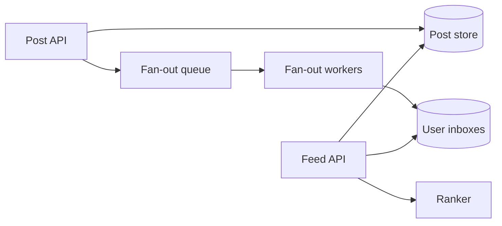

News Feed 的核心不是“把帖子按时间排序”，而是**什么时候为关注关系付出 fan-out 成本**。

假设 Alice 有 200 个粉丝。她发帖时，把 post ID 推进 200 个 inbox 很便宜。但一个明星有 5000 万粉丝，同样的写入会制造 5000 万次 timeline 更新。这个反例直接暴露了两种基本方案。

> 对应实验：[打开 News Feed Lab](https://lab.zichaoyang.com/system-design/news-feed/)。提高 follower 数量，观察 write amplification 何时迫使系统转向 hybrid。

## 两个先决概念

- **Fan-out-on-write**：发帖时预计算每个粉丝的 inbox。读很快，但大账号写放大严重。
- **Fan-out-on-read**：用户打开 feed 时，再拉取关注账号的近期帖子并 merge。写便宜，但每次读都要做大量工作。

大多数产品不会二选一，而是采用 hybrid：普通账号走 write fan-out；明星帖子保留在 author outbox，读取时再合并。

## 主路径

`UserInbox` 不必存整篇帖子，只存候选 `post_id`、作者和粗略分数。Feed API 取候选后批量读取帖子，再做过滤和 ranking。这样删除、权限变化和内容更新不会复制到几百万份正文。

## 架构演化

1. 小规模时，按关注列表查询近期帖子并 merge 足够简单。
2. 读流量上升后，为普通用户预计算 inbox，把工作从读时搬到写时。
3. 明星账号出现后，停止对它做巨量写 fan-out，读取时合并 celebrity outbox。
4. 排序从时间线升级为 relevance ranking，但 ranker 只处理已经缩小的候选集。
5. inbox、post store 和 fan-out worker 按 user/author 分片；队列积压成为新鲜度指标。

## 最容易忽略的失败

- **重复投递**：worker 重试会重复写 inbox。以 `(user_id, post_id)` 做幂等去重。
- **删帖传播慢**：读取时必须再做 visibility check，不能只信旧 inbox。
- **队列积压**：系统仍可读，但 feed 变旧。监控 fan-out lag，而不只看错误率。
- **冷启动**：新用户没有关注图，可用地区热门、主题兴趣或 onboarding 信号填充。

## 关键取舍

Hybrid 不是“更高级”，而是承认 workload 有长尾。统一 fan-out-on-write 架构在普通账号上很高效，却会被 celebrity problem 击穿；统一 fan-out-on-read 则让所有普通读取都为极端情况买单。

面试开场可以说：

> The central tradeoff is when to pay the fan-out cost: at write time for fast reads, or at read time to avoid celebrity write amplification.

画完主链路后，主动给三个 deep dive：celebrity handling、ranking freshness、delete/privacy correctness。这样答案会围绕真正的约束，而不是组件清单。
