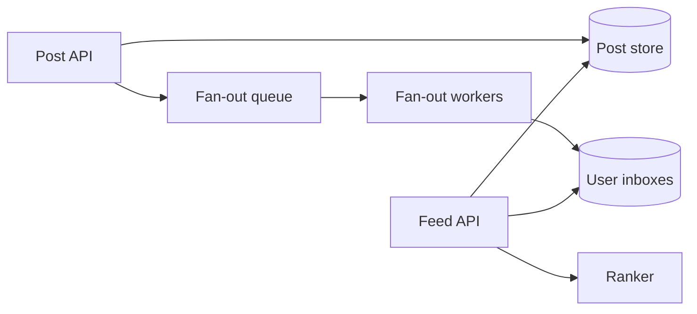

News Feed 的核心不是“把帖子按时间排序”，而是**什么时候为关注关系付出 fan-out 成本**。

假设 Alice 有 200 个粉丝。她发帖时，把 post ID 推进 200 个 inbox 很便宜。但一个明星有 5000 万粉丝，同样的写入会制造 5000 万次 timeline 更新。这个反例直接暴露了两种基本方案。

> 对应实验：[打开 News Feed Lab](https://lab.zichaoyang.com/system-design/news-feed/)。提高 follower 数量，观察 write amplification 何时迫使系统转向 hybrid。

## 需求边界（Requirements）

功能上支持发帖、关注、分页读取和删帖可见性；首版只做时间序。非功能上 feed p99 约 200ms、允许秒级最终新鲜度，但隐私/删除过滤必须正确，celebrity 流量不能拖垮普通用户。

## 0. 先搭一个按时间排序的 MVP Scaffold

第一版范围只包括：发帖、关注、读取最近 50 条 feed。先不做推荐模型、广告、评论和明星优化。使用一台应用和 PostgreSQL，读 feed 时查询所有已关注作者的近期帖子并按 `created_at` merge。这个版本虽然不能扛大规模，但语义清楚、可以验证产品。

## 1. API：先固定 cursor 语义

```http
POST /v1/posts
{"text":"hello","clientRequestId":"p-17"}

PUT /v1/users/42/following/9

GET /v1/feed?cursor=eyJ0cyI6...&limit=50
```

Feed 必须用稳定 cursor，而不是 `offset=5000`。Cursor 至少包含上一页最后一项的 `(rank_time, post_id)`，避免用户翻页期间新帖子插入导致重复或遗漏。

## 2. 数据模型（Data Model）

```sql
Post(post_id PK, author_id, body_url, created_at, visibility, deleted_at)
Follow(follower_id, followee_id, created_at, PRIMARY KEY(follower_id, followee_id))
UserInbox(user_id, rank_time, post_id, source, PRIMARY KEY(user_id, post_id))
```

MVP 只需要前两张表；`UserInbox` 是 fan-out-on-write 阶段才增加的物化视图。正文或媒体进 object storage，inbox 只放 post reference，避免复制大 payload。

## 3. 单机端到端流程

发帖事务写 `Post`。读取时先取关注列表，再按 author 分批查询最近帖子，做 k-way merge、visibility filter 和 cursor 截断。先记录一次读取触碰了多少 author、扫描多少 post，这两个指标会告诉你什么时候读时 merge 失效。

## 4. 容量估算：先找到 fan-out 放大

假设 5000 万 DAU，每人每天读 10 次，平均读 QPS 约 5.8k，峰值 5 倍约 29k；每天 1000 万帖子，写 QPS 仅约 116。若平均作者 200 粉丝，fan-out 写入却达到 20 亿 inbox entry/天，约 23k/s；一个 5000 万粉丝账号单次发帖就制造 5000 万项工作。

因此这题不能只比较“读 QPS 和写 QPS”，还要计算 follower graph 带来的 amplification。

## 5. Latency Budget：200ms 内完成什么

可给 feed p99 200ms：gateway 20ms，候选读取 60ms，post hydration 40ms，ranking/filter 50ms，余量 30ms。Fan-out backlog 不直接增加请求 latency，却会降低 freshness，所以同时监控 request p99 和 `oldest_unprocessed_post_age`。

## 6. Correctness and Reliability

Fan-out worker 使用 `(user_id, post_id)` 幂等写。删帖或权限变化后，旧 inbox 可能仍含 reference，因此读路径必须再做 visibility check。Queue 积压时允许 feed 变旧，但发帖本身不能失败；恢复后按 post ID 重放。

## 7. Trade-offs：不要提前选 fan-out

- Read-time merge 写简单、数据新鲜，但读取成本随 following 数增长。
- Write fan-out 读快，却放大写和存储，并产生异步新鲜度。
- Hybrid 增加两路 merge 复杂度，但把极端 celebrity 从普通用户路径拆开。

## 两个先决概念

- **Fan-out-on-write**：发帖时预计算每个粉丝的 inbox。读很快，但大账号写放大严重。
- **Fan-out-on-read**：用户打开 feed 时，再拉取关注账号的近期帖子并 merge。写便宜，但每次读都要做大量工作。

大多数产品不会二选一，而是采用 hybrid：普通账号走 write fan-out；明星帖子保留在 author outbox，读取时再合并。

## 主路径



`UserInbox` 不必存整篇帖子，只存候选 `post_id`、作者和粗略分数。Feed API 取候选后批量读取帖子，再做过滤和 ranking。这样删除、权限变化和内容更新不会复制到几百万份正文。

## 架构演化

1. 小规模时，按关注列表查询近期帖子并 merge 足够简单。
2. 读流量上升后，为普通用户预计算 inbox，把工作从读时搬到写时。
3. 明星账号出现后，停止对它做巨量写 fan-out，读取时合并 celebrity outbox。
4. 排序从时间线升级为 relevance ranking，但 ranker 只处理已经缩小的候选集。
5. inbox、post store 和 fan-out worker 按 user/author 分片；队列积压成为新鲜度指标。

## 最容易忽略的失败

- **重复投递**：worker 重试会重复写 inbox。以 `(user_id, post_id)` 做幂等去重。
- **删帖传播慢**：读取时必须再做 visibility check，不能只信旧 inbox。
- **队列积压**：系统仍可读，但 feed 变旧。监控 fan-out lag，而不只看错误率。
- **冷启动**：新用户没有关注图，可用地区热门、主题兴趣或 onboarding 信号填充。

## 面试表达与关键取舍

Hybrid 不是“更高级”，而是承认 workload 有长尾。统一 fan-out-on-write 架构在普通账号上很高效，却会被 celebrity problem 击穿；统一 fan-out-on-read 则让所有普通读取都为极端情况买单。

面试开场可以说：

> The central tradeoff is when to pay the fan-out cost: at write time for fast reads, or at read time to avoid celebrity write amplification.

画完主链路后，主动给三个 deep dive：celebrity handling、ranking freshness、delete/privacy correctness。这样答案会围绕真正的约束，而不是组件清单。
