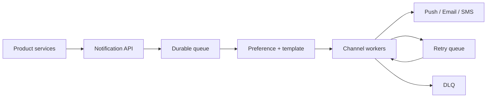

通知系统最难的不是调用 APNs、FCM 或邮件 API，而是把快速 producer 与**慢、限流、会失败的外部 provider** 隔离开。

订单服务发出 `order_shipped`。用户同时开启 push 和 email。如果 push provider 超时，系统不能让订单接口跟着超时，也不能无限重试导致用户半夜收到十封重复邮件。

> 对应实验：[打开 Notification System Lab](https://lab.zichaoyang.com/system-design/notification-system/)。提高事件速率和 provider 延迟，观察 queue、rate limit 与 retry 何时成为必要条件。

## 需求边界（Requirements）

功能上接收通知、展开渠道、应用偏好、追踪 delivery 与重试。非功能上 acceptance 必须 durable；验证码、交易、营销分别有不同 freshness/priority；第三方 provider 故障不能反向拖垮业务服务。

## 0. 先搭单渠道 MVP Scaffold

先只支持 email。业务服务调用 Notification API，API 写一张 `notifications` 表；一个后台 worker 轮询 `pending` 行、调用 provider、记录结果。这个版本能完整演示 acceptance、异步执行和重试，不需要先部署 Kafka。

搭建顺序：定义 notification ID 和模板；API 事务写入；worker 用 lease 抢任务；provider 调用设置 timeout；按错误类型重试；超过上限标记 dead。先用数据库队列跑通，再由吞吐和轮询争抢证明何时换 broker。

## 1. API：接受通知不等于已经送达

```http
POST /v1/notifications
Idempotency-Key: order-88-shipped

{
  "userId":"42",
  "template":"order_shipped",
  "channels":["push","email"],
  "variables":{"orderId":"88"},
  "priority":"transactional",
  "expiresAt":"2026-07-14T00:00:00Z"
}

202 Accepted
{"notificationId":"n-7","status":"accepted"}
```

`202` 只承诺系统已可靠接收，不承诺 provider 已送达。查询接口返回每个 channel 的独立状态。

## 2. 数据模型（Data Model）

```sql
Notification(notification_id PK, user_id, template_id, payload, priority, expires_at, created_at)
Delivery(notification_id, channel, status, attempt_count, next_attempt_at,
         provider_message_id, last_error, PRIMARY KEY(notification_id, channel))
Preference(user_id, channel, category, enabled, quiet_hours, version)
Template(template_id, locale, version, subject, body)
```

一条业务 notification 展开为多条 delivery。模板要版本化，否则重试可能使用与首次发送不同的正文。

## 3. 单机端到端流程

API 校验模板变量和 TTL，在事务中写 Notification 与 Delivery。Worker 用 `SELECT ... FOR UPDATE SKIP LOCKED` 租一批任务，读取 preference、渲染固定版本模板、调用 provider，再更新状态。Crash 导致 lease 过期后重试，同一个 provider idempotency key 防重复。

## 4. 容量估算：provider 才是下游上限

假设日均 10 亿通知，平均约 11.6k/s，峰值 10 倍约 116k/s；平均 1.4 个 channel，实际 delivery 峰值约 162k/s。若 email provider 只允许 20k/s，队列至少每秒积压 142k，必须用 priority、TTL 和多 provider capacity plan。

## 5. Latency Budget：区分 acceptance 与 delivery

API acceptance p99 可设 100ms，其中 durable write 30ms；验证码 delivery 目标可能 3 秒，账单通知 1 分钟，营销消息 1 小时。不要把它们混成一个 SLA。监控 `accepted_to_first_attempt`、provider latency 和 queue age。

## 6. Correctness and Reliability

采用 at-least-once delivery 加 `(notification_id, channel)` 幂等。Outbox 保证业务事务提交与通知事件不会一边成功一边丢失。Retry 有指数退避、jitter、最大次数和 expiration；无效 device token 直接永久失败。DLQ 必须可重放，但重放仍沿用原 ID。

## 7. Trade-offs：渠道隔离与成本

- 一个共享队列简单，但营销洪峰会阻塞验证码；按 priority/channel 隔离更稳，运维成本更高。
- 发送前实时读 preference 最准确但增加延迟；缓存更快，需要版本失效。
- 多 provider 提升韧性，却引入模板差异、重复风险和更复杂 reconciliation。

## 先讲清投递语义

- **At-least-once delivery**：消息可能重复，但不能静默丢失。工程上通常比幻想 exactly-once 更现实。
- **Idempotency / dedup**：以 `notification_id + channel` 识别同一次投递，重试不再制造新通知。
- **Dead-letter queue (DLQ)**：超过重试上限的消息进入隔离队列，供修复或人工处理，不再堵住主队列。

## 主链路



API 只负责验证请求、生成稳定 ID 并可靠入队。worker 再读取用户偏好、渲染模板、执行渠道限速并调用 provider。这样 producer 的 latency 不受第三方接口支配。

## 约束如何推动演化

1. 小规模可以同步调用一个 provider，但必须先定义超时。
2. provider 一慢，queue 就成为必要的时间缓冲器。
3. 多渠道出现后，先展开用户偏好，再为每个渠道创建独立 delivery job。
4. 重试出现后，dedup、指数退避、jitter 和 DLQ 必须一起出现。
5. 大规模时按租户、渠道和优先级分队列，避免营销短信拖死验证码。

## 可靠性不等于无限重试

需要区分错误：`429` 应尊重 provider 的 retry-after；网络超时可以退避重试；无效 token 应直接停用；模板错误应进 DLQ。每次重试都要有预算，否则恢复期的 retry storm 会再次压垮 provider。

还要明确用户体验语义。验证码可以重复生成但只能使用最新一条；账单通知宁可稍晚也不能丢；促销消息过了有效期就不应补发。优先级和 TTL 是产品规则，不是队列细节。

## 面试表达

> I would make notification acceptance durable and asynchronous. The queue absorbs provider latency, while channel workers enforce preferences, rate limits, idempotency, retries, and expiration.

常见 deep dive 是 preference consistency、priority isolation、provider failover 和 delivery status。不要声称 exactly-once；说清 at-least-once 加幂等，反而更专业。
