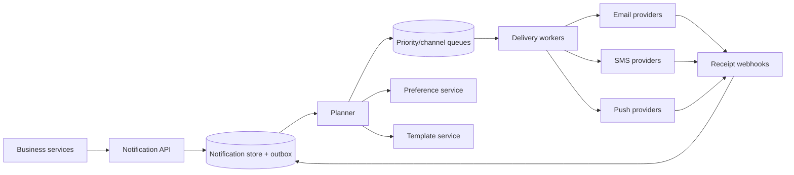

通知系统看起来只是把业务事件转成 email、SMS 或 push。真正上线后，最常见的事故不是“完全发不出去”，而是同一条退款通知发了三遍、用户退订后仍收到营销短信，或者 provider timeout 后系统不知道对方究竟发没发。

通知不是普通消息队列。它同时受用户偏好、渠道能力、模板版本、发送时间、供应商限额和合规约束影响。

这道题的核心是：**把一次业务通知意图变成可追踪、可去重、按政策选择渠道的投递状态机，而不是把 provider API 调用散落在每个业务服务里。**

> 配套实验：[打开 Notification System Lab](https://lab.zichaoyang.com/system-design/notification-system/)。先只保留 email 渠道，再提高事件率和 provider latency；看到 retry backlog 后再加入多 provider。

## 为什么网络超时会导致用户收到两封邮件

订单服务发出：

```text
OrderShipped(order_id=991, user_id=42)
```

Notification worker 调用邮件 provider。Provider 已经接受邮件，但响应在网络中丢失。Worker 看到 timeout，重新消费事件并再次调用，于是用户收到两封内容完全相同的邮件。

要解决它，系统至少需要两层稳定身份：

- `notification_id`：这一次业务通知意图；
- `delivery_attempt_id`：向某个渠道/provider 的一次尝试。

如果 provider 支持 idempotency key，每次 retry 复用同一个 delivery ID；如果不支持，就无法严格保证外部世界 exactly once，只能用内部去重、发送前状态和结果查询把概率降到最低。

所以“queue exactly once”仍然不能自动保证“用户只收到一次”。真正的副作用发生在 provider 边界之外。

## 先讲清 Notification 和 Delivery

**Notification**

产品层意图，例如“告诉用户订单已发货”。它包含 category、业务对象、收件人和模板数据，不直接等于一封 email。

**Delivery**

Notification 在具体 channel 上的一次发送，例如 push 到 device A、email 到地址 B。一个 Notification 可以产生多个 Delivery。

**Template**

版本化内容与变量 schema。`order_shipped@v5` 应能重建当时发出的标题和正文。

**Preference**

用户对 category/channel 的选择，例如安全通知必须 email，营销 push 关闭，夜间进入 quiet hours。

**Provider receipt**

Provider 返回的 accepted ID 或之后的 delivered/bounced webhook。Accepted 只代表供应商收到了，不代表最终到达设备或邮箱。

## 题目边界

核心功能：

1. 业务服务创建即时或定时通知；
2. 根据用户偏好、地区和通知类别选择渠道；
3. 渲染版本化模板和 locale；
4. 通过 email、SMS、push、in-app provider 投递；
5. Retry、fallback、rate limit 与 provider failover；
6. 查询 sent、delivered、failed、bounced 状态；
7. 支持退订、quiet hours 和合规审计。

第一版不设计聊天消息和营销活动编辑器。Bulk campaign 可以复用发送基础设施，但需要独立 audience expansion。

非功能目标：

- 事务通知创建后数秒内开始投递；
- 重复业务事件不会重复创建逻辑通知；
- 用户退订和强制类别政策正确执行；
- Provider 慢或故障时不会拖垮业务服务；
- 高优先级安全通知不被营销洪峰饿死；
- 所有内容、决策和尝试可审计，敏感变量受保护。

## 第一版：只发 Email，但完整保存 Intent

订单服务不要直接传最终 HTML，而是创建结构化通知：

```http
POST /v1/notifications
Idempotency-Key: order-991:shipped:v1

{
  "recipient":{"userId":"u-42"},
  "category":"TRANSACTIONAL",
  "template":"order-shipped@5",
  "templateData":{"orderId":"991","trackingNumber":"TN-88"},
  "channels":["EMAIL"],
  "sendAt":null
}
```

服务端在数据库事务中：

1. 按 tenant + idempotency key 查重；
2. 验证 template variable schema；
3. 写 Notification；
4. 写 outbox event；
5. 返回 notification ID。

```json
{"notificationId":"n-77","state":"QUEUED"}
```

业务服务只等待“通知意图已可靠接收”，不等待 provider。这样邮件供应商慢 30 秒，不会占住订单请求线程。

## 数据模型：状态不能只用 sent=true

```text
Notification(
  notification_id,
  tenant_id,
  idempotency_key,
  recipient_id,
  category,
  template_name,
  template_version,
  template_data_ref,
  requested_channels,
  priority,
  scheduled_at,
  state,
  created_at
)

Delivery(
  delivery_id,
  notification_id,
  channel,
  destination_ref,
  provider,
  state,
  attempt_count,
  next_attempt_at,
  provider_message_id,
  rendered_content_hash
)

DeliveryAttempt(
  delivery_id,
  attempt,
  request_id,
  provider,
  started_at,
  completed_at,
  outcome,
  provider_code
)

Preference(
  user_id,
  category,
  channel,
  enabled,
  quiet_hours,
  locale,
  version
)
```

Delivery 状态机：

```text
PENDING -> SENDING -> ACCEPTED -> DELIVERED
                \-> RETRY_WAIT -> SENDING
                \-> FAILED_PERMANENT
ACCEPTED -> BOUNCED | EXPIRED
```

`SENDING` 不能无限卡住。Worker lease 到期后由 reconciler 查询 provider receipt 或按幂等语义 retry。

## Template：变量 Schema 比字符串替换重要

模板定义：

```yaml
name: order-shipped
version: 5
category: TRANSACTIONAL
required_variables:
  orderId: string
  trackingNumber: string
channels:
  EMAIL:
    subject: "订单 {{orderId}} 已发货"
    body: "物流单号：{{trackingNumber}}"
  PUSH:
    title: "订单已发货"
    body: "点击查看物流"
```

创建通知时验证变量完整性，渲染前做 channel-specific escaping。用户提供的文本进入 HTML email 时不能直接插值。

Template version immutable。修改文案产生 v6；已经排队的通知继续用 v5，保证审计和 retry 内容一致。否则一次 retry 可能发出与首次 attempt 不同的内容。

Locale fallback 明确，例如 `zh-CN -> zh -> en`。找不到必需 locale 是永久失败还是回退英文，由 category policy 决定。

## Preference 和强制通知

并非所有通知都可退订：

- `SECURITY`：登录告警、密码变更，通常强制至少一个渠道；
- `TRANSACTIONAL`：订单、付款，受产品和地区政策约束；
- `MARKETING`：必须尊重 opt-out 和 consent；
- `SOCIAL`：可按用户偏好和 digest 合并。

Preference evaluation 返回解释：

```text
channel EMAIL selected: transactional default
channel PUSH suppressed: user disabled
send delayed until 08:00: quiet hours
```

这份 decision 记录在 Notification 上。不要把偏好判断散在 worker 中，否则 retry 时用户刚改变设置，系统行为会不可解释。

对于 scheduled/marketing 通知，可以在真正发送前重新检查 consent，因为合规状态可能变化；事务通知通常在创建时锁定业务语义。两者应明确区分。

## Outbox 到 Queue：不丢 Notification

创建 Notification 与 publish queue 不能是两个无事务动作。使用 outbox：

```text
DB transaction:
  INSERT notification
  INSERT outbox(notification_created)
```

Publisher 至少一次发到 queue。Planner consumer 按 notification ID 幂等，解析 preference，创建 channel deliveries。

Queue 按 priority/channel 分开：

```text
security-high
transactional
social
marketing-bulk
```

防止百万营销通知让密码重置排在后面。各队列有独立 worker pool、provider quota 和 SLO。

## Provider Adapter：统一接口，不抹平差异

```python
class ProviderAdapter:
    def send(self, delivery, rendered_message, idempotency_key): ...
    def query(self, provider_message_id): ...
    def cancel(self, provider_message_id): ...
```

Email、SMS、push 能力不同：Push token 会失效，SMS 有国家/运营商限制，Email 有 bounce 与 spam complaint。Adapter 统一调用形状，但 provider-specific code 和 receipt 必须保留。

Provider response 分类：

- transient：timeout、429、5xx，可指数退避 retry；
- permanent：invalid email、unregistered device、模板违规，不 retry；
- ambiguous：timeout 后未知是否 accepted，优先 query 或幂等 retry。

所有失败都统一 retry 是通知系统制造重复与成本失控的常见原因。

## 高层架构



Planner 做“应该发什么”；Worker 做“向 provider 尝试发送”。分开后，模板/偏好错误不会占用 provider worker，provider retry 也不需要重新做 audience 规划。

In-app notification 可以写用户 inbox store，不经过外部 provider，但仍复用 Notification ID、偏好和模板。

## Retry、退避与 Deadline

指数退避加 jitter：

```text
1s, 2s, 4s, 8s ... capped at 15m
```

每个 Delivery 有 `expires_at`。两天后的验证码没有发送价值，应进入 EXPIRED，不再 retry。

Provider `Retry-After` 优先于本地默认。全局 circuit breaker 在错误率激增时暂停新调用，避免 retry storm；队列保留工作，等待恢复或切换 provider。

高优先级通知可以更快 retry，但不能无限。每次尝试有最大次数与总时间预算。

## 多 Provider Failover：不能盲目双发

Email provider A timeout 时立刻切 B，可能 A 已经 accepted，于是用户收到两封。Failover 策略要根据错误是否明确：

- 明确拒绝/连接未建立：可以切 B；
- Ambiguous timeout：先 query A、等待 webhook，或接受小概率重复；
- Provider 大面积 outage：对尚未尝试的 delivery 切 B。

Provider routing 还考虑地区、成本、deliverability 和 sender reputation。每次 Delivery 锁定 route decision 和版本，retry 是否继续原 provider由 policy 决定。

## Push Token 和 Destination 生命周期

```text
Destination(
  user_id,
  channel,
  destination_id,
  encrypted_address_or_token,
  state,
  verified_at,
  last_success_at,
  failure_count
)
```

Push provider 返回 unregistered 后，将 token 标为 invalid，不能永久 retry。Email hard bounce 也应抑制后续发送；soft bounce 可有限重试。

Destination 是敏感数据，加密存储、限制日志。Worker 只在发送时获取短期解密能力。

## 容量估算

假设每天 10B notifications，平均产生 1.3 个 channel deliveries：

```text
13B deliveries/day ≈ 150K deliveries/s average
```

峰值按 5 倍约 750K/s。若 5% 需要一次 retry，额外约 37.5K/s；provider outage 时 retry backlog 会更大。

每条 Notification metadata 1KB：

```text
10B × 1KB = 10TB/day
```

热 OLTP 只保留近期状态，历史 attempt 进入压缩分析存储。模板数据中的大附件放 object storage。

Provider quota 可能按账号、sender、国家和秒/日限制。Scheduler 要按这些维度 token bucket，而不是只有全局 worker 数。

## 延迟和 Freshness SLO

事务 push 的“数秒内”：

| 阶段 | p99 预算 |
|---|---:|
| API durable create | 100 ms |
| Outbox + planner | 300 ms |
| Queue wait | 500 ms |
| Provider call | 1,000 ms |
| 余量 | 1,100 ms |

Provider accepted 后的最终设备 delivery 不完全受我们控制，应单独监控 receipt latency。

Scheduled 通知关注 schedule lateness：`actual_send_time - scheduled_at`。营销 bulk 可以容忍分钟级，OTP 不能。

## 故障与正确性

**业务事件重复**

调用方使用业务唯一 idempotency key；Notification API 返回原 ID。不能只靠 queue dedup 窗口。

**Worker 在 provider success 后崩溃**

Delivery 留在 SENDING。Reconciler 用 provider message ID 查询，或复用 idempotency key retry；不支持时明确这是 ambiguous delivery。

**Webhook 重复/乱序**

按 provider event ID 去重，状态机只允许单调转换。晚到的 `accepted` 不能把 `delivered` 改回去。

**Preference service 故障**

营销 fail closed，不发送；关键事务可使用 last-known preference + 强制 policy。Failure mode 按 category 定义。

**Template 发布错误**

新 version 先 preview、schema test 和 canary。旧 queued notification 仍 pin 旧 version，支持紧急停止某 template version。

**Queue backlog**

按 priority 隔离，动态扩 worker，但仍受 provider quota。过期消息直接丢入 EXPIRED，不让无价值 retry 占资源。

## 观测

- Notification create、dedup、planning latency；
- Queue depth、oldest age，按 priority/channel；
- Provider request p99、accept、429、5xx、timeout；
- Retry、ambiguous、permanent failure；
- Delivered、bounce、complaint、invalid token；
- Schedule lateness、quiet-hour delay、preference suppression；
- Template render error、locale fallback；
- 每类通知的成本和用户 opt-out。

“发送成功率”不能只算 provider accepted。对 email 要看 bounce，对 push 看 invalid token，对业务要看最终 delivery 和用户反馈。

## 关键取舍

**异步发送** 隔离业务 latency，却让状态查询和最终一致性成为必要。

**更多 retry** 提高 transient failure 恢复，也增加重复、成本和过期通知。

**多 provider** 提高可用性和谈判空间，却让路由、幂等和 deliverability 复杂。

**发送时重新检查偏好** 更符合最新 consent，却可能改变已创建事务通知的原意；按 category 定义。

**模板集中管理** 保证一致和审计，也要求严格 version/schema，不能把所有自由度交给业务服务。

## 用 Lab 看 Backlog 怎么形成

**实验一：提高事件速率**

保持 provider 吞吐不变，观察 queue age 而不是只看 queue length。计算多久会错过通知 deadline。

**实验二：增加 Provider latency 和错误**

观察 worker 被在途调用占满、retry 放大。加入 timeout、circuit breaker 和 jitter。

**实验三：加入多 Channel**

明确一个 Notification 何时算完成：任一 channel 成功、必需 channel 全成功，还是每个 delivery 独立。不要只加三条箭头。

## 面试表达：从重复邮件开始

可以这样开场：

> I would separate a notification intent from its channel deliveries. The API durably stores an idempotent intent; an asynchronous planner applies preferences and templates; channel workers execute versioned deliveries with retries and provider-specific failure semantics.

演化顺序：

```text
one email provider
-> durable intent + outbox
-> delivery state machine
-> preferences and versioned templates
-> channel queues and retry policy
-> multiple providers, receipts and failover
```

最后给深入入口：

> I can go deeper into external-side-effect idempotency, provider failover, preference semantics, or priority scheduling and retry storms.

这样讲，通知系统的价值不再是“统一 SDK”，而是统一业务意图、外部副作用和合规政策。

## 参考资料

- [RFC 5321: Simple Mail Transfer Protocol](https://www.rfc-editor.org/rfc/rfc5321)
- [Apple Push Notification Service](https://developer.apple.com/documentation/usernotifications/setting-up-a-remote-notification-server)
- [Firebase Cloud Messaging](https://firebase.google.com/docs/cloud-messaging)
- [Transactional Outbox Pattern](https://microservices.io/patterns/data/transactional-outbox.html)
