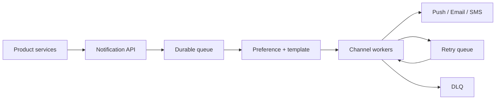

通知系统最难的不是调用 APNs、FCM 或邮件 API，而是把快速 producer 与**慢、限流、会失败的外部 provider** 隔离开。

订单服务发出 `order_shipped`。用户同时开启 push 和 email。如果 push provider 超时，系统不能让订单接口跟着超时，也不能无限重试导致用户半夜收到十封重复邮件。

> 对应实验：[打开 Notification System Lab](https://lab.zichaoyang.com/system-design/notification-system/)。提高事件速率和 provider 延迟，观察 queue、rate limit 与 retry 何时成为必要条件。

## 先讲清投递语义

- **At-least-once delivery**：消息可能重复，但不能静默丢失。工程上通常比幻想 exactly-once 更现实。
- **Idempotency / dedup**：以 `notification_id + channel` 识别同一次投递，重试不再制造新通知。
- **Dead-letter queue (DLQ)**：超过重试上限的消息进入隔离队列，供修复或人工处理，不再堵住主队列。

## 主链路

API 只负责验证请求、生成稳定 ID 并可靠入队。worker 再读取用户偏好、渲染模板、执行渠道限速并调用 provider。这样 producer 的 latency 不受第三方接口支配。

## 约束如何推动演化

1. 小规模可以同步调用一个 provider，但必须先定义超时。
2. provider 一慢，queue 就成为必要的时间缓冲器。
3. 多渠道出现后，先展开用户偏好，再为每个渠道创建独立 delivery job。
4. 重试出现后，dedup、指数退避、jitter 和 DLQ 必须一起出现。
5. 大规模时按租户、渠道和优先级分队列，避免营销短信拖死验证码。

## 可靠性不等于无限重试

需要区分错误：`429` 应尊重 provider 的 retry-after；网络超时可以退避重试；无效 token 应直接停用；模板错误应进 DLQ。每次重试都要有预算，否则恢复期的 retry storm 会再次压垮 provider。

还要明确用户体验语义。验证码可以重复生成但只能使用最新一条；账单通知宁可稍晚也不能丢；促销消息过了有效期就不应补发。优先级和 TTL 是产品规则，不是队列细节。

## 面试表达

> I would make notification acceptance durable and asynchronous. The queue absorbs provider latency, while channel workers enforce preferences, rate limits, idempotency, retries, and expiration.

常见 deep dive 是 preference consistency、priority isolation、provider failover 和 delivery status。不要声称 exactly-once；说清 at-least-once 加幂等，反而更专业。
