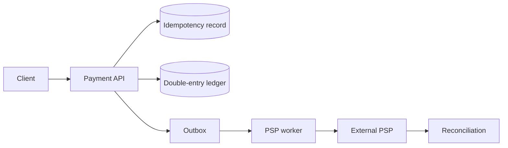

支付系统首先是正确性系统，然后才是吞吐系统。最小反例不是“数据库慢”，而是：客户端付款成功前超时，于是重试同一请求。服务端如果把重试当新付款，用户会被扣两次。

> 对应实验：[打开 Payment Ledger Lab](https://lab.zichaoyang.com/system-design/payment-ledger/)。打开重复请求、PSP 故障和跨 region 约束，观察为什么 integrity 是扩展前置条件。

## 需求边界（Requirements）

功能上创建转账、查询状态、reversal、接 PSP callback 与 reconciliation。非功能优先级是金额守恒、幂等和可审计，高于低延迟；系统可返回 pending，但不能重复扣款或伪造确定结果。

## 0. 先搭一个内部转账 MVP Scaffold

先不接 Stripe/银行，只做两个内部账户之间转 10 元。单个 PostgreSQL 事务：锁定 idempotency key，验证账户状态，创建 transfer，写一借一贷两条 ledger entry，校验总和为零，commit 后返回。Balance 由 entry 汇总或在同事务维护物化值。

手把手顺序：定义金额整数最小单位；建 account/transfer/entry 表；写 debit+credit 事务；加入 idempotency；加入 reversal；写 invariant 测试 `sum(entries)=0`。只有内部账本正确，才接外部 PSP。

## 1. API：一个业务意图对应一个 key

```http
POST /v1/transfers
Idempotency-Key: checkout-991

{"fromAccount":"cash:user-42","toAccount":"payable:merchant-9","amount":1000,"currency":"USD"}

201 Created
{"transferId":"t-8","state":"posted"}
```

金额用整数 cents，不用浮点。相同 key、相同 request hash 返回旧结果；相同 key、不同金额返回 `409`。查询 API 可以返回 pending/posted/reversed，但历史 entry 不修改。

## 2. 数据模型（Data Model）

```sql
Account(account_id PK, currency, status, balance_minor, version)
Transfer(transfer_id PK, idempotency_key UNIQUE, request_hash, state, created_at)
LedgerEntry(entry_id PK, transfer_id, account_id, amount_minor, currency, created_at)
Outbox(event_id PK, aggregate_id, event_type, payload, published_at)
```

数据库约束确保每条 transfer 的 entries 平衡；不同 currency 不能直接相加，换汇要通过专门 clearing account 和 rate record。

## 3. 单机端到端流程

事务按稳定顺序锁账户避免 deadlock；插入 Transfer；检查余额/额度；写 debit 与 credit；更新 balance view；写 outbox；commit 后返回。Publisher 从 outbox 发事件。外部 capture 后续由 state machine worker 推进，绝不把网络 PSP 调用放进数据库事务。

## 4. 容量估算：先算 ledger entry 写放大

假设峰值 10 万 payment/s，每笔最少 2 条 entry，就是 20 万 row/s；再加 fee、tax、reserve 可能 4 到 8 条。每条 entry 连索引按 300 bytes 估算，4 条/支付每天约 10TB 写入。查询多集中在近期账户和商户结算，历史可按时间归档，但审计记录不能丢。

## 5. Latency Budget：用户响应与资金最终状态分层

内部 ledger commit p99 可目标 100ms；外部 authorization 可能 1 到 3 秒；settlement 可能数天。API 应显示 pending，而不是为了一个同步“成功”把所有外部步骤串起来。Timeout 是 unknown，需要查询 PSP，不可直接当 failed 重扣。

## 6. Correctness and Reliability

核心 invariant 是金额守恒、幂等和不可变审计。Transaction outbox 防止“账已提交、事件没发”。PSP webhook 和主动查询都按 provider transaction ID 幂等。Daily reconciliation 比较内部 entry、PSP report 与银行 statement，差异进入人工队列。

## 7. Trade-offs：一致性边界必须明确

- 单库事务最容易证明正确，先达到容量边界再按 account 分片。
- 同步 PSP 调用流程直观但把外部故障带进请求；异步 state machine 更可靠，却暴露 pending 状态。
- 物化 balance 读快但需 invariant 校验；实时 sum ledger 正确来源清楚，却无法支撑高频余额查询。

## 先讲清四个词

- **Idempotency key**：代表一次业务意图的稳定 key。同一个 key 的重试返回同一结果，不再创建新付款。
- **Double-entry**：每笔价值转移至少产生一借一贷，所有 entry 的代数和为零。
- **Append-only ledger**：错误不能原地修改历史，只能追加 reversal/correction，保留审计链。
- **Reconciliation**：周期性对比内部 ledger、银行或 PSP 报表，找出遗漏、重复和金额差异。

## 一次付款的路径



API 在同一个数据库事务里锁定 idempotency key、创建 payment 状态、追加 ledger entry 与 outbox event。外部 PSP 调用不能放进数据库事务：它又慢又不受你控制。worker 异步推进 `created -> authorized -> captured/failed` 状态机。

## 为什么不直接更新 balance

只保存 `balance = 90` 无法回答余额为何变化，也无法可靠回滚。Ledger 保存事实：用户资产账户 `-10`，商户应收账户 `+10`。Balance 是这些 entry 的物化视图，可以重建和校验。

## 常见难点

- Idempotency key 需要作用域和请求摘要。同 key 不同金额应报冲突，不应静默复用。
- PSP timeout 是 unknown，不等于 failed。先查询 PSP 状态，再决定是否重试 capture。
- 消息投递和数据库提交之间用 transactional outbox，避免“账已记、事件丢了”。
- 分片前先定义跨账户事务边界。按 account 分片容易扩展，却让跨 shard 转账需要 saga 或专门 ledger owner。

## 面试表达

> I would make the ledger the immutable source of truth. Idempotency protects retries, double-entry entries make value conservation auditable, and external PSP calls advance an asynchronous state machine.

这题不要用 eventually consistent 的口号掩盖金额正确性。明确哪些状态必须事务一致，哪些外部步骤只能通过状态机与 reconciliation 达到最终业务一致。
