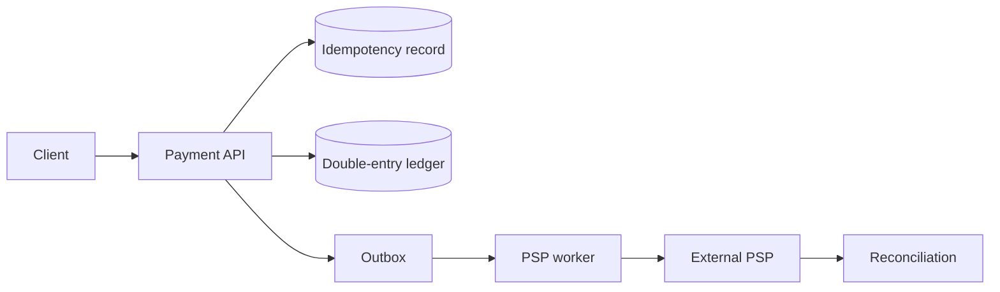

支付系统首先是正确性系统，然后才是吞吐系统。最小反例不是“数据库慢”，而是：客户端付款成功前超时，于是重试同一请求。服务端如果把重试当新付款，用户会被扣两次。

> 对应实验：[打开 Payment Ledger Lab](https://lab.zichaoyang.com/system-design/payment-ledger/)。打开重复请求、PSP 故障和跨 region 约束，观察为什么 integrity 是扩展前置条件。

## 先讲清四个词

- **Idempotency key**：代表一次业务意图的稳定 key。同一个 key 的重试返回同一结果，不再创建新付款。
- **Double-entry**：每笔价值转移至少产生一借一贷，所有 entry 的代数和为零。
- **Append-only ledger**：错误不能原地修改历史，只能追加 reversal/correction，保留审计链。
- **Reconciliation**：周期性对比内部 ledger、银行或 PSP 报表，找出遗漏、重复和金额差异。

## 一次付款的路径

API 在同一个数据库事务里锁定 idempotency key、创建 payment 状态、追加 ledger entry 与 outbox event。外部 PSP 调用不能放进数据库事务：它又慢又不受你控制。worker 异步推进 `created -> authorized -> captured/failed` 状态机。

## 为什么不直接更新 balance

只保存 `balance = 90` 无法回答余额为何变化，也无法可靠回滚。Ledger 保存事实：用户资产账户 `-10`，商户应收账户 `+10`。Balance 是这些 entry 的物化视图，可以重建和校验。

## 常见难点

- Idempotency key 需要作用域和请求摘要。同 key 不同金额应报冲突，不应静默复用。
- PSP timeout 是 unknown，不等于 failed。先查询 PSP 状态，再决定是否重试 capture。
- 消息投递和数据库提交之间用 transactional outbox，避免“账已记、事件丢了”。
- 分片前先定义跨账户事务边界。按 account 分片容易扩展，却让跨 shard 转账需要 saga 或专门 ledger owner。

## 面试表达

> I would make the ledger the immutable source of truth. Idempotency protects retries, double-entry entries make value conservation auditable, and external PSP calls advance an asynchronous state machine.

这题不要用 eventually consistent 的口号掩盖金额正确性。明确哪些状态必须事务一致，哪些外部步骤只能通过状态机与 reconciliation 达到最终业务一致。
