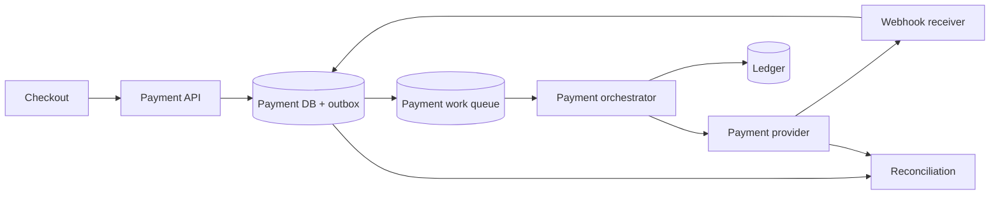

支付系统最危险的 bug 往往发生在“请求到底成功没有”的灰色地带。客户端发起付款，服务调用支付供应商；供应商已经扣款，但响应丢了。客户端重试，如果系统把它当成新付款，用户会被扣两次。

更深一层，即使供应商只扣一次，我们自己的余额和账本也可能因部分失败对不上。因此支付系统要同时维护两种东西：一个会变化的支付流程状态，以及一份只能追加、可审计的资金事实。

这道题的核心是：**用幂等状态机协调外部副作用，用双重记账账本守住内部资金不变量，再用对账处理无法靠在线事务消除的现实差异。**

> 配套实验：[打开 Payment Ledger Lab](https://lab.zichaoyang.com/system-design/payment-ledger/)。先打开重复请求，再制造 PSP timeout；观察“API 幂等”和“外部实际只扣一次”为什么是两层问题。

## 一次付款里有两个不同的“成功”

用户支付 100 美元。系统可能经历：

```text
PaymentIntent created
-> PSP charge accepted
-> internal ledger posted
-> merchant payout scheduled
```

PSP charge 成功不等于内部 ledger 已记账；ledger 已记账也不等于商户已经收到 payout。把所有阶段压成 `paid=true`，发生故障时就无法判断下一步应该 retry、查询还是补偿。

至少要区分：

- **Payment state**：这笔业务流程走到哪里；
- **Ledger posting**：资金在内部账户间如何移动；
- **Provider state**：外部 PSP 实际做了什么；
- **Settlement state**：资金何时真正结算到银行或商户。

## 双重记账为什么不是“存两条重复记录”

假设用户向商户支付 100 美元，平台收 3 美元手续费。一个简化 ledger transaction 可以有：

```text
Debit  user_cash          100 USD
Credit merchant_payable   97 USD
Credit platform_revenue    3 USD
```

每个 ledger transaction 内：

$$
\sum debit = \sum credit
$$

这是一个结构性不变量。不是把余额从 100 改成 0，再把商户余额从 0 改成 97；而是追加一组平衡分录。当前余额是分录聚合或其可信物化结果。

退款不会删除原交易，而是追加反向分录。历史不可变，审计才能回答“为什么今天的余额是这样”。

## 题目边界

本文设计一个平台支付与账本核心：

1. 创建 payment intent；
2. 通过外部 PSP authorize/capture；
3. 把成功业务动作原子记入双重账本；
4. 支持退款和冲正；
5. 查询 payment、transaction 和 account balance；
6. 通过 webhook 与日终文件对账；
7. 所有写操作幂等并可审计。

第一版不展开风控、银行卡网络协议、税务和完整清结算。金额均以单币种 transaction 为主；外汇需要独立汇率与多币种分录。

非功能目标：

- 任何已确认 ledger transaction 都 durable；
- 同一业务意图重试不会重复扣款或重复记账；
- 单 transaction 永远借贷平衡；
- 资金账户不允许未经定义的负余额；
- 外部 PSP 状态最终可通过 reconciliation 对齐；
- 所有 actor、版本和状态变更可审计；
- 正确性优先于跨 Region 写可用性。

## 第一版：一台应用、一个关系数据库、一个模拟 PSP

先不要 Kafka 和微服务。关系数据库事务非常适合守住账本不变量。

### API

```http
POST /v1/payment-intents
Idempotency-Key: checkout-session-991

{
  "payerId":"user-42",
  "merchantId":"merchant-8",
  "amount":{"currency":"USD","minorUnits":10000},
  "paymentMethodToken":"pm-token"
}
```

```json
{
  "paymentIntentId":"pi-77",
  "state":"PROCESSING",
  "amount":{"currency":"USD","minorUnits":10000}
}
```

使用整数 minor units，禁止浮点金额。币种使用 ISO 代码，但要知道不同币种的小数位不同，不能全都假设 2 位。

查询和退款：

```http
GET  /v1/payment-intents/pi-77
POST /v1/payment-intents/pi-77/refunds
```

退款也有独立 idempotency key，且累计退款不能超过可退金额。这个约束必须在数据库事务中检查。

## Payment 状态机

```text
CREATED
-> PROCESSING
-> AUTHORIZED
-> CAPTURED
-> FAILED

CAPTURED -> PARTIALLY_REFUNDED -> REFUNDED
CAPTURED -> DISPUTED
```

只允许合法状态转换，并使用 version compare-and-swap：

```sql
UPDATE payment_intents
SET state = 'CAPTURED', version = version + 1
WHERE payment_intent_id = :id
  AND state = 'PROCESSING'
  AND version = :expected_version;
```

重复 webhook 或 worker retry 命中已完成状态时返回幂等成功，而不是再次记账。

State machine 保存外部 provider reference：

```text
PaymentIntent(
  payment_intent_id,
  tenant_id,
  idempotency_key,
  payer_id,
  merchant_id,
  amount_minor,
  currency,
  state,
  provider,
  provider_payment_id,
  version,
  created_at,
  updated_at
)
```

## Ledger 数据模型

```text
LedgerAccount(
  account_id,
  owner_type,
  owner_id,
  currency,
  account_type,
  normal_balance,
  state
)

LedgerTransaction(
  ledger_transaction_id,
  business_type,
  business_reference UNIQUE,
  effective_at,
  created_at,
  description,
  state
)

LedgerEntry(
  ledger_transaction_id,
  entry_sequence,
  account_id,
  direction,
  amount_minor,
  currency,
  PRIMARY KEY (ledger_transaction_id, entry_sequence)
)
```

`business_reference` 例如 `payment:pi-77:capture`，保证同一 capture 只 posting 一次。

数据库在 commit 前验证：

1. 至少两条 entry；
2. 每条 amount 为正整数；
3. 所有 entry currency 满足 transaction 规则；
4. Debit 总额等于 credit 总额；
5. 受限账户余额不会越过允许边界；
6. Business reference 唯一。

不要靠每日脚本才发现借贷不平。平衡必须是写入事务的硬约束。

## Balance：派生值也要能证明

精确余额可以从所有 entry 聚合，但账户有数亿分录时太慢。维护物化余额：

```text
AccountBalance(
  account_id,
  posted_debits,
  posted_credits,
  available_balance,
  version,
  updated_at
)
```

Posting transaction 在同一个数据库事务中插入 ledger entries 并更新受影响 balances。Balance 是优化，ledger entries 是事实来源。

定期从 entries 重算并与 materialized balance 比较。发现差异时告警和冻结相关操作，不能直接“把数字改对”而没有修正分录。

Pending authorization 与 posted balance 分开。预授权可以减少 available balance，但尚未成为最终 posted capture；不要把 pending hold 伪装成最终交易。

## 外部 PSP 调用：数据库事务包不住互联网

不能开启数据库事务，调用 PSP 等两秒，再 commit。长事务会锁资源，而且数据库回滚无法撤销 PSP 已完成的扣款。

采用状态机 + worker：

1. API 事务创建 PaymentIntent 和 outbox；
2. Worker 领取 intent，状态改 PROCESSING；
3. 使用 `payment_intent_id` 作为 PSP idempotency key 调用；
4. PSP 返回成功后，数据库事务写 provider reference、post ledger、改 CAPTURED、写后续 outbox；
5. 超时则进入 `UNKNOWN_PROVIDER_STATE` 或保持 PROCESSING，由 reconciler 查询。



Ledger 可以与 Payment 表位于同一强事务数据库，第一版最安全。规模和组织需要拆服务时，用明确 posting API、idempotency 和 saga；不要为了“微服务”提前失去原子性。

## Idempotency 分三层

**API idempotency**

同一 checkout retry 返回同一个 PaymentIntent。Key 绑定请求 payload hash；同 key 不同金额必须报冲突，不能返回旧结果。

```text
IdempotencyRecord(
  tenant_id,
  key,
  request_hash,
  resource_id,
  response_ref,
  state,
  expires_at
)
```

**Provider idempotency**

向 PSP retry 使用稳定 key。若 PSP 不支持，则先查询 provider state 或人工处理 ambiguous outcome。

**Ledger idempotency**

`business_reference` 唯一，capture/refund 只能 posting 一次。即使 webhook 和 polling 同时确认成功，也只有一个事务获胜。

任何一层缺失，都可能造成不同形式的重复。

## Webhook：不可信、重复、乱序的外部输入

Webhook receiver：

1. 验证签名和时间窗口；
2. 按 provider event ID 去重；
3. 原始 payload 加密存档；
4. 快速返回 2xx；
5. 异步根据 provider payment ID 找本地 intent；
6. 通过状态机应用事件。

`refund_succeeded` 可能在我们看到 `charge_succeeded` 前到达。状态机不能只按接收顺序盲改；必要时查询 PSP authoritative state。

Webhook 不是唯一真相。它会延迟或丢失，因此 reconciler 仍需轮询 pending/unknown payments。

## Reconciliation：在线正确也需要离线核对

每日获取 PSP settlement report：

```text
provider payment id
gross amount
fee
refund
settlement status
currency
```

与本地 Payment + Ledger 对比，产生：

- PSP 有、本地无；
- 本地 captured、PSP failed；
- 金额或币种不一致；
- Fee/settlement 差异；
- 重复 provider reference。

```text
ReconciliationCase(
  case_id,
  provider,
  provider_reference,
  local_reference,
  discrepancy_type,
  amount_delta,
  state,
  resolution_entry_id
)
```

修正通过明确 adjustment ledger transaction 完成，不编辑历史 entry。Reconciliation 不是系统失败的补丁，而是支付系统面对外部边界的正式组成部分。

## 容量估算

假设高峰 50K payment attempts/s，成功率 90%。每个成功 payment 产生平均 3 条 ledger entries：

```text
45K × 3 = 135K ledger entries/s
```

加退款、费用、payout 和 adjustment，真实 entry 可能更多。数据库按 account/ledger partition 设计，但单 transaction 的所有 entries 必须在同一事务边界。

若每天 1B entries、每条含索引约 200 bytes：

```text
1B × 200B = 200GB/day raw ledger data
```

Ledger 历史长期保留，采用按时间/账户分区、只读归档和独立分析副本。OLTP 主库不承担任意年度报表扫描。

热门平台 clearing account 会出现在大量 transaction 中，可能成为 balance row 热点。可按业务/时间拆多个子账户，结算时汇总；但每个 transaction 仍须平衡。不能为了并发丢掉 accounting 语义。

## 延迟预算：付款完成不必等所有后续动作

用户付款可能需要外部网络，p99 数百毫秒到数秒。可以拆：

| 阶段 | 预算示例 |
|---|---:|
| API 校验、幂等 | 30 ms |
| PSP authorize/capture | 1,500 ms |
| Ledger posting | 50 ms |
| 响应与余量 | 420 ms |

Notification、analytics、merchant payout scheduling 都在 outbox 后异步，不进入 checkout latency。

如果 PSP 超过同步 deadline，返回 `PROCESSING` 和 PaymentIntent ID，让客户端查询或接收 webhook；不要把未知状态报成失败并鼓励创建新付款。

## 多 Region：资金写入宁可有明确 Owner

同一个 account 或 PaymentIntent 在多个 Region 同时写，会让余额与状态机冲突。常见设计：

- 按 merchant/account 选择 home Region；
- 所有资金写命令路由到 owner；
- 远端 Region 提供只读副本和 API ingress；
- Owner 故障通过 consensus/lease 切换；
- 切换期间短暂拒绝写，避免 split brain。

支付创建的可用性不值得用双扣风险交换。读取和报表可以最终一致，ledger posting 通常选择强一致单 owner。

跨币种与跨账本边界可以用 clearing accounts 和 saga，但每个本地 ledger transaction 仍保持平衡。全局业务最终完成，不意味着本地账本可以暂时不平。

## 故障与恢复

**API 响应丢失**

客户端用同一 idempotency key 重试，拿回同一 intent 和状态。

**PSP timeout**

标记 provider outcome unknown，查询 PSP。不要用新 key 再 charge。

**PSP 成功，DB commit 失败**

Reconciler/Webhook 最终看到 provider success，使用同一 business reference 完成 ledger posting。期间 payment 保持 PROCESSING/REQUIRES_RECONCILIATION。

**DB commit 成功，queue publish 失败**

Transactional outbox 保证后台最终发布。

**重复 webhook 与 worker race**

Payment version CAS + ledger business reference unique。一个完成，另一个读到已完成状态。

**错误分录**

追加 reversal/adjustment，不更新或删除旧 entry。修正记录引用原 transaction 与审批人。

## 观测与不变量

业务：payment create/capture/refund success、processing age、unknown outcome、conversion。

系统：API/PSP/ledger p99、queue age、retry、webhook lag、DB lock/conflict。

资金：

- 每 transaction debit-credit 差必须为 0；
- Materialized balance 与 entry 重算差；
- Provider settlement 与本地 ledger 差；
- Pending authorization age；
- Duplicate business reference attempt；
- Negative balance violation。

不变量告警优先级高于普通 error rate。某个 endpoint 99.99% 可用，但账本出现 1 美分不平，仍然是严重事故。

## 关键取舍

**同步等 PSP** 给用户立即结果，却受外部 tail latency；异步 PROCESSING 更稳但 UX 复杂。

**Payment 与 Ledger 同库事务** 正确性简单，组织和扩展耦合；拆服务需要更严格幂等和 reconciliation。

**强一致单 owner** 降低多 Region 写可用性，却守住资金顺序。

**物化余额** 读取快，但必须和 immutable entries 同事务更新并定期重算。

**更多自动 retry** 恢复 transient failure，也增加 ambiguous duplicate 风险。支付 retry 必须有稳定身份和状态查询。

## 用 Lab 亲自制造支付事故

**实验一：重复请求**

关闭 idempotency，连续提交同一 checkout；再加入 key + payload hash，验证同 key 不同金额会被拒绝。

**实验二：PSP timeout**

让 PSP 成功但丢响应。比较“直接重试新 charge”和“查询同一 provider key”的结果。

**实验三：跨 Region**

让两个 Region 同时更新一个 account balance。看到 race 后，选择 owner/consensus，而不是用 last-write-wins 处理钱。

## 面试表达：先把状态机和账本分开

可以这样开场：

> I would separate the payment workflow from the ledger. The payment intent is an idempotent state machine that coordinates an external PSP; the ledger is an immutable double-entry record where every transaction balances before commit. Reconciliation connects the two when network outcomes are ambiguous.

演化顺序：

```text
single DB payment state machine
-> double-entry posting in one transaction
-> outbox worker + PSP idempotency
-> webhook and unknown-state recovery
-> reconciliation and adjustments
-> partitioned ledger with single-writer ownership
```

最后提供深入方向：

> I can go deeper into double-entry invariants, provider timeout semantics, ledger partitioning, or reconciliation and multi-region ownership.

这条主线不会把支付题讲成普通订单 CRUD，也不会用“exactly once”掩盖外部世界的模糊状态。

## 参考资料

- [Stripe: Idempotent Requests](https://docs.stripe.com/api/idempotent_requests)
- [Stripe: Payment Intents API](https://docs.stripe.com/payments/payment-intents)
- [ISO 4217 Currency Codes](https://www.iso.org/iso-4217-currency-codes.html)
- [Transactional Outbox Pattern](https://microservices.io/patterns/data/transactional-outbox.html)
