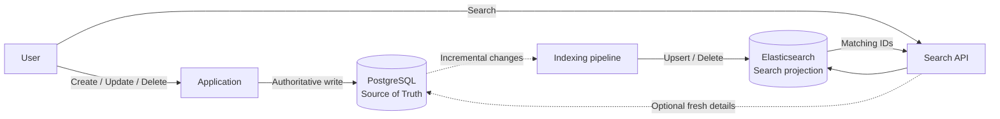
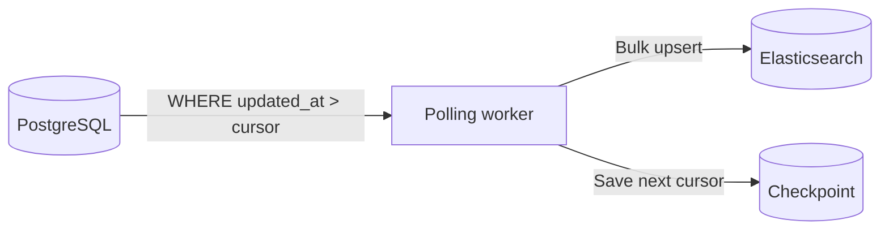
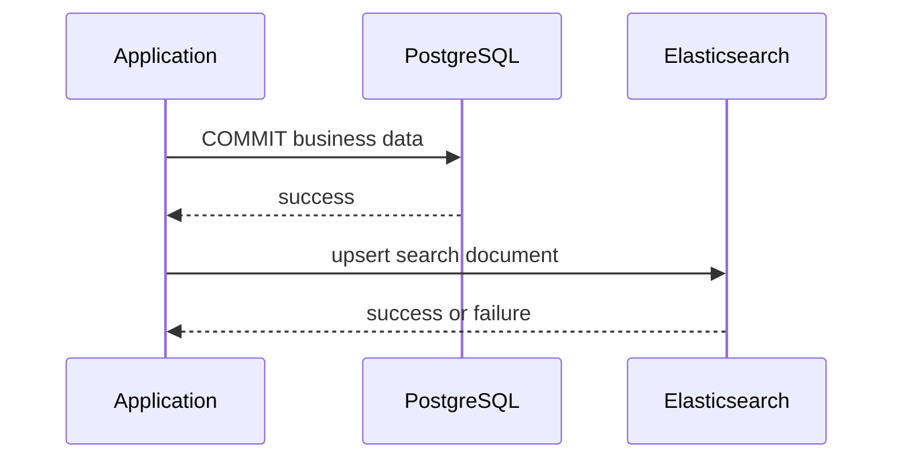
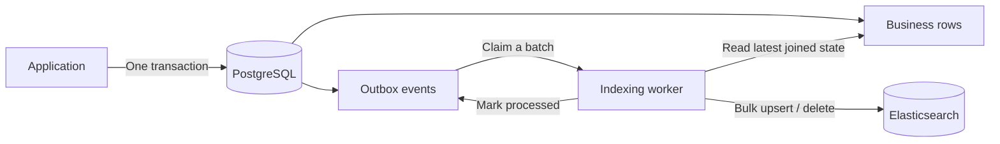
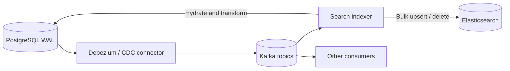
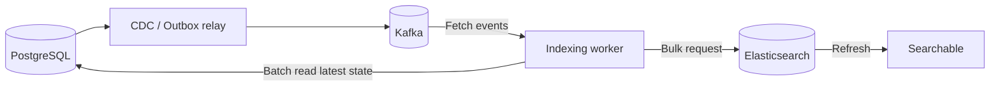
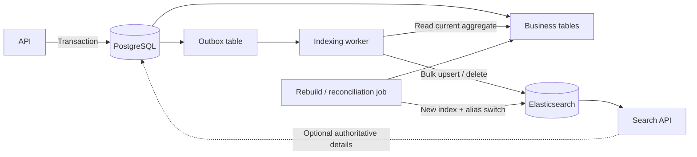

先确定一个不会变的原则：**PostgreSQL 保存事实，Elasticsearch 保存可重建的搜索视图。**

用户创建、修改或删除数据时，权威结果先进入 PostgreSQL。Elasticsearch 中的 document 是从这些事实派生出来的，它可以暂时落后，也可以在损坏后从 PostgreSQL 全量重建。



真正需要选择的是虚线这一段：PostgreSQL 的变化怎样可靠地到达 indexing pipeline？

## Incremental indexing 到底在做什么

假设 PostgreSQL 中有规范化的职位和公司表：

```text
jobs
  id, title, description, company_id, status, updated_at

companies
  id, name, industry
```

为了避免搜索时做 join，Elasticsearch 中通常保存一个反规范化 document：

```json
{
  "job_id": 123,
  "title": "Backend Engineer",
  "description": "Build payment systems...",
  "company_name": "Acme",
  "industry": "Fintech",
  "status": "active",
  "source_version": 17
}
```

因此 incremental indexing 不是简单地把一行 PostgreSQL 复制过去，而是完成三件事：

```text
Detect change
-> Build the latest search document
-> Upsert or delete it in Elasticsearch
```

固定使用业务 ID，例如 `job:123`，重复执行同一个 upsert 也只会得到一个 document。这是后面所有可靠方案的基础。

## 方案一：按 `updated_at` 定时扫描

最简单的做法是让 worker 每隔一段时间查询最近变化的数据：



概念上的查询是：

```sql
SELECT id, updated_at
FROM jobs
WHERE (updated_at, id) > (:last_updated_at, :last_id)
ORDER BY updated_at, id
LIMIT 1000;
```

不要只用 `updated_at > :cursor`。多条记录可能拥有相同时间戳，分页时需要 `id` 作为稳定的 tie-breaker。实际实现还常常向前重叠一小段时间，再依靠幂等 upsert 去重，以降低时钟精度和事务边界造成的遗漏风险。

它的优点是系统少、实现快，不需要消息队列，也不需要修改 PostgreSQL 的 WAL 配置。缺点也很直接：

- 延迟至少包含 polling interval；
- 高频扫描会给 PostgreSQL 增加查询压力；
- hard delete 后已经没有 row 可以被扫描，需要 soft delete、tombstone 表或额外删除日志；
- 漏掉一次 cursor 边界可能长期不被发现；
- 不同表的变化怎样共同触发一个 document 重建，需要应用自己补充规则。

它适合原型、小数据量、允许几十秒或几分钟延迟的内部搜索。

## 方案二：应用层直接双写

应用在处理一次请求时，先写 PostgreSQL，再写 Elasticsearch：



它看起来最直观，正常情况下延迟也很低。但 PostgreSQL transaction 和 Elasticsearch write 之间没有一个共同的本地事务：

```text
PostgreSQL commit succeeds
-> process crashes
-> Elasticsearch write never happens
```

反过来先写 Elasticsearch 也不能解决问题，只是把不一致方向调换了。让用户请求一直重试 Elasticsearch，还会把搜索集群故障扩散到核心写入路径。

直接双写只有在下面条件同时成立时才比较容易接受：数据不重要、可以通过定期全量对账修复、流量不高，而且团队明确接受丢同步的风险。它不应该因为“代码少”就被误认为可靠方案。

## 方案三：Transactional Outbox

Outbox 把“业务修改”和“需要重新索引”记录在同一个 PostgreSQL transaction 中：



```sql
BEGIN;

UPDATE jobs
SET title = 'Senior Backend Engineer',
    version = version + 1,
    updated_at = now()
WHERE id = 123;

INSERT INTO outbox_events (entity_type, entity_id, event_type)
VALUES ('job', 123, 'search_document_changed');

COMMIT;
```

只要业务修改成功，outbox event 就一定存在。后台 worker 可以独立重试，不需要让 Elasticsearch 的短暂故障影响用户写 PostgreSQL。

Worker 通常不直接相信 event 中的一份旧 document，而是根据 `entity_id` 回到 PostgreSQL 读取最新状态，把 `jobs`、`companies` 等数据重新组合成搜索 document。十次连续更新也可以合并为一次“为 job 123 建立当前版本”。

删除需要显式事件：

```json
{
  "entity_type": "job",
  "entity_id": 123,
  "event_type": "search_document_deleted",
  "source_version": 18
}
```

Outbox 的主要 trade-off 是需要维护 outbox 表、worker、重试和清理机制。对于大多数尚未拥有 Kafka/CDC 平台的产品，它通常是可靠性和复杂度之间最均衡的默认方案。

## 方案四：CDC 读取 PostgreSQL WAL

Change Data Capture 不要求每个写入者都主动创建业务事件。它通过 PostgreSQL logical decoding 从 WAL 中持续读取已经提交的行变化：



这条路径适合已经有事件平台、写入来源很多，或者多个下游都需要数据库变化的系统。PostgreSQL logical decoding 本身就是为了把 SQL 修改流式传给外部消费者；Debezium 可以先做一致性 snapshot，再从对应 WAL 位置持续发送 `INSERT`、`UPDATE` 和 `DELETE` 变化。

但 CDC 捕获的是 database row change，不会自动理解业务搜索模型。比如公司名字变化时，CDC 只看到 `companies` 的一行更新；indexer 仍然要知道这会影响该公司的所有 job documents。

CDC 的工程成本也更高：

- 维护 connector、replication slot、Kafka 和 consumer；
- 处理 schema evolution、重复消息和乱序；
- connector 停止消费时，replication slot 可能让 PostgreSQL 保留更多 WAL，因此必须监控磁盘；
- 初始 snapshot、故障切换和重新建立 slot 都需要操作流程。

它的价值不是“比 outbox 更高级”，而是把数据库变化变成可供多个系统复用的事件流。

## 四种方案放在一起比较

下面的 latency 是常见量级，不是产品保证；它还要再加上 Elasticsearch refresh 以及系统积压时间。

| 方案 | 正常同步延迟 | 丢变化风险 | 工程复杂度 | 最适合 |
|---|---:|---|---|---|
| `updated_at` polling | 秒到分钟 | 中等，cursor 和 delete 容易出错 | 低 | 原型、小系统、宽松 freshness |
| 应用直接双写 | 请求内到秒级 | 高，两个写入无法原子提交 | 低 | 可丢失、可对账的非关键索引 |
| Transactional Outbox | 几百毫秒到数秒 | 低，事件与业务数据同事务 | 中 | 大多数中小型生产系统 |
| CDC + event stream | 毫秒到数秒 | 低，但依赖 slot、offset 和消费者设计 | 高 | 多写入源、多个下游、高吞吐平台 |

三个判断通常就够了：

1. 如果只是做第一版，先用 polling，但同时准备定期全量对账。
2. 如果搜索已经进入生产核心路径，又没有 Kafka 平台，优先用 outbox。
3. 如果组织已经稳定运行 CDC/Kafka，而且不止 Elasticsearch 一个下游，再使用 CDC。

直接双写可以作为对照理解，但通常不是最终答案。

## Latency 要拆成两段

“PostgreSQL 已经提交，但为什么还搜不到？”通常不是一个 latency，而是两段：

```text
PostgreSQL commit
-> detection + queue + transform + Elasticsearch write
-> Elasticsearch refresh
-> visible to search
```

第一段是 synchronization latency，由 polling interval、outbox backlog、Kafka lag、batch size 和重试决定。第二段是 search visibility latency：Elasticsearch 接受一次写入后，需要 refresh 才能让它对 search 可见。

Elasticsearch 当前文档说明，普通 index 默认会周期性地大约每秒 refresh 一次，但仅针对最近收到过搜索请求的 index；Elastic Cloud Serverless 的默认值是 5 秒。不要为了追求看起来“实时”而在每条写入后主动调用 refresh，它会增加集群成本。只有确实需要 write-then-search 的小范围流程，才考虑 `refresh=wait_for`。

因此一个 outbox 系统即使在 200ms 内把 document 写进 Elasticsearch，用户也可能再等一个 refresh interval 才能搜索到它。产品 SLO 应该测量完整的 commit-to-searchable latency，而不只是 worker 的处理时间。

## 有 Kafka 时，Indexing Worker 通常花多久

Kafka 正常没有积压时，通常不是整条链路中最慢的部分。一个普通 document 的转换只需要几毫秒；时间更多花在等待 batch、回读 PostgreSQL、网络传输和 Elasticsearch bulk write 上。



一次没有积压的正常处理，可以用下面的量级建立直觉：

| 阶段 | 常见量级 |
|---|---:|
| PostgreSQL commit 到 Kafka event | 10–200ms |
| Kafka 等待 consumer fetch | 5–100ms |
| Worker 批量读取 PostgreSQL | 5–100ms |
| 转换成 Elasticsearch documents | 通常低于 10ms |
| Elasticsearch Bulk API | 20–200ms |
| 等待 Elasticsearch refresh | 通常再加 0–1 秒 |

这些数字只是一个正常、同地域、负载可控系统的起始估计，不是服务保证。比较实际的第一版 SLO 可以是：

```text
Kafka event -> Elasticsearch accepted:
  P95 within 500ms

PostgreSQL commit -> visible to search:
  P95 within 2–3s
  P99 within 5s
```

Worker 通常不会收到一条 event 就发一次 Elasticsearch request，而是做 micro-batching：

```text
Flush when either condition is reached:
  200–1000 documents
  or 20–100ms waiting time
```

这会主动增加几十毫秒 latency，但能显著减少 PostgreSQL query 和 Elasticsearch request 数量。比“每批固定 1000 条”更可靠的做法，是同时限制 document 数量和请求总字节数，避免 1000 个大 document 形成过大的 bulk request。

一个比较稳妥的消费顺序是：

```text
Read Kafka events
-> deduplicate entity IDs inside the batch
-> batch read current PostgreSQL state
-> build latest documents
-> Elasticsearch bulk upsert / delete
-> retry failed items
-> commit Kafka offsets after success
```

如果同一个 job 在 100ms 内修改了十次，worker 不需要依次重放十份旧 document；它可以合并相同 entity ID，回 PostgreSQL 读取一次当前版本。

需要单独处理 fan-out event。例如公司改名可能影响十万个 job documents。这种任务不能阻塞一个 Kafka partition 很长时间，通常要展开成可分批、可 checkpoint 的 reindex job。

因此应该同时监控三类 latency：

```text
consumer_lag
worker_batch_processing_duration
postgres_commit_to_searchable_latency
```

只看 worker 每秒处理多少条，无法发现最老的一条消息已经在 Kafka 里等待了十分钟。

## Elasticsearch 加一个节点，多久才能完成 Scale-out

这里要区分两个时刻：

```text
Node joined the cluster
!=
Cluster finished rebalancing
```

新节点加入集群本身通常很快，但它刚加入时没有数据。Elasticsearch 会重新计算 shard allocation，然后通过 peer recovery 把一部分 shard 复制到新节点。目标副本追上最新写入后，集群才切换 shard 的位置并删除旧副本。

扩容不是“把整个 Elasticsearch 再复制一遍”。在节点规格和数据 tier 相同的简单集群中，从 `N` 个 data nodes 增加到 `N + 1` 个，粗略需要移动：

```text
data_to_move ≈ total_allocated_shard_bytes / (N + 1)
```

`total_allocated_shard_bytes` 要包含 primary 和 replica 实际占用的总量。例如三个节点当前一共存放 3TiB shard data，增加第四个同规格节点，最终可能有大约 0.75TiB 被移动到新节点，而不是复制全部 3TiB。

最简单的时间下界是：

```text
rebalance_time >= data_to_move / effective_recovery_throughput
```

有效吞吐取下面几项中的较小值：

```text
source disk read
target disk write
network bandwidth
Elasticsearch recovery limit
concurrent shard recovery capacity
```

对于普通 self-managed data node，Elasticsearch 当前默认的 `indices.recovery.max_bytes_per_sec` 是每个节点 40MiB/s；cold 和 frozen node、托管服务以及显式配置可能不同。按 40MiB/s 持续跑满计算，理论下界是：

| 移动数据量 | 40MiB/s 理论下界 | 200MiB/s 理论下界 |
|---:|---:|---:|
| 100GiB | 约 43 分钟 | 约 9 分钟 |
| 500GiB | 约 3.6 小时 | 约 43 分钟 |
| 1TiB | 约 7.3 小时 | 约 1.5 小时 |

所以上面的 3TiB、三节点增加到四节点的例子中，移动约 0.75TiB，在 40MiB/s 下理论上至少约 5.5 小时。真实时间通常更长，因为 shard 是按块迁移的，吞吐不会一直跑满，期间还要继续服务 search 和 indexing。

Elasticsearch 默认限制每个节点同时进行的 incoming 和 outgoing recoveries，也限制集群同时进行的 imbalance-driven shard relocation；当前默认值都是 2。直接把这些并发数字调大，不一定明显变快，反而可能抢占线上查询、写入、磁盘和网络资源。应先测量真正瓶颈，再在低峰期逐步调整。

### Scale-out 期间服务会停吗

正常的 shard relocation 不要求停服。原 shard 在目标副本完成恢复前仍然提供服务，新的写入也会被追平。但是 recovery 会消耗 source node 的磁盘读取、target node 的磁盘写入和节点间网络，因此 search latency 和 indexing throughput 可能变差。

扩容操作应该关注两组目标：

```text
Correctness:
  all primary and replica shards remain available

Performance:
  search and indexing stay inside production SLO
```

如果线上已经接近磁盘、CPU 或 network 极限，等到节点快满才加机器，rebalancing 本身可能成为压垮集群的额外负载。Scale-out 要留出恢复过程所需要的 headroom。

### 加节点不等于增加 Primary Shard 数量

Elasticsearch 移动的是完整 shard。现有 index 只有一个 primary shard 时，增加十个节点也不会自动把这个 primary 切成十份；最多只是把 primary 或 replica 放到不同节点。

`index.number_of_shards` 是 index 创建时确定的 static setting。若现有 shard 数不足以利用新节点，需要创建具有更多 primary shards 的新 index 并 reindex，再通过 alias 切换；满足约束时也可以使用 split index API。

因此扩容之前要先问：

```text
我们缺的是更多机器容量，
还是当前 index 根本没有足够的 shards 可以分散？
```

### 怎样知道还要多久

先看 cluster 是否仍有 relocating shards：

```http
GET _cluster/health
```

再看正在恢复的 shard、已复制字节和百分比：

```http
GET _cat/recovery?v=true&active_only=true
```

也可以查看 shard 当前位于哪个节点：

```http
GET _cat/shards?v=true
```

比静态公式更准确的 ETA 是使用线上实测速率：

```text
remaining_time ≈ remaining_recovery_bytes / observed_bytes_per_second
```

完成的判断不是“新节点已经出现在 `_cat/nodes`”，而是 cluster 达到预期 health、没有非预期的 unassigned 或 relocating shards，并且各节点负载进入稳定状态。

## 生产实现不能漏掉的六件事

### 1. 幂等 upsert

消息系统和 worker 都可能重复投递。使用固定 document ID，并把重复处理视为正常情况。

### 2. 版本防乱序

为 PostgreSQL entity 维护单调递增的 `source_version`。Elasticsearch 只接受更新的版本，避免旧事件晚到后覆盖新状态。

### 3. 显式处理 delete

Hard delete 以后无法再读取原 row。outbox 或 CDC pipeline 必须把 delete 转换成 Elasticsearch delete，而不是只处理 upsert。

### 4. 维护反规范化依赖

先写下“哪个 source row 变化，会影响哪些 search documents”。`company.name` 改变可能触发成千上万个 jobs 重建，这和单行复制是两个不同的问题。

### 5. 随时能够全量重建

Incremental pipeline 用于日常更新，不代替 rebuild。建立新 index、从 PostgreSQL 全量回填、校验数量与抽样内容，最后原子切换 alias：

```text
jobs_v7 (current alias target)

build jobs_v8
-> validate
-> switch alias jobs_read: v7 -> v8
-> keep v7 briefly for rollback
```

### 6. 监控 lag，而不只是吞吐量

最有解释力的指标是：

```text
indexing_lag = now - oldest_unprocessed_change_time
```

同时监控失败重试数量、dead-letter 数量、CDC replication slot lag、Elasticsearch bulk error rate，以及抽样对账的不一致率。

## 一个简单的推荐架构

如果团队现在只有 PostgreSQL 和 Elasticsearch，可以从下面这版开始：



这套设计接受 eventual consistency，但不接受静默丢数据：

- 核心写入只依赖 PostgreSQL；
- Elasticsearch 故障时，outbox 保留待处理工作；
- worker 恢复后继续追赶；
- 搜索索引出现系统性问题时，可以从 PostgreSQL 重建；
- 需要绝对最新的数据时，按搜索结果 ID 回到 PostgreSQL 读取详情。

一句话总结：**polling 最简单，双写最快但不可靠，outbox 是常见默认选择，CDC 适合已经拥有事件平台的更大系统。无论选择哪一个，PostgreSQL 都是事实来源，Elasticsearch 都应该保持可丢弃、可重建。**

## 参考资料

- [PostgreSQL: Logical Decoding](https://www.postgresql.org/docs/current/logicaldecoding.html)
- [Debezium PostgreSQL Connector](https://debezium.io/documentation/reference/stable/connectors/postgresql.html)
- [Elastic: Near real-time search](https://www.elastic.co/docs/manage-data/data-store/near-real-time-search)
- [Elastic: Refresh an index](https://www.elastic.co/docs/api/doc/elasticsearch/operation/operation-indices-refresh)
- [Elastic: Add and remove Elasticsearch nodes](https://www.elastic.co/docs/deploy-manage/maintenance/add-and-remove-elasticsearch-nodes)
- [Elastic: Cluster-level shard allocation and routing settings](https://www.elastic.co/docs/reference/elasticsearch/configuration-reference/cluster-level-shard-allocation-routing-settings)
- [Elastic: Index recovery settings](https://www.elastic.co/docs/reference/elasticsearch/configuration-reference/index-recovery-settings)
- [Elastic: CAT recovery API](https://www.elastic.co/docs/api/doc/elasticsearch/operation/operation-cat-recovery)
- [Elastic: General index settings](https://www.elastic.co/docs/reference/elasticsearch/index-settings/index-modules)
