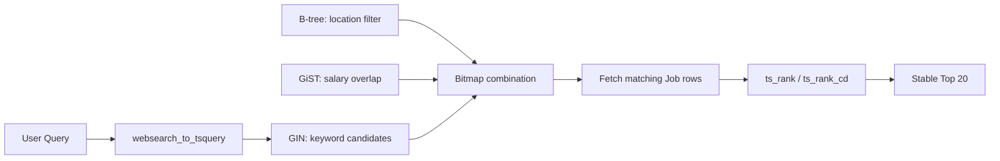

很多人学习 PostgreSQL index 时，会先背一张表：equality 用 B-tree，全文搜索用 GIN，地理或范围用 GiST。但真正写 query 时，困难通常不是“记不起 index 名字”，而是不知道下面这些条件应该怎样一起工作：

```text
keyword = "backend engineer"
location = Seattle
company = Acme
salary overlaps [150k, 220k]
status = active
```

这不是一个 index 能完成的查询。它是四个阶段：

```text
Retrieve candidates
-> Filter structured fields
-> Rank remaining rows
-> Return a bounded page
```

本文用这个职位搜索作为贯穿例子，但方法同样适用于商品、文章、房源和工单搜索。

## 先从 Access Pattern 开始

不要先问“这张表应该建几个 index”。先问系统反复执行哪些 query：

```text
1. 按 job_id 查看一个职位
2. 按 keyword 搜 title 和 description
3. 按 location_id / company_id 精确过滤
4. 按 salary range 判断区间重叠
5. 只搜索 active jobs
6. 按 relevance 返回稳定的 Top 20
```

每个 index 都应该能回答其中一个明确问题。无法对应访问模式的 index，通常只是额外的写入和存储成本。

## 最小 Search Model

High-level model 不需要列出职位的所有属性，只保留影响搜索设计的字段：

```text
Job {
  job_id          [PRIMARY KEY]
  company_id      [EXACT FILTER]
  location_id     [EXACT FILTER]
  salary_range    [RANGE FILTER]
  status          [ACTIVE OR INACTIVE]
  title
  description
  search_vector   [FULL-TEXT REPRESENTATION]
  updated_at      [TIE-BREAKER / RECENCY]
}
```

这里最重要的规则是：高频 filter 使用 typed columns。不要把 `location_id`、`salary_range` 和 `company_id` 全部藏在一个没有合适索引的 JSON metadata 中。

## 四个概念不要混在一起

| 概念 | 它回答的问题 | Job Search 例子 |
|---|---|---|
| Index type | 数据用什么结构组织 | B-tree、GIN、GiST、BRIN |
| Indexed expression | index 保存哪一个值 | `lower(company_name)`、`search_vector` |
| Partial index | 只为哪些 rows 建 index | `WHERE status = 'active'` |
| Multicolumn index | 哪些 columns 共享一个 index | `(company_id, updated_at)` |

Partial index 不是和 B-tree、GIN 并列的第五种 index。它是一个范围选择：B-tree、GIN、GiST 都可以只索引满足 predicate 的 rows。

## B-tree：相等、范围和顺序

B-tree 是 PostgreSQL 默认 index，适合可以排序的数据：

```text
=
<  <=  >  >=
BETWEEN
IN
ORDER BY
```

在 Job Search 中，它适合：

```text
job_id = ?
location_id = ?
company_id = ?
ORDER BY updated_at DESC
```

例如招聘方经常查看自己仍在招聘的职位，并按时间倒序：

```sql
CREATE INDEX jobs_company_recent_active_idx
ON jobs (company_id, updated_at DESC, job_id DESC)
WHERE status = 'active';
```

这个 index 同时利用了三个性质：

1. `company_id` 用 equality 缩小范围；
2. `updated_at` 已经按需要的顺序排列；
3. `job_id` 提供唯一、稳定的 tie-breaker。

当 B-tree 的顺序与 `ORDER BY ... LIMIT 20` 一致时，PostgreSQL 找够 20 个 qualifying rows 后有机会停止，而不必排序所有结果。

### Multicolumn B-tree 的左侧规则

`(company_id, updated_at)` 最适合先限定 `company_id` 的查询。它不能自动成为 `location_id` 搜索的好 index，也不应该因为“可能有用”就继续加入 salary、status、title。

正确思路是：只有一个组合访问模式长期稳定且高频，才建立 multicolumn index。公共搜索的 filters 可以任意组合时，先使用几个独立 index。

## GIN：从词找到包含它的 Rows

GIN 是 inverted index。它不是按整行排序，而是把一个值拆成多个 components，并保存 component 到 row IDs 的映射：

```text
backend  -> [job_12, job_27, job_91]
engineer -> [job_12, job_34, job_91]
```

因此 GIN 很适合：

- `tsvector` 全文搜索；
- arrays；
- 某些 JSONB containment query；
- 由 extension 提供的 trigram 搜索。

GIN 在职位搜索中回答的是：

> 哪些 active jobs 包含用户输入的 search terms？

它不回答：

> 哪一个 Job 的 relevance score 最高？

这一区别非常关键。GIN 提供 candidate retrieval，`ts_rank` 或 `ts_rank_cd` 才负责动态 ranking。

## 用 Generated `tsvector` 保存可搜索文本

不要在每次搜索时重新执行：

```sql
to_tsvector(title || description)
```

更清晰的第一版是保存一个 generated `tsvector`：

```sql
search_vector tsvector GENERATED ALWAYS AS (
  setweight(to_tsvector('english', coalesce(title, '')), 'A') ||
  setweight(to_tsvector('english', coalesce(description, '')), 'B')
) STORED
```

然后只为 active jobs 建 GIN：

```sql
CREATE INDEX jobs_search_active_gin
ON jobs USING GIN (search_vector)
WHERE status = 'active';
```

这样做有三个好处：

1. Job 更新时统一计算 searchable representation；
2. title 和 description 可以使用不同权重；
3. query 不需要重复拼接文本并重新生成 `tsvector`。

`'english'` configuration 必须明确写出，并与 query parsing 使用相同配置。否则 stemming、stop words 和 index expression 可能不一致。

## GiST：索引“关系”，不只是一个标量值

GiST 是一个可扩展的 indexing framework。它适合某些空间、范围、包含和 nearest-neighbor 关系。

职位薪资适合用区间表达：

```text
Job salary:       [140k, 180k]
Candidate request:[160k, 220k]
Relationship:     overlap
```

如果产品语义确实是区间重叠，可以使用 range type 和 GiST：

```sql
CREATE INDEX jobs_salary_active_gist
ON jobs USING GiST (salary_range)
WHERE status = 'active';
```

查询条件概念上是：

```sql
salary_range && requested_salary_range
```

但不要为了展示 GiST 改变产品语义。如果产品只有：

```text
salary_max >= requested_minimum
```

那么独立的 `salary_max` typed column 和 B-tree 可能更简单。Index type 应该由 operator 和 query semantics 决定，而不是由字段名决定。

## Partial Index：只索引真正参与在线查询的 Rows

Job 表会持续积累 closed、paused 和 expired rows，但求职者搜索通常只关心 active jobs。

最直接的想法是：

```sql
CREATE INDEX jobs_status_idx ON jobs(status);
```

这个 index 往往价值有限，因为 status 的 distinct values 很少，而且 active 可能占大多数。更实用的是让真正的搜索 indexes 都成为 partial indexes：

```text
GIN(search_vector) WHERE status = 'active'
B-tree(location_id) WHERE status = 'active'
B-tree(company_id) WHERE status = 'active'
GiST(salary_range) WHERE status = 'active'
```

它带来的收益是：

- closed history 不扩大在线搜索 index；
- 更小的 index 更容易留在 memory/cache；
- 搜索只处理产品允许展示的 rows。

代价是：

- Job 关闭时要从这些 partial indexes 中移除对应 entries；
- 如果几乎所有 rows 都 active，空间和读取收益会变小；
- query predicate 必须能够明确推出 index predicate。

最后一点很容易踩坑。若 index predicate 是 `status = 'active'`，固定的搜索 SQL 也应该明确写这个条件。一个过度通用的 `status = $1` prepared query，未必能让 generic plan 证明 `$1` 一定是 `active`。

## Separate Index 还是 Composite Index

公共职位搜索可能出现这些组合：

```text
keyword only
keyword + location
keyword + salary
keyword + location + company
location + salary without keyword
```

不要为每个组合创建一个新 index：

```text
(location, salary)
(location, company)
(company, salary)
(location, company, salary)
...
```

PostgreSQL 可以把多个 index 结果组合成 bitmaps：

```text
GIN(keyword) bitmap
AND B-tree(location_id) bitmap
AND GiST(salary_range) bitmap
-> Bitmap Heap Scan
```

所以第一版通常从独立、专注的 indexes 开始。只有 query logs 和 `EXPLAIN` 证明某个组合长期占主导，才增加 composite index。

需要知道一个 trade-off：bitmap combination 通常会丢失原 index 的 ordering，因此后面仍可能需要显式 sort。对于动态全文 ranking，本来就需要按 score 排序，这通常可以接受。

## 一次混合搜索怎样执行

用户输入：

```text
"backend engineer"
location = Seattle
salary = [150k, 220k]
status = active
```

整体数据流是：



对应的 SQL shape 是：

```sql
SELECT
  job_id,
  title,
  ts_rank(search_vector, parsed_query) AS score
FROM jobs
WHERE status = 'active'
  AND search_vector @@ parsed_query
  AND location_id = requested_location
  AND salary_range && requested_salary_range
ORDER BY score DESC, updated_at DESC, job_id DESC
LIMIT 20;
```

生产代码不应该用大量下面这种 optional predicate 填满一条万能 SQL：

```sql
($location IS NULL OR location_id = $location)
```

更好的做法是根据实际请求生成少量、可测试的 query shapes：keyword-only、keyword-with-filters、filter-only。只把用户真正提供的 predicates 放进 query，让 planner 更容易估计 selectivity。

## 为什么使用 `websearch_to_tsquery`

直接把搜索框输入交给 `to_tsquery`，用户很容易因为不懂 query syntax 得到错误。

第一版更适合：

```sql
websearch_to_tsquery('english', user_input)
```

它支持普通文本、quoted phrase、`OR` 和减号排除，同时比原始 `to_tsquery` 更适合未经格式化的用户输入。

Company name 可以单独处理：

```text
"Acme" -> resolve Company.company_id -> filter Job.company_id
```

只有明确要求 typo-tolerant company lookup 时，才考虑 `pg_trgm`。不要默认把公司名 fuzzy search 和所有 Job description 混在一起。

## Ranking：GIN 找候选，`ts_rank` 计算顺序

PostgreSQL core 提供 `ts_rank` 和 `ts_rank_cd`，没有内置 BM25。

第一版可以保持简单：

```text
primary order   = text relevance
secondary order = updated_at
final order     = unique job_id
```

```sql
ORDER BY score DESC, updated_at DESC, job_id DESC
```

`job_id` 是稳定结果不可缺少的 tie-breaker。若只按 score 排序，同分 rows 的内部顺序没有 API-level guarantee。

GIN 的 posting lists 不按当前 query 的动态 score 排列。因此，一个 common term 匹配 500,000 rows 时，PostgreSQL 可能仍要读取并计算大量 candidates 的 rank。`LIMIT 20` 可以限制 Top-N sort 保存的数据量，但不会自动把 candidate scoring 限制为 20 rows。

## Top 1,000 与 Cursor Pagination

需要分清两个限制：

```text
page size     = 20
result window = top 1,000
```

每次 API 只返回 20 条，并使用包含完整排序位置的 signed cursor：

```text
last_score
last_updated_at
last_job_id
returned_count
```

到达第 1,000 条后不再签发 next cursor。这个产品约束可以：

- 禁止无限 deep pagination；
- 避免精确统计全部 matches；
- 限制网络、序列化和客户端成本；
- 控制一个 query 最多暴露多少结果。

它不能保证 PostgreSQL 只搜索 1,000 个 candidates。对于动态 relevance，真正的成本仍然由 filter 后需要打分的 candidate count 决定。

## Index 不是免费的

Index 是为读取保存的额外数据结构。每增加一个 index，就增加：

- `INSERT` 的维护工作；
- indexed fields `UPDATE` 的维护工作；
- disk 和 buffer cache 占用；
- vacuum、bloat、statistics 和 rebuild 成本。

GIN 的写入尤其值得关注，因为一个 document 会产生多个 lexeme entries。PostgreSQL 可以用 pending list 缓冲 GIN 更新，但过大的 pending list 也可能拖慢搜索或造成 cleanup spike。

因此正确问题不是：

> 这个字段能不能建 index？

而是：

> 这个 index 能为高频 query 排除多少 rows，它的读取收益是否大于写入和内存成本？

## Freshness 为什么不需要异步 Indexing Worker

当 Job 和所有 indexes 都在同一个 PostgreSQL 中时，row 和 index entries 在同一个事务中更新：

```text
UPDATE Job status active -> closed
-> update partial index entries
-> COMMIT
-> a new statement no longer finds this Job in active indexes
```

因此 PostgreSQL 第一版没有独立搜索系统常见的 index propagation lag。只有把搜索放到 read replica 或独立 Search Index 后，才会引入 replication lag 或 event-to-index lag。

## 用 `EXPLAIN` 验证，不靠 Index 名字猜性能

Index 存在，不代表 planner 一定会使用它。小表、低 selectivity、过时 statistics 或不匹配的 query shape，都可能让 sequential scan 更便宜。

验证真实查询：

```sql
EXPLAIN (ANALYZE, BUFFERS)
SELECT ...;
```

重点看：

```text
estimated rows vs actual rows
candidate rows before ranking
BitmapAnd / Bitmap Heap Scan
heap blocks read vs cache hits
rows removed by filters
sort method and memory
temporary-file spill
total execution time
```

`ANALYZE` 会真的执行 query。对 `UPDATE`、`DELETE` 等有副作用的 statement，要放进可以 rollback 的测试 transaction。

## 一个实用的 Index 决策表

| Query semantics | First choice | 备注 |
|---|---|---|
| Primary key / equality | B-tree | 默认选择 |
| Numeric or time range | B-tree | `<`、`>`、`BETWEEN` |
| Ordered Top-N | matching B-tree | 有机会 early stop |
| Full-text term membership | GIN on `tsvector` | retrieval，不负责动态 rank |
| Range overlap / containment | GiST | 取决于 operator class |
| Fuzzy string similarity | `pg_trgm` GIN/GiST | 需求明确后再加 |
| Huge append-only table with physical correlation | BRIN | 很小，但过滤较粗 |
| Only a stable subset of rows | Partial index | 可以叠加在 B-tree/GIN/GiST 上 |
| Stable multi-column access pattern | Multicolumn index | leading columns 很关键 |

## 第一版的推荐组合

如果需求只是 keyword、location、company、salary 和 active status，可以从下面这组能力开始：

```text
generated weighted tsvector
active-only GIN(search_vector)
active-only B-tree(location_id)
active-only B-tree(company_id)
active-only GiST(salary_range), only if overlap is the real semantics
websearch_to_tsquery
ts_rank or ts_rank_cd
stable ORDER BY with job_id
cursor pagination, page size 20, result window 1,000
EXPLAIN (ANALYZE, BUFFERS) on real query distributions
```

不要一开始加入：

- 每一种 filter combination 的 composite index；
- 所有 metadata fields 的 index；
- 没有产品需求的 fuzzy search；
- BM25 extension；
- 独立 Elasticsearch；
- 任意深的 offset pagination；
- 全量精确 result count。

## PostgreSQL 的边界在哪里

边界不是固定的 row count，而是：

```text
candidate count after retrieval and filters
ranking cost per candidate
concurrent search QPS
working set vs available memory
sort spill and random heap I/O
search workload's effect on transactional queries
```

如果正确的数据表达、indexes、query shape 和 read scaling 之后，common queries 仍要对巨大候选集做复杂 ranking，或者产品开始要求 typo tolerance、复杂 synonyms、facets 和独立扩容，才考虑专用 Search Index。

真正可迁移的方法是：

> 先用 access pattern 定义语义，再选择能支持这些 operators 的数据表达和 index；最后用实际 query plan 证明它有效。

## 参考资料

- [PostgreSQL: Index Types](https://www.postgresql.org/docs/current/indexes-types.html)
- [PostgreSQL: Tables and Indexes for Full Text Search](https://www.postgresql.org/docs/current/textsearch-tables.html)
- [PostgreSQL: Controlling Text Search](https://www.postgresql.org/docs/current/textsearch-controls.html)
- [PostgreSQL: GIN Indexes](https://www.postgresql.org/docs/current/gin.html)
- [PostgreSQL: Range Types](https://www.postgresql.org/docs/current/rangetypes.html)
- [PostgreSQL: Partial Indexes](https://www.postgresql.org/docs/current/indexes-partial.html)
- [PostgreSQL: Multicolumn Indexes](https://www.postgresql.org/docs/current/indexes-multicolumn.html)
- [PostgreSQL: Combining Multiple Indexes](https://www.postgresql.org/docs/current/indexes-bitmap-scans.html)
- [PostgreSQL: Indexes and ORDER BY](https://www.postgresql.org/docs/current/indexes-ordering.html)
- [PostgreSQL: Indexes on Expressions](https://www.postgresql.org/docs/current/indexes-expressional.html)
- [PostgreSQL: Using EXPLAIN](https://www.postgresql.org/docs/current/using-explain.html)
- [PostgreSQL: pg_trgm](https://www.postgresql.org/docs/current/pgtrgm.html)

