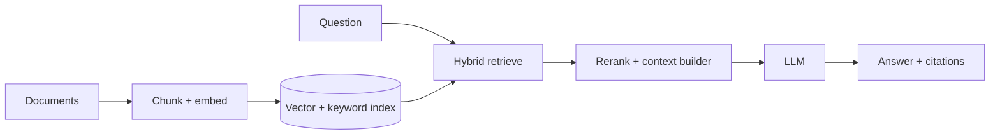

RAG 的出发点很简单：模型 context window 装不下全部知识，所以先找相关证据，再把少量证据交给模型。它不是“加一个 vector database”就结束。

如果只有三页文档，直接放进 prompt 更简单。只有 corpus 超过 context、内容频繁更新或需要引用来源时，retrieval 才值得它的复杂度。

> 对应实验：[打开 RAG System Lab](https://lab.zichaoyang.com/system-design/rag-system/)。改变 chunk size、top-k、context window、freshness 和 rerank 开关。

## 概念阶梯

- **Chunking**：把文档切成可检索单元。太大引入无关内容，太小丢失上下文并增加 vector 数量。
- **Embedding / ANN**：把 query 和 chunk 映射到向量，用近似最近邻快速找语义相似内容。
- **Hybrid search**：组合 dense vector 与关键词/BM25，弥补专有名词、编号和精确短语上的召回缺口。
- **Reranking**：用更贵的模型对初步 top-k 精排，先宽召回、再窄判断。

## 两条路径

Ingestion 必须保留 document/chunk/version/ACL metadata。Query 时先做租户和权限过滤，再 retrieval；不能先取到无权内容再要求模型“不要泄漏”。

## 质量为什么经常失败

- 没召回正确证据，生成模型再强也无法回答。
- 召回了证据但 chunk 缺上下文，需要 parent section 或邻接 chunk 扩展。
- top-k 太大挤满 context，相关信息反而被噪声淹没。
- 文档更新后旧 chunk 未删除，答案引用过期版本。

评估要分层：retrieval recall、reranker quality、citation correctness、answer groundedness。只看最终回答分数无法定位坏在何处。

## 面试表达

> I would treat RAG as two systems: an ingestion plane that produces versioned, permission-aware indexes, and an online plane that retrieves, reranks, assembles evidence, and generates cited answers.

Deep dive 可以选 chunking、hybrid retrieval、freshness、multi-tenancy 或 evaluation。先证明 retrieval 必要，再选 vector store。
